...menustart

- [GPU Programming for Video Games, Summer 2020, Georgia Tech](#b369fffc612dbbb4c7a6dfa31d084ab0)
- [6 Backface Culling](#28334b98449eaca000e409a2961c6c33)
    - [Backface culling method](#ee1676bbfe64cb66faf7e5ec01593ed5)
    - [When to perform backface culling ?](#6b740ec394657fb2e3006a3312e29a13)
- [7 Basic Lighting](#f645278fb1c70a40dd691e06135865fe)
    - [Local vs. global illumination](#ea06e1cd6dbd257f4c66f45eee3c0e13)
    - [Elements of PBR(physically-based rendering)](#96382d822120f3c7a9014efb8261fd0e)
    - [Illumination: diffuse lighting](#d0c6019becee5e1db1b792e7ae3088d7)
    - [Illumination: specular lighting](#9ae158c2b7218467a0355d44a43195b8)
    - [BRDF](#4e69f1c58994758054563aa7392ffa4c)
    - [Light source properties](#cb6bc578172fc9b2d26af7123d455935)
    - [Spot light effect](#0cc6280c44ed3adaa5935128cae9593f)
- [8 Rasterization](#f20a96ec50f4fc236a0a161b1ae0fb0c)
    - [Shading methods](#d7ecfd012daf5f79f8afb273d6e5dd7a)
    - [Z-Buffer](#8c99afbaad8ede5b27fa1d8b04f51aee)
- [9 Introduction to Textures](#7e81ac3c516ee9b2786c37d4f8144a9c)
    - [Texture](#a3e8ae43188ae76d38f414b2bdb0077b)
    - [Texture Coordinates](#789129d85cbd3e4c28736b7b0888bca1)
    - [Texture Coordinates Conventions](#b524170705d1cbe7fac8ab5bdb5d7a56)
    - [Mip-mapping](#76f348c5b4f4033bbe614a1e87530854)
- [10 Advanced Texture Techniques](#df09531a332e56d9047f13c84a238f26)
    - [Normal mapping](#4297a12020af73570442a8627bb334a2)
    - [Creating normal map from height field](#15a3bd330b137231f40e160b2e8c5ef4)
    - [Storing normals in textures](#6d70a0431d891924f9ec1ae7b7d7e0a8)
    - [Environment mapping](#45607b8307c211876c7c9c449ec4f856)
    - [Alpha test](#9a127762ac5984527e7208b2eb34759f)
    - [Multi-texturing example: light mapping](#893849f0218b9c900db556f560caa601)
- [11 Color Spaces](#60005419066e6110f986a078554458df)
    - [Gamma Curves](#775fd5b1afb19aeebc3f333d500bf527)
    - [Modern approach: Let the GPU magically handle it](#6ce135cfb6960aacec3d01c0cb166f0b)
    - [DIY linear space (helpers)](#954641d535c15b2374486ec45fc1fd36)
- [13 GPU Architecture & Assembly Language](#d61c9e146d2d15883b5c8f7d218a05a2)
    - [Shader Models](#6c51b2a3e1266217e1821d5fb8880283)
    - [Shader data](#629c46faa285a39d0f65b20b26a6ddde)
    - [Specialized instructions ( Assembly,  GeForce 6 )](#92ae455ac58c5a02edbefd78c872cd0d)
    - [Vertex Shader](#ac6784fa422b1d1fef85036ee4decde6)
    - [Pixel ( or fragment ) shader](#d3d1e02aed1546fbc9d0b0c0dfa1b97d)
    - [Some uses of pixel shaders](#07b6d393a22ca42fc5df0d0d4b035751)
    - [Shader Language](#5eb3ef14b8dcdc301af4c983a7136410)

...menuend


<h2 id="b369fffc612dbbb4c7a6dfa31d084ab0"></h2>


# GPU Programming for Video Games, Summer 2020, Georgia Tech

- book
    - 3D Game Engine Design --  A practical approach to real-time computer graphics

- Notes
    - Texture Coordinates Conventions
        - OpenGL/Unity: (0,0) = lower left corner


<h2 id="28334b98449eaca000e409a2961c6c33"></h2>


# 6 Backface Culling

- Determin "facing direction"
- Triangle order matters
- How to compute a normal vector for 2 given vectors ?
    - Using **cross product** , depends on LHS/RHS you are actually using.
    - so if you load in the 3d model, and you have back face culling activated in your game engine, and the object disappears, then that probably is a suggestion that there's a different convention (LHS/RHS) being used by the model than what the softward rendering it is expecting it to be.
    - again, the face normal is not the normals exported by the 3d modeling software.


<h2 id="ee1676bbfe64cb66faf7e5ec01593ed5"></h2>


## Backface culling method

- Check if the normal is facing the camera
- How the determine that ?
    - use **Dot Product**: `n̂·ê`


<h2 id="6b740ec394657fb2e3006a3312e29a13"></h2>


## When to perform backface culling ?

1. world transform
2. view transform
3. vertex lighting
4. projection transform
5. clipping 
6. perspective divide
7. viewport transform
8. Rasterization

- can perform in different places
    - after step 2 ( common )
    - after step 1
    - even before step 1.
- mostly nowadays, this kind of optimization is actually done further down in the chain. 
    - after step 6, check "winding order" in 2D
        - this comes from the fact that GPUs are so powerful nowadays, you're usually better off just sending a bunch of stuff to the card, and letting the card go ahead , do these computations (step 1-6) on the vertex side, and then make decision about whether to call a triangle before you that final pixel shader stage.
    - after viewport transform, as "officially" done by OpenGL


<h2 id="f645278fb1c70a40dd691e06135865fe"></h2>


# 7 Basic Lighting

<h2 id="ea06e1cd6dbd257f4c66f45eee3c0e13"></h2>


## Local vs. global illumination

- Local illumination
    - Direct illumination: light shine on all objects without blocking or reflection
    - used in most games
    - can ncorporate shadows with a lot of work

- Global illumination
    - Indirect illumination: light bounces from one object to other objects
    - Adds more realism
    - Computationally much more expensive
    - Ray tracing, radiosity
    - We'll look at ways of approximating this effect


<h2 id="96382d822120f3c7a9014efb8261fd0e"></h2>


## Elements of PBR(physically-based rendering)

- Linear space lighting
- Energy conservation
- Reciprocity
- Metallic/dielectric distinction
    - dielectric means "not metal" in this class
- "Everything is shiny" (i.e., has specular)
- "Everything has Fresnel"
    - wet pavement with sun near horizon
- Bonus: high definition render buffers and tonemapping to handle high dynamic range.


<h2 id="d0c6019becee5e1db1b792e7ae3088d7"></h2>


## Illumination: diffuse lighting

- Light sources are given
- Assume light bounces in all directions
    - **reflected light will reach the camera no matter where the camera is!**
- Light intensity calculation
    - Reflectivity ∝ the entry angle
    - use **Lambert's consine Law**
- **C<sub>dif</sub> = C<sub>light</sub> ⊗ M<sub>dif</sub> * max( 0, n̂·l̂ )**
    - diffuse intensity is proportional to cos(θ), where θ is the angle between the normal vector and light source vector.
    - when normal vector and light source vector are both unit vectors, `cos(θ) = n̂·l̂`.
    - use `max` function to avoid the negative value of dot product
    - C<sub>light</sub>  is the RGB color of the light
    - M<sub>dif</sub> is an RGB color of this diffuse reflection, basically the material color
    - the circled time ⊗ is a `colorwise product`.
        - red times red, green times green, blue times blue.

<h2 id="9ae158c2b7218467a0355d44a43195b8"></h2>


## Illumination: specular lighting

- Create shinning surface ( surface perfectly reflects )
- Viewpoint dependent
- Blinn-Phong model
    - but it is not a physically plausible model
- A physically-based model : Bidirectional Reflectance Functions
    - For "punctal" light ( typical point, directional, spotlight... )
    - **C<sub>final</sub> = C<sub>light</sub> ⊗ π*BRDF( l̂ , ê ) * max(0, n̂·l̂ )**
        - BRDF: Bidirectional Reflectance Function
        - ê : the vector torwards the eye ball
    - classic diffuse lighting model:
        - BRDF = M<sub>dif</sub> / π
    - what is the π ?

<h2 id="4e69f1c58994758054563aa7392ffa4c"></h2>


## BRDF 

- BRDFs should have reciprocity
    - Reciprocity means we can swap the incoming and outgoing light directions:
    - BRDF( l̂ , ê ) = BRDF( ê , l̂ )
- Energy conservation
    - "Total amount of reflected light cannot be more thant the amount of incoming light" -- Rory Driscoll
    - For classic diffuse model BRDF = M<sub>dif</sub> / π , turns out you *technically* need `πM<sub>dif</sub> < 1`
    - Since π is just a constant, "we usually just ignore it and assume that our lights are just π times too bright. " -- Steve McAuley.
- A common yet confusing convention
    - For classic diffuse model BRDF = M<sub>dif</sub> / π
        - we'll pretend you *practically* need `M<sub>dif</sub> < 1`
    - Convenient for artists: 
        - hit a diffuse surface with a material color of "1" with a directinal light with an "intensity" of "1" parallel with its normal and you get "1".
    - We will generally use the same convention.
    - If you are implementing global illumination, be careful !


<h2 id="cb6bc578172fc9b2d26af7123d455935"></h2>


## Light source properties

- Postion ( point of spot ) , or angle ( directinal )
- Range
    - Specifying the visibility
- Attenuation
    - The farther the light source, the dimmer the color
    - Writing it as a multiplier
        - `Atten = 1/( a₀ + a₁d + a₂d² )`

<h2 id="0cc6280c44ed3adaa5935128cae9593f"></h2>


## Spot light effect 

[cg tutorial: 5.5.2 Adding a Spotlight Effect](https://developer.download.nvidia.com/CgTutorial/cg_tutorial_chapter05.html)


<h2 id="f20a96ec50f4fc236a0a161b1ae0fb0c"></h2>


# 8 Rasterization

<h2 id="d7ecfd012daf5f79f8afb273d6e5dd7a"></h2>


## Shading methods

- flat shading
- Gouraud shading
    - supported by (even old) 3D graphics hardward
- Phong shading
    - requires generating per-pixel normals to computer light intensity for each pixel , which is computationally expensive...
    - Can be done on modern GPUs

<h2 id="8c99afbaad8ede5b27fa1d8b04f51aee"></h2>


## Z-Buffer

- so in additon to painting light information to a buffer sitting there somewhere in your video memory, we also going to be filling out something called z-buffer.
    - this is another image you're writing, but instead of containing color information, it contains depth information.
- also called *depth buffer*
- Draw the pixel which is nearest to the viewer
- Number of the entries corresponding to the screen resolution ( e.g. 1024x768 sould have a 768k-entry Z-buufer )
- Granularity matters
    - 8-bit nerver used
    - 16-bit z value could generate artifacts


<h2 id="7e81ac3c516ee9b2786c37d4f8144a9c"></h2>


# 9 Introduction to Textures

<h2 id="a3e8ae43188ae76d38f414b2bdb0077b"></h2>


## Texture

- Rendering tiny triangles is slow
- Players won't even look at some certain details
    - sky, clouds, walls, terrain, wood patterns, etc.
- Simple way to add details and enhance realism.
- Use 2D images to map polygons.
- Images are composed of 2D "texels"
    - texels are like the pixels of a 2D image that's going to be stretched around and placed on the object.


<h2 id="789129d85cbd3e4c28736b7b0888bca1"></h2>


## Texture Coordinates

- Introduce one more component to geometry
    - position coordinates
    - normal vector ( used in lighting calculation)
    - color ( may not need now )
    - **Texture coordinates** (2D)

<h2 id="b524170705d1cbe7fac8ab5bdb5d7a56"></h2>


## Texture Coordinates Conventions

- Direct3D / XNA texture convention
    - (u,v) coordinates for each vertex
    - (0,0) = upper left corner
    - (1,1) = lower right corner
- OpenGL/Unity texture convention
    - (s,t)/(u,v) coordinates for each vertex
    - (0,0) = lower left corner
    - (1,1) = upper right corder


<h2 id="76f348c5b4f4033bbe614a1e87530854"></h2>


## Mip-mapping

- Multiple versions are provided for the same texture
- Different versions have different levels of details
    - e.g. 7 LOD maps: 256x256, 128x128, 64x64, 32x32, 16x16, 8x8, 4x4
    - Choose the closest maps to render a surface
- Maps can be automatically generated by 3D API
- API or hardware can 
    - choose the right one for the viewer
        - good performance for far triangles
        - good LOD for close-by objects
    - Trilinearly interpolate


<h2 id="df09531a332e56d9047f13c84a238f26"></h2>


# 10 Advanced Texture Techniques

<h2 id="4297a12020af73570442a8627bb334a2"></h2>


## Normal mapping

- **Per-fragment lighting** using bump map (normal map) to perturb surface normal
- No geometry tessellation, avoid geometric complexity
- Store normal vectors rather than RGB color for bump map
- Apply per-pixel shading (w/light vector, e.g. Phong shading)
- 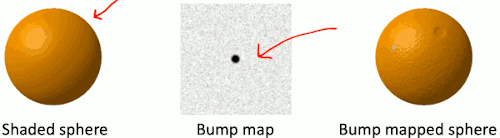
- 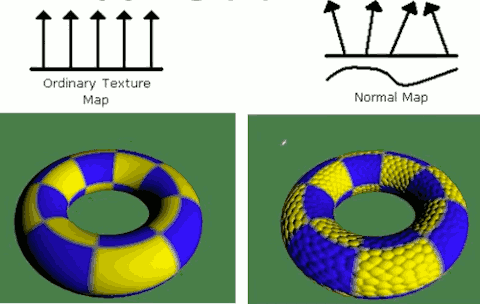

---

- Normal map was derived from a height field map
    - Height field stores the "elevation" for each texel.
    - Sample texel's height as well as texels to the right and above.
    - 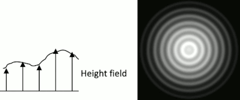
        - right side: height map, maybe something that grayscale indicates the height , created by something like photoshop.
        - left side: 2D conceptual exsample, where the grascale values in this texture indicate height variations. And then you can run a piece of software that would use that information ,  the normal vector along the height field surface.
        - 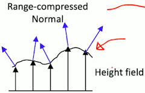
        - Game engines like Unity3D provide the ability to create normal map from height map.
    - [normal map example on web](http://cpetry.github.io/NormalMap-Online/)
        - 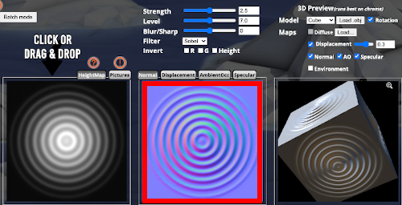
        - why does the normal map has such weird particular color pattern ?
            - see next paragraph

 
<h2 id="15a3bd330b137231f40e160b2e8c5ef4"></h2>


## Creating normal map from height field

- To compute the normal vector, you basically want to take the partial derivatives of the height field along the various directions.
- Height Field H(u,v)
    - 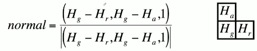
    - here we are essentially doing the calculus type trick of using a first difference , and the horizontal and the vertical direction , in order to compute the approximation to those partial derivatives.
    - and to normalize it to unit length.
- In flat regions , normal is (0,0,1), i.e. pointing "up".
- And this is why you typically see big blue sections in normal map, because the Blue component always be 1 before normalization
    - and you see RED along x axis, because that represents the changes in horizontal direction
    - and you see GREEN along y axis, beause that represents the variations in vertical direction
- From "The Cg Tutorial", p.203


<h2 id="6d70a0431d891924f9ec1ae7b7d7e0a8"></h2>


## Storing normals in textures

- Textures don't have to store color; we can store another things as well, like normals
    - Use r,g,b components to store x,y,z of normal
- Problem: Texture take [0,1] values; normals need [-1,1] values
- Easy solution: "Range Compression"
    ```c
    colorComponnet = 0.5 * normalComponnet + 0.5;
    normalcomponent = 2 * ( colorComponent - 0.5);
    ```

<h2 id="45607b8307c211876c7c9c449ec4f856"></h2>


## Environment mapping

- 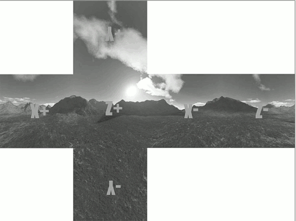
- Here is another technique where the texture values here are indeed RGB colors, but, this is very different kind of texture.
    - called Cube Map Texutre ( in world coordinate )
    - Each face encodes 1/6 of the panoramic environment 
- You can imagine going to the world, and taking the camera, and pointing up,down,left, right, forward, back, and each time you do that, you take a picture.
    - and then you load them into photoshop, and find the edge to line them up.
    - and what you built is basically a description of the overall light environment of the scene.
    - this is something called *image-based lighting*. this gives us the ability to make some really cool looking kind of reflection

- You can create cube map by yourown, and the game engine like Unity3D can create cube map for you,  using "reflection probes"

---

-  ,  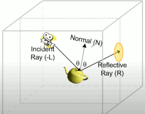
    - The teapot here is reacting to light an specular fashion. 
    - Look up the environment map
        - shader language also have a particular function `texCUBE()` for sampling the texel in cube map.
    - Add reflection to a fragment's final color
    - r̂ = 2 * (n̂·l̂)*n̂ - l̂
- Rendered Image:
    - 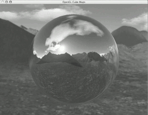

<h2 id="9a127762ac5984527e7208b2eb34759f"></h2>


## Alpha test

- Reject pixels by checking their alpha values
- Model fences, chicken wires, etc.

```c
if ( α op val )
    reject pixel
else
    accept pixel
```

<h2 id="893849f0218b9c900db556f560caa601"></h2>


## Multi-texturing example: light mapping

- 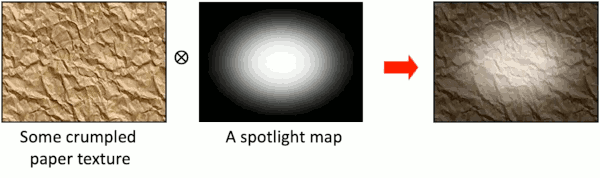
- used for old games
- it is reasonable for diffuse, not specualr , and can not handle moving light


<h2 id="60005419066e6110f986a078554458df"></h2>


# 11 Color Spaces

<h2 id="775fd5b1afb19aeebc3f333d500bf527"></h2>


## Gamma Curves 

- 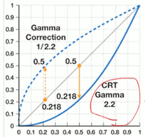
- As a historical things, if you think back to your old cathode ray tube display monitors and TVs, they way that those display light isn't in a linear fashion, 
    - in terms of that numbers that goes in , you could think of them as vlotages or just 8-bit values,  the light that comes out at these  at these lower values is actually less than you would expect.
    - and one way to think about it is that it's like taking this number 0-1 to the power of 2.2 (later I'm goint to use the number 2). 
    - 0.5<sup>2.2</sup> ≈ 0.218
    - If you were to take images that wre taken sort of in a standard way of storing just raw light values and display it on a old CRT, they would basically come out too **dark**.
- So essentially every consumer camera will pre-apply a correction to it, **val<sup>1/2.2</sup>** ,  pretty close to taking a square root.
    - that is, the actual value stored in image is bigger than the raw value ( in gamma space )
    - that way these 2 effects counteract each other, and you get the right light out (the gray straight line)
- Imagine that the actual light value of a particular pixel should a A, we store the square root of that in the image and then the monitor squares that, so we get A out.
    - (√A)² = A , ok it's ok.A
    - but now the issue comes in we want to blend images. This kind of gamma space, called sRGB if you using photoshop. Suppose you have a 3D object, and you light it with just one light. ok fine.  But now what if you're lighting it with 2 lights?  The square root value √A that is the way the texture is stored. So if we try to add lights in our shader code , √A + √B,  and then if we're adding them in the gamma space, then the screen is going to squre them (√A + √B)². And then We have some problems.
    - People made games for many many years using this gamma space lighting and people enjoy them and such. But pretty much the main issue there is that any given set of lights in the scene only really works for that particular scene. you level desiginers would put a lot of effort into tweaking the particular lights so this weirdness may be going on but everything still looks good. But if somebody comes on later and tries to add a light to the scene, everything gets kind of weird.  
- If you have a professional cinematographer who does lighting for a living, the lights in your game engine just don't combine in the way that they're used to. 
    - So the solution to this is basically take that square every time you read a texture and then you do all of your math and your shader you all up all your lights or whatever, and then you do that **square root** at that final pixel value before you write it into the screen. Normally you would acutally take some instructions in your pixel shader to do thos kinds of computations, but fortunately modern GPUs will have hardware in there to do this for you.


<h2 id="6ce135cfb6960aacec3d01c0cb166f0b"></h2>


## Modern approach: Let the GPU magically handle it

- Avoid wasting instructions in pixel shader
- Direct3D API:
    - Texture read: D3DSAMP_SRGBTEXTURE
    - Pixel write: D3DRS_SRGBWRITEENABLE
- OpenGL API:
    - Texture read: GL_EXT_texture_sRGB
    - Pixel write GL_EXT_framebuffer_sRGB


<h2 id="954641d535c15b2374486ec45fc1fd36"></h2>


## DIY linear space (helpers)

```cg
inline float3 DeGamma( in float3 c){
    return pow(c, 2,2);
}
inline float3 ReGamma( in float3 c){
    return pow(c, 1/2.2);
}
```

```cg
#pragma surface surf BlinnPhong finalColor:finalgamma

void finalgamma(Input IN, SurfaceOutput o, inout fixed4 c ) {
    c = fixed4( ReGamma(c.xyz), c.a );
}
```

In your "surface shader" (old Unity Style):

```cg
float4 tex = tex2D( _MainTex, In.uv_MainTex);
tex.rgb = DeGamma(tex.rgb);
```

You'd only need this to do linear lighting in **older, non-pro** versions of Unity(4 and earlier) and on **older GPUs**.


- Unity
    - Unity had a technology that they were using for a bit called surface shaders, and surface shaders were basically a way that you could write a stub of shader code and then unity would come along and make a bunch of variations of that for a whole bunch of different lighting configurations. 
        - one of the basic ideas of the surfaces was that you could define a special function (e.g. `finalgamma`) that would be applied right before a color value would actually be sent to the framebuffer.
    - Unity isn't really pushing this anymore, they're now pushing something called shader graph that we'll look at later. 
    - 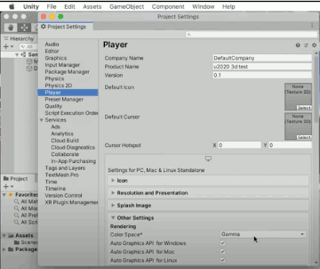
    - Oh, even unity 2020.1,  defaults to having gamma color space... No, unity, you should not be doing this nowadays.  I guess if you're doing like a 2D sprite game where you have no lighting effects,  maybe gamma space is a good idea, but SWITCH it to **linear**.
    - So anytime you are using unity if you're doing 3d graphics, in general just switch it linear.
    - High Definition RP  ( render pipeline)
        - this design specifically to target exclusively high-end systems: PS4, Xbox one , gaming PC.
    - Universal Render Pipeline
        - it used to go by the name of the lightweight render pipeline.
        - the idea of this pipeline it is fairly capable but it can also scale down to lower end devices like mobile phones.


<h2 id="d61c9e146d2d15883b5c8f7d218a05a2"></h2>


# 13 GPU Architecture & Assembly Language

<h2 id="6c51b2a3e1266217e1821d5fb8880283"></h2>


## Shader Models 

- Xbox 360 (SM 3.0)
- Playstation 3 (SM 3.0)
- Mid-2015 15" MacBook Pro (SM 5.1)
- Original Playstation 4 (SM 5.1)
- Original Xbox One & Xbox One S (SM 5.1)
- Xbox One X (SM 6.0)
- Playstation 4 Pro (SM 6.0)
- Nintendo Switch (SM 6.4)
- Most of "standard" Unity seem to defaults to SM 3.0 ( HDRP needs 5.0 )

Basically the shader model is defined an agreement of certain kinds of registers and certain kinds of instructions that the GPU will execute. But the exact details of how the GPU executes those instructions is up to that GPU and the driver.

<h2 id="629c46faa285a39d0f65b20b26a6ddde"></h2>


## Shader data 

- Mostly floats
- Integer & bitwise operations available in Shader Model 4.0, but not earlier
- Fixed-size vectors and matrices
    - not really necessarily a fixed convention in shader about rather these vector should be thought of as row vectors or column vectors. There are these 4 number things that depending on how you arrange the computation your shader code, you can interpret them as columns or as rows.
- Tree main types 
    - Per-instance data, e.g., per-vertex position
    - Per-pixel interpolated data, e.g., texture coordinates
    - Per-batch data, e.g., light position ( usually referred to as **uniform** variables)


<h2 id="92ae455ac58c5a02edbefd78c872cd0d"></h2>


## Specialized instructions ( Assembly,  GeForce 6 )

- Dot products
- Exponential instructions
    - EXP, LOG
- Reciprocal instructions
    - RCP ( reciprocal )
    - RSQ ( reciprocal square root )
        - interestingly, there is no instruction for square root ( GeForce 6 )
- Trigonometric function
    - SIN, COS
- Swizzling (swapping xyzw, e.g. zwxy) , write masking ( only some xyzw get assigned, e.g. xyz), and negation is "free" ( e.g. -z )
    - xyzw = rgba
- You can read the entire GPU Gems series for free on NVIDIA's website


<h2 id="ac6784fa422b1d1fef85036ee4decde6"></h2>


## Vertex Shader

- Transform to clip space
    - the main job of the vertex shader , is to do the transformations of transforming 3D coordinate spaces and projections onto the 2D screen.
- Calculate per-vertex lighting (e.g. Gouraud shading)
- Input
    - Common inputs:
        - Vertex postion (x,y,z,w)
        - Texture coordinate
            - most often just passed directly through because the texture lookups won't acutally happen until we get to the pixel shader
        - Vertex colors
            - if you weren't using textures for the colors you might have colors associated with the individual vertices.
            - you will only really see that in some extremely old 3D games
        - Constant inputs
            - common to all of the vertices, e.g. your 4x4 transformation matrix for your vertices, often refer to uniform
    - Output to a pixel (fragment) shader
- Vertex shader is executed once per vertex, so usually less expensive than pixel shader

- Vertex Compute Unit under shader model 3.0
    - 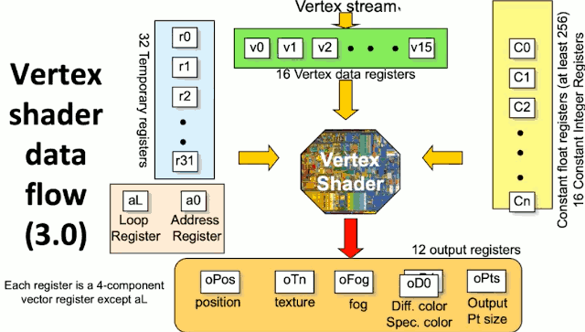
        - general purpose register ( blue ) are for your computation
        - constant registers ( yellow ) are for uniform variables
        - input register ( green ) for vertices
    - shader languages are very simple, because the vertex compute unit itself is very simple
        - there is no malloc, no heap to allocate memory, no stack, no recursion
        - you can't have a function call itself, all function basically inlined because no stack for function invoking.  there is only registers


<h2 id="d3d1e02aed1546fbc9d0b0c0dfa1b97d"></h2>


## Pixel ( or fragment ) shader

- Determine each fragment's color
    - Custom pixel operations
    - Texture sampling
- Input
    - **Interpolated** output from vertex shader
    - Typically vertex position, vertex normals, texture coordinates, etc.
    - There registers could be reused for other purpose
- Output
    - Color (including alpha)
    - Depth value (optional)
        - most of the time this isn't something you programmer need to deal with explicitly , this is handled automatically by the GPU behind the scenes, but it can use that to do z-buffer depth tests and other things.

---

- Executed once per pixel, hence typically executed many more times than a vertex shader
- It can be advantageous to compute some stuff on a per-vertex basic to improve performance.

- Pixel shader data flow (3.0)
    - 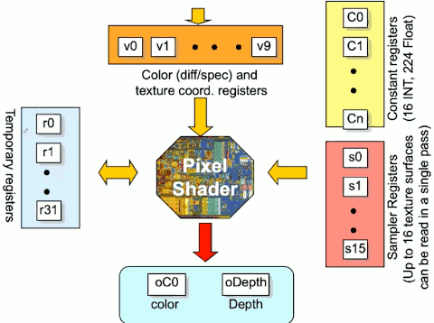
    - blue r0,r1... : general purpose registers
    - red: hardward mechanisms that go out and talk to the parts of your video memory that are storing textures, and these are linked to interpolation hardward.
    - Output: the depth is usually handled automatically.


<h2 id="07b6d393a22ca42fc5df0d0d4b035751"></h2>


## Some uses of pixel shaders

- Texturing objects
- Per-pixel lighting (e.g. Phong Shading)
- Normal mapping ( each pixel has its own normal)
- Shadows ( determine whether a pixel is shadowed or not)
- Environment mapping ( use cube map)


<h2 id="5eb3ef14b8dcdc301af4c983a7136410"></h2>


## Shader Language

- Historically , HLSL/Cg most common
    - Both are more-or-less compatible
- GLSL(for OpenGL)
    - Not exactly the same as, but similar to HLSL/Cg
- Newer
    - Vulkan Shading Language
    - Metal Shading Language ( Apple )


