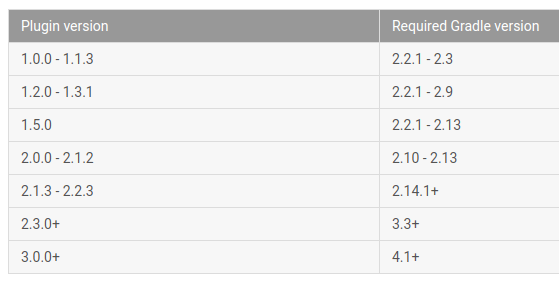

...menustart

 - [Gradle ==========](#e65d7c02720a16a39d157f31d85e1a59)
     - [Setup Gradle](#027160dccd9bf12e7e9a8b443969242b)
     - [Gradle Proxy Setting](#9a0e6d829f84ab3d85718633cd60d22b)
     - [Gradle create Java project](#d07c3afc41aa50868acc5daea24be425)
     - [Define a custom project property](#ee44ae63c19c5c6e494f4c65e75171b5)
     - [Define a custom task to run shell command](#b6c9a7859d3ce329dd999102d004758e)
     - [Task Dependency](#824c20e070522edf25afd49840b2415e)
     - [reference existing property](#224943e19ad0f37257982e3641b30c7b)
     - [speed up](#e15919e9f3dda8070015df3a70e233ea)
 - [Examples](#ff7c0fcd6a31e735a61c001f75426961)
     - [Add a task to mv files](#10a661ffd4df8982dd9dbd53e9f9ae72)
     - [add local jar](#3543535ab5cfcb8be02766dee55fa568)
 - [gradle java 插件](#99e91f3394da6444ff8b456668a550d7)
     - [1. 使用Java插件](#c623c7746ee0b9c37dd52277de59e0d8)
     - [2. 构建项目](#8a26c5518717adc00e89670b449413b7)
     - [3. 外部依赖](#3ce11b7291ca0e81c61b7ac1487baedc)
     - [4. 自定义项目](#992b5f30aa610a63842983eba0867abc)
     - [5. 发布JAR包](#93ef76c0b29821dd343e30ec3205a084)
     - [6. 创建Eclipse项目](#9d902f6daebc41bb35220496478b24e7)
 - [Gardle android plugin =======](#73f40ab93e7cb43c5f82139114d9b298)
     - [Command line create a android project with Gradle](#ff1e2724b57fa7703668d76dae901cdb)
     - [Set Source / Target Compatibility](#a6eec98d694e6bf6b3e7b2d2a8dec973)
     - [Product flavors](#6e3087c3ae908b9a7aefea0a2970b30a)
     - [Using proguard](#eeb10f0eeabc8c7de151028795fea392)
     - [Gradle 指定 manifest 文件路径](#089a24d84135c1eb537e96621be085d5)
     - [proguard in android plugin](#4927795f5413b00c41eb275236b2c3c5)
     - [gradle for unity3d android example](#997304d5400f082feabc402ac46aba97)
 - [Gradle and JNI](#124d869fe2f048f9f54668347d680079)
     - [hello-jni with gradle](#b7cd0782fca8810a571477d4e6784736)
     - [tips](#e4c9479b11955648dad558fe717a4eb2)
     - [JNI Example](#50a46251dc9b0613fecae34742c7e655)
     - [More update-date example](#897b756c8e40a52eb8834378681d0283)
 - [QA](#0ab687c6a13802a6674d5327e3d4177e)
     - [Gradle version 2.2 is required. Current version is 2.10](#2e072d186473767187aba8236da72d93)
     - [Could not find method runProguard() for arguments](#769f6f1c57e8b9182a031ed34dbd00e0)
     - [android logcat filter](#a00bb7ae615e786ed0e6d98d43e7248a)

...menuend


<h2 id="e65d7c02720a16a39d157f31d85e1a59"></h2>


## Gradle ==========

<h2 id="027160dccd9bf12e7e9a8b443969242b"></h2>


### Setup Gradle

 1. download gradle 2.3
    - [gradle](http://gradle.org/)  
    - [All Gradle Versions](https://services.gradle.org/distributions)
 2. config
    - `export GRADLE_HOME=/<installation location>/gradle-2.3`
    - `export PATH=${PATH}:$GRADLE_HOME/bin`

<h2 id="9a0e6d829f84ab3d85718633cd60d22b"></h2>


### Gradle Proxy Setting

gradle 经常会被墙，所以需要设置代理

vim ~/.gradle/gradle.properties

```bash
systemProp.http.proxyHost=代理地址
systemProp.http.proxyPort=端口
#systemProp.http.nonProxyHosts=不用代理的Hosts
systemProp.https.proxyHost=代理地址
systemProp.https.proxyPort=端口
#systemProp.https.nonProxyHosts=不用代理的Hosts
```

注意: 行末不要留空格！！


<h2 id="d07c3afc41aa50868acc5daea24be425"></h2>


### Gradle create Java project

```
gradle init --type java-library
```

    
<h2 id="ee44ae63c19c5c6e494f4c65e75171b5"></h2>


### Define a custom project property

```
ext.property_name = ...
```

使用的时候，不需要 `ext.`   , 直接 `property_name`

<h2 id="b6c9a7859d3ce329dd999102d004758e"></h2>


### Define a custom task to run shell command

```
task buildAPI(type:Exec)  {
    commandLine "mv" , "-f" , _jarFile  , _cpDestPath
}
```

<h2 id="824c20e070522edf25afd49840b2415e"></h2>


### Task Dependency

```
jarFiles.dependsOn build
buildAPI.dependsOn jarFiles
```

<h2 id="224943e19ad0f37257982e3641b30c7b"></h2>


### reference existing property

```
"${project.buildDir}/..."
```

<h2 id="e15919e9f3dda8070015df3a70e233ea"></h2>


### speed up

在下面的目录下面创建gradle.properties文件：

```
/home/<username>/.gradle/ (Linux)
/Users/<username>/.gradle/ (Mac)
C:\Users\<username>\.gradle (Windows)
```

+

```
org.gradle.parallel=true
org.gradle.daemon=true
```

----------

<h2 id="ff7c0fcd6a31e735a61c001f75426961"></h2>


## Examples 

<h2 id="10a661ffd4df8982dd9dbd53e9f9ae72"></h2>


### Add a task to mv files

添加一个 task `buildAPI` , 在 原有 `build` 任务的基础上, 对某个目录的 java classes 进行 jar 打包，并拷贝到指定目录。


```
ext._path = "${project.buildDir}/intermediates/classes/release/"
ext._cpDestPath = ...
ext._jarFile = "API_MediaDecode.jar"

task jarFiles(type:Exec)  {
    commandLine 'jar' , "-cvf" , _jarFile  , "-C" ,  _path  , "."
}   

task buildAPI(type:Exec)  {
    commandLine "mv" , "-f" , _jarFile  , _cpDestPath
}

jarFiles.dependsOn build
buildAPI.dependsOn jarFiles
```

<h2 id="3543535ab5cfcb8be02766dee55fa568"></h2>


### add local jar 

```
...
apply plugin: 'android'

dependencies {
   // add local jar
   compile fileTree(dir: '../../MobileAuth/libs', include: '*.jar')
}

android {
```

----

<h2 id="99e91f3394da6444ff8b456668a550d7"></h2>


## gradle java 插件

<h2 id="c623c7746ee0b9c37dd52277de59e0d8"></h2>


### 1. 使用Java插件

只需要要构建脚本中添加以下代码：
 
```
apply plugin: 'java'  
```

 - 默认情况下，Gradle会在src/main/java中查找你的源码，在src/test/java中查找你的测试代码
 - src/main/resources下的文件都会被打包
 - src/test/resources下的文件会被包含在classpath中用于测试
 - 所有输出的文件都保存在build目录里，
 - 生成的jar包则是在build/libs里面

<h2 id="8a26c5518717adc00e89670b449413b7"></h2>


### 2. 构建项目

 - gradle tasks命令查看任务。
 - gradle build时，Gradle会执行编译，测试，并且将源文件和资源文件打成jar包。
 - clean：删除build目录和其他构建时生成的文件
 - assemble：编译并打包，但不执行单元测试。
 - check：编译并测试代码。


<h2 id="3ce11b7291ca0e81c61b7ac1487baedc"></h2>


### 3. 外部依赖

通常一个项目会有许多外部依赖，我们需要在构建脚本中告诉Gradle在哪里可以找到这些依赖。比如如果使用maven中央仓库的话，我们可以通过以下代码来添加仓库：

```
repositories {  
    mavenCentral()  
}  
```

然后再通过下面代码添加依赖：

```
dependencies {  
    compile group: 'commons-collections', name: 'commons-collections', version: '3.2'  
    testCompile group: 'junit', name: 'junit', version: '4.+'  
}  
```

上面的代码中，声明了在编译期，需要依赖 commons-collections，在测试期需要依赖 junit。


<h2 id="992b5f30aa610a63842983eba0867abc"></h2>


### 4. 自定义项目

前面提到，Java插件为项目定义了许多默认配置，如果我们需要，这些配置都是可以由我们自己来定义的。如下面例子，指定项目版本号和JDK版本号，并且添加一些属性到JAR包的manifest文件中：

```
sourceCompatibility = 1.5  
version = '1.0'  
jar {  
    manifest {  
        attributes 'Implementation-Title': 'Gradle Quickstart', 'Implementation-Version': version  
    }  
}  
```

修改test任务来添加系统属性：

```
test {  
    systemProperties 'property': 'value'  
}  
```

<h2 id="93ef76c0b29821dd343e30ec3205a084"></h2>


### 5. 发布JAR包

以下代码是发布JAR包到本地中。发布到maven仓库或jcenter仓库以后再讨论。

```
project.version=1.0
uploadArchives {  
    repositories {  
       flatDir {  
           dirs 'repos'  
       }  
    }  
}  
```

执行gradle uploadArchives即可发布该JAR包。

uploadArchives 需要指定 project.version , 如果没有，最后的 jar 会以 "-unspecified"  结尾。

或者在 settings.gradle 文件中指定 `rootProject.name`

<h2 id="9d902f6daebc41bb35220496478b24e7"></h2>


### 6. 创建Eclipse项目

```
apply plugin: 'eclipse'  
```

执行 `gradle eclipse` 会生成eclipse项目文件
 


----------


<h2 id="73f40ab93e7cb43c5f82139114d9b298"></h2>


## Gardle android plugin =======

[Android Tools Project Site](http://tools.android.com/tech-docs/new-build-system/user-guide#TOC-Running-ProGuard)

[Gradle Android Plugin 中文手册](http://www.kancloud.cn/kancloud/gradle-for-android/52007)

[Gradle Doc](https://docs.gradle.org/current/dsl/org.gradle.api.Project.html)


<h2 id="ff1e2724b57fa7703668d76dae901cdb"></h2>


### Command line create a android project with Gradle

```
android create project -a MainActivity -k package_path_com.example.app -t android-16 -g -v 1.1.3 -p projectName 
```

<h2 id="a6eec98d694e6bf6b3e7b2d2a8dec973"></h2>


### Set Source / Target Compatibility 

```
android {
    ...
    compileOptions {
        sourceCompatibility = 'VERSION_1_6'
        targetCompatibility = 'VERSION_1_6'
    }
    ...
 }
```

<h2 id="6e3087c3ae908b9a7aefea0a2970b30a"></h2>


### Product flavors

```

android {
    ....
    productFlavors {
        flavor1 {
            ...
        }
        flavor2 {
            ...
        }
    }
}
```

 - A product flavor defines a customized version of the application build by the project
 - It will generate another app for each flavor


<h2 id="eeb10f0eeabc8c7de151028795fea392"></h2>


### Using proguard

To enable proguard:

```bash
android {
    buildTypes {
        release {
            minifyEnabled true
            proguardFile getDefaultProguardFile('proguard-android.txt')
        }
    }

    productFlavors {
        flavor1 {
            proguardFile 'some-other-rules.txt'
        }
    }
}
```

 - The ProGuard plugin is applied automatically by the Android plugin
 - proguard task are created automatically if the **Build Type** sets ***minifyEnabled*** property *true*
 - There are 2 default rules files:
    - proguard-android.txt
    - proguard-android-optimize.txt
 - You can use own proguard rules, or use more 1 proguard rules through **productFlavors**

<h2 id="089a24d84135c1eb537e96621be085d5"></h2>


### Gradle 指定 manifest 文件路径

```
android {
    sourceSets {
        main {
            manifest.srcFile 'ToDoList/src/main/AndroidManifest.xml'
            java.srcDirs  'src'
            res.srcDirs  'res'
        }
    }
}
```

`res.srcDirs  'res'`  指定 资源路径 ( src/main/res ) 

其他的类似可用设置:

```
sourceSets {
    main {
        manifest.srcFile 'AndroidManifest.xml'
        java.srcDirs = ['src']
        resources.srcDirs = ['src/main/res']
        aidl.srcDirs = ['src']
        renderscript.srcDirs = ['src']
        res.srcDirs = ['res/main/res']
        assets.srcDirs = ['assets']
    }
    instrumentTest.setRoot('tests')
}
```

 
<h2 id="4927795f5413b00c41eb275236b2c3c5"></h2>


### proguard in android plugin

```
    buildTypes {
        release {
        minifyEnabled true
        proguardFile 'proguard-project.txt'
        }
    }

```
    
<h2 id="997304d5400f082feabc402ac46aba97"></h2>


### gradle for unity3d android example

```
buildscript {  
   repositories {  
     mavenCentral()  
   }  
   dependencies {  
     classpath 'com.android.tools.build:gradle:0.10.+'  
   }  
   tasks.withType(JavaCompile) { options.encoding = "UTF-8" }  
 }  
 apply plugin: 'android'  
 dependencies {  
   compile fileTree(dir: 'libs', include: '*.jar')  
 }  
 android {  
   compileSdkVersion 19  
   buildToolsVersion "20.0.0"  
   defaultConfig {  
     minSdkVersion 9  
     targetSdkVersion 19  
   }  
   lintOptions {  
        abortOnError false  
      }  
   signingConfigs {  
       myConfig{   
         storeFile file("releasesig.keystore")  
         storePassword ""  
         keyAlias "release"  
         keyPassword ""  
       }   
     }   
   buildTypes{   
       release {   
         signingConfig signingConfigs.myConfig   
       }   
     }   
   sourceSets {  
     main {   
           manifest.srcFile 'AndroidManifest.xml'   
           java.srcDirs = ['src']   
           resources.srcDirs = ['src']   
           aidl.srcDirs = ['src']   
           renderscript.srcDirs = ['src']   
           res.srcDirs = ['res']  
           assets.srcDirs = ['assets']   
           jniLibs.srcDirs = ['libs']   
         }   
   }  
 }  
```

another example :

```
buildscript {
    repositories {
        mavenCentral()
    }
    dependencies {
        classpath 'com.android.tools.build:gradle:1.1.3'
    }
}
apply plugin: 'android'

dependencies {  
   compile fileTree(dir: 'libs', include: '*.jar')  
}  

android {
    compileSdkVersion 'android-23'
    buildToolsVersion '23.0.2'

  sourceSets {
      main {
          manifest.srcFile './AndroidManifest.xml'
       java.srcDirs  'src'
          res.srcDirs  'res'
        assets.srcDirs = ['assets']   
           jniLibs.srcDirs = ['libs']   
      }
  }
    
    lintOptions {  
        abortOnError false  
      } 

    buildTypes {
        release {
            minifyEnabled false
            proguardFile getDefaultProguardFile('proguard-android.txt')
        }
    }
}
```

API example:

```
buildscript {
    repositories {
        mavenCentral()
    }
    dependencies {
        classpath 'com.android.tools.build:gradle:1.1.3'
    }
}
apply plugin: 'android'


android {
    compileSdkVersion 'android-16'
    buildToolsVersion '23.0.2'

    compileOptions {
        sourceCompatibility = 'VERSION_1_6'
        targetCompatibility = 'VERSION_1_6'
    }

    sourceSets {
        main {
            manifest.srcFile 'AndroidManifest.xml'
            java.srcDirs  'src'
        res.srcDirs  'res'
        }
    }

    buildTypes {
        release {
        minifyEnabled true
        proguardFile 'proguard-project.txt'
        }
    }

}


ext._proguardedFilePath = "${project.buildDir}/intermediates/classes-proguard/release/classes.jar"
ext._cpDestPath = "/Users/qibinyi/WORK/WORK/TestVideo/Assets/Plugin/Android/API_MediaDecode.jar"

task buildAPI(type:Exec)  {
    commandLine "mv" , "-f" , _proguardedFilePath  , _cpDestPath
}


buildAPI.dependsOn build


```

---

<h2 id="124d869fe2f048f9f54668347d680079"></h2>


# Gradle and JNI

<h2 id="b7cd0782fca8810a571477d4e6784736"></h2>


## hello-jni with gradle 

 1. use `android create`   command to create a android gradle project
 2. add `ndk.dir=<path-to-ndk>` to local.properties file
 3. in build.gradle file inside of the defaultConfig closure , add ..
    ```
    buildToolsVersion ...

    defaultConfig {
        // applicationId "com.apixel.luaTest"
        ndk {
            moduleName "hello-world"
        }
    }
    sourceSets.main {
        jni.srcDirs = ['jni']
    }
    ```

 4. create a folder `jni` , In that folder, create a file called *hello-world.c*
 5. in java Activity class, call the method in *hello-world.c*

```c
// hello-world.c
#include <string.h>
#include <jni.h>

jstring
Java_com_apixel_luaTest_Main_stringFromJNI(JNIEnv* env, jobject thiz) {
    return (*env)->NewStringUTF(env, "Hello world from JNI!");
}
```

```java
// Main.java
public class Main extends Activity
{
    static {
        System.loadLibrary("hello-world");
    }

    public native String stringFromJNI();

    /** Called when the activity is first created. */
    @Override
    public void onCreate(Bundle savedInstanceState)
    {
        super.onCreate(savedInstanceState);
        setContentView(R.layout.main);

        String testString = stringFromJNI();
        System.out.println( testString );
    }
}
```

<h2 id="e4c9479b11955648dad558fe717a4eb2"></h2>


## tips 
    
 - native 方法如果定义在 cpp 文件中， 需要 加上 extern "C"
 - link library :
    ```
    ndk {
        ...
        ldLibs "log"
    }
    ```

 - 这个例子中，我们演示了 java 调用 native 方法， c++ 调用 java的情况会更复杂
 - 有时候，我们需要获取 JAVA VM

```c
extern "C" {
    JNIEXPORT jint JNI_OnLoad(JavaVM* vm, void *reserved)
        JniHelper::setJavaVM(vm);
        return JNI_VERSION_1_4;
    }
}
```

 - PS: JNI_OnLoad 方法 必须于工程的 jni 目录中定义 ，  放在static library 中无效


<h2 id="50a46251dc9b0613fecae34742c7e655"></h2>


## JNI Example

```
buildscript {
    repositories {
        mavenCentral()
    }
    dependencies {
        classpath 'com.android.tools.build:gradle:2.0.0'
    }
}
apply plugin: 'android'

android {
    compileSdkVersion 'android-16'
    buildToolsVersion '24.0.0'

    defaultConfig {
        minSdkVersion 11
        // applicationId "com.apixel.luaTest"
        ndk {
            moduleName "hello-world"
            ldLibs "log" , "android" , \
                "${project.rootDir}/../../luajit/prebuilt/android/\${TARGET_ARCH_ABI}/libluajit.a"    ,  \
                 "${project.rootDir}/../../tolua/prebuilt/android/\${TARGET_ARCH_ABI}/libtolua.so"
            cFlags "-O2 -I${project.rootDir}/../../luajit/include -I${project.rootDir}/../../tolua/include  \
                    -I${project.rootDir}/../../luabinding/luabinding"
            abiFilters "armeabi", "armeabi-v7a", "x86"// ,  "arm64-v8a"
            stl "gnustl_static"
        }
    }

    signingConfigs {
        release {
            storeFile file("${project.rootDir}/../../../androidKeystore/test.keystore")
            storePassword "Guardiola7"
            keyAlias "test.keystore"
            keyPassword "Guardiola7"
        }
    }

    sourceSets.main {
        jni.srcDirs = ['jni','../common_src']
        java.srcDirs += [ '../../tolua/src_misc/android/java' ]
        assets.srcDirs += [ '../common_res' ]
        jniLibs.srcDirs = [ '../../tolua/prebuilt/android' ]
    }
    buildTypes {
        release {
            minifyEnabled false
            proguardFile getDefaultProguardFile('proguard-android.txt')
            signingConfig signingConfigs.release
        }
    }
}
```

<h2 id="897b756c8e40a52eb8834378681d0283"></h2>


## More update-date example

```gradle
buildscript {
    repositories {
        google()
        jcenter()
    }
    dependencies {
        classpath 'com.android.tools.build:gradle:3.1.1'
    }
}
allprojects {
    repositories {
        google()
        jcenter()
    }
}

apply plugin: 'android'

android {
    compileSdkVersion 26
    defaultConfig {
        applicationId "you-app-package-id"
        minSdkVersion 21
        targetSdkVersion 26

        ndk {
            abiFilters 'armeabi'
        }

    }
      lintOptions {
          abortOnError false
      }

    buildTypes {
        release {
            minifyEnabled false
            proguardFile getDefaultProguardFile('proguard-android.txt')
        }
    }
    sourceSets {
        main {
            jniLibs.srcDirs = ['libs']
        }
    }
}


dependencies {
    // implementation 'com.google.code.gson:gson:2.2.1'
    implementation fileTree(include: ['*.jar'], dir: 'libs')
}

```

---


<h2 id="0ab687c6a13802a6674d5327e3d4177e"></h2>


# QA

<h2 id="2e072d186473767187aba8236da72d93"></h2>


## Gradle version 2.2 is required. Current version is 2.10

 - solution:
    - change `classpath 'com.android.tools.build:gradle:1.3.0'` to ` classpath 'com.android.tools.build:gradle:2.0.0'`




<h2 id="769f6f1c57e8b9182a031ed34dbd00e0"></h2>


## Could not find method runProguard() for arguments

 - in `build.gralde` , Instead of "runProguard false" use "minifyEnabled false" 


<h2 id="a00bb7ae615e786ed0e6d98d43e7248a"></h2>


## android logcat filter

 - `adb logcat -s TAG1*:I  TAG2:*`

