...menustart

- [edX  Introduction to Kuberneters](#e017284a962c40a7dc29fd29bea64bb4)
- [Access Kuberneters](#10ebfd4c6ede5e99a80eb32105dc4419)
    - [HTTP API Space of Kubernetes](#c9157975d6f67292424e86421d6ca49c)
    - [kubectl Configuration File](#70becb84ec118d75e27f125448562a2b)
    - [Kubernetes dashboard](#6bbde18895b093a1a0fc79b5c02e4462)
        - [Deploying the Dashboard UI](#ae1fd03692378014b99c5c70b6c121af)
        - [Accessing the Dashboard UI](#f32d0f539f9fbaff4c670cd2e5d7b14d)
        - [APIs - with 'kubectl proxy'](#d7dba71d2e1aa5aea658e819489eab4d)
        - [APIs - without 'kubectl proxy'](#c4a8eba76a7943e2e98a2e8b0f014db3)
- [Kubernetes Building Blocks](#79ea233bebd117c1c22480caf3c940c9)
    - [Kubernetes Object Model](#ea99654864cc0264b53634e7bf4863cb)
    - [Pods](#dc4b70c03e8043e50e38f2068887b1d4)
    - [Labels](#3ad6cb6100190c8f81e99fd52debf7ef)
    - [Label Selectors](#e54704b162577ba89d8f645bfd5be15d)
    - [ReplicationControllers](#aac34088fe3223e79b752a76ecdd321b)
    - [ReplicaSets](#99a29afc20721ef52b3d558eb6873f30)
    - [Deployments](#3081015fddfcd25b52903a5dc112ca7c)
    - [Namespaces](#13d28e8dfc702e3456e0767dff9a128a)
- [Authentication, Authorization, and Admission Control](#1e357d04dca49d644ad9513be68b74eb)
    - [Overview](#3b878279a04dc47d60932cb294d96259)
    - [Authentication](#c75f7811d70d17dbcd88e9d03752cbed)
    - [Authorization](#9cd8a2455b1839ff98ef70c05b9b5983)
    - [Admission Control](#a7765f8868404f7c3cb890ce051f7de4)
- [Service](#c2ba7e785c49050f48da9aacc45c2b85)
    - [Connecting Users to Pods](#96edaa8fd542cd7d2b685b4b038122cf)
    - [Service Object Example](#69da20bc1f38561244d83c7efb17eb3c)
    - [kube-proxy](#ea11065c99d9485fc7fe03aa1b668c20)
    - [Service Discovery](#24bbdaf375ddacbe3973587b50d98790)
    - [ServiceType](#4b351f6c3fa2b34bb1b969ce9502fe25)
        - [ServiceType: ClusterIP and NodePort](#c82f134a33d4debd7b8f763ed6e1834f)
        - [ServiceType: LoadBalancer](#3001d26f885c56a255f931078ae477c6)
- [Deploying an Application](#e7fc0ac576a6a88284d3525beadf5825)
    - [Deploy vi kubectl](#afc6a537dc75e9e56e87f88dc5d6af11)
        - [List the Pods, along with their attached Labels](#3b4e7053c64600e4f233a1ca0fb66946)
        - [Select the Pods with a given Label](#744302e45006d83e73e1e80fe19d7bdd)
        - [Delete the Deployment](#b500ea1a492ff7210ded38234bce4f8f)
        - [Create a YAML file with Deployment details](#ea3304e0b2e6faecdb42b70d3057f290)
        - [Creating a Service and Exposing It to the External World with NodePort I](#56255e54c326ca1c88892709ccdd62d9)
    - [Liveness and Readiness Probes](#87bd2994afe1748bd27e511e65b532a7)
        - [Liveness](#cacca97bb7abbf614d9c8f5a7569f5ea)
            - [Liveness Command](#3f1dcde80733742e2de45b734a4b4990)
        - [Liveness HTTP Request](#5b9d89f92b125d919fd5b98610ae68b9)
        - [TCP Liveness Probe](#b0d4459ffe193a51b32c146a67e97d64)
    - [Readiness Probes](#4f27a8cdff4a57ee4e0efc7db568d939)
- [Kubernetes Volume Management](#a3973c1903e1e860ead03894c4b4a082)
    - [Volumes](#c6f01c78bfe0a0a495cb5d3ed77824a9)
    - [Volume Types](#1760f6eeb378b6f01f6ccb20faeeac82)
    - [PersistentVolumes](#3f91308865b7567ae097573f6d0519e9)
    - [PersistentVolumeClaims](#455385b545189aa1f74511b5dc40d1eb)
- [ConfigMaps and Secrets](#e74688af9e034b8fe88786eee6b7ff2b)
    - [ConfigMaps](#a041d4808053eb1261d0dbab572ea629)
        - [Create a ConfigMap from Literal Values and Get Its Details](#8765f1ffd93b405ae1a91c13aae3e663)
        - [Create a ConfigMap from a Configuration File](#ea3972a8f5c658d8ede325d13968d46f)
        - [Use ConfigMap Inside Pods](#36b689f5b271da1324001d06c4d83dfe)
    - [Secrets](#ffb85bfe93f1d2f1654a7048b87f0403)
        - [Create the Secret with the 'kubectl create secret' Command](#f1f3541f0c90a9bcc70092dbedacb64b)
        - [Create a Secret Manually](#656442f43e660ae59f8878a63474407a)
        - [Use Secrets Inside Pods](#b81fb44d1f7de48c36dbb8f865a9cd2c)
            - [Using Secrets as Environment Variables](#472677ea9956d73c10d21a2d17777435)
            - [Using Secrets as Files from a Pod](#9488499f57000e087049e3d8faac3473)
- [Ingress](#7d05c708b92b4809bfe9bf66edf8f765)
    - [Ingress I](#70b2b5b8a36e937c6fddf510da3968c3)
    - [Ingress II](#dd374142ee0d3696af5151d9e9ded05f)
    - [Ingress Controller](#a5765900d255fcb42e5ea092fe489331)
        - [Deploy an Ingress Resource](#65c0a46ef98d210656055f61588ff4ed)
    - [kubernetes/ingress-nginx user-guide TLS](#8fd6748f0750d9c913b9e2dfcbb7946b)
- [Advanced Topics](#41ef0c7e3aa81f83c8172c71f9986dfb)
    - [Annotations](#933e469cb306a0ea9faabd3e4235d3be)
    - [Deployment Features](#e4c677a2cc444dd3ce2cea9f020921aa)
    - [Jobs](#12ceff2290bb9039beaa8f36d5dec226)
    - [Quota Management](#708c25df4f4584405d14fbf936539d2e)
    - [DaemonSets](#d1026cec97f2e9854c2a3b4a8f8bd039)
    - [StatefulSets](#a5896f58556198d1653d2d00a0db9b06)
    - [Kubernetes Federation](#022ea9eb4d6919b0b0b73c167d1c0083)
    - [Custom Resources](#1eefdde32973942a371cb277943df70f)
    - [Helm](#152090ff5e9a05ea7e1cf0c248449638)
    - [Monitoring and Logging](#9ad24640fe10d78bada6b5e68dd0f68f)

...menuend


<h2 id="e017284a962c40a7dc29fd29bea64bb4"></h2>


# edX  Introduction to Kuberneters


<h2 id="10ebfd4c6ede5e99a80eb32105dc4419"></h2>


# Access Kuberneters

<h2 id="c9157975d6f67292424e86421d6ca49c"></h2>


## HTTP API Space of Kubernetes

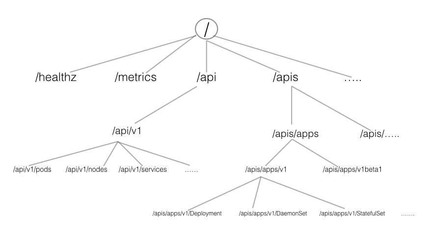

HTTP API space of Kubernetes can be divided into three independent groups:

 - Core Group (/api/v1)
    - This group includes objects such as Pods, Services, nodes, etc.
 - Named Group
    - This group includes objects in **/apis/$NAME/$VERSION** format
    - These different API versions imply different levels of stability and support:
        - Alpha level - it may be dropped at any point in time, without notice. For example, /apis/batch/v2alpha1.
        - Beta level - it is well-tested, but the semantics of objects may change in incompatible ways in a subsequent beta or stable release. 
            - example, /apis/certificates.k8s.io/v1beta1
        - Stable level - appears in released software for many subsequent versions.
            - For example, /apis/networking.k8s.io/v1
 - System-wide
    - This group consists of system-wide API endpoints, like /healthz, /logs, /metrics, /ui, etc.

<h2 id="70becb84ec118d75e27f125448562a2b"></h2>


## kubectl Configuration File

 - To connect to the Kubernetes cluster, kubectl needs the master node endpoint and the credentials to connect to it.
 - On the master node machine, by default, a configuration file, config, inside the.kube directory, which resides in the user's home directory.
 - That configuration file has all the connection details.  
 - To look at the connection details, we can either see the content of the ~/.kube/config(Linux) file, or run the following command:


```
# kubectl config view
apiVersion: v1
clusters:
- cluster:
    certificate-authority-data: DATA+OMITTED
    server: https://10.192.83.78:6443
  name: kubernetes
...
```

 - Once kubectl is installed, we can get information about the Minikube cluster with the `kubectl cluster-info` command

```
# kubectl cluster-info
```


<h2 id="6bbde18895b093a1a0fc79b5c02e4462"></h2>


## Kubernetes dashboard 

<h2 id="ae1fd03692378014b99c5c70b6c121af"></h2>


### Deploying the Dashboard UI

```
kubectl create -f https://raw.githubusercontent.com/kubernetes/dashboard/master/src/deploy/recommended/kubernetes-dashboard.yaml
```

<h2 id="f32d0f539f9fbaff4c670cd2e5d7b14d"></h2>


### Accessing the Dashboard UI

```
kubectl proxy
```

 - Kubectl will make Dashboard available at
    - `http://localhost:8001/api/v1/namespaces/kube-system/services/https:kubernetes-dashboard:/proxy/`

 - to access the proxy from external browse , try 

```
# kubectl proxy --port=8001 --address='<master.ip.addr>' --accept-hosts="^*$"
Starting to serve on 10.192.83.78:8001
```

 - now access `http://10.192.83.78:8001/api/v1/namespaces/kube-system/services/https:kubernetes-dashboard:/proxy/`
    - PS. it will lead to authoriation problem.

 - for test purpose only , you can Granting admin privileges to Dashboard's Service Account 
    - Afterwards you can use Skip option on login page to access Dashboard.

```
$ cat <<EOF | kubectl create -f -
apiVersion: rbac.authorization.k8s.io/v1beta1
kind: ClusterRoleBinding
metadata:
  name: kubernetes-dashboard
  labels:
    k8s-app: kubernetes-dashboard
roleRef:
  apiGroup: rbac.authorization.k8s.io
  kind: ClusterRole
  name: cluster-admin
subjects:
- kind: ServiceAccount
  name: kubernetes-dashboard
  namespace: kube-system
EOF
```


[more solutions on stackoverflow](https://stackoverflow.com/questions/46664104/how-to-sign-in-kubernetes-dashboard)


<h2 id="d7dba71d2e1aa5aea658e819489eab4d"></h2>


### APIs - with 'kubectl proxy'

 - When kubectl proxy is configured, we can send requests to localhost on the proxy port:
    - With the above curl request, we requested all the API endpoints from the API server.

```
$ curl http://localhost:8001/
{
 "paths": [
   "/api",
   "/api/v1",
   "/apis",
   "/apis/apps",
   ......
   ......
   "/logs",
   "/metrics",
   "/swaggerapi/",
   "/ui/",
   "/version"
 ]
}
```

<h2 id="c4a8eba76a7943e2e98a2e8b0f014db3"></h2>


### APIs - without 'kubectl proxy'

 - Without **kubectl proxy** configured, we can get the **Bearer Token** using kubectl,and then send it with the API request.
 - A **Bearer Token** is an **access token** which is generated by the authentication server(the API server on the master node) and given back to the client. 
 - Using that token, the client can connect back to the Kubernetes API server without providing further authentication details, and then, access resources. 

 - **Get the token**

```
TOKEN=$(kubectl describe secret -n kube-system $(kubectl get secrets -n kube-system | grep default | cut -f1 -d ' ') | grep -E '^token' | cut -f2 -d':' | tr -d '\t' | tr -d " ")
```

 - **Get the API server endpoint**


```
APISERVER=$(kubectl config view | grep https | cut -f 2- -d ":" | tr -d " ")
# echo $APISERVER
https://10.192.83.78:6443
```

 - Access the API Server using the curl command, as shown below

```
curl $APISERVER/api --header "Authorization: Bearer $TOKEN" --insecure
{
  "kind": "APIVersions",
  "versions": [
    "v1"
  ],
  "serverAddressByClientCIDRs": [
    {
      "clientCIDR": "0.0.0.0/0",
      "serverAddress": "10.192.83.78:6443"
    }
  ]
}
```

<h2 id="79ea233bebd117c1c22480caf3c940c9"></h2>


# Kubernetes Building Blocks

<h2 id="ea99654864cc0264b53634e7bf4863cb"></h2>


## Kubernetes Object Model

 - With each object, we declare our intent or desired state using the **spec** field
 - The Kubernetes system manages the **status** field for objects, in which it records the actual state of the object. 
 - To create an object, we need to provide the **spec** field to the Kubernetes API server. 
    - The spec field describes the desired state, along with some basic information, like the name. 
 - Below is an example of a Deployment object:

```
apiVersion: apps/v1
kind: Deployment
metadata:
  name: nginx-deployment
  labels:
    app: nginx
spec:
  replicas: 3
  selector:
    matchLabels:
      app: nginx
  template:
    metadata:
      labels:
        app: nginx
    spec:
      containers:
      - name: nginx
        image: nginx:1.7.9
        ports:
        - containerPort: 80
```

 - kind
    - mention the object type
 - metadata
    - attach the basic information to objects, like the name.
 - spec
    - define the desired state of the deployment.
    - You may have noticed that in our example we have two spec fields (spec and spec.template.spec).
    - In our example, we want to make sure that, at any point in time, at least 3 Pods are running, which are created using the Pods Template defined in spec.template.
    - In spec.template.spec, we define the desired state of the Pod.
        - Here, our Pod would be created using nginx:1.7.9.
 - Once the object is created, the Kubernetes system attaches the **status** field to the object; we will explore it later.

<h2 id="dc4b70c03e8043e50e38f2068887b1d4"></h2>


## Pods

 - A Pod is the smallest and simplest Kubernetes object.
    - It is the unit of deployment in Kubernetes, which represents a single instance of the application. 
 - A Pod is a logical collection of one or more containers, which:
    - Are scheduled together on the same host
    - Share the same network namespace
    - Mount the same external storage (volumes).

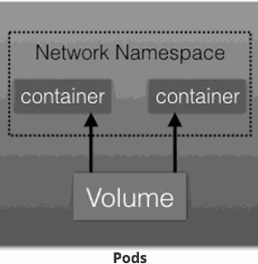

 - Pods do not have the capability to self-heal by themselves. 
    - That is why we use them with controllers, which can handle a Pod's replication, fault tolerance, self-heal, etc. 
    - Examples of controllers are Deployments, ReplicaSets, ReplicationControllers, etc.
 - We attach the Pod's specification to other objects using Pods Templates, as we have seen in the previous section.


<h2 id="3ad6cb6100190c8f81e99fd52debf7ef"></h2>


## Labels

 - Labels are key-value pairs that can be attached to any Kubernetes objects (e.g. Pods).
 - Labels are used to organize and select a subset of objects, based on the requirements in place.
 - Many objects can have the same Label(s). Labels do not provide uniqueness to objects.  

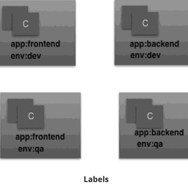

 - In the image above, we have used two Labels: app and env.
    - Based on our requirements, we have given different values to our four Pods.

<h2 id="e54704b162577ba89d8f645bfd5be15d"></h2>


## Label Selectors

 - With Label Selectors, we can select a subset of objects. 
 - Kubernetes supports two types of Selectors:
    - Equality-Based Selectors
        - allow filtering of objects based on Label keys and values. 
        - With this type of selectors, we can use the =, ==, or != operators. 
        - For example, with env==dev we are selecting the objects where the env Label is set to dev. 
    - Set-Based Selectors
        - allow filtering of objects based on a set of values
        - With this type of Selectors, we can use the in, notin, and exist operators. 
        - For example, with **env in (dev,qa)**, we are selecting objects where the env Label is set to dev or qa. 

<h2 id="aac34088fe3223e79b752a76ecdd321b"></h2>


## ReplicationControllers

 - A ReplicationController (rc) is a controller that is part of the master node's controller manager. 
 - It makes sure the specified number of replicas for a Pod is running at any given point in time.
 - Generally, we don't deploy a Pod independently, as it would not be able to re-start itself, if something goes wrong. 
 - We always use controllers like ReplicationController to create and manage Pods. 

<h2 id="99a29afc20721ef52b3d558eb6873f30"></h2>


## ReplicaSets

 - A ReplicaSet (rs) is the next-generation ReplicationController.
 - ReplicaSets support both equality- and set-based selectors, whereas ReplicationControllers only support equality-based Selectors.
    - Currently, this is the only difference.

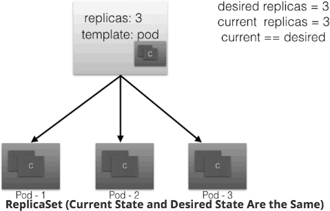

 - ReplicaSets can be used independently, but they are mostly used by Deployments to orchestrate the Pod creation, deletion, and updates. 
 - A Deployment automatically creates the ReplicaSets, and we do not have to worry about managing them. 


<h2 id="3081015fddfcd25b52903a5dc112ca7c"></h2>


## Deployments

 - Deployment objects provide declarative updates to Pods and ReplicaSets.
 - The DeploymentController is part of the master node's controller manager, and it makes sure that the current state always matches the desired state.
 - let's say we have a **Deployment** which creates a **ReplicaSet A**.  **ReplicaSet A** then create **3 Pods**. 
    - In each Pod, one of the containers user the nginx:1.7.9 image.
 - Now, in the Deployment, we change the Pods Template and we update the image for the nginx container from nginx:1.7.9 to nginx:1.9.1.
    - As have modified the Pods Template, a new **ReplicaSet B** gets created. 
    - This process is referred to as a **Deployment rollout**.
 - A rollout is only triggered when we update the Pods Template for a deployment.
    - Operations like scaling the deployment do not trigger the deployment.
 - Once **ReplicaSet B** is ready, the Deployment starts pointing to it.
    - with which, if something goes wrong, we can rollback to a previously known state.

<h2 id="13d28e8dfc702e3456e0767dff9a128a"></h2>


## Namespaces

 - we can partition the Kubernetes cluster into sub-clusters using Namespaces.
 - The names of the resources/objects created inside a Namespace are unique, but not across Namespaces.

```
# kubectl get namespaces
NAME          STATUS   AGE
default       Active   22h
kube-public   Active   22h
kube-system   Active   22h
```

 - Generally, Kubernetes creates two default Namespaces: kube-system and default. 
    - The kube-system Namespace contains the objects created by the Kubernetes system.
    - By default, we connect to the default Namespace.
 - kube-public is a special Namespace, which is readable by all users and used for special purposes, like bootstrapping a cluster. 
 - Using **Resource Quotas**, we can divide the cluster resources within Namespaces. 

<h2 id="1e357d04dca49d644ad9513be68b74eb"></h2>


# Authentication, Authorization, and Admission Control

<h2 id="3b878279a04dc47d60932cb294d96259"></h2>


## Overview

 - To access and manage any resources/objects in the Kubernetes cluster, we need to access a specific API endpoint on the API server. 
 - Each access request goes through the following three stages:
    - Authentication
        - Logs in a user.
    - Authorization
        - Authorizes the API requests added by the logged-in user.
    - Admission Control
        - Software modules that can modify or reject the requests based on some additional checks, like **Quota**.

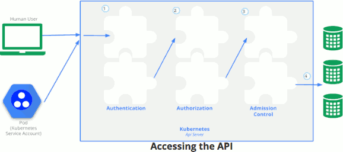


<h2 id="c75f7811d70d17dbcd88e9d03752cbed"></h2>


## Authentication

 - Kubernetes does not have an object called user, nor does it store usernames or other related details in its object store.
 - However, even without that, Kubernetes can use usernames for access control and request logging.
 - Kubernetes has two kinds of users:
    - Normal Users
        - They are managed outside of the Kubernetes cluster via independent services like User/Client Certificates, a file listing usernames/passwords, etc.
    - Service Accounts
        - With Service Account users, in-cluster processes communicate with the API server to perform different operations.
        - Most of the Service Account users are created automatically via the API server, but they can also be created manually. 
        - The Service Account users are tied to a given Namespace and mount the respective credentials to communicate with the API server as Secrets.
 - If properly configured, Kubernetes can also support **anonymous requests**, along with requests from Normal Users and Service Accounts.
 - For authentication, Kubernetes uses different authenticator modules:
    - Client Certificates
        - need to reference a file containing one or more certificate authorities by passing the **--client-ca-file=SOMEFILE** option to the API server. 
    - Static Token File
        - pass a file containing pre-defined bearer tokens with the **--token-auth-file=SOMEFILE** option to the API server. 
        - Currently, these tokens would last indefinitely, and they cannot be changed without restarting the API server.
    - Bootstrap Tokens
        - currently in an alpha statu
    - Static Password File
        - It is similar to Static Token File
        - pass a file containing basic authentication details with the **--basic-auth-file=SOMEFILE** option.
    - Service Account Tokens
        - This is an automatically enabled authenticator that uses signed bearer tokens to verify the requests. 
        - These tokens get attached to Pods using the ServiceAccount Admission Controller, which allows in-cluster processes to talk to the API server.
    - OpenID Connect Tokens
        - OpenID Connect helps us connect with OAuth 2 providers, such as Azure Active Directory, Salesforce, Google, etc., to offload the authentication to external services.
    - Webhook Token Authentication
        - With Webhook-based authentication, verification of bearer tokens can be offloaded to a remote service.
    - Keystone Password
        - Keystone authentication can be enabled by passing the `--experimental-keystone-url=<AuthURL> option` to the API server, where AuthURL is the Keystone server endpoint.
    - Authenticating Proxy
        - If we want to program additional authentication logic, we can use an authenticating proxy. 

 - We can enable multiple authenticators,
    - In order to be successful, you should enable at least two methods: the service account tokens authenticator and the user authenticator.

<h2 id="9cd8a2455b1839ff98ef70c05b9b5983"></h2>


## Authorization

 - After a successful authentication, users can send the API requests to perform different operations.
 - Then, those API requests get authorized by Kubernetes using various authorization modules.
 - Some of the API request attributes that are reviewed by Kubernetes include user, group, extra, Resource or Namespace, to name a few.
    - Next, these attributes are evaluated against policies. 
    - If the evaluation is successful, then the request will be allowed, otherwise it will get denied. 
 - Similar to the Authentication step, Authorization has multiple modules/authorizers.

 - Authorization modules
    - Node Authorizer
        - Node authorization is a special-purpose authorization mode which specifically authorizes API requests made by kubelets.
        - It authorizes the kubelet's read operations for services, endpoints, nodes, etc., and writes operations for nodes, pods, events, etc. 
    - Attribute-Based Access Control (ABAC) Authorizer
        - With the ABAC authorizer, Kubernetes grants access to API requests, which combine policies with  attributes.
        - In the following example, user nkhare can only read Pods in the Namespace lfs158.
        - 
        ```
        {
          "apiVersion": "abac.authorization.kubernetes.io/v1beta1",
          "kind": "Policy",
          "spec": {
            "user": "nkhare",
            "namespace": "lfs158",
            "resource": "pods",
            "readonly": true
          }
        }
        ```

        - To enable the ABAC authorizer, we would need to start the API server with the **--authorization-mode=ABAC** option.
        - We would also need to specify the authorization policy, like **--authorization-policy-file=PolicyFile.json**
    - Webhook Authorizer
        - With the Webhook authorizer, Kubernetes can offer authorization decisions to some third-party services, which would return true for successful authorization, and false for failure. 
        - In order to enable the Webhook authorizer, we need to start the API server with the **--authorization-webhook-config-file=SOME_FILENAME** option, where SOME_FILENAME is the configuration of the remote authorization service. 
    - Role-Based Access Control (RBAC) Authorizer
        - 使用RBAC，我们可以根据各个用户的角色来规范对资源的访问。
        - In Kubernetes, we can have different roles that can be attached to subjects like users, service accounts, etc. 
        - While creating the roles, we restrict resource access by specific operations, such as create, get, update, patch, etc.
        - In RBAC, we can create two kinds of roles:
            - Role  -- With Role, we can grant access to resources within a specific Namespace.
            - ClusterRole  -- The ClusterRole can be used to grant the same permissions as Role does, but its scope is cluster-wide.
        - 
        ```
        kind: Role
        apiVersion: rbac.authorization.k8s.io/v1
        metadata:
          namespace: lfs158
          name: pod-reader
        rules:
        ~ apiGroups: [""] # "" indicates the core API group, ~ should be -
          resources: ["pods"]
          verbs: ["get", "watch", "list"]
        ```

        - Above example creates a pod-reader role, which has access only to the Pods of lfs158 Namespace.
        - Once the role is created, we can bind users with RoleBinding.
        - There are two kinds of RoleBindings:         
            - RoleBinding
                - It allows us to bind users to the same namespace as a Role 
            - ClusterRoleBinding
                - It allows us to grant access to resources at a cluster-level and to all Namespaces.
        - 
        ```
        kind: RoleBinding
        apiVersion: rbac.authorization.k8s.io/v1
        metadata:
          name: pod-read-access
          namespace: lfs158
        subjects:
        ~ kind: User  # ~ should be -
          name: nkhare
          apiGroup: rbac.authorization.k8s.io
        roleRef:
          kind: Role
          name: pod-reader
          apiGroup: rbac.authorization.k8s.io
        ```

        - see above example,  it gives access to nkhare to read the Pods of lfs158 Namespace.
        - To enable the RBAC authorizer, we would need to start the API server with the **--authorization-mode=RBAC** option. 
        - With the RBAC authorizer, we dynamically configure policies. 


<h2 id="a7765f8868404f7c3cb890ce051f7de4"></h2>


## Admission Control

 - Admission control is used to specify granular access control policies, which include allowing privileged containers, checking on resource quota, etc.
 - We force these policies using different admission controllers, like ResourceQuota, AlwaysAdmit, DefaultStorageClass, etc. 
 - To use admission controls, we must start the Kubernetes API server with the admission-control

```
--admission-control=NamespaceLifecycle,ResourceQuota,PodSecurityPolicy,DefaultStorageClass.
```

 - By default, Kubernetes comes with some built-in admission controllers.

<h2 id="c2ba7e785c49050f48da9aacc45c2b85"></h2>


# Service

<h2 id="96edaa8fd542cd7d2b685b4b038122cf"></h2>


## Connecting Users to Pods

 - To access the application, a user/client needs to connect to the Pods
 - Kubernetes provides a higher-level abstraction called Service, which logically groups Pods and a policy to access them. 
    - This grouping is achieved via Labels and Selectors, which we talked about in the previous chapter. 
 - We can assign a name to the logical grouping, referred to as a **Service name**. 

<h2 id="69da20bc1f38561244d83c7efb17eb3c"></h2>


## Service Object Example

 - The following is an example of a Service object:

```
kind: Service
apiVersion: v1
metadata:
  name: frontend-svc
spec:
  selector:
    app: frontend
  ports:
    - protocol: TCP
      port: 80
      targetPort: 5000
```

 - In this example, we are creating a **frontend-svc** Service by selecting all the Pods that have the Label **app** set to the **frontend**.
 - By default, each Service also gets an IP address, which is routable only inside the cluster. 
    - The IP address attached to each Service is also known as the ClusterIP for that Service.
 - The user/client now connects to a service via the IP address, which forwards the traffic to one of the Pods attached to it.
    - A service does the load balancing while selecting the Pods for forwarding the data/traffic.
 - While forwarding the traffic from the Service, we can select the target port on the Pod.
    - for example, for frontend-svc, we will receive requests on Port 80.  We will then forward these requests to one of the attached Pods on Port 5000. 
    - If the target port is not defined explicitly, then traffic will be forwarded to Pods on the port on which the Service receives traffic.

<h2 id="ea11065c99d9485fc7fe03aa1b668c20"></h2>


## kube-proxy

 - All of the worker nodes run a daemon called kube-proxy, which watches the API server on the master node for the addition and removal of Services and endpoints. 
 - For each new Service, on each node, kube-proxy configures the iptables rules to capture the traffic for its ClusterIP and forwards it to one of the endpoints.
 - When the service is removed, kube-proxy removes the iptables rules on all nodes as well.

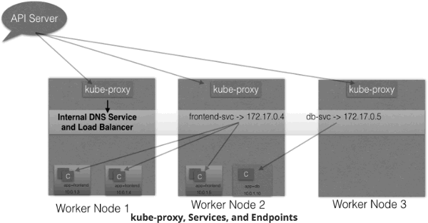


<h2 id="24bbdaf375ddacbe3973587b50d98790"></h2>


## Service Discovery

As Services are the primary mode of communication in Kubernetes, we need a way to discover them at runtime. 

Kubernetes supports two methods of discovering a Service:

 - Environment Variables
    - As soon as the Pod starts on any worker node, the kubelet daemon running on that node adds a set of environment variables in the Pod for all active Services.
    - For example, if we have an active Service called redis-master, which exposes port 6379, and its ClusterIP is 172.17.0.6, then, on a newly created Pod, we can see the following environment variables:
    - 
    ```
    REDIS_MASTER_SERVICE_HOST=172.17.0.6
    REDIS_MASTER_SERVICE_PORT=6379
    REDIS_MASTER_PORT=tcp://172.17.0.6:6379
    REDIS_MASTER_PORT_6379_TCP=tcp://172.17.0.6:6379
    REDIS_MASTER_PORT_6379_TCP_PROTO=tcp
    REDIS_MASTER_PORT_6379_TCP_PORT=6379
    REDIS_MASTER_PORT_6379_TCP_ADDR=172.17.0.6
    ```

 - DNS
    - Kubernetes has an add-on for DNS, which creates a DNS record for each Service and its format is like my-svc.my-namespace.svc.cluster.local
    - **Services within the same Namespace can reach to other Services with just their name.**
    - For example, if we add a Service redis-master in the **my-ns** Namespace, then all the Pods in the same Namespace can reach to the redis Service just by using its name, **redis-master**. 
    - Pods from other Namespaces can reach the Service by adding the respective Namespace as a `suffix`, like **redis-master.my-ns**. 
    - This is the most common and highly recommended solution. 

        
<h2 id="4b351f6c3fa2b34bb1b969ce9502fe25"></h2>


## ServiceType

 - While defining a Service, we can also choose its access scope.
 - We can decide whether the Service:
    - Is only accessible within the cluster
    - Is accessible from within the cluster and the external world
    - Maps to an external entity which resides outside the cluster.
 - Access scope is decided by `ServiceType`, which can be mentioned when creating the Service.

<h2 id="c82f134a33d4debd7b8f763ed6e1834f"></h2>


### ServiceType: ClusterIP and NodePort

 - ClusterIP is the default ServiceType. 
    - A Service gets its Virtual IP address using the ClusterIP. 
    - That IP address is used for communicating with the Service and is accessible only within the cluster. 
 - With the NodePort ServiceType, in addition to creating a ClusterIP, a port from the range 30000-32767 is mapped to the respective Service, from all the worker nodes.
    - For example, if the mapped NodePort is `32233` for the service frontend-svc, then, if we connect to any worker node on port 32233, the node would redirect all the traffic to the assigned ClusterIP - 172.17.0.4.

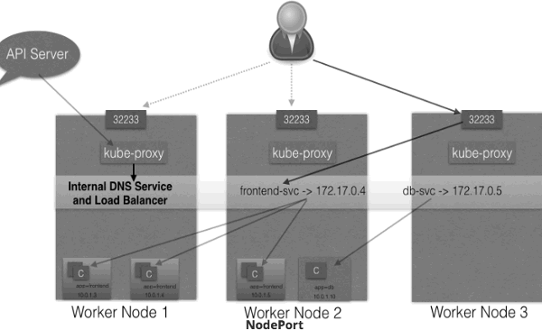

 - The NodePort ServiceType is useful when we want to make our Services accessible from the external world.
 - The end-user connects to the worker nodes on the specified port, which forwards the traffic to the applications running inside the cluster.
 - To access the application from the external world, administrators can configure a reverse proxy outside the Kubernetes cluster and map the specific endpoint to the respective port on the worker nodes. 


<h2 id="3001d26f885c56a255f931078ae477c6"></h2>


### ServiceType: LoadBalancer

 - With the LoadBalancer ServiceType:
    - NodePort and ClusterIP Services are automatically created, and the external load balancer will route to them
    - The Services are exposed at a static port on each worker node
    - The Service is exposed externally using the underlying cloud provider's load balancer feature.
 - The LoadBalancer ServiceType will only work if the underlying infrastructure supports the automatic creation of Load Balancers and have the respective support in Kubernetes, as is the case with the Google Cloud Platform and AWS. 

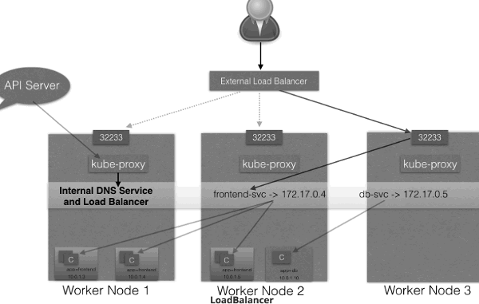


<h2 id="e7fc0ac576a6a88284d3525beadf5825"></h2>


# Deploying an Application

<h2 id="afc6a537dc75e9e56e87f88dc5d6af11"></h2>


## Deploy vi kubectl

<h2 id="3b4e7053c64600e4f233a1ca0fb66946"></h2>


### List the Pods, along with their attached Labels

```
$ kubectl get pods -L k8s-app,label2
NAME                         READY   STATUS    RESTARTS   AGE   K8S-APP     LABEL2
webserver-74d8bd488f-dwbzz   1/1     Running   0          14m   webserver   <none>
webserver-74d8bd488f-npkzv   1/1     Running   0          14m   webserver   <none>
webserver-74d8bd488f-wvmpq   1/1     Running   0          14m   webserver   <none>
```

<h2 id="744302e45006d83e73e1e80fe19d7bdd"></h2>


### Select the Pods with a given Label

```
$ kubectl get pods -l k8s-app=webserver
NAME                         READY     STATUS    RESTARTS   AGE
webserver-74d8bd488f-dwbzz   1/1       Running   0          17m
webserver-74d8bd488f-npkzv   1/1       Running   0          19m
webserver-74d8bd488f-wvmpq   1/1       Running   0          17m

$ kubectl get pods -l k8s-app=webserver1
No resources found.
```

<h2 id="b500ea1a492ff7210ded38234bce4f8f"></h2>


### Delete the Deployment 

```
$ kubectl delete deployments webserver
deployment "webserver" deleted
```

 - Deleting a Deployment also deletes the ReplicaSets and the Pods we created:

```
$ kubectl get replicasets
No resources found.

$ kubectl get pods
No resources found.
```

<h2 id="ea3304e0b2e6faecdb42b70d3057f290"></h2>


### Create a YAML file with Deployment details

 - Let us now create the webserver.yaml file with the following content:

```
apiVersion: apps/v1
kind: Deployment
metadata:
  name: webserver
  labels:
    app: nginx
spec:
  replicas: 3
  selector:
    matchLabels:
      app: nginx
  template:
    metadata:
      labels:
        app: nginx
    spec:
      containers:
      - name: nginx
        image: nginx:alpine
        ports:
        - containerPort: 80
```


```
$ kubectl create -f webserver.yaml
deployment "webserver" created
```

 - we can also name a port  , it can be be using the referenced web-port name while creating the Service 

```
        ports:
        - containerPort: 5000
          name: web-port
```

<h2 id="56255e54c326ca1c88892709ccdd62d9"></h2>


### Creating a Service and Exposing It to the External World with NodePort I

 - with the **NodePort**  ServiceType, Kubernetes opens up a static port on all the worker nodes. I
 - If we connect to that port from any node, we are forwarded to the respective Service.
 - Create a webserver-svc.yaml file with the following content:

```
apiVersion: v1
kind: Service
metadata:
  name: web-service
  labels:
    run: web-service
spec:
  type: NodePort
  ports:
  - port: 80
    protocol: TCP
  selector:
    app: nginx
```

```
$ kubectl create -f webserver-svc.yaml
service/web-service created

$ kubectl get svc
NAME          TYPE        CLUSTER-IP     EXTERNAL-IP   PORT(S)        AGE
kubernetes    ClusterIP   10.96.0.1      <none>        443/TCP        1d
web-service   NodePort    10.110.47.84   <none>        80:31074/TCP   12s
```

 - Our web-service is now created and its ClusterIP is 10.110.47.84.
 - In the PORT(S)section, we can see a mapping of 80:31074,
    - which means that we have reserved a static port 31074 on the node
    - If we connect to the node on that port, our requests will be forwarded to the ClusterIP on port 80.
 - It is not necessary to create the Deployment first, and the Service after. They can be created in any order. 
 - A Service will connect Pods based on the Selector.


```
$ kubectl describe svc web-service
Name:                     web-service
Namespace:                default
Labels:                   run=web-service
Annotations:              <none>
Selector:                 app=nginx
Type:                     NodePort
IP:                       10.110.47.84
Port:                     <unset>  80/TCP
TargetPort:               80/TCP
NodePort:                 <unset>  31074/TCP
Endpoints:                172.17.0.4:80,172.17.0.5:80,172.17.0.6:80
Session Affinity:         None
External Traffic Policy:  Cluster
Events:                   <none>
```

<h2 id="87bd2994afe1748bd27e511e65b532a7"></h2>


## Liveness and Readiness Probes

 - These probes are very important, because they allow the kubelet to control the health of the application running inside a Pod's container.

<h2 id="cacca97bb7abbf614d9c8f5a7569f5ea"></h2>


### Liveness

 - If a container in the Pod is running, but the application running inside this container is not responding to our requests, then that container is of no use to us. 
    - This kind of situation can occur, for example, due to application deadlock or memory pressure.
    - In such a case, it is recommended to restart the container to make the application available.
 - Rather than doing it manually, we can use **Liveness Probe**.
    - Liveness probe checks on an application's health, and, if for some reason, the health check fails, it restarts the affected container automatically.
 - Liveness Probes can be set by defining:
    - Liveness command
    - Liveness HTTP request
    - TCP Liveness Probe.

<h2 id="3f1dcde80733742e2de45b734a4b4990"></h2>


#### Liveness Command

 - In the following example, we are checking the existence of a file /tmp/healthy:

```
apiVersion: v1
kind: Pod
metadata:
  labels:
    test: liveness
  name: liveness-exec
spec:
  containers:
  - name: liveness
    image: k8s.gcr.io/busybox
    args:
    - /bin/sh
    - -c
    - touch /tmp/healthy; sleep 30; rm -rf /tmp/healthy; sleep 600
    livenessProbe:
      exec:
        command:
        - cat
        - /tmp/healthy
      initialDelaySeconds: 3
      periodSeconds: 5
```
 
 - The existence of the **/tmp/healthy** file is configured to be checked every 5 seconds using the **periodSeconds** parameter. 
 - The **initialDelaySeconds** parameter requests the kubelet to wait for 3 seconds before doing the first probe. 
 - When running the container, we will first create the /tmp/healthy file, and then we will remove it after 30 seconds. 
    -  The deletion of the file would trigger a health failure, and our Pod would get restarted.


<h2 id="5b9d89f92b125d919fd5b98610ae68b9"></h2>


### Liveness HTTP Request

 - In the following example, the kubelet sends the HTTP GET request to the /healthz endpoint of the application, on port 8080. 
 - If that returns a failure, then the kubelet will restart the affected container; otherwise, it would consider the application to be alive.

```
livenessProbe:
      httpGet:
        path: /healthz
        port: 8080
        httpHeaders:
        - name: X-Custom-Header
          value: Awesome
      initialDelaySeconds: 3
      periodSeconds: 3
```

<h2 id="b0d4459ffe193a51b32c146a67e97d64"></h2>


### TCP Liveness Probe

 - With TCP Liveness Probe, the kubelet attempts to open the TCP Socket to the container which is running the application. 
 - If it succeeds, the application is considered healthy, otherwise the kubelet would mark it as unhealthy and restart the affected container.

```
livenessProbe:
      tcpSocket:
        port: 8080
      initialDelaySeconds: 15
      periodSeconds: 20
```


<h2 id="4f27a8cdff4a57ee4e0efc7db568d939"></h2>


## Readiness Probes

 - Sometimes, applications have to meet certain conditions before they can serve traffic. 
 - These conditions include 
    - ensuring that the depending service is ready,
    - or acknowledging that a large dataset needs to be loaded, etc.
 - In such cases, we use Readiness Probes and wait for a certain condition to occur. Only then, the application can serve traffic.
 - A Pod with containers that do not report ready status will not receive traffic from Kubernetes Services.

```
readinessProbe:
  exec:
    command:
    - cat
    - /tmp/healthy
  initialDelaySeconds: 5
  periodSeconds: 5
```

 - Readiness Probes are configured similarly to Liveness Probes. Their configuration also remains the same.


<h2 id="a3973c1903e1e860ead03894c4b4a082"></h2>


# Kubernetes Volume Management  

 - To back a Pod with a persistent storage, Kubernetes uses **Volumes**. 

<h2 id="c6f01c78bfe0a0a495cb5d3ed77824a9"></h2>


## Volumes

 - containers, which create the Pods, are ephemeral in nature.
    - All data stored inside a container is deleted if the container crashes.
    - However, the kubelet will restart it with a clean state, which means that it will not have any of the old data.
 - To overcome this problem, Kubernetes uses Volumes. 
    - A Volume is essentially a directory backed by a storage medium. 
    - The storage medium and its content are determined by the Volume Type.
 - In Kubernetes, a Volume is attached to a Pod and shared among the containers of **that Pod**.
    - The Volume has the same life span as the **Pod**,  and it outlives the containers of the Pod 
        - this allows data to be preserved across container restarts.

<h2 id="1760f6eeb378b6f01f6ccb20faeeac82"></h2>


## Volume Types

 - A directory which is mounted inside a Pod is backed by the underlying Volume Type.
 - A Volume Type decides the properties of the directory, like size, content, etc. Some examples of Volume Types are:
    - emptyDir
        - An empty Volume is created for the Pod as soon as it is scheduled on the worker node. The Volume's life is tightly coupled with the Pod. If the Pod dies, the content of emptyDir is deleted forever.  
        - emptyDir Volume 的生命周期与 Pod 一致。 Pod 中的所有容器都可以共享 Volume，它们可以指定各自的 mount 路径。
        - emptyDir 特别适合 Pod 中的容器需要临时共享存储空间的场景.
    - hostPath
        - With the hostPath Volume Type, we can share a directory from the host to the Pod. 
        - If the Pod dies, the content of the Volume is still available on the host.
        - 大部分应用都不会使用 hostPath Volume，因为这实际上增加了 Pod 与节点的耦合，限制了 Pod 的使用.
        - 不过那些需要访问 Kubernetes 或 Docker 内部数据（配置文件和二进制库）的应用则需要使用 hostPath。
    - external Storage Provider
        - gcePersistentDisk
            - we can mount a Google Compute Engine (GCE) persistent disk into a Pod.
        - awsElasticBlockStore
            - we can mount an AWS EBS Volume into a Pod. 
    - persistentVolumeClaim
        - We can attach a PersistentVolume to a Pod.


<h2 id="3f91308865b7567ae097573f6d0519e9"></h2>


## PersistentVolumes

 - A Persistent Volume is a network-attached storage in the cluster, which is provisioned by the administrator.
 - PersistentVolumes can be dynamically provisioned based on the StorageClass resource. 
    - A StorageClass contains pre-defined provisioners and parameters to create a PersistentVolume
    - Using PersistentVolumeClaims, a user sends the request for dynamic PV creation, which gets wired to the StorageClass resource.
 - Some of the Volume Types that support managing storage using PersistentVolumes are:
    - GCEPersistentDisk
    - AWSElasticBlockStore
    - AzureFile
    - NFS
    - iSCSI

<h2 id="455385b545189aa1f74511b5dc40d1eb"></h2>


## PersistentVolumeClaims

 - A PersistentVolumeClaim (PVC) is a request for storage by a user. 
    - Users request for PersistentVolume resources based on size, access modes, etc. 
    - Once a suitable PersistentVolume is found, it is bound to a PersistentVolumeClaim.
 - After a successful bound, the PersistentVolumeClaim resource can be used in a Pod.
 - Once a user finishes its work, the attached PersistentVolumes can be released. The underlying PersistentVolumes can then be reclaimed and recycled for future usage. 

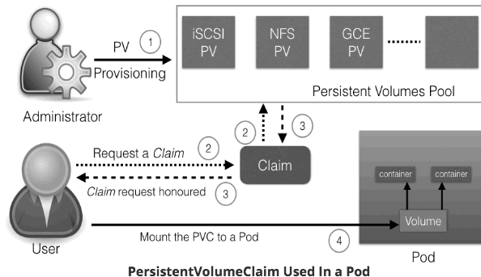


<h2 id="e74688af9e034b8fe88786eee6b7ff2b"></h2>


# ConfigMaps and Secrets

 - While deploying an application, we may need to pass such runtime parameters like configuration details, passwords, etc. 
 - In such cases, we can use the ConfigMap API resource.
 - Similarly, when we want to pass sensitive information, we can use the Secret API resource.

<h2 id="a041d4808053eb1261d0dbab572ea629"></h2>


## ConfigMaps

 - ConfigMaps allow us to decouple the configuration details from the container image.
 - Using ConfigMaps, we can pass configuration details as key-value pairs, which can be later consumed by Pods, or any other system components, such as controllers. 
 - We can create ConfigMaps in two ways:
    - From literal values
    - From files.

<h2 id="8765f1ffd93b405ae1a91c13aae3e663"></h2>


### Create a ConfigMap from Literal Values and Get Its Details

```
$ kubectl create configmap my-config --from-literal=key1=value1 --from-literal=key2=value2
configmap "my-config" created
```

```
$ kubectl get configmaps my-config -o yaml
apiVersion: v1
data:
  key1: value1
  key2: value2
kind: ConfigMap
metadata:
  creationTimestamp: 2017-05-31T07:21:55Z
  name: my-config
  namespace: default
  resourceVersion: "241345"
  selfLink: /api/v1/namespaces/default/configmaps/my-config
  uid: d35f0a3d-45d1-11e7-9e62-080027a46057
```

<h2 id="ea3972a8f5c658d8ede325d13968d46f"></h2>


### Create a ConfigMap from a Configuration File

 - First, we need to create a configuration file.

```
apiVersion: v1
kind: ConfigMap
metadata:
  name: customer1
data:
  TEXT1: Customer1_Company
  TEXT2: Welcomes You
  COMPANY: Customer1 Company Technology Pct. Ltd.
```

```
$ kubectl create -f customer1-configmap.yaml
configmap "customer1" created
```


<h2 id="36b689f5b271da1324001d06c4d83dfe"></h2>


### Use ConfigMap Inside Pods

**As an Environment Variable**

 - We can get the values of the given key as environment variables inside a Pod
 - In the following example, while creating the Deployment, we are assigning values for environment variables from the `customer1` ConfigMap:

```
 containers:
      - name: rsvp-app
        image: teamcloudyuga/rsvpapp
        env:
        - name: MONGODB_HOST
          value: mongodb
        - name: TEXT1
          valueFrom:
            configMapKeyRef:
              name: customer1
              key: TEXT1
        - name: TEXT2
          valueFrom:
            configMapKeyRef:
              name: customer1
              key: TEXT2
        - name: COMPANY
          valueFrom:
            configMapKeyRef:
              name: customer1
              key: COMPANY
```

**As a Volume**

 - We can mount a ConfigMap as a Volume inside a Pod. 
 - For each key, we will see a file in the mount path and the content of that file becomes the respective key's value. 
 - For more details : [Configure a Pod to Use a ConfigMap](https://kubernetes.io/docs/tasks/configure-pod-container/configure-pod-configmap/#adding-configmap-data-to-a-volume)


<h2 id="ffb85bfe93f1d2f1654a7048b87f0403"></h2>


## Secrets 

 - With Secrets, we can share sensitive information like passwords, tokens, or keys in the form of key-value pairs, similar to ConfigMaps; thus, we can control how the information in a Secret is used, reducing the risk for accidental exposures.
 - In Deployments or other system components, the Secret object is referenced, without exposing its content.
 - It is important to keep in mind that the Secret data is stored as plain text inside **etcd**. 
    - Administrators must limit the access to the API server and **etcd**.
    - etcd is distributed key-value store


<h2 id="f1f3541f0c90a9bcc70092dbedacb64b"></h2>


### Create the Secret with the 'kubectl create secret' Command

 - To create a Secret, we can use the kubectl create secret command:
    - it would create a secret called **my-password**, which has the value of the **password** key set to **mysqlpassword**.

```
$ kubectl create secret generic my-password --from-literal=password=mysqlpassword
```


<h2 id="656442f43e660ae59f8878a63474407a"></h2>


### Create a Secret Manually

 - We can also create a Secret manually, using the YAML configuration file
 - With Secrets, each object data must be encoded using base64.

```
$ echo mysqlpassword | base64
bXlzcWxwYXNzd29yZAo=
```

 - and then use it in the configuration file:

```
apiVersion: v1
kind: Secret
metadata:
  name: my-password
type: Opaque
data:
  password: bXlzcWxwYXNzd29yZAo=
```

<h2 id="b81fb44d1f7de48c36dbb8f865a9cd2c"></h2>


### Use Secrets Inside Pods

<h2 id="472677ea9956d73c10d21a2d17777435"></h2>


#### Using Secrets as Environment Variables

```
spec:
  containers:
  - image: wordpress:4.7.3-apache
    name: wordpress
    env:
    - name: WORDPRESS_DB_HOST
      value: wordpress-mysql
    - name: WORDPRESS_DB_PASSWORD
      valueFrom:
        secretKeyRef:
          name: my-password
          key: password
```


<h2 id="9488499f57000e087049e3d8faac3473"></h2>


#### Using Secrets as Files from a Pod

 - We can also mount a Secret as a Volume inside a Pod.
 - [More details](https://kubernetes.io/docs/concepts/configuration/secret/#using-secrets-as-files-from-a-pod)


---

<h2 id="7d05c708b92b4809bfe9bf66edf8f765"></h2>


# Ingress

 - we can access our deployed containerized application from the external world. 
    - Among the ServiceTypes mentioned in that chapter, NodePort and LoadBalancer are the most often used. 
    - For the LoadBalancer ServiceType, we need to have the support from the underlying infrastructure. 
    - Even after having the support, we may not want to use it for every Service, as LoadBalancer resources are limited and they can increase costs significantly. 
    - Managing the NodePort ServiceType can also be tricky at times, as we need to keep updating our proxy settings and keep track of the assigned ports. 
 - In this chapter, we will explore the **Ingress**, which is another method we can use to access our applications from the external world.


<h2 id="70b2b5b8a36e937c6fddf510da3968c3"></h2>


## Ingress I

 - An Ingress is a collection of rules that allow inbound connections to reach the cluster Services
 - Ingress configures a Layer 7 HTTP load balancer for Services and provides the following:
    - TLS (Transport Layer Security)
    - Name-based virtual hosting 
    - Path-based routing
    - Custom rules.
 - 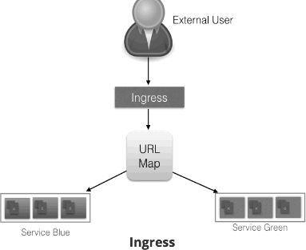

<h2 id="dd374142ee0d3696af5151d9e9ded05f"></h2>


## Ingress II

 - With Ingress, users don't connect directly to a Service. Users reach the Ingress endpoint, and, from there, the request is forwarded to the respective Service. 

```
apiVersion: extensions/v1beta1
kind: Ingress
metadata:
  name: web-ingress
  namespace: default
spec:
  rules:
  - host: blue.example.com
    http:
      paths:
      - backend:
          serviceName: webserver-blue-svc
          servicePort: 80
  - host: green.example.com
    http:
      paths:
      - backend:
          serviceName: webserver-green-svc
          servicePort: 80
```

 - According to the example we provided above, users requests to both blue.example.com and green.example.com would go to the same Ingress endpoint, and, from there, they would be forwarded to webserver-blue-svc, and webserver-green-svc, respectively. 
 - Here, we have seen an example of a Name-Based Virtual Hosting Ingress rule. 
 - We can also have Fan Out Ingress rules, in which we send requests like example.com/blue and example.com/green, which would be forwarded to webserver-blue-svc and webserver-green-svc, respectively.

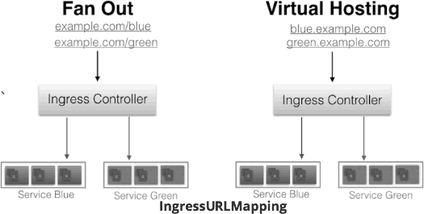


 - The Ingress resource does not do any request forwarding by itself. 
 - All of the magic is done using the Ingress Controller.


<h2 id="a5765900d255fcb42e5ea092fe489331"></h2>


## Ingress Controller
 
 - An Ingress Controller is an application which 
    - watches the Master Node's API server for changes in the Ingress resources and 
    - updates the Layer 7 Load Balancer accordingly. 
 - The Ingress Controller creates a Load Balancer.


<h2 id="65c0a46ef98d210656055f61588ff4ed"></h2>


### Deploy an Ingress Resource

 - For example, if we create a webserver-ingress.yaml file with the content that we saw on the Ingress II page,

```
$ kubectl create -f webserver-ingress.yaml
```

```
$ cat /etc/hosts
127.0.0.1        localhost
::1              localhost
192.168.99.100   blue.example.com green.example.com
```


<h2 id="8fd6748f0750d9c913b9e2dfcbb7946b"></h2>


## kubernetes/ingress-nginx user-guide TLS

 - https://github.com/kubernetes/ingress-nginx/blob/master/docs/user-guide/tls.md


<h2 id="41ef0c7e3aa81f83c8172c71f9986dfb"></h2>


# Advanced Topics

<h2 id="933e469cb306a0ea9faabd3e4235d3be"></h2>


## Annotations

 - With Annotations, we can attach arbitrary non-identifying metadata to any objects, in a key-value format:
    - 以key-value格式 将任意 非标示元数据 附加到 任何对象

```
"annotations": {
  "key1" : "value1",
  "key2" : "value2"
}
```

 - In contrast to Labels, annotations are not used to identify and select objects. Annotations can be used to:
    - Store build/release IDs, PR numbers, git branch, etc.
    - Phone/pager numbers of people responsible, or directory entries specifying where such information can be found
    - Pointers to logging, monitoring, analytics, audit repositories, debugging tools, etc.
    - Etc
 - For example, while creating a Deployment, we can add a description like the one below:

```
apiVersion: extensions/v1beta1
kind: Deployment
metadata:
  name: webserver
  annotations:
    description: Deployment based PoC dates 2nd June'2017
```


 - We can look at annotations while describing an object:

```
$ kubectl describe deployment webserver
Name:                webserver
Namespace:           default
CreationTimestamp:   Sat, 03 Jun 2017 05:10:38 +0530
Labels:              app=webserver
Annotations:         deployment.kubernetes.io/revision=1
                     description=Deployment based PoC dates 2nd June'2017
```

<h2 id="e4c677a2cc444dd3ce2cea9f020921aa"></h2>


## Deployment Features

 - Earlier, we have seen how we can use the Deployment object to deploy an application. 
    - This is just a basic functionality. We can do more interesting things, like recording a Deployment, if something goes wrong, we can revert to the working state.
 - In addition, the Deployment object also provides the following features:
    - Autoscaling
    - Proportional scaling
    - Pausing and resuming.
 - [More details](https://kubernetes.io/docs/concepts/workloads/controllers/deployment/#scaling-a-deployment)

<h2 id="12ceff2290bb9039beaa8f36d5dec226"></h2>


## Jobs

 - A Job creates one or more Pods to perform a given task. 
    - The Job object takes the responsibility of Pod failures.
    - It makes sure that the given task is completed successfully. 
    - Once the task is over, all the Pods are terminated automatically.
 - Starting with the Kubernetes 1.4 release, we can also perform Jobs at specified times/dates, such as [cron jobs](https://kubernetes.io/docs/concepts/workloads/controllers/cron-jobs/).
 
<h2 id="708c25df4f4584405d14fbf936539d2e"></h2>


## Quota Management

 - When there are many users sharing a given Kubernetes cluster, there is always a concern for fair usage. 
    - To address this concern, administrators can use the ResourceQuota object,  which provides constraints that limit aggregate resource consumption per Namespace.
 - We can have the following types of quotas per Namespace:
    - Compute Resource Quota
        - We can limit the total sum of compute resources (CPU, memory, etc.) that can be requested in a given Namespace.
    - Storage Resource Quota
        - We can limit the total sum of storage resources (PersistentVolumeClaims, requests.storage, etc.) that can be requested.
    - Object Count Quota
        - We can restrict the number of objects of a given type (pods, ConfigMaps, PersistentVolumeClaims, ReplicationControllers, Services, Secrets, etc.).

<h2 id="d1026cec97f2e9854c2a3b4a8f8bd039"></h2>


## DaemonSets

 - In some cases, like collecting monitoring data from all nodes, or running a storage daemon on all nodes, etc., we need a specific type of Pod running on all nodes at all times.
 - A [DaemonSet](https://kubernetes.io/docs/concepts/workloads/controllers/daemonset/) is the object that allows us to do just that.   
 - Whenever a node is added to the cluster, a Pod from a given DaemonSet is created on it. When the node dies, the respective Pods are garbage collected. If a DaemonSet is deleted, all Pods it created are deleted as well.
 

<h2 id="a5896f58556198d1653d2d00a0db9b06"></h2>


## StatefulSets

 - The StatefulSet controller is used for applications which require a unique identity, such as name, network identifications, strict ordering, etc.
    - For example, MySQL cluster, etcd cluster.
 - The StatefulSet controller provides identity and guaranteed ordering of deployment and scaling to Pods.

<h2 id="022ea9eb4d6919b0b0b73c167d1c0083"></h2>


## Kubernetes Federation

 - With the Kubernetes Cluster Federation we can manage multiple Kubernetes clusters from a single control plane. 

<h2 id="1eefdde32973942a371cb277943df70f"></h2>


## Custom Resources

 - In Kubernetes, a resource is an API endpoint which stores a collection of API objects. For example, a Pod resource contains all the Pod objects.
 - Although in most cases existing Kubernetes resources are sufficient to fulfill our requirements, we can also create new resources using custom resources.
    - With custom resources, we don't have to modify the Kubernetes source.
 - Custom resources are dynamic in nature, and they can appear and disappear in an already running cluster at any time.
 - To make a resource declarative, we must create and install a **custom controller**, which can interpret the resource structure and perform the required actions. 
    - Custom controllers can be deployed and managed in an already running cluster.
 - There are two ways to add custom resources:
    - Custom Resource Definitions (CRDs)
        - This is the easiest way to add custom resources and it does not require any programming knowledge. However, building the custom controller would require some programming.
    - API Aggregation
        - For more fine-grained control, we can write API Aggregators. They are subordinate API servers which sit behind the primary API server and act as proxy.


<h2 id="152090ff5e9a05ea7e1cf0c248449638"></h2>


## Helm

 - To deploy an application, we use different Kubernetes manifests, such as Deployments, Services, Volume Claims, Ingress, etc. 
 - Sometimes, it can be tiresome to deploy them one by one.
 - We can bundle all those manifests after templatizing them into a well-defined format, along with other metadata. 
 - Such a bundle is referred to as *Chart*.
    - These Charts can then be served via repositories, such as those that we have for rpm and deb packages. 
 - Helm is a package manager (analogous to yum and apt) for Kubernetes, which can install/update/delete those Charts in the Kubernetes cluster.
 - Helm has two components:
    - A client called helm, which runs on your user's workstation
    - A server called tiller, which runs inside your Kubernetes cluster.
 - The client helm connects to the server tiller to manage Charts. Charts submitted for Kubernetes are available [here](https://github.com/kubernetes/charts).


<h2 id="9ad24640fe10d78bada6b5e68dd0f68f"></h2>


## Monitoring and Logging

 - In Kubernetes, we have to collect resource usage data by Pods, Services, nodes, etc., to understand the overall resource consumption and to make decisions for scaling a given application.
 - Two popular Kubernetes monitoring solutions are Heapster and Prometheus.
    - Heapster
        - Heapster is a cluster-wide aggregator of monitoring and event data, which is natively supported on Kubernetes. 
    - Prometheus
        - Prometheus, now part of CNCF (Cloud Native Computing Foundation), can also be used to scrape the resource usage from different Kubernetes components and objects. Using its client libraries, we can also instrument the code of our application.

 - Another important aspect for troubleshooting and debugging is Logging, in which we collect the logs from different components of a given system.  
 - In Kubernetes, we can collect logs from different cluster components, objects, nodes, etc. 
 - The most common way to collect the logs is using Elasticsearch, which uses fluentd with custom configuration as an agent on the nodes.
 - fluentd is an open source data collector, which is also part of CNCF.


