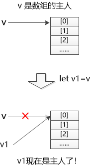
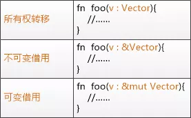
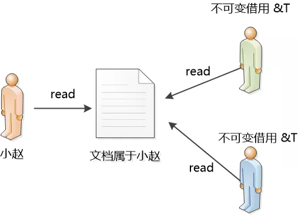
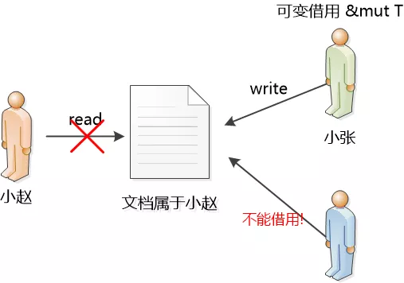

...menustart

- [Rust](#f5e265d607cb720058fc166e00083fe8)
    - [所有权](#ed840a18e255779553359d5e0ec6f8a8)
    - [Data Types](#637881603c973c4967d77ec4ba147e0c)
        - [Scalar Types](#09d9982852d86c2479924a4e3b723b1e)
        - [Compound Types](#9e57b6b46532794638212df8e239adde)
    - [Grammar](#d305bbe79fb9dd87a3fda339c8b601b6)
        - [String](#27118326006d3829667a400ad23d5d98)
        - [Vectors/arrays](#a9ed91a0564c396f668757003053c533)
        - [Tuples](#e7e26a0ac2e1758814e4999a9242ba71)
        - [Struct](#886ef5dbd655a6c97726d7091c6b173e)
        - [Enum](#cf20423ed48998082c20099488a0917c)
        - [Generics](#0d7bdbf7f4e4f0dc8ed310a01dee3502)
        - [Methods](#20c51b5f4e9aeb5334c90ff072e6f928)
        - [Traits (Interface)](#fb0066fcef08c6094e2f12e05e3b347f)
        - [Pattern matching](#b72e68f7732ac254f401f88ed4911ada)
        - [Control flow](#af68915e510fea51b880a5e4e7577708)
    - [Memory safety & pointers](#24356b0edc0a65ad0b52ef7b6ee12dae)
    - [Modules](#bf17ac149e2e7a530c677e9bd51d3fd2)
    - [Error Handling](#ef43236673ca0bb606b14091061ac271)
        - [Unrecoverable Errors with panic!](#689fed929813adeb0bf87f95904bb0ed)
        - [Recoverable Errors with Result](#05da5d7fbff37a203b05610205bcc83e)
        - [unwrap and expect](#d0dd9c6057e4b7304e97d4b63a862cdc)
        - [Propagating Errors](#fb49d19dc99200030dd86a0b9521e776)
        - [? Operator](#38427ebf412a041dbb876847293e30ae)
    - [Traits](#42dff6d9ccc56c155188778aff284f7c)
        - [Default Implementations](#f78cdd8ee64bc0232a9d010a9ab3502a)
        - [Traits as Parameters `impl Trait` syntax](#3d591b9a37ce5be1a66a4106f0f326be)
        - [Specifying Multiple Trait Bounds with the `+` Syntax](#7ae84d1dbd2b9229bdcfbf5c7894d4ce)
        - [Clearer Trait Bounds with where Clauses](#a7dbea5d964307601e9192a4c3574b31)
        - [Returning Types that Implement Traits](#8bc762cd737affa437bd5226f1a3f07a)
        - [Fixing the largest Function with Trait Bounds](#bce419857a72cd38b5c75c2ed17433c0)
        - [Using Trait Bounds to Conditionally Implement Methods](#8d14778e381116681aa5fcf8e7fad595)
    - [Validating References with Lifetimes](#64ddc28a0ac7f69186ee86b1f8bc8786)
        - [Lifetime Annotations in Function Signatures](#f3d4e3f175edde17a6397d2dbb331920)
        - [Lifetime Annotations in Struct Definitions](#7a84101a7a68dae9cd05990ef3ccfa86)
        - [Lifetime Annotations in Method Definitions](#f3d510a4e30d6a89ebee0474abaa57a9)
        - [The Static Lifetime](#2bb98037fd2da57e912de143f6c29347)

...menuend


<h2 id="f5e265d607cb720058fc166e00083fe8"></h2>


# Rust

<h2 id="ed840a18e255779553359d5e0ec6f8a8"></h2>


## 所有权

- Rust编译器：对于任何给定的对象都只有一个绑定与之对应。
    - 
- 怎么把 v 传递给另外一个函数呢?
    - 借用 (&v), 临时借给其他函数
    - 类似java中的 引用
- recap 
    - 
- 同一时刻，
    - 要么只有一个可变（&mut）借用，
    - 要么有多个不可变（&) 借用，
    - 不能同时存在可变和不可变借用。 
    - 没有人希望 自己在读的时候，对象被别人改变了。
    - 
    - 
- 当大家都在读一个东西的时候，是不能写的。当一个人在写的时候，别人是不能读的。
    - 经典的读写锁问题, Rust在编译器级别做了限制.

<h2 id="637881603c973c4967d77ec4ba147e0c"></h2>


## Data Types 

<h2 id="09d9982852d86c2479924a4e3b723b1e"></h2>


### Scalar Types

- integers
    - i8,i32,u64,...
- floating-point numbers
    - f32,f64
- Booleanbs
    - bool : true/false
- characters
    - `'z'`
    - Rust’s char type is four bytes in size and represents a Unicode Scalar Value, which means it can represent a lot more than just ASCII.
    - Unicode Scalar Values range from U+0000 to U+D7FF and U+E000 to U+10FFFF inclusive

<h2 id="9e57b6b46532794638212df8e239adde"></h2>


### Compound Types

- Tuple
- Array


<h2 id="d305bbe79fb9dd87a3fda339c8b601b6"></h2>


## Grammar

<h2 id="27118326006d3829667a400ad23d5d98"></h2>


### String 

- String literals ( static str )
    -
    ```rust
    let x: &str = "hello world!";
    ```
- A heap-allocated string
    -
    ```rust
    let s: String = "hello world".to_string();
    ```
- A string slice – an immutable view into another string
    -
    ```rust
    let s_slice: &str = &s;
    println!("{} {}", s, s_slice); // hello world hello world
    ```
    - This is basically an immutable pair of pointers to a string


<h2 id="a9ed91a0564c396f668757003053c533"></h2>


### Vectors/arrays

- A fixed-size array
    -
    ```rust
    let four_ints: [i32; 4] = [1, 2, 3, 4];
    ```
- A dynamic array (vector)
    -
    ```rust
    let mut vector: Vec<i32> = vec![1, 2, 3, 4];
    vector.push(5);
    ```
- A slice – an immutable view into a vector or array
    -
    ```rust
    let slice: &[i32] = &vector;
    // Use `{:?}` to print something debug-style
    println!("{:?} {:?}", vector, slice); // [1, 2, 3, 4, 5] [1, 2, 3, 4, 5]
    ```

<h2 id="e7e26a0ac2e1758814e4999a9242ba71"></h2>


### Tuples 

- A fixed-size set of values of possibly different types
    -
    ```rust
    let x: (i32, &str, f64) = (1, "hello", 3.4);
    ```
- Destructuring `let`
    -
    ```rust
    let (a, b, c) = x;
    ```
- Indexing
    -
    ```rust
    println!("{}", x.1); // hello
    ```


<h2 id="886ef5dbd655a6c97726d7091c6b173e"></h2>


### Struct

```rust
struct Point {
    x: i32,
    y: i32,
}

let origin: Point = Point { x: 0, y: 0 };
```

- A struct with unnamed fields, called a ‘tuple struct’
    -
    ```rust
    struct Point2(i32, i32);
    let origin2 = Point2(0, 0);
    ```

<h2 id="cf20423ed48998082c20099488a0917c"></h2>


### Enum

- Basic C-like enum
    ```rust
    enum Direction {
        Left,
        Right,
        Up,
        Down,
    }

    let up = Direction::Up;
    ```
- Enum with fields
    ```rust
    enum OptionalI32 {
        AnI32(i32),
        Nothing,
    }
    let two: OptionalI32 = OptionalI32::AnI32(2);
    let nothing = OptionalI32::Nothing;
    ```
    - that is, **Option is an enum** !

<h2 id="0d7bdbf7f4e4f0dc8ed310a01dee3502"></h2>


### Generics

```rust
struct Foo<T> { bar: T }

// This is defined in the standard library as `Option`
enum Optional<T> {
    SomeVal(T),
    NoVal,
}
```

<h2 id="20c51b5f4e9aeb5334c90ff072e6f928"></h2>


### Methods

```rust
impl<T> Foo<T> {
    // Methods take an explicit `self` parameter
    fn get_bar(self) -> T {
        self.bar
    }
}

let a_foo = Foo { bar: 1 };
println!("{}", a_foo.get_bar()); // 1
```

<h2 id="fb0066fcef08c6094e2f12e05e3b347f"></h2>


### Traits (Interface)

known as interfaces or typeclasses in other languages.

```rust
trait Frobnicate<T> {
    fn frobnicate(self) -> Option<T>;
}
```

- implement trait
    -
    ```rust
    impl<T> Frobnicate<T> for Foo<T> {
        fn frobnicate(self) -> Option<T> {
            Some(self.bar)
        }
    }
    let another_foo = Foo { bar: 1 };
    println!("{:?}", another_foo.frobnicate()); // Some(1)
    ```

See more details at *Traits* section.

<h2 id="b72e68f7732ac254f401f88ed4911ada"></h2>


### Pattern matching

```rust
let foo = OptionalI32::AnI32(1);
match foo {
    OptionalI32::AnI32(n) => println!("it’s an i32: {}", n),
    OptionalI32::Nothing  => println!("it’s nothing!"),
}
```

<details>
<summary>
Advanced pattern matching
</summary>

```rust
struct FooBar { x: i32, y: OptionalI32 }
let bar = FooBar { x: 15, y: OptionalI32::AnI32(32) };

match bar {
    FooBar { x: 0, y: OptionalI32::AnI32(0) } =>
        println!("The numbers are zero!"),
    FooBar { x: n, y: OptionalI32::AnI32(m) } if n == m =>
        println!("The numbers are the same"),
    FooBar { x: n, y: OptionalI32::AnI32(m) } =>
        println!("Different numbers: {} {}", n, m),
    FooBar { x: _, y: OptionalI32::Nothing } =>
        println!("The second number is Nothing!"),
}
```

</details>


<h2 id="af68915e510fea51b880a5e4e7577708"></h2>


### Control flow

- `for` loops/iteration
    -
    ```rust
    let array = [1, 2, 3];
    for i in array.iter() {
        println!("{}", i);
    }
    ```
- Ranges
    -
    ```rust
    for i in 0u32..10 {
        print!("{} ", i);
    }
    println!(""); // prints `0 1 2 3 4 5 6 7 8 9 `
    ```
- if
    -
    ```rust
    if n < 0 {
        print!("{} is negative", n);
    } else if n > 0 {
        print!("{} is positive", n);
    } else {
        print!("{} is zero", n);
    }
    ```
- if as expression
    -
    ```rust
    let value = if true {
        "good"
    } else {
        "bad"
    };
    ```
- if let = 
    -
    ```rust
    if let Coin::Quarter(state) = coin {
        println!("State quarter from {:?}!", state);
    } else {
        count += 1;
    }
    ```
- `while` loop
    -
    ```rust
    while 1 == 1 {
        println!("The universe is operating normally.");
        // break statement gets out of the while loop.
        //  It avoids useless iterations.
        break
    }
    ```
- Infinite loop
    -
    ```rust
    loop {
        println!("Hello!");
        // break statement gets out of the loop
        break
    }
    ```

<h2 id="24356b0edc0a65ad0b52ef7b6ee12dae"></h2>


## Memory safety & pointers

- 
```rust
let mut mine: Box<i32> = Box::new(3);
*mine = 5; // dereference
```
- Owned pointer
    - only one thing can ‘own’ this pointer at a time
    - This means that when the `Box` leaves its scope, it can be automatically deallocated safely. 
- 
```rust
let mut now_its_mine = mine;
*now_its_mine += 2;
```
- Here, `now_its_mine` takes ownership of `mine`. In other words, `mine` is moved.
- Reference
    - an immutable pointer that refers to other data
    - While a value is borrowed immutably, it cannot be mutated or moved.
    - A borrow lasts until the end of the scope it was created in.
    -
    ```rust
    let mut var = 4;
    var = 3;
    let ref_var: &i32 = &var;

    println!("{}", var); // Unlike `mine`, `var` can still be used
    println!("{}", *ref_var);
    ```
- Mutable reference
    - While a value is mutably borrowed, it cannot be accessed at all.
    -
    ```rust
    let mut var2 = 4;
    let ref_var2: &mut i32 = &mut var2;
     *ref_var2 += 2;   
    // this would not compile because `var2` is borrowed.
    // var2 = 2; 
    ```


<h2 id="bf17ac149e2e7a530c677e9bd51d3fd2"></h2>


## Modules

- Modules to Control Scope and Privacy
- Exposing Paths with the `pub` Keyword
- Starting Relative Paths with `super`
    - construct relative paths that begin in the parent module by using `super` at the start of the path.
- Bringing Paths into Scope with the `use` Keyword
- Re-exporting Names with `pub use`
- We can declare a module by starting with the `mod` keyword 

[Packages, Crates, and Modules](https://doc.rust-lang.org/book/ch07-00-managing-growing-projects-with-packages-crates-and-modules.html)


<h2 id="ef43236673ca0bb606b14091061ac271"></h2>


## Error Handling

<h2 id="689fed929813adeb0bf87f95904bb0ed"></h2>


### Unrecoverable Errors with panic!

To abort on panic in release mode, add the following lines into `[profile]` sections in your Cargo.toml file

```
[profile.release]
panic = 'abort'
```

<h2 id="05da5d7fbff37a203b05610205bcc83e"></h2>


### Recoverable Errors with Result

```rust
enum Result<T, E> {
    Ok(T),
    Err(E),
}
```

<details>
<summary>
Example:
</summary>

```rust
use std::fs::File;
use std::io::ErrorKind;

fn main() {
    let f = File::open("hello.txt");

    let f = match f {
        Ok(file) => file,
        Err(error) => match error.kind() {
            ErrorKind::NotFound => match File::create("hello.txt") {
                Ok(fc) => fc,
                Err(e) => panic!("Problem creating the file: {:?}", e),
            },
            other_error => panic!("Problem opening the file: {:?}", other_error),
        },
    };
}
```
</details>


That’s a lot of match! The match expression is very useful but also very much a primitive.

The `Result<T, E>` type has many methods that accept a closure and are implemented using match expressions.


<details>
<summary>
Using those methods will make your code more concise. 
</summary>

```rust
use std::fs::File;
use std::io::ErrorKind;

fn main() {
    let f = File::open("hello.txt").unwrap_or_else(|error| {
        if error.kind() == ErrorKind::NotFound {
            File::create("hello.txt").unwrap_or_else(|error| {
                panic!("Problem creating the file: {:?}", error);
            })
        } else {
            panic!("Problem opening the file: {:?}", error);
        }
    });
}
```
</details>


<h2 id="d0dd9c6057e4b7304e97d4b63a862cdc"></h2>


### unwrap and expect

If the Result value is the Ok variant, unwrap will return the value inside the Ok.

If the Result is the Err variant, unwrap will call the panic! macro for us.

```rust
use std::fs::File;

fn main() {
    let f = File::open("hello.txt").unwrap();
}
```

Another method, expect, which is similar to unwrap, lets us also choose the panic! error message. 

<h2 id="fb49d19dc99200030dd86a0b9521e776"></h2>


### Propagating Errors


<details>
<summary>
Propagating Example
</summary>

```rust
use std::io;
use std::io::Read;
use std::fs::File;

fn read_username_from_file() -> Result<String, io::Error> {
    let f = File::open("hello.txt");

    let mut f = match f {
        Ok(file) => file,
        Err(e) => return Err(e),
    };

    let mut s = String::new();

    match f.read_to_string(&mut s) {
        Ok(_) => Ok(s),
        Err(e) => Err(e),
    }
}
```

</details>

<h2 id="38427ebf412a041dbb876847293e30ae"></h2>


### ? Operator

<details>
<summary>
A Shortcut for Propagating Errors: the ? Operator
</summary>

```rust
use std::io;
use std::io::Read;
use std::fs::File;

fn read_username_from_file() -> Result<String, io::Error> {
    let mut s = String::new();
    File::open("hello.txt")?.read_to_string(&mut s)?;
    Ok(s)
}
```

</details>

If the value of the Result is an Ok, the value inside the Ok will get returned from `?` expression, and the program will continue.

If the value is an Err, the Err will be returned from the whole function as if we had used the return keyword so the error value gets propagated to the calling code.

**The ? Operator Can Only Be Used in Functions That Return Result.**

<h2 id="42dff6d9ccc56c155188778aff284f7c"></h2>


## Traits

```rust
pub trait Summary {
    fn summarize(&self) -> String;
}
```

<h2 id="f78cdd8ee64bc0232a9d010a9ab3502a"></h2>


### Default Implementations

```rust
pub trait Summary {
    fn summarize(&self) -> String {
        String::from("(Read more...)")
    }
}
```

<h2 id="3d591b9a37ce5be1a66a4106f0f326be"></h2>


### Traits as Parameters `impl Trait` syntax

```rust
pub fn notify(item: impl Summary) {
    println!("Breaking news! {}", item.summarize());
}
```

It is actually syntax sugar for a longer form, which is called a `trait bound` it looks like this:

```rust
pub fn notify<T: Summary>(item: T) {
    println!("Breaking news! {}", item.summarize());
}
```

<h2 id="7ae84d1dbd2b9229bdcfbf5c7894d4ce"></h2>


### Specifying Multiple Trait Bounds with the `+` Syntax

```rust
pub fn notify(item: impl Summary + Display) {
```

The `+` syntax is  also valid with trait bounds on generic types:

```rust
pub fn notify<T: Summary + Display>(item: T) {
```

<h2 id="a7dbea5d964307601e9192a4c3574b31"></h2>


### Clearer Trait Bounds with where Clauses

We can rewrite the following code 

```rust
fn some_function<T: Display + Clone, U: Clone + Debug>(t: T, u: U) -> i32 {
```

to :

```rust
fn some_function<T, U>(t: T, u: U) -> i32
    where T: Display + Clone,
          U: Clone + Debug
{
```

<h2 id="8bc762cd737affa437bd5226f1a3f07a"></h2>


### Returning Types that Implement Traits

you can only use `impl Trait` if you’re returning a single type. 

```rust
fn returns_summarizable() -> impl Summary {
```

See *Using Trait Objects That Allow for Values of Different Types* in chapter 17.


<h2 id="bce419857a72cd38b5c75c2ed17433c0"></h2>


### Fixing the largest Function with Trait Bounds

```rust
fn largest<T: PartialOrd + Copy>(list: &[T]) -> T {
    let mut largest = list[0];

    for &item in list.iter() {
        if item > largest {
            largest = item;
        }
    }

    largest
}
```

`>` operator is defined as a default method on the standard library trait std::cmp::PartialOrd, we need to specify PartialOrd in the trait bounds for T so the largest function can work on slices of any type that we can compare. 


When we made the largest function generic, it became possible for the list parameter to have types in it that don’t implement the Copy trait. Consequently, we wouldn’t be able to move the value out of list[0] and into the largest variable, resulting in this error. To call this code with only those types that implement the Copy trait, we can add Copy to the trait bounds of T! 

<h2 id="8d14778e381116681aa5fcf8e7fad595"></h2>


### Using Trait Bounds to Conditionally Implement Methods

For example, the type `Pair<T>` always implements the new function. But `Pair<T>` only implements the cmp_display method if its inner type T implements the PartialOrd trait that enables comparison and the Display trait that enables printing.

```rust
use std::fmt::Display;

struct Pair<T> {
    x: T,
    y: T,
}

impl<T> Pair<T> {
    fn new(x: T, y: T) -> Self {
        Self {
            x,
            y,
        }
    }
}

impl<T: Display + PartialOrd> Pair<T> {
    fn cmp_display(&self) {
        if self.x >= self.y {
            println!("The largest member is x = {}", self.x);
        } else {
            println!("The largest member is y = {}", self.y);
        }
    }
}
```

We can also conditionally implement a trait for any type that implements another trait. 

```rust
impl<T: Display> ToString for T {
    // --snip--
}
```


<h2 id="64ddc28a0ac7f69186ee86b1f8bc8786"></h2>


## Validating References with Lifetimes

Every reference in Rust has a lifetime, which is the scope for which that reference is valid.

Most of the time, lifetimes are implicit and inferred,  just like most of the time, types are inferred. 

We must annotate types when multiple types are possible. In a similar way, we must annotate lifetimes when the lifetimes of references could be related in a few different ways.

Rust requires us to annotate the relationships using generic lifetime parameters to ensure the actual references used at runtime will definitely be valid.


```rust
// error[E0106]: missing lifetime specifier
// help: this function's return type contains a borrowed value, but the
// signature does not say whether it is borrowed from `x` or `y`
fn longest(x: &str, y: &str) -> &str {
    if x.len() > y.len() {
        x
    } else {
        y
    }
}
```

<h2 id="f3d4e3f175edde17a6397d2dbb331920"></h2>


### Lifetime Annotations in Function Signatures

```rust
fn longest<'a>(x: &'a str, y: &'a str) -> &'a str {
    if x.len() > y.len() {
        x
    } else {
        y
    }
}
```

- The function signature now tells Rust that 
    - for some lifetime 'a, the function takes two parameters, both of which are string slices that live at least as long as lifetime 'a. 
    - The function signature also tells Rust that the string slice returned from the function will live at least as long as lifetime 'a. 

```rust
fn main() {
    let string1 = String::from("long string is long");

    {
        let string2 = String::from("xyz");
        let result = longest(string1.as_str(), string2.as_str());
        println!("The longest string is {}", result);
    }
}
```

- In this example, 
    - string1 is valid until the end of the outer scope, 
    - string2 is valid until the end of the inner scope, 
    - and result references something that is valid until the end of the inner scope. 


Next, let’s try an another example:

```rust
// error[E0597]: `string2` does not live long enough
fn main() {
    let string1 = String::from("long string is long");
    let result;
    {
        let string2 = String::from("xyz");
        result = longest(string1.as_str(), string2.as_str());
    }
    println!("The longest string is {}", result);
}
```

<h2 id="7a84101a7a68dae9cd05990ef3ccfa86"></h2>


### Lifetime Annotations in Struct Definitions

```rust
struct ImportantExcerpt<'a> {
    part: &'a str,
}
```

<h2 id="f3d510a4e30d6a89ebee0474abaa57a9"></h2>


### Lifetime Annotations in Method Definitions

```rust
impl<'a> ImportantExcerpt<'a> {
    fn level(&self) -> i32 {
        3
    }
}
```

<h2 id="2bb98037fd2da57e912de143f6c29347"></h2>


### The Static Lifetime

'static, which means that this reference can live for the entire duration of the program.

All string literals have the 'static lifetime, which we can annotate as follows:

```rust
let s: &'static str = "I have a static lifetime.";
```


