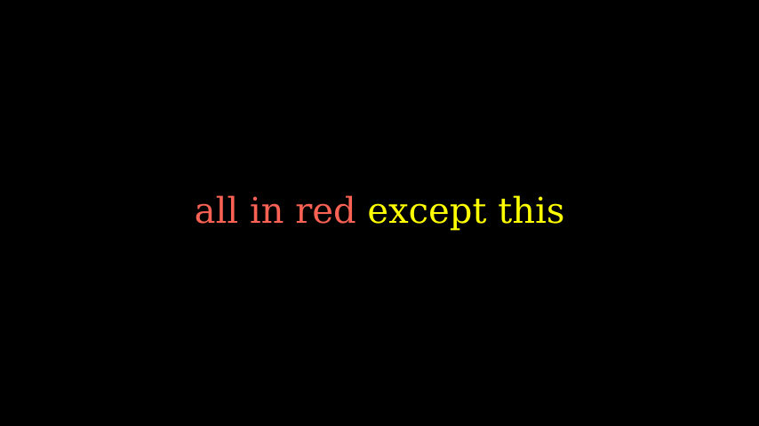
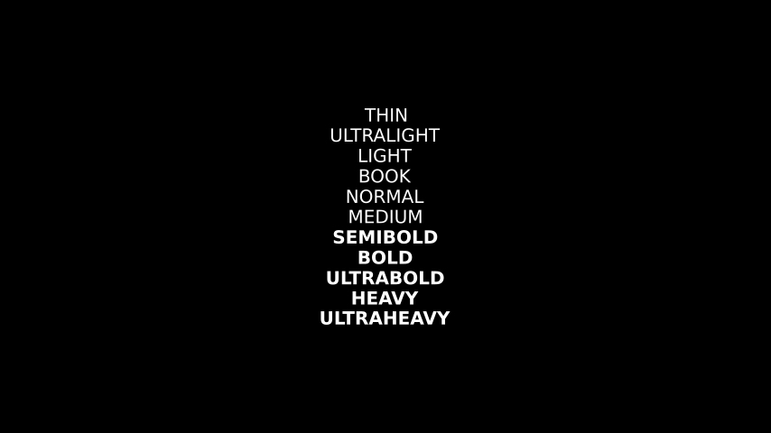
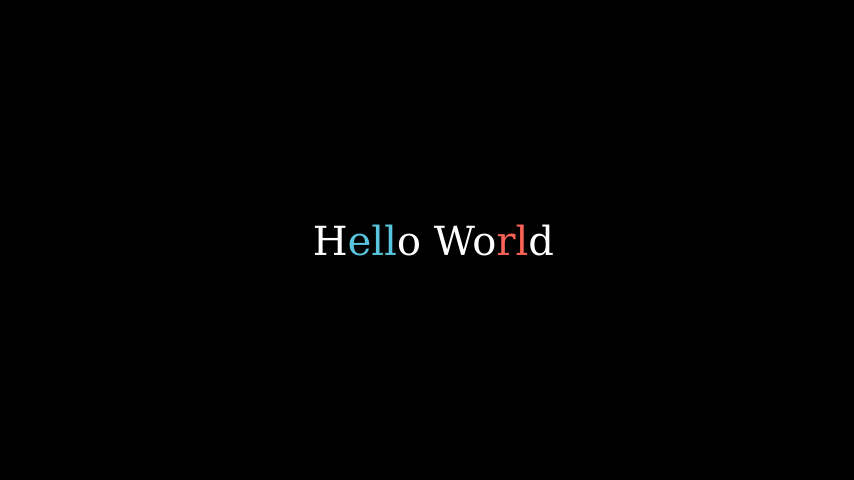
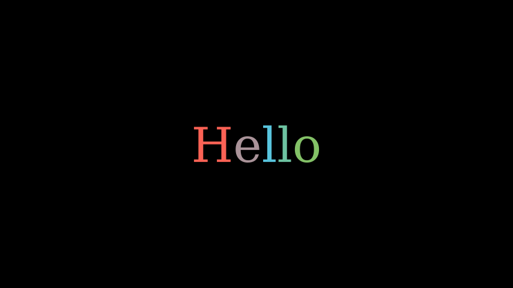
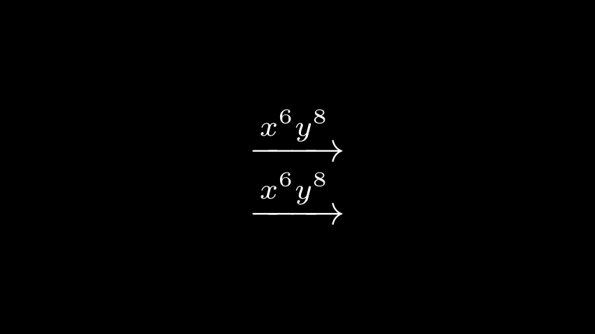
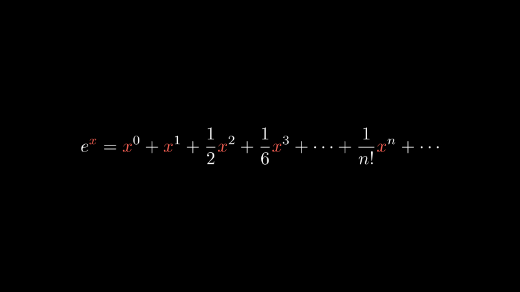
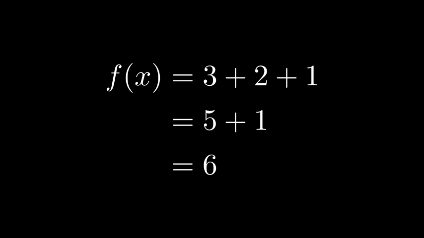

[](...menustart)

- [Manim Text](#8dc4d1cd4d814e35214beeee4edc233e)
    - [Text Without LaTeX](#05271c4842470dffc0b2d9605fbba9d8)
        - [MarkupText](#de3f15d9428af472d02534a646a659d8)
        - [Font Weight](#6184141f3ad2584cff257e2bfbbb8d0b)
        - [Text To Color t2c](#10c417cf962b73ecbbc3fa28e9e07952)
        - [Gradients](#e99e133f4481158db879726b7335d967)
        - [Text To Gradient t2g](#15e5445e2b258b42b3b0c12ba43d24bd)
        - [Interating](#baadec00e97b4cf4b62939e9e88c5a28)
    - [Text With LaTeX](#eb9a4c1f0e36c5b4c1fb0cf6217d2cf0)
        - [MathTex](#686dc5f1a6e6e3b8ef3da8cd3544b6d9)
        - [LaTeX commands and keyword arguments](#f0bc731d5f691bb915cbd2e2fd26508a)
        - [Substrings and parts](#f5116b6c004358871f753c9306807f75)
        - [Aligning formulae](#408a8fc05271ca23231550608d7e5365)

[](...menuend)


<h2 id="8dc4d1cd4d814e35214beeee4edc233e"></h2>

# Manim Text

There are two different ways by which you can render Text in videos:

1. Using Pango ( [text_mobject](https://docs.manim.community/en/stable/reference/manim.mobject.svg.text_mobject.html#module-manim.mobject.svg.text_mobject) )
    - use either Text or MarkupText
2. Using LaTex ( [tex_mobject](https://docs.manim.community/en/stable/reference/manim.mobject.svg.tex_mobject.html#module-manim.mobject.svg.tex_mobject) )
    - be used when you need mathematical typesetting


<h2 id="05271c4842470dffc0b2d9605fbba9d8"></h2>

## Text Without LaTeX


<h2 id="de3f15d9428af472d02534a646a659d8"></h2>

### MarkupText



```python
from manim import *

class SingleLineColor(Scene):
    def construct(self):
        text = MarkupText(f'all in red <span fgcolor="{YELLOW}">except this</span>', color=RED)
        self.add(text)
```


<h2 id="6184141f3ad2584cff257e2bfbbb8d0b"></h2>

### Font Weight



```python
from manim import *

class DifferentWeight(Scene):
    def construct(self):
        import manimpango

        g = VGroup()
        weight_list = dict(sorted({weight: manimpango.Weight(weight).value for weight in manimpango.Weight}.items(), key=lambda x: x[1]))
        for weight in weight_list:
            g += Text(weight.name, weight=weight.name, font="Open Sans")
        self.add(g.arrange(DOWN).scale(0.5))
```

<h2 id="10c417cf962b73ecbbc3fa28e9e07952"></h2>

### Text To Color t2c




```python
from manim import *

class Textt2cExample(Scene):
    def construct(self):
        t2cindices = Text('Hello', t2c={'[1:-1]': BLUE}).move_to(LEFT)
        t2cwords = Text('World',t2c={'rl':RED}).next_to(t2cindices, RIGHT)
        self.add(t2cindices, t2cwords)
```


<h2 id="e99e133f4481158db879726b7335d967"></h2>

### Gradients



```python
from manim import *

class GradientExample(Scene):
    def construct(self):
        t = Text("Hello", gradient=(RED, BLUE, GREEN)).scale(2)
        self.add(t)
```


<h2 id="15e5445e2b258b42b3b0c12ba43d24bd"></h2>

### Text To Gradient t2g


```python
from manim import *

class t2gExample(Scene):
    def construct(self):
        t2gindices = Text(
            'Hello',
            t2g={
                '[1:-1]': (RED,GREEN),
            },
        ).move_to(LEFT)
        t2gwords = Text(
            'World',
            t2g={
                'World':(RED,BLUE),
            },
        ).next_to(t2gindices, RIGHT)
        self.add(t2gindices, t2gwords)
```

<h2 id="baadec00e97b4cf4b62939e9e88c5a28"></h2>

### Interating 

Text objects behave like VGroups. Therefore, you can slice and index the text.


```python
from manim import *

class IterateColor(Scene):
    def construct(self):
        text = Text("Colors").scale(2)
        for letter in text:
            letter.set_color(random_bright_color())
        self.add(text)
```


<h2 id="eb9a4c1f0e36c5b4c1fb0cf6217d2cf0"></h2>

## Text With LaTeX

<h2 id="686dc5f1a6e6e3b8ef3da8cd3544b6d9"></h2>

### MathTex

Everything passed to [MathTex](https://docs.manim.community/en/stable/reference/manim.mobject.svg.tex_mobject.MathTex.html#manim.mobject.svg.tex_mobject.MathTex) is in math mode by default.

To be more precise, MathTex is processed within an `align*` environment.  You can achieve a similar effect with [Tex](https://docs.manim.community/en/stable/reference/manim.mobject.svg.tex_mobject.Tex.html#manim.mobject.svg.tex_mobject.Tex) by enclosing your formula with `$` symbols:  e.g. `$\xrightarrow{x^6y^8}$`



```python
from manim import *

class MathTeXDemo(Scene):
    def construct(self):
        rtarrow0 = MathTex(r"\xrightarrow{x^6y^8}").scale(2)
        rtarrow1 = Tex(r"$\xrightarrow{x^6y^8}$").scale(2)

        self.add(VGroup(rtarrow0, rtarrow1).arrange(DOWN))
```


<h2 id="f0bc731d5f691bb915cbd2e2fd26508a"></h2>

### LaTeX commands and keyword arguments

We can use any standard LaTeX commands in the AMS maths packages. Such as the *mathtt* math-text type or the *looparrowright* arrow.

Some commands require special packages to be loaded into the TeX template. For example, to use the *mathscr* script, we need to add the *mathrsfs* package.  Since this package isn’t loaded into Manim’s tex template by default, we have to add it manually.


```python
from manim import *

class AMSLaTeX(Scene):
    def construct(self):
        tex = Tex(r'$\mathtt{H} \looparrowright$ \LaTeX', color=BLUE).scale(1.5)
        self.add(tex)

        myTemplate = TexTemplate()
        myTemplate.add_to_preamble(r"\usepackage{mathrsfs}")
        tex = Tex(r'$\mathscr{H} \rightarrow \mathbb{H}$}', tex_template=myTemplate).scale(2)
        tex.shift( DOWN * 3 )
        self.add(tex)
```

<h2 id="f5116b6c004358871f753c9306807f75"></h2>

### Substrings and parts

The TeX mobject can accept multiple strings as arguments. 


```python
from manim import *

class LaTeXSubstrings(Scene):
    def construct(self):
        tex = Tex('Hello', r'$\bigstar$', r'\LaTeX').scale(3)
        tex.set_color_by_tex('e', RED)
        self.add(tex)
```

Note that set_color_by_tex() colors the entire substring containing the Tex.

---



```python
from manim import *

class CorrectLaTeXSubstringColoring(Scene):
    def construct(self):
        equation = MathTex(
            r"e^x = x^0 + x^1 + \frac{1}{2} x^2 + \frac{1}{6} x^3 + \cdots + \frac{1}{n!} x^n + \cdots",
            substrings_to_isolate="x"
        )
        equation.set_color_by_tex("x", RED)
        self.add(equation)
```

By setting substring_to_isolate to x, we split up the MathTex into substrings automatically and isolate the x components into individual substrings.

Note that Manim also supports a custom syntax that allows splitting a TeX string into substrings easily: simply enclose parts of your formula that you want to isolate with double braces. In the string MathTex(r"{{ a^2 }} + {{ b^2 }} = {{ c^2 }}"), the rendered mobject will consist of the substrings a^2, +, b^2, =, and c^2. This makes transformations between similar text fragments easy to write using TransformMatchingTex.


<h2 id="408a8fc05271ca23231550608d7e5365"></h2>

### Aligning formulae

MathTex mobject is typeset in the LaTeX align* environment. This means you can use the `&` alignment character when typesetting multiline formulae:



```python
from manim import *

class LaTeXAlignEnvironment(Scene):
    def construct(self):
        tex = MathTex(r'f(x) &= 3 + 2 + 1\\ &= 5 + 1 \\ &= 6').scale(2)
        self.add(tex)
```


