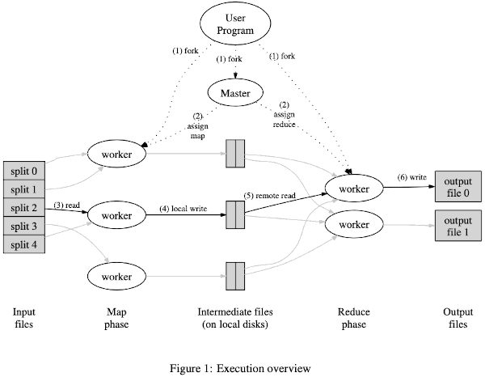

# MapReduce

# 2 Programming Model

The computation takes a set of *input* key/value pairs, and produces a set of *output* key/value pairs.

- Map function
    - written by the user, takes an input pair and produces a set of *intermediate* key/value pairs.  1 to N ?
    - The MapReduce library groups together all intermediate values associated with the same intermediate key *I* and passes them to the Reduce function.
- Reduce function
    - also written by the user, accepts an intermediate key *I* and a set of values for that key.  
    - It merges together these values to form a possibly smaller set of values. 
    - Typically just zero or one output value is produced per Reduce invocation. 
    - read the intermediate values via an iterator


## 2.1 Example

Counting the number of occurrences of each word in a large collection of documents.

```python
map(String key, String value):
    // key: document name
    // value: document contents
    for each word w in value:
        EmitIntermediate(w, "1");
reduce(String key, Iterator values):
    // key: a word
    // values: a list of counts
    int result = 0;
    for each v in values:
        result += ParseInt(v);
    Emit(AsString(result));
```

- The *map* function emits each word plus an associated count of occurrences (just ‘1’ in this simple example).
- The *reduce* function sums together all counts emitted for a particular word.

## 2.2 Types

Conceptually the map and reduce functions supplied by the user have associated types:

```
map     (k1,v1)         → list(k2,v2)
reduce  (k2,list(v2))   → list(v2)
```

- the number next to `k` and `v` means the domain
- the input keys and values are drawn from a different domain than the output keys and values.
- the intermediate keys and values are from the same domain as the output keys and values.


# 3 Implementation



- Map 
    - the input data is partitioned into a set of *M splits*.
    - the input splits can be processed in paralled by different machines 
- Reduce
    - are distributed by partitioning the intermediate key space into R pieces using a partitioning function (e.g. *hash(key)* **mod** R )
- M map tasks, and R reduce tasks
    - The master picks idle workers and assigns each on a map task or a reduce task 
- Map task worker read the corresponding input split, and parses it. The intermediate key/value pairs produced by *map* function are buffered in memory.
    - Periodically, the buffered pairs are written to local disk, partitioned into R regions by the partitioning function.
    - The locations of these buffered pairs on the local disk are passed back to the master, who is responsible for forwarding these locations to the reduce workers.
    - When a reduce worker is notified by the master about these locations, it uses RPC to read the buffered data from the local disks of the map workers. 
    - When a reduce worker has read all in- termediate data, it sorts it by the intermediate keys so that all occurrences of the same key are grouped together. he sorting is needed because typically many different keys map to the same reduce task.

- The reduce worker iterates over the sorted intermediate data and for each unique intermediate key encountered, it passes the key and the corresponding set of intermediate values to the user’s Reduce function. 
    - The output of the Reduce function is appended to a final output file for this reduce partition.

- When all map tasks and reduce tasks have been completed, the master wakes up the user program. 
    - At this point, the *MapReduce* call in the user program returns back to the user code.

- After successful completion, users do not need to combine these R output files (one per reduce task, with file names as specified by the user) into one file -- they often pass these files as input to another MapReduce call, or use them from another distributed application that is able to deal with input that is partitioned into multiple files.


