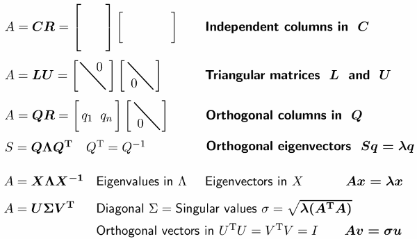

<h2 id="bd8cfe5912b0bee7fd7d191afedf8995"></h2>

# Linear ALgebra

- [MIT: A 2020 Vision of Linear Algebra](LA_1806_new_vision2020.md)
    - 

    - the 1st half, 1,2,3, is about solving equations
    - the 2nd half, 4,5,6, is about eigenvalues and eigenvectors and singular values.

    - A =  Column matrix * Row matrix  ?
    - LU  famous computer commands for elimination, for solving equations, the first job of linear algebra.
    - S is symmetric matrix
    - You really don't want to miss Singualr value.
    - Symmetric matrix, S,  is the king of linear algebra
    - Orthogonal matrix, Q, is the queen of linear algebra

---

- MIT 18.06
    - [preface](LinearAlgebra_preface.md) 
    - [Elimination](LinearAlgebra_MatricesandGaussianElimination.md)  
    - [Vector Space](LinearAlgebra_VectorSpace.md)  
    - [Orthogonality](LinearAlgebra_Orthogonality.md)
    - [Determinants](LinearAlgebra_Determinants.md) 
    - [Eigen](LinearAlgebra_Eigen.md)  
    - [Positive Definite Matrices](LinearAlgebra_PositiveDefiniteMatrices.md)
    - [Computing With Matrix](LinearAlgebra_Computing_With_Matrix.md)
    - [Linear Programming and Game theory](LinearAlgebra_Linear_Programming_and_Game_theory.md)
    - [Netshell](LinearAlgebra_Netshell.md)  
    - TODO
    - [18.06 lecture vidoe note](note_18.06.md) 
    - [18.06 lecture vidoe note 2](note_18.06_2.md) 

---

- MIT 18.065
    - [1-6 Review of 18.06](MIT_18065_1.md)
    - [7 PCA, 8 norm](MIT_18065_7.md)
    - [9 least², 10 Difficult of Ax=b](MIT_18065_9.md)

---

- 3Brown1Blue
    - [Essence of LA](3blue1brown.md)

<h2 id="0349a55a6a70f89e604c28892ce24d82"></h2>

# Calculus

- [Calculus One](CalculusOne.md) 
- [Calculus One: Part II](CalculusOne_part2.md)
- [微积分总览](微积分总览.md) 
- [essenceOfCalculus](essenceOfCalculus.md )
- [偏导数](partial_derivative.md)

<h2 id="0d2765b30694ee9f4fb7be2ae3b676dc"></h2>

# Probability 

- 台大概率笔记
    - [台大概率笔记](TaiwanU_probability.md)
    - [连续机率分布](TaiwanU_probability2.md) 
    - [期望值 条件概率 失忆性](TaiwanU_probability67.md) 
    - [联合概率 边际概率 双变数期望值](TaiwanU_probability8.md) 
    - [多个随机变量之和的概率分布](TaiwanU_probability9.md) 
- [随机数](Dev_Random.md) , [random number](random_number.md)

<h2 id="682352d7b7d88f46edac62cd97b58db1"></h2>

# 3Blue1Brown

- Lockdown Math
    - [ep.1 quadratic formula](3b1b_quadratic_formula.md)
    - [ep.2,3 Trigonometry & Complex number](3b1b_trigonometry.md)
    - [ep.4 euler formular](3b1b_euler_formula.md)
- [3b1b Fourier Transform](3b1b_fourier_transform.md)
- [3b1b Bayes theorem](bayes_theorem.md)

<h2 id="74248c725e00bf9fe04df4e35b249a19"></h2>

# Misc 

- [Tricks](Tricks.md)
- [softmax implementation](softmax.md)
- [prime number](math_prime.md)

