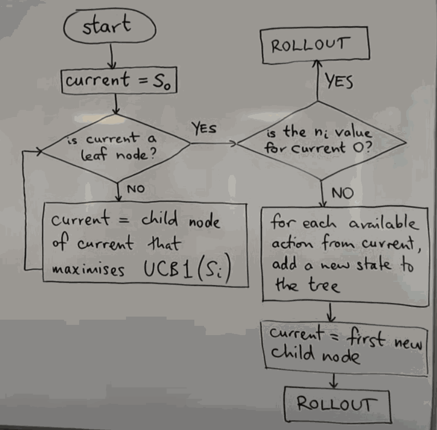
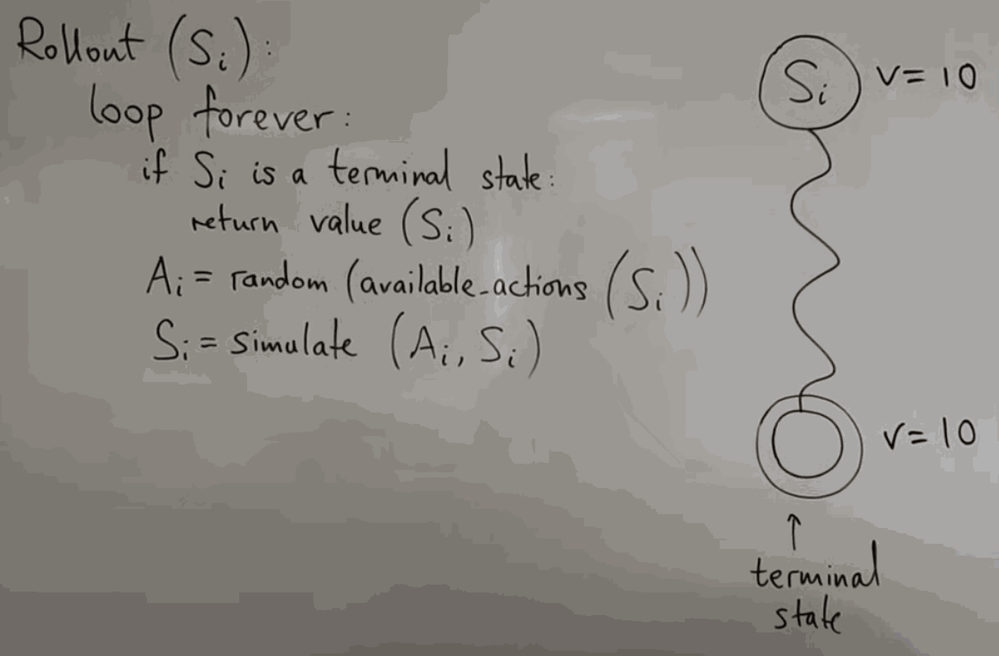
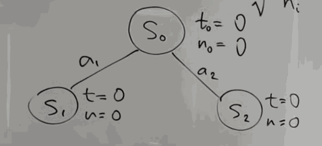
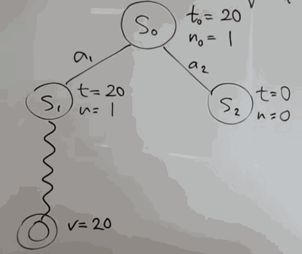
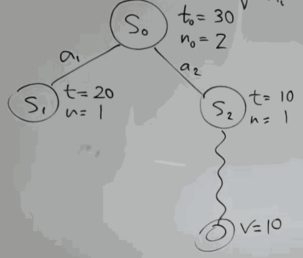
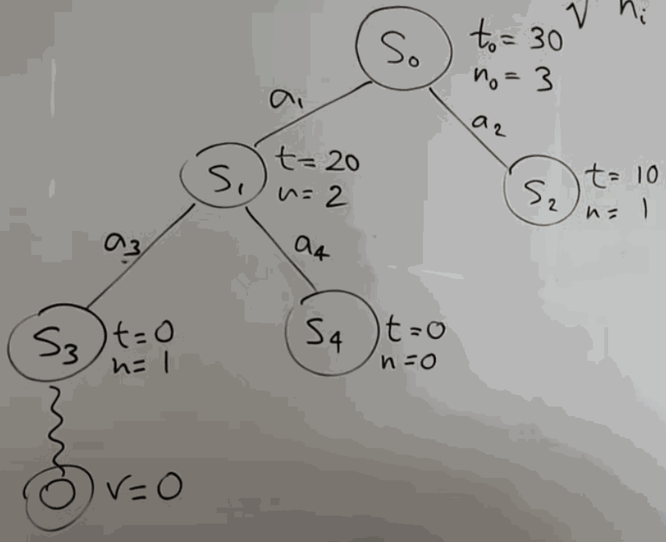
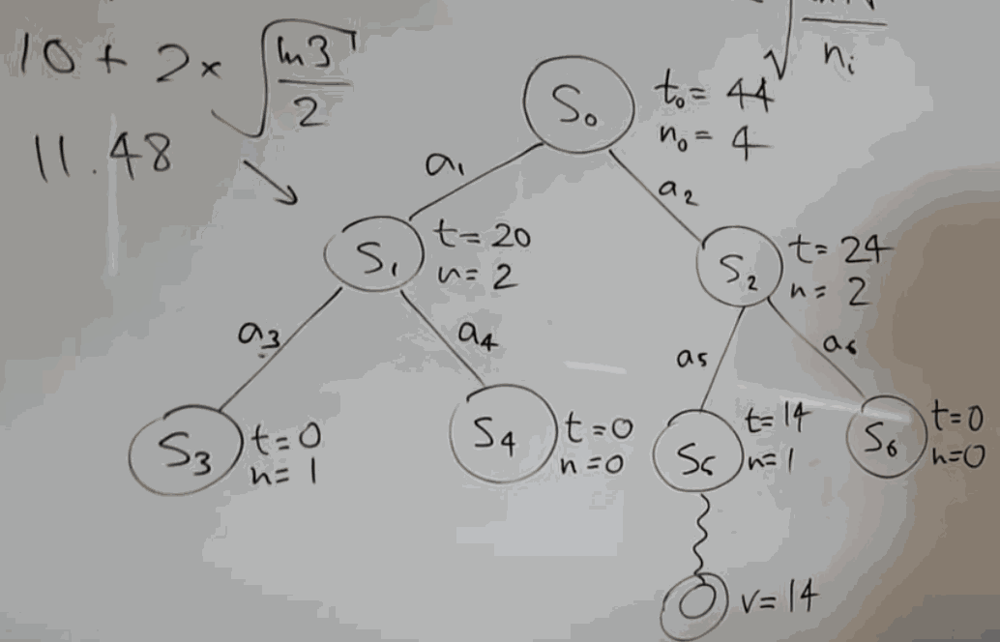

# Monte Carlo Tree Search

## Four Phases

1. Tree Traversal
    - using UCB1 formula
2. Node Expansion
    - add extra nodes to the tree
3. Rollout (Random Simulation)
    - random simulation of the game or the problem, in order to find a value
4. Backpropagation
    - take the value found in the rollout and backpropagate it up to the root node

## Tree Traversal & Node Expansion

- 
- you start at initial state s0
- you keep traversing the tree,  choosing the best child node based on the UCB1, until you reach a leaf node
- once you reach a leaf node, 
    - if it's never been sampled before, you don't expand it, you just do a rollout from there.
    - if it's have been sampled before, you expand it by adding all of its children to the tree, and then you choose one of them to rollout from.

## Rollout

- 
- random choose an available action, and keep doing that until reach terminal state

## Worked Example

start at state s0, the first thing need to add the available actions

- 
    - N: visit count of parent node
- 

1st iteration, same ucb value, choose s1, s1 has not been visited yet, rollout it, get a terminal state (v:20), backpropagate it to s1.

- 

2nd iteration, ucb(s2) is infinite, choose  s2, rollout & backpropagate

- 

3rd iteration, ucb(s1) is maximum,  so choose s1, it is leaf node and already been visited before, so expand it, add s3, s4, choose s3, rollout & backpropagate

- 

4th iteration, ucb(s1) = 11.48, ucb(s2) = 12.10, choose s2, add s5, s6, rollout & backpropagate

- 

If we were asked to stop at this point. The search would essentially tell us that the best action to take. Because the value of s2 is 24, and the value of s1 is 20. 
