[](...menustart)

- [Reinventing Minecraft world generation](#96e75305b322e594ce2306f5a30ab5dc)
- [Terrain Shaping](#1ecd272b0d72d00d6836b914db9f0fba)
    - [Perlin Noise](#af3462ddc2e2da770f2e68b7f1c0dc98)
    - [Octaves](#e2e85df2662cca65725c9579e636f4e6)
    - [Noise Transformation](#bafd676d01211ad97b90e256fe1dd60e)
    - [Do more deliberate Noise Transformation: Continentalness](#13e64d78231fbc637e4efeeaea767514)
    - [Multinoise](#af14c8424f79e6ca6961814e1ac0833c)
    - [3D Noise](#08b98ab159219b50eb6192e7dc1776de)
    - [Cave Generation](#e62ecbf6c6addf50c3cf990d97893700)
    - [Biomes](#206f531dc3ec38029e7e42e0b6785ba0)

[](...menuend)


<h2 id="96e75305b322e594ce2306f5a30ab5dc"></h2>

# Reinventing Minecraft world generation

https://www.youtube.com/watch?v=ob3VwY4JyzE

- chunk
    - 16x16x256
- what is the "procedure" ?
    ```java
    BlockState = getBlock(int x, int y, int z) {
        // Figure out which block should be at this coordinate
    }
    ```
- a chunk is generated in steps
    1. terrain shaping
        - just deciding stone and air(empty)
    2. water filling
        - all blocks below 64 (height) is going to be filled with water
    3. surface replacement
        - what biome is it ?  jungle, or desert ? and base on that we replace the top layer with somethings( dirt, grass...)
    4. features and structures 
        - trees, villages...


<h2 id="1ecd272b0d72d00d6836b914db9f0fba"></h2>

# Terrain Shaping

<h2 id="af3462ddc2e2da770f2e68b7f1c0dc98"></h2>

## Perlin Noise

- Example: 2d noise to generate height map
    ```java
    BlockState = getBlock(int x, int y, int z) {
        PerlinNoise noise = new PerlinNoise();
        var surfaceY = 100 + noise.sample2d(x,y) * 20;
        return y < surfaceY ? STONE: AIR;
    }
    ```
    - 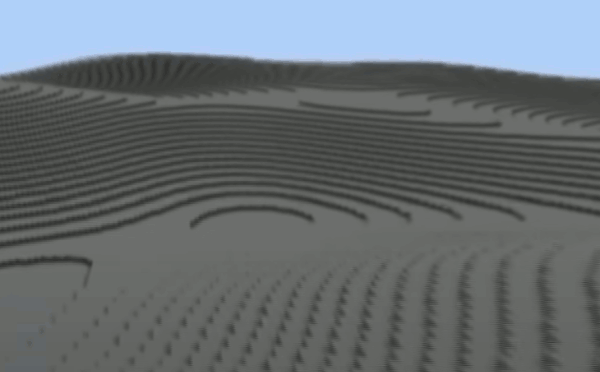

<h2 id="e2e85df2662cca65725c9579e636f4e6"></h2>

## Octaves

- What is octaves ?
    - normally doule the frequency and half the amplitude
- Multioctaves on sine(x)
    - 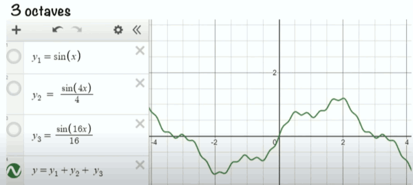
- MultiOcatves on Perlin Noise
    - 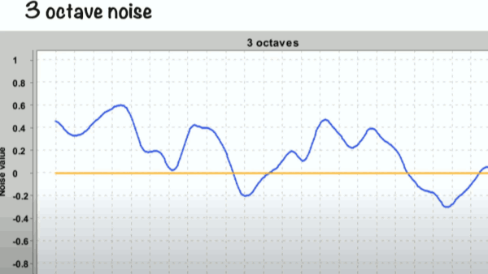
- MultiOcatves for terrain generation
    ```java
    BlockState = getBlock(int x, int y, int z) {
        final int octaves = 4;
        PerlinNoise noise = new PerlinNoise(octaves); // new constructor
        var surfaceY = 100 + noise.sample2d(x,y) * 20;
        return y < surfaceY ? STONE: AIR;
    }
    ```
    - 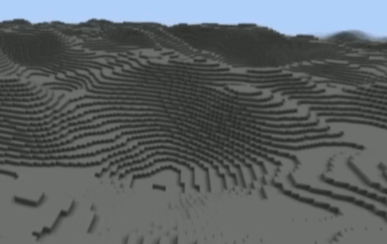
    - more interesting


<h2 id="bafd676d01211ad97b90e256fe1dd60e"></h2>

## Noise Transformation

- noise value gives us value from -1 to 1
    ```java
        var surfaceY = 100 + noise.sample2d(x,y) * 20;
    ```
- and we doing somthing on it
    ```java
        return y < surfaceY ? STONE: AIR;
    ```
- and gave us such terrain
    - 


<h2 id="13e64d78231fbc637e4efeeaea767514"></h2>

## Do more deliberate Noise Transformation: Continentalness

- we're going to take our Perlin noise, and I'm going to call it `Continentalness`.
- everywhere in the world has a value for continentalness.
- shaping
    - shaping really means creating an indirect connection between continentalness and terrain height.
- this shaping give us a boring flat world
    - 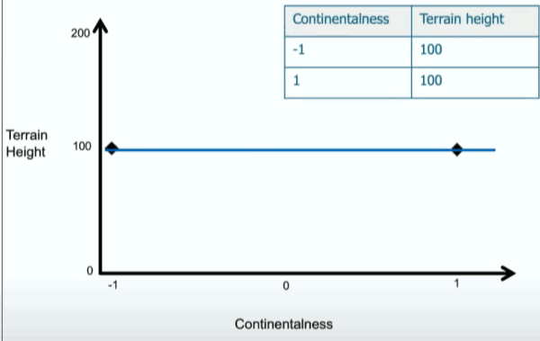 , 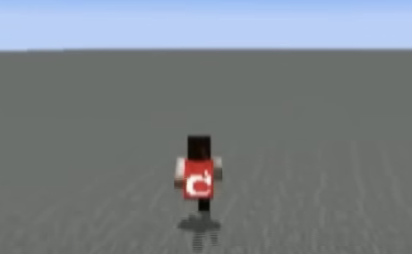
    - I don't care what continentalness it is, the surface height is always going to be 100.
- straight line shaping
    - 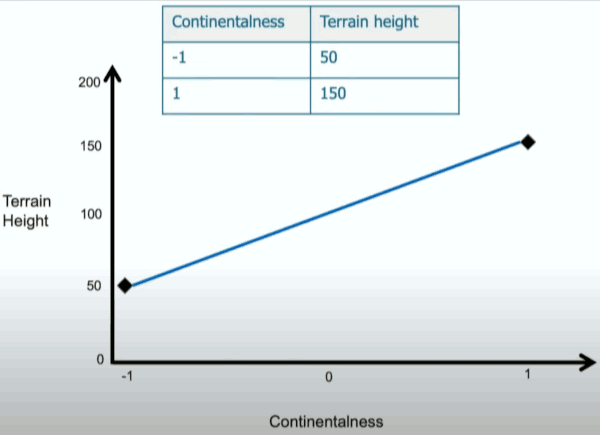 , 
- segment lines shaping
    - 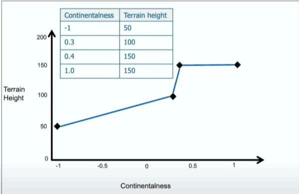 , 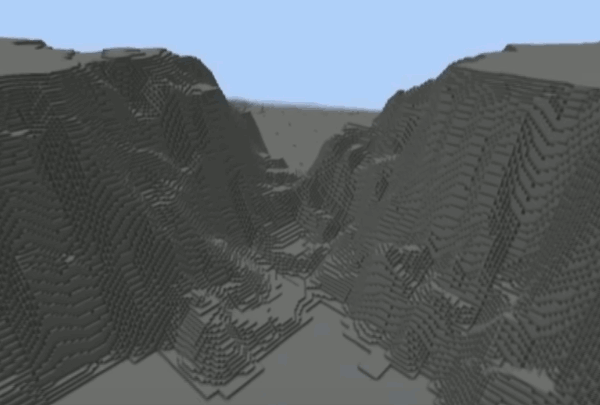


<h2 id="af14c8424f79e6ca6961814e1ac0833c"></h2>

## Multinoise

- We have 3 noises here
    - Continentalness, Erosion, Peaks & valleys
    - 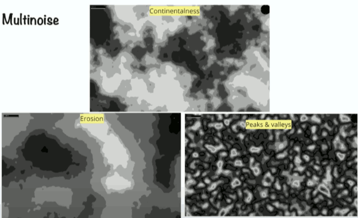
    - Erosion changes quite slowly, Peaks & valleys tends to generate ridges.

- We basically create lots of spline points.
    - this spline points is kind of how far inland are we.
        - 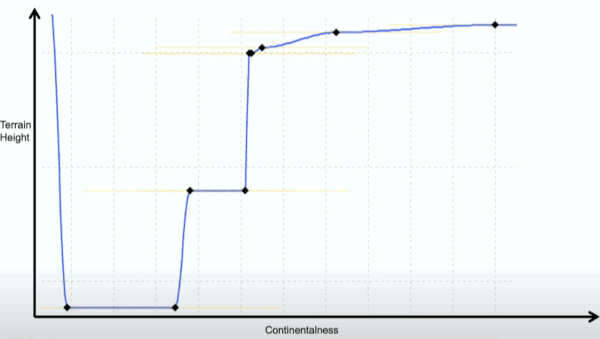
        - high continentalness we're far inland, low continentalness means we're kind of offshore.
        - that's why as continentalness starts growing, terrain height goes way down below the sea level, and that's how we get oceans.
        - and then we get kind of the caostline coming in (`/`) and as we go further up the scale we suddenly get plateaus, etc...
    - but there points lead to other splines too. 
        - so we're saying that when continentalness is over here, terrain height is there but only if other noises are at 0, because we have other splines connected to it.
        - 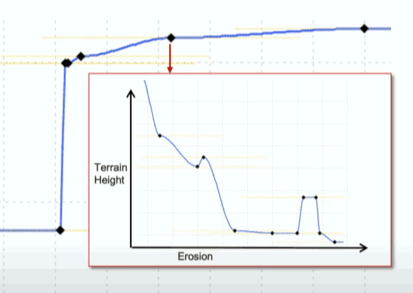
        - so we're saying that but if erosion, let's say, is low, then the terrain height gets even higher, if erosion is high, terrain gets lower.
    - and same thing there each dot here is connected to yet another one
        - 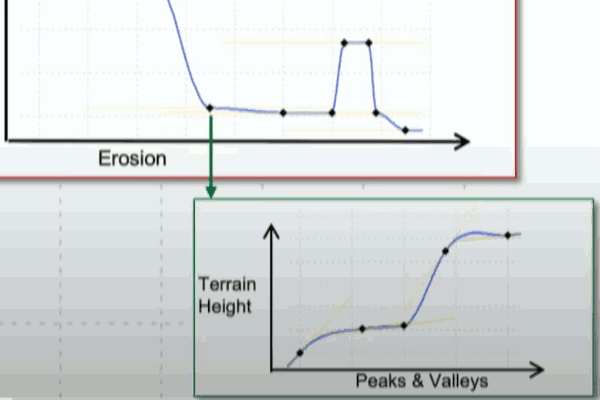
- multinoise examples
    - 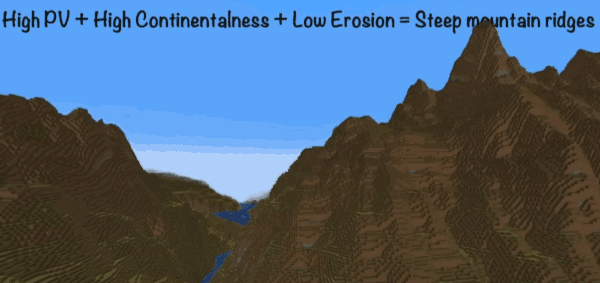
    - 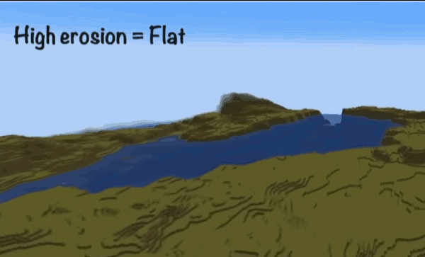


<h2 id="08b98ab159219b50eb6192e7dc1776de"></h2>

## 3D Noise

- 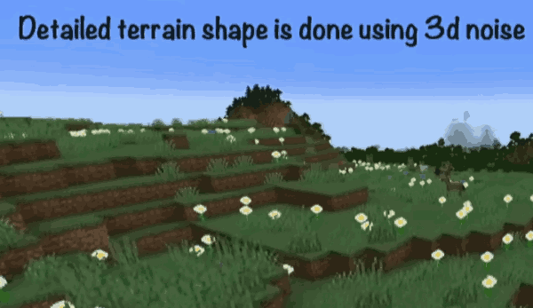 , 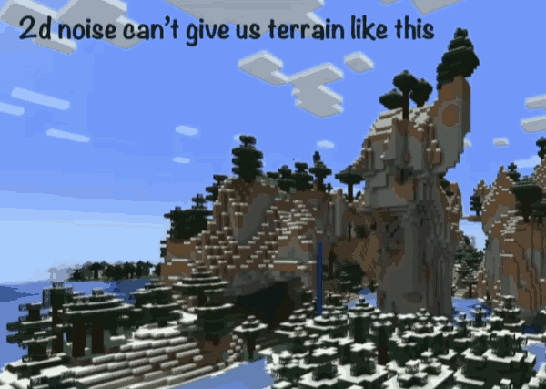
- 3d noise function
    - 3 inputs (x,y,z)
    - 1 output ("density")
- let's say a block is AIR if its density is `<= 0`, we get this
    - 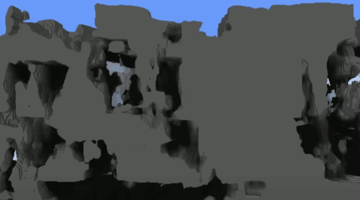
- we then apply a bias to it, so the higher up we are the more we lower the density value, and the lower down we are, the more we increase the density value.
    - 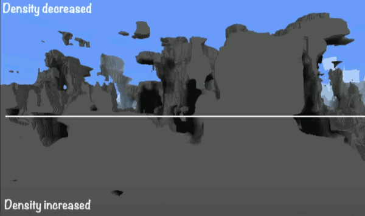
- Why do we do that ?  That's how we generate the detailed surface of world.
    - because the terrain shape is controlled by two things, squashing factor and height offset.
    - The squashing factor is what I just showed you, this is an example of high squashing factor where we with that bias is very strong. So it's basically almost like a flat world.
        - 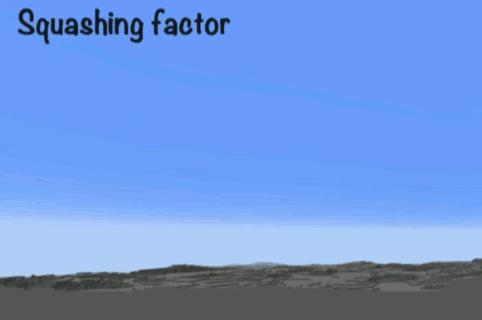
        - but as we relax that bias , we reduce squashing factor then the 3d noise is allowed to be shown.
        - 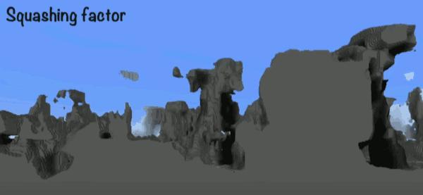
    - and the height offset is just literally moving everything up or down.
    - Those 2 numbers have a radical effect on the world, 
- In practice, we can figure that the same using spline points. So we define how continentalness, and all these other noises.
    - basically add points for squashing factor, and we add points for terrain elevation, that is , **both are controlled via terrain shaping spline points**.
- So those things together give us a max of madness and kind of more normal looking terrain.
    - 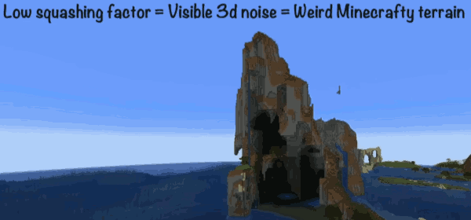


<h2 id="e62ecbf6c6addf50c3cf990d97893700"></h2>

## Cave Generation

- use 3d noise as well
    - 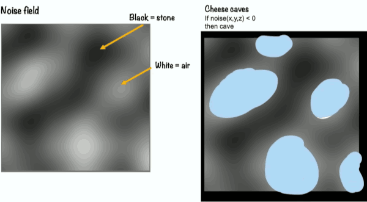
    - however we will do a little bit of transformation to make it little flatter to make it possible to run around.
- long tunnels (spaghetti caves)
    - now what we didn't get from this was long tunnels.
    - to get long tunnels, 
    - 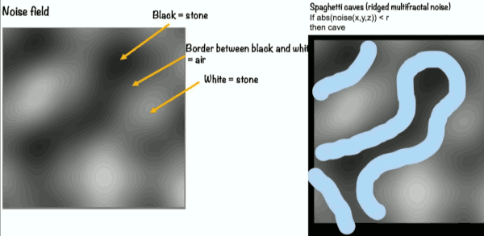
- we can combines things that's when the mgaic happens.
    - 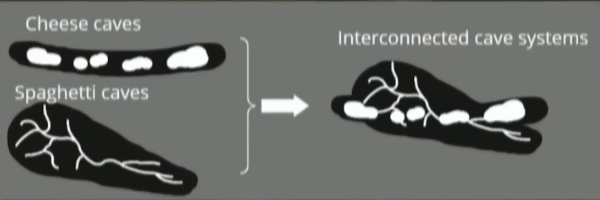


<h2 id="206f531dc3ec38029e7e42e0b6785ba0"></h2>

## Biomes

- A minecraft world is divided into biomes.
- Biomes are placed based on 5 noises
    - 3 noise we already have:  Continentalness,  Erosion, Peaks & valleys
    - Temperature ,  Humidity
    - 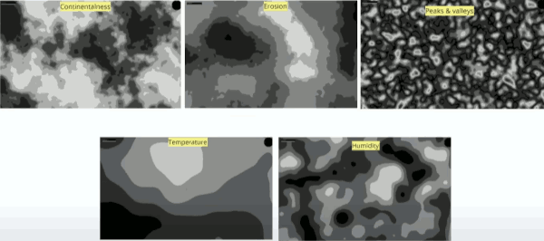
- The combination of noise values determines which biome to place where.
- We configure biomes by using tables rather than spline points because biomes are discrete.
    - 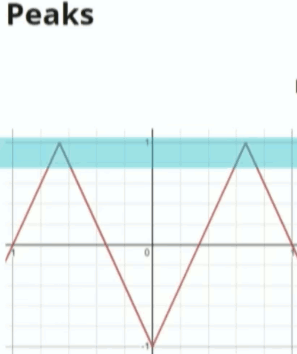
    - 
    - if we're in an area where peak noise is hight, then look at continentalness and erosion and that decide which biome we're in.
    - to make this easier to configure we split the noise values into number ranges. 
        - 
        - we say that, erosion index 0 means a value from -1 to -0.78,  erosion index 6 means 0.55 to 1.
- Let's way this place I'm in right now is `Far Inland` and erosion index 1, so there's going to be a peak here.
    - but what kind of peak ? There's different types of peaks, it's these snowy things.
    - well that depends on temperature. e.g. High continentalness + Low erosion + Low temp = Jagged Peaks
        - 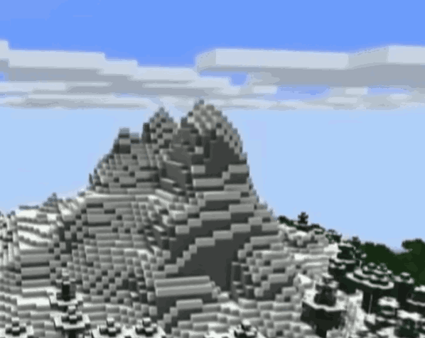
- In a jungle case, we were low continentalness and medium erosion (say index 3), so this is going to be a middle biome. 
    - But what kind of a middle biome ? So we look at this table
    - 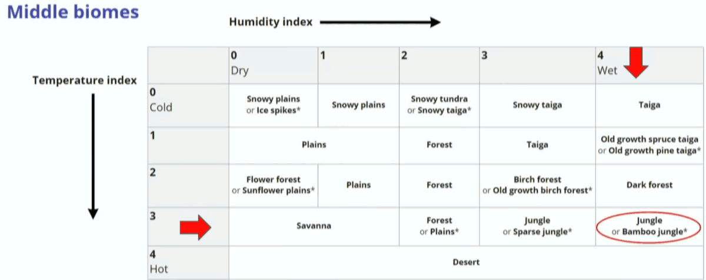
    - the humidity is higher, and the temperature is kind of high, so it is Jungle.
- configuring this is tricky because you need to understand and visualize a 5D grid. 
    - 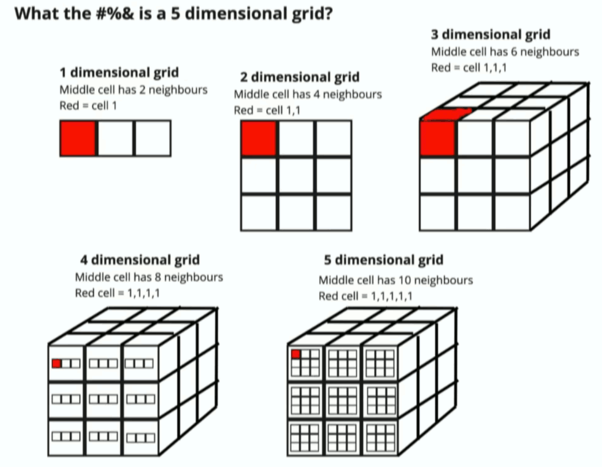
    - Why does it matter because neighbors mattera lot, we don't want a desert to neighbor a snowy peaks.
    - we configure these tables we think a lot about what biomes could neighbor which bomes. But it's 5D configuration space, it makes really hard.


