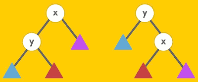
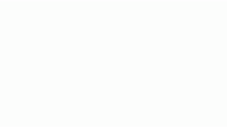

# MIT 6.006 Notes

## 2. Data Structures and Dynamic Arrays


Data Structure | \| | Operation, <br>Worst Case O(·)  | &nbsp; |  &nbsp;
--- | :--- | --- | --- | --- 
&nbsp; | Static | Dynamic | Dynamic | Dynamic
&nbsp; | get_at(i)<br>set_at(i,x) | insert_first(x)<br>delete_first()| insert_last(x)<br>delete_last() | insert_at(i,x)<br>delete_at(i)
Array | ***1*** | n | n | n
Linked List | n | ***1*** | n | n 
Dynamic Array | ***1*** | n | ***1***<sub>(a)</sub> | n


- linked lists are great if you're working on the ends, even dynamically.
- (static) arrays are great if you're doing random access and nothing dynamic, nothing adding or deleting.
- dynamic arrays get all of the good running times of linked lists and all of the good running times of static arrays.
    - we won't get quite all of them, but most of them. 


### Dynamic Arrays ( Python lists )

```cpp
| A  | ---> |x₀|x₁|x₂|...|...|...| 
|len |    // length of array, # of items
|size|    // actual memory allocated
```

- relax constraint size (array) = n (# of items in sequence)
    - with a static array, we allocated an array of size exactly n. 
    - Let's relax that.  Let's not make it exactly n.
- enforce size = Θ(n) ≥ n, e.g. 2n
- maintain A[i] = x<sub>i</sub>
- re-size to 2n if not enough space
    - think about `n insert_last()` from an array of size 1, when do we resize ?
        - we can insert 1 item for free, as soon as we insert the 2nd item, then we have to resize(2).
        - the we insert the 3rd item,  we need resize(4) at first ...
    - we're going to resize at n equals 1,2,4,8,..., all the power of 2
        - ⇒ resize cost: Θ(1+2+4+8+...)
        - = Θ( ∑<sub>i=0</sub><sup>lgn</sup> 2<sup>i</sup> )
            - this is a geometric series & geometric series are dominated by the last term, the biggest term.
            - then in terms of Θ notation, you can just look at the last term and put a Θ around it, and you done
        - = Θ( 2<sup>lgn</sup> ) = Θ(n)
            - it's linear time, cool.
            - I'm doing n operations here, and I spent linear total time to do all of the resizing. That's like constant each, **kind of**.
        - the *kind of* is an important notion,  which we call **amortization**.
            - **amortization**: operation takes T(n) amortized time  if any k operations take ≤ kT(n) time
            - *amortized* means a particular kind of averaging over the sequence of operations


## 3. Sets

Data Structure | \| | Operation, O(·)  | &nbsp; |  &nbsp; |  &nbsp;
--- | :--- | --- | --- | --- | ---
&nbsp; | Container | Static | Dynamic | Order | &nbsp;
&nbsp; | build(X) | find(k) | insert(x)<br>delete() | find_min()<br>find_max() | find_prev(k)<br>find_next(k)
**Array** | n | n | n | n | n
**Sorted Array** | nlogn | logn | n | ***1*** | logn


## 4. Hashing


- Can I do `find(k)` faster than O(lgn) ?
    - No. We can't do faster than O(lgn) for `find(k)`, which is a little weird.
        - the items that I'm storing in this data structure, for any way I saw these things, any algorithm of this certain type is going to require at least logarithmic time.
        - comparison model:  means the objects I'm storing, I can kind of think of them as black boxes. I don't get to touch tehse things, except the only way that I can distinguish between them is given a key and an item, or two items I can do a comparison on those keys, same?bigger?or smaller.
        - an algorithm in the comparison model is decision tree. This is eventually has n+1 leaves, n items and 1 `none`, which may represent the output. And the complexity of that algorithm is O(lgn) because this decision tree is binary tree, 

    - Yes. If the keys are integer key, we can use Direct Access Array.
        - i.e., if the key is 10, we store the data in 10th location in the Direct Access Array.
        - Θ(1) to find(k)
        - how about inserting and deleting ? Θ(1) , BUT...
        - but we don't know how hight the numbers to. so we have problems, we're using way too much sapce when we have a large universe of keys.
        - solution:  allocate m=Θ(n) space, and map [0,u-1] down to [0,m-1]. we are going to store more than one thing at the same index. And we now can put a dynamic array here instead store the objects, it's called **chaining**.
            - so the map function we are choosing very important. we really want a hash function that will evenly distribute keys over the [0,n-1] space.

- Universal hash function
    - *universal* is a descriptor, there exist many universal hash functions


Data Structure | \| | Operation, O(·)  | &nbsp; |  &nbsp; |  &nbsp;
--- | :--- | --- | --- | --- | ---
&nbsp; | Container | Static | Dynamic | Order | &nbsp;
&nbsp; | build(X) | find(k) | insert(x)<br>delete() | find_min()<br>find_max() | find_prev(k)<br>find_next(k)
Array | n | n | n | n | n
Sorted Array | nlogn | logn | n | ***1*** | logn
**Direct Access Array** | u | ***1*** | ***1*** | u | u 
**Hash Table** | n<sub>(e)</sub> | **1**<sub>(e)</sub> | **1**<sub>(e)</sub> | n | n

> u: the size of memory that the largest key is allowed to store, u < 2<sup>w</sup>

> e: expected runtime

- What's the worst case of Hash Table `find(k)` ? Linear search, O(n).
    - I could store another set's data structure as my chain and do better that way. That's actually how Java does it.
    - If your range of keys is small, you don't need a hash table, you just need a Direct Access Array.
    - Python Dictionary/Set implementation: if whenever we are more than a linear factor away from the fill factor  we are trying to be, then we could just completely rebuild the hash table with the new hash fucntion, randomly chosen from our hash table with a new size, and we can get amortized bound.


## 5. Linear Sorting

- Tuple Sort
    - [ (3,2), (0,3), (4,4), (4,2), (2,2) ]
    - use a stable sorting,
        - least significant sort first, then do most significant sort again

## 6. Binary Trees

- deletion a node is tricky
    - if node has no child, i.e. a leaf
        - simply detach it 
    - if node has left child
        - delete the node directly will destroy the tree structure, DO NOT do that
        - recursively swap the label of the node and its predecessor
            - detach it when it's becoming a leaf
    - if node has no left child, i.e. it has a right child
        - recursively swap the label of the node and its successor


## 7. Binary Trees  AVL

- Tree Property
    - how go get tree size in O(1) ?
    - node.size = node.left.size + node.right.size
        - when inserting , deleting a node,  need update all the nodes along the path up to the root node, O(h)
    - can also apply to
        - sum, product, min, max, etc...
    - but NOT node's index, depth.
- Rotation
    - We need a new tool to manipulate a tree. We are going to need something else to let us guarantee logarithmic height.
    - And it's called the rotation. It's just a tool for re-balancing the tree.
    - It should not change the data that's represented by the tree, the traversal order
    - a very powerful tool in all tree data structures. This is the thing we can do in a tree that want to affect any of the stuff We have done so far.
    - 
        - -- right rotate(x) →
        -   ⃪ left rotate(y) --
    - After rotation, you must **update the tree property** on x,y and on their ancestors in order.
    - 
- How to maintain this hight balance property using rotation ?
    - height balance:
        - skew(node) = height(node.right) - height(node.left) ∈ {-1,0,1}
    - consider lowest unbalanced node x
        - ⇒ skew(x) ∈ {-2,2} , say 2, the right subtree y is too high
    - case 1: skew(y) = 1
    - case 2: skew(y) = 0
        - left rotate x ?
    - case 3: skew(y) = -1
        - right rotate y
        - left rotate x
    - 


