[](...menustart)

- [Multivariable Calculus](#8ed36a2358db5f51e14738b08adae1e8)
    - [Vector Fields](#3b7f54591e7f5474a014162323f133b3)
    - [Transformations](#e4ba47693cf74a797e63f4557d4b88f4)
    - [Partial derivatives](#0528ae3ac84335726cdb869c37f074b5)
    - [Formal definition of partial derivatives](#720490b1bfd5d1d881f484a660c17cbe)
    - [Symmetry of second partial derivatives](#a32eb790ef82890d3d0f9fa9b2baa39b)
    - [Gradient](#5e59525cb7d1d1cd93be0b9f36e9d09a)
    - [Directional derivative](#5b6aea879e0205053b5c2ead9de77092)
    - [Why the gradient is the direction of steepest ascent](#b4e20dd468bf9adb89509b770119bd85)
    - [Gradient and contour maps](#9201e0fe2c81168aca84873317f7d525)
    - [Multivariable chain rule](#c6b56a77a991e01195baa8b3a6c425a1)
    - [Vector form of the multivariable chain rule](#3c1eaf19d0cdbb7207ae3fee0af4defd)
    - [Multivariable chain rule and directional derivatives](#4291d8b552cce8e49e10e7162e73e79a)

[](...menuend)


<h2 id="8ed36a2358db5f51e14738b08adae1e8"></h2>

# Multivariable Calculus

```bash
f(x,y) = x² + y
f(x,y) = |3x|
         |2y|
```

The convention is to usually think if there's multiple numbers that go into the output,  think of it as a vector.

It would probably be more accurate to call it multidimensional calculus. Because, instead of thinking of 2 separate entities, whenever you see 2 things like that,  you're gonna be thinking about the x-y plane. And thinking about just a single point.

**And you'd think of this as a function that takes a point to a number, or a point to a vector.**


<h2 id="3b7f54591e7f5474a014162323f133b3"></h2>

## Vector Fields

This concept comes up all the time in multivariable calculus, and that's probably because they come up all the time in physics.

- What is vector field ?
    - It is pretty much a way of visualizing functions that have the same number of dimensions in their input as in their output.

```bash
f(x,y) = |y³-9y|
         |x³-9x|
```

So if you imagin trying to visualize a function like this, it would be really hard because you somehow to visualize this thing in four dimensions.

So instead what we do, we look only in the input space, x-y plane. And for each individual input point, for example (1,2), I'm gonna consider the vector that it outputs and attach that vector to the point.

- 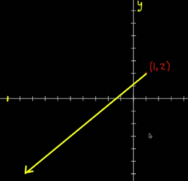

This is a really big vector.  If we draw a whole bunch of diffrent points and see what vectors attach to them, this would be a real mess.  So instead we scale them down, this is common.

- 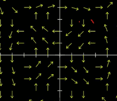

You're kind of lying about what the vectors themselves are, but you get a much better feel for what each thing corresponds to. 

And another thing about this drawing that's not entirely faithful to the original function that we have  is that all of these vectors are the same length. This is kind of common practice when vector fields are drawn. There are ways of getting around this, one way is just use colors with your vectors. 

- 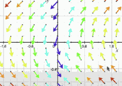

Here the color is used to give a hint of length.

Another thing you can do is cale them to be roughly proportional to what they should be. 

- 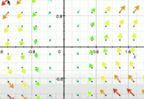

```bash
           |x|
f(x,y,z) = |y|
           |z|
```

- 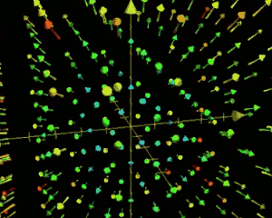


<h2 id="e4ba47693cf74a797e63f4557d4b88f4"></h2>

## Transformations

```bash
         |3cos(t)+cos(t)cos(s)|
f(t,s) = |3sin(t)+sin(t)cos(s)|
         |        sin(s)      |
```

- 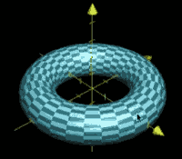


How you might think of this **torus**  as a transformation ?

First let me just get straight what the input space here is.  You could think the input space as the entire t-s plance.

- 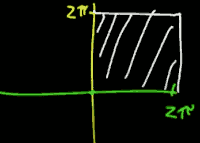 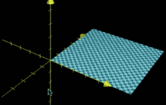

So what we can do is think about this portion of t-s plane as living inside 3-D space as a sort of cheating...


- 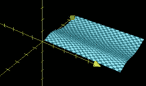 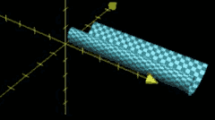 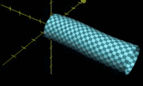 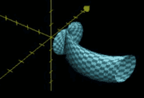  

The general idea of starting with a square and somehow warping that  is acutally a pretty powerful thought. 

And as we get into multi variable calculus and you start thinking a little more deeply about surfaces, I think it really helps if you think about a slight little movement on your input space, what happens to that tiny little movement, or that tiny little traversal, what it looks like if you do that same movement somewhere on the output space.


<h2 id="0528ae3ac84335726cdb869c37f074b5"></h2>

## Partial derivatives

```
f(x,y) = x²y + sin(y)
```

∂f/∂x 

∂f/∂y

why do we call these partical derivatives? It's sort of like, this doesn't tell the full story of how F changes cause it only cares about the x/y direction.

To compute the partical derivative, just pretend another variable is constant, and you take ordinary derivative.

- 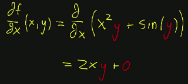
- 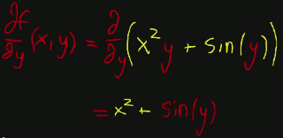

You're thinking this is because you're just moving in one direction for the input and you're seeing how that influences things.

- 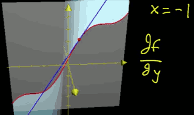


<h2 id="720490b1bfd5d1d881f484a660c17cbe"></h2>

## Formal definition of partial derivatives

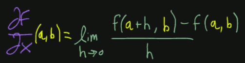 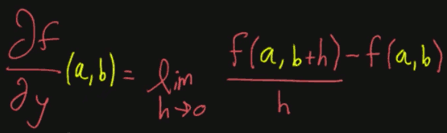


<h2 id="a32eb790ef82890d3d0f9fa9b2baa39b"></h2>

## Symmetry of second partial derivatives

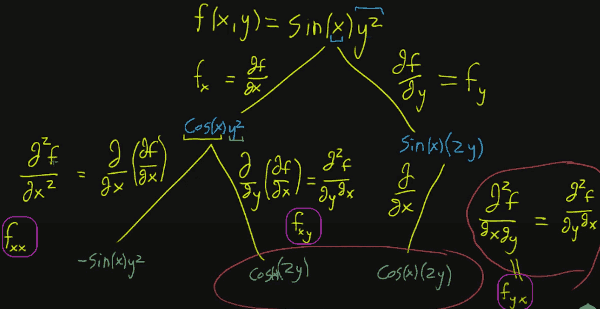

> notice the x,y order in 2 different notations for second partial derivatives.

That is a pretty cool result.   What's surprising is that  this turns out to be true under certain criterion , **not all functions**. There's a special theorem called **Schwarz's theorem**, where if the second partial derivatives of your function are continuous at the relevant point, that's the circumstance for this being true. But for all intents and purposes, the kind of functions you can expect to run into , this is the case.  **The order of partial derivatives doesn't matter.**


<h2 id="5e59525cb7d1d1cd93be0b9f36e9d09a"></h2>

## Gradient

> The gradient captures all the partial derivative information of a scalar-valued multivariable function.

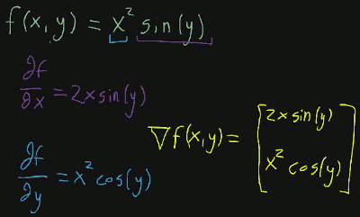

This is a vector-valued function.   More general...

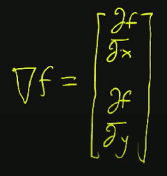

I like to think about the gradient as the **full** derivative cuz it kind of captures all of the information that you need.

A very helpful mnemonic advice with the gradient is to think about this nabla ∇ as being a vector full of partial derivative operators.


The gradient can be thought of as pointing in the "**direction of steepest ascent**".  This is a rather important interpretation for the gradient.

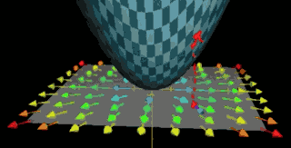

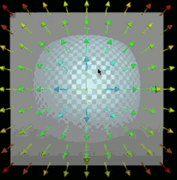


<h2 id="5b6aea879e0205053b5c2ead9de77092"></h2>

## Directional derivative

Directional derivatives tell you how a multivariable function changes as you move along some vector in its input space.  That is, what does a nudge in that vector's direction do to the function itself? 

But you're not really thinking of the actuall vector, but you'be be thinking of taking a very very small step along it , maybe h·v.

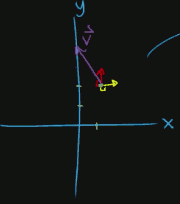

So, the directional derivative is saying,  when you take a slight nudge in the direction of that vector, what is the resulting change to the output.

- 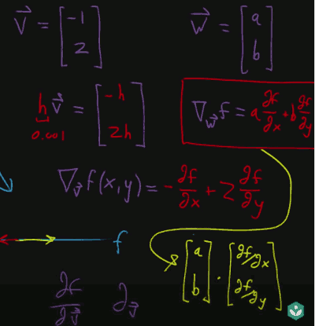
- The right bottom term is just w·∇f.


Formal definition:

- 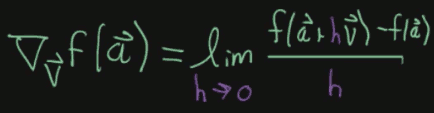


<h2 id="b4e20dd468bf9adb89509b770119bd85"></h2>

## Why the gradient is the direction of steepest ascent

```bash
f(x,y) = x² + y²
```

If you have a given point somewhere in the input x-y plane, the question is, of all the possible directions that you can move away from this point, which one of them results in the greastes increase to your function ?

- 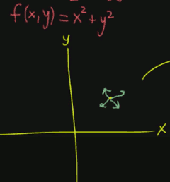

Why does the gradient, the combination of partial derivatives, has anything to do with choosing the best direction ?

- 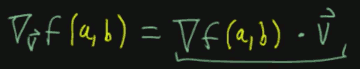

When ∇f(a,b) has the same direction as v , dot product has the greatest value.


<h2 id="9201e0fe2c81168aca84873317f7d525"></h2>

## Gradient and contour maps

Question:  of all of the vectors that move from this output of 2 , up to the value of 2.1 , which one dest it the fastest ?


- 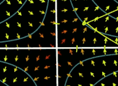 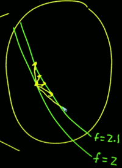

Which one does it with the shortest distance ? It's gonna be the one that connects them pretty much perpendicular to the original line. Because if you think about these as lines, and the more you zoom in, the more the pretty much look like parallel lines, the path that connects one to the other is gonna be perpendicular to both of them.

Keep it in the back of you mind: **Gradient is always perpendicular to contour lines**.


<h2 id="c6b56a77a991e01195baa8b3a6c425a1"></h2>

## Multivariable chain rule

- Here are 3 functions
    1. `f(x,y) = x²y`   (in yellow)
    2. `x(t) = cos(t)`  (in blue)
    3. `y(t) = sin(t)`
- What I want to do is start thinking about the composition of them.
    - `f( x(t), y(t) )`   (in green)
    - So the image that you might have in your head for something like this
        - *t* is just living on a number line
        - *x,y* is just the plane
        - and the out put *f*
    - for this whole composition of functions, you're thinking of xₜ,yₜ as taking a single point in t, and kind of moving it over to 2D space somewhere, and then from there, our multivariable function takes that back down.
        - 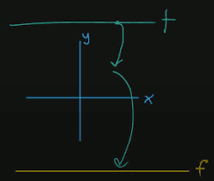
    - And what I want to know is what's the derivative of this function df/dt. It's just an ordinary derivative, not a partial derivative, because this is just a single variable function.
        - How do you take this dirivative ? And there's a special rule for this, it's called the multivariable chain rule. But **you don't actually need it**.
        - d/dt f(cos²(t)sin(t) ) = cos²(t)cos(t) + sin(t)( 2(cos(t))(-sint(t)) )
    - We can also solve it by using partial derivative.
        - ∂f/∂x = 2xy
        - ∂f/∂y = x²
        - dx/dt = -sin(t)
        - dy/dt = cos(t)
    - **multivariable chain rule**
        - 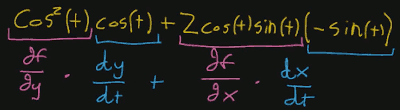
        - 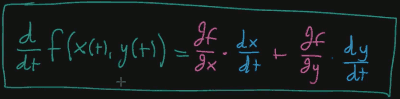


<h2 id="3c1eaf19d0cdbb7207ae3fee0af4defd"></h2>

## Vector form of the multivariable chain rule

Instead of writing x(t), y(t) as separate functions, it's better and a little bit cleaner if we say there's a vector valued function , that takes in a single number *t*, and then it outputs some kind of vector.

```python
v(t) =  ⎡x(t)⎤
        ⎢    ⎥
        ⎣y(t)⎦
```

```octave
dv/dt = ⎡d       ⎤
        ⎢──(x(t))⎥
        ⎢dt      ⎥
        ⎢        ⎥
        ⎢d       ⎥
        ⎢──(y(t))⎥
        ⎣dt      ⎦
```


- 

And now you might start to notice something here. You may recognize the right part as a dot product.

- 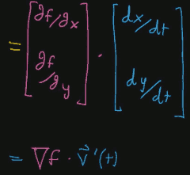

The left one is the gradient of f, ∇f. And the right vector is just the derivative of v, v'(t).

And it's another way to write the multi-variable chain rule.

And if you were being a little bit more exact you would emphasize that when you take the gradient of f , the thing that you input into it is the output of that vector valued function, and then you dot-product it by the derivative of v, v'(t).

```octave
∇f( v(t) )·v'(t)
```


<h2 id="4291d8b552cce8e49e10e7162e73e79a"></h2>

## Multivariable chain rule and directional derivatives


