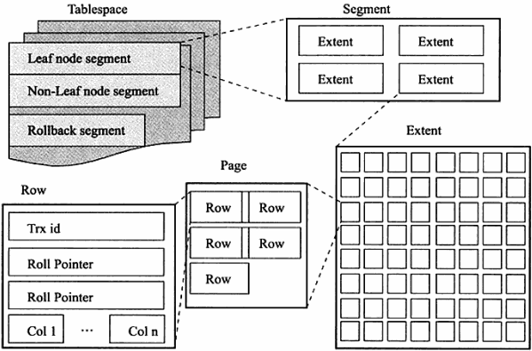
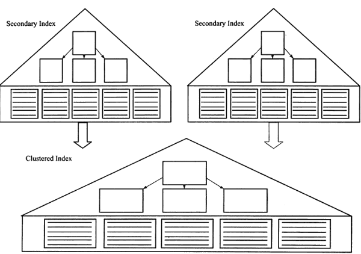

...menustart

- [Mysql](#9edb3c572b56b91542af659480518681)
- [Misc](#74248c725e00bf9fe04df4e35b249a19)
    - [Mysql 并发更新数据 加锁处理](#f12a4c82c151d110c6ea3521e6aca5b2)
        - [SELECT显式加锁](#18a31fbbef71484ce0cc52995764a78b)
        - [使用乐观锁](#4e7e4e0d4b9110317f8e672b2aa3af35)
    - [mysql 慢日志查询](#1838954ac65225f29f4cccf9131bb24f)
    - [mysql 操作记录查询](#e1a8175ef9a04770289a68720bff0ffc)
    - [mysql 记录 未使用 index的查询](#06380fb607958af6dbecb617ce31f2cd)
    - [how to check whether mysql reuse the connection](#005022c3c2f0c952bbd1532235bc4959)
    - [`select count(*)` is very slow on large table](#c4935fa15c0a1305da238eec81cc54b3)
    - [`select ... limit offset , n ` is slow when offset  is higher](#5c7924ade1a946ba9a0af0cc562c127b)
    - [use default value if select get no result](#7b83de8606257483382081d2e0e808de)
    - [Sub query example](#60df3279b8377ba6468528ab017f1dc0)
    - [CASE ... WHEN ... ELSE...](#06eb0ebfd08b098bd2c0529968e05930)
    - [restore database from dump file](#c4606a5312075cb8424b31a364e46848)
    - [Create a `new_user` and Grant all privileges on db `db_test`](#c3b5d31eac469e51b08ec13a8edc866e)
    - [Convert a timestamp to seconds(GMT)](#551a3f8ce4409963ec6de228ccc44ae0)
    - [三元表达式](#6ada22780ed552c34465864a2648f7e9)
- [第1章  MySQL 体系结构和存储引擎](#6a1a36d328d46ab67d6d4af4b7f9191a)
    - [1.1 配置文件](#bdf6b309174103a16017dcf95cfd0efa)
    - [1.3 MySQL 存储引擎](#d515f90f3281ec25eef39dd7a232630f)
        - [1.3.1 InnoDB 存储引擎](#76926ae879779c10f256fc887a33535f)
        - [1.3.2 MyISAM 引擎](#10a207a8a92177201fd0def5891f18e9)
        - [1.3.3 NDB 存储引擎](#13e3e5ed01041f818331a97deac86214)
        - [1.3.4 Memory 存储引擎](#ceecb928aa5951705b07ffc49c0629a0)
    - [1.5 连接MySQL](#cfaac8a9eeb58e270ad461cce3df9f7c)
- [第二章 InnoDB](#8e788bda205182e80990dfed0bcff02c)
    - [2.3 内存](#1b37f1c1fb3c3bb49c18e5a43cb06b88)
    - [2.6 InnoDB 关键特性](#936e0201b58bac57bbd7cb232e03ac3f)
        - [2.6.1 Insert Buffer](#9a97b564b52c773dea3833c68f88e637)
        - [2.6.2 double write](#c06cff525dbcc52aa3c38fd593f25bea)
        - [2.6.3 自适应哈希索引](#3cc3790f5764ac4baf663e97952dca7e)
- [第4章 表](#3fde40ff068923f2387b0495ade6ebc5)
    - [4.1 索引组织表](#59fd6ac7a6b8d7528f201084c941fdad)
    - [4.2 InnoDB 逻辑存储结构](#b2dcd46c558626075638ee6046ffbc5c)
        - [4.2.1 tablespace](#01ead1b0328abc6654e3d8392861dd35)
        - [4.2.2 段](#17df3eac98b9ebf9202238890b2e299f)
        - [4.2.3  区 extent](#6efb7cc1797fdc081d0764eb9202354d)
        - [4.2.4 页](#723fc535fa63fbc37e7424dc8ddff5e4)
    - [4.3 行记录格式](#e8c588431c34af99054450ed068ea5b6)
        - [4.3.1 Compact 行记录格式](#ab615bc108657e6e7a4b50da37748198)
        - [4.3.3 行溢出数据](#b32e3a32fb403a3b601076c6c021b8f1)
        - [4.3.5 CHAR 的行结构存储](#2be315f4f2b6d8c07bf84451ce7b8de4)
    - [4.6 约束](#811b998743c3d56e56df88c10ce5f10c)
        - [4.6.1 数据完整性](#22aea1f7185c635d337b46427a68c9a9)
        - [4.6.5 ENUM 和 SET 约束](#ca4e41470c6372bd027bae84d09a44ac)
        - [4.6.6 触发器与约束](#81ffa61b53284efa0ff8c04493881144)
        - [4.6.7 外键约束](#f6aca2bdb6c4002d9913f98a1d7a8eff)
    - [4.7 视图](#eed7c7688f8494931b0ac89e272809e2)
        - [4.7.1 视图的作用](#f243820912ed96f134fe1034566f094e)
        - [4.7.2 物化视图 TODO](#0ebf2d0bb89a07bfe061ba4ecc19e6eb)
    - [4.8 分区表  TODO](#2f2671e6576b631310c056c69c2e0423)
        - [4.8.1 分区概述](#289a680a7bf25ae091c0dda18609711e)
- [第5章  索引与算法](#50c3944fafe0b2e03f7470915079140f)
    - [5.1 InnoDB 索引概述](#983b8b0c99814194a4a7b07618e9f276)
    - [5.4 B+树索引](#bd45bf972a14cfd7ae0d32a3d3334156)
        - [5.4.1 聚集索引](#5c614374adfe5f122c8a2155d87d4d77)
        - [5.4.2 辅助索引](#81ab38c3f24b5753bbe756d6dc1ebafd)
    - [5.5 Cardinality 值](#26cdd6c55db26574560353191beb9640)
    - [5.6 B+树索引的使用](#a3f3f22ce2ecd49e0899aa0470bb4188)
        - [5.6.1 不同应用中的 B+树索引](#cc473a5ef59e8cf3e28bc6618a4db748)
        - [5.6.2 联合索引](#121f3825a3bc99fa74e52a95c6fcb3fa)

...menuend


<h2 id="9edb3c572b56b91542af659480518681"></h2>


# Mysql

<h2 id="74248c725e00bf9fe04df4e35b249a19"></h2>


# Misc

<h2 id="f12a4c82c151d110c6ea3521e6aca5b2"></h2>


## Mysql 并发更新数据 加锁处理

- MySQL是支持给数据行加锁（InnoDB）的，并且在UPDATE/DELETE等操作时确实会自动加上排它锁
- 只是并非只要有UPDATE关键字就会全程加锁 , 如

```
UPDATE table1 SET num = num + 1 WHERE id=1;
```

这句 其实并不只是一条UPDATE语句 ，而应该类似于两条SQL语句（伪代码）：

```
a = SELECT * FROM table1 WHERE id=1；
UPDATE table1 SET num = a.num + 1 WHERE id=1;
```

- 其中执行SELECT语句时没有加锁，只有在执行UPDATE时才进行加锁的。
- 会出现并发操作时的更新数据不一致。
- 解决的方法可以有2种：
    - 1 通过事务显式的对SELECT进行加锁
    - 2 使用乐观锁机制


<h2 id="18a31fbbef71484ce0cc52995764a78b"></h2>


### SELECT显式加锁

- 对SELECT进行加锁的方式有两种，如下：

```
SELECT ... LOCK IN SHARE MODE       #共享锁，其它事务可读，不可更新
SELECT ... FOR UPDATE       #排它锁，其它事务不可读写
```

- 对于上面提到的场景，必须使用排它锁.
- 上面的2种语句只有在事务之中才能生效，否则不会生效。 在MySQL命令行使用事务的方式如下：

```
SET AUTOCOMMIT=0;
BEGIN WORK;
    a = SELECT num FROM table1 WHERE id=2 FOR UPDATE;
    UPDATE table1 SET num = a.num + 1 WHERE id=2;
COMMIT WORK;
```

- 这样只要以后更新数据时，都使用这样事务来进行操作；那么在并发的情况下，后执行的事务就会被堵塞，直到当前事务执行完成。（通过锁把并发改成了顺序执行）


<h2 id="4e7e4e0d4b9110317f8e672b2aa3af35"></h2>


### 使用乐观锁

- 乐观锁是锁实现的一种机制，它总是会天真的认为所有需要修改的数据都不会冲突。
- 所以在更新之前它不会给数据加锁，而只是查询了数据行的版本号（这里的版本号属于自定义的字段，需要在业务表的基础上额外增加一个字段，每当更新一次就会自增或者更新）。
- 在具体更新数据的时候更新条件中会添加版本号信息，当版本号没有变化的时候说明该数据行未被更新过，并且也满足更新条件，所以会更新成功。
- 当版本号有变化的时候，则无法更新数据行，因为条件不满足，此时就需要在进行一次SQL操作。（重新查询记数据行，再次使用新的版本号更新数据）

原则上，这2种方式都可以支持。具体使用哪一种就看实际的业务场景，对哪种支持更好，并且对性能的影响最小。


---

[深入理解SELECT ... LOCK IN SHARE MODE和SELECT ... FOR UPDATE](https://blog.csdn.net/cug_jiang126com/article/details/50544728)

<h2 id="1838954ac65225f29f4cccf9131bb24f"></h2>


## mysql 慢日志查询

```
set global slow_query_log='ON';
set global long_query_time=1;

show variables like 'slow_query%';
show variables like 'long_query_time';
```
- Now check the slow logs at `mysql.slow_log`

<h2 id="e1a8175ef9a04770289a68720bff0ffc"></h2>


## mysql 操作记录查询

```
SET GLOBAL general_log = 'ON'
SET GLOBAL log_output = 'TABLE'

show variables like '%general%';
```


- Now you can find the mysql operation log in `mysql.general_log` table


<h2 id="06380fb607958af6dbecb617ce31f2cd"></h2>


## mysql 记录 未使用 index的查询

```
set global log_queries_not_using_indexes=ON;
```

- those queries will appears in slow_log

<h2 id="005022c3c2f0c952bbd1532235bc4959"></h2>


## how to check whether mysql reuse the connection

- in `mysql.general_log` ,  if the connection is reused, you should see the `connection` event only at the very beginning


<h2 id="c4935fa15c0a1305da238eec81cc54b3"></h2>


## `select count(*)` is very slow on large table

- Here's a cheap way to get an estimated row count:

```
> select TABLE_ROWS FROM INFORMATION_SCHEMA.TABLES where TABLE_SCHEMA='your_db_name' and TABLE_NAME='your_table_name';
+------------+
| TABLE_ROWS |
+------------+
|      57889 |
+------------+
1 rows in set (0.00 sec)
``` 

<h2 id="5c7924ade1a946ba9a0af0cc562c127b"></h2>


## `select ... limit offset , n ` is slow when offset  is higher

- `limit offset ,n ` -> `where id > offset limit n` 
- Note:
    - `id` is the auto incr primary key , and should be continous (that is , you should NOT delete the rows )


<h2 id="7b83de8606257483382081d2e0e808de"></h2>


## use default value if select get no result

COALESCE returns 1st non-NULL value

```
select COALESCE(AVG(distance), 0) as baseline from records where uuid=?
```

<h2 id="60df3279b8377ba6468528ab017f1dc0"></h2>


## Sub query example

```mysql
select COALESCE( sum(orderAmount), 0 )  from payment_vivosdk   
where 
    uuid="test-User-0" and 
    paidtime >= ( select COALESCE( AVG(startTime), -1) from tbl_rechargeAcc where activity_kind = 2 and endTime > 969393337  ) and 
    paidtime <= ( select COALESCE( AVG(deadline),  -1) from tbl_rechargeAcc where activity_kind = 2 and endTime > 969393337  ) 
```

<h2 id="06eb0ebfd08b098bd2c0529968e05930"></h2>


## CASE ... WHEN ... ELSE...

```mysql
    WHERE m.p1 = ? OR m.p2 = ?  ORDER by   CASE 
        when (m.p1=?) and ((withdraw&1)<>0) then match_id - 10000000
        when (m.p2=?) and ((withdraw&2)<>0) then match_id - 10000000
        ELSE  match_id END   DESC LIMIT 20
```


<h2 id="c4606a5312075cb8424b31a364e46848"></h2>


## restore database from dump file

```
mysql -uroot -ppwd  < dumpfile
```


<h2 id="c3b5d31eac469e51b08ec13a8edc866e"></h2>


## Create a `new_user` and Grant all privileges on db `db_test`

```mysql
CREATE USER 'new_user'@'%' IDENTIFIED BY 'new_user_pwd';
GRANT ALL PRIVILEGES  ON db_test.* TO 'new_user'@'%' WITH GRANT OPTION;
```

<h2 id="551a3f8ce4409963ec6de228ccc44ae0"></h2>


## Convert a timestamp to seconds(GMT)

不同时区的数据库，存放的date 受时区影响, UNIX_TIMESTAMP方法不是我们想要的...

```mysql
SELECT TIMESTAMPDIFF( SECOND, "1970-01-01 00:00:00" , "2020-05-01 12:05:55" );
```

<h2 id="6ada22780ed552c34465864a2648f7e9"></h2>


## 三元表达式

```mysql
... status=if(status="created","paid",status)
```

--- 

<MySQL技术内幕(InnoDB存储引擎)第2版>


<h2 id="6a1a36d328d46ab67d6d4af4b7f9191a"></h2>


# 第1章  MySQL 体系结构和存储引擎

<h2 id="bdf6b309174103a16017dcf95cfd0efa"></h2>


## 1.1 配置文件

- MySQL 可以没有配置文件，这种情况下， MySQL 会按照编译时的默认参数设置 启动实例
- 用以下命令可以查看当 MySQL 数据库实例启动时， 会在哪些位置查找配置文件

```
# mysql --help | grep cnf
                      order of preference, my.cnf, $MYSQL_TCP_PORT,
/etc/my.cnf /etc/mysql/my.cnf ~/.my.cnf
```

- 可以看到， MySQL 是按 `/etc/my.cnf -> /etc/mysql/my.cnf -> ~/.my.cnf`  顺序读取配置文件的.
- 如果几个配置文件中 都有同一个参数， 以最后一个读到的参数为准 


<h2 id="d515f90f3281ec25eef39dd7a232630f"></h2>


## 1.3 MySQL 存储引擎

<h2 id="76926ae879779c10f256fc887a33535f"></h2>


### 1.3.1 InnoDB 存储引擎
 
- 默认引擎, 支持事务， 行锁设计，支持外键
- 4.1开始， 每个InnoDB的表 单独放到一个独立的 idb文件中
- 每张表 按 主键的顺序进行存放， 如果没有显示指定主键， InnoDB 会为每一行 生成一个6字节的 ROWID


<h2 id="10a207a8a92177201fd0def5891f18e9"></h2>


### 1.3.2 MyISAM 引擎

- 不支持事务，表锁设计，支持全文索引
- MyISAM 的缓冲池只 cache 索引文件，而不cache 数据文件


<h2 id="13e3e5ed01041f818331a97deac86214"></h2>


### 1.3.3 NDB 存储引擎

- 集群存储引擎 ， share nothing 的集群架构
- NDB的特点是 数据全部放入内存中， 因此主键查找速度极快
- JOIN操作是在数据库层完成的，而不是在存储引擎层完成的， 复杂的JOIN 操作需要巨大的网络开销，因此查询速度很慢.

<h2 id="ceecb928aa5951705b07ffc49c0629a0"></h2>


### 1.3.4 Memory 存储引擎

- 只支持表锁，性能较差， 并且不支持 TEXT和BLOB 类型
 

<h2 id="cfaac8a9eeb58e270ad461cce3df9f7c"></h2>


## 1.5 连接MySQL
 
- TCP/IP
- UNIX 域套接字
    - Linux环境下， 可以使用 UNIX域套接字
    - UNIX域套接字 其实不是一个网络协议， 所以只能在 MySQL客户端和数据库实例 在一台服务器上的情况下使用


<h2 id="8e788bda205182e80990dfed0bcff02c"></h2>


# 第二章 InnoDB 

<h2 id="1b37f1c1fb3c3bb49c18e5a43cb06b88"></h2>


## 2.3 内存

- 1 缓冲池
    - InnoDB 是基于磁盘存储的，并将其中的记录按照 页的方式进行管理。 Disk-base Database. 基于磁盘的数据库系统，通常使用缓冲池技术来提高数据库的整体性能
    - 配置参数:  innodb_buffer_pool_size 
    - 还可以配置多个缓冲池的实例，  每个页根据哈希值平局分配到 不同缓冲池实例中， 好处是减少数据库内部的资源竞争， 增加数据库的并发处理能力。
    - 配置参数:  innodb_buffer_pool_instances
- 2 LRU List, Free List 和 Flush List
    - 缓冲池 里存放各种类型的页， 通过 LRU 算法进行管理。
    - Free List 空闲页
    - LRU列表中的页被修改后， 称为 dirty page, 即缓冲池中的页和磁盘上的页的数据产生了不一致，  Flush List 包含了这些 dirty page.
- 3 redo log buffer


<h2 id="936e0201b58bac57bbd7cb232e03ac3f"></h2>


## 2.6 InnoDB 关键特性

- insert buffer
- double write
- Adaptive Hash Index 自适应哈希索引
- Async IO
- Flush Neighbor Page 刷新邻接页

<h2 id="9a97b564b52c773dea3833c68f88e637"></h2>


### 2.6.1 Insert Buffer

- Insert Buffer 和数据页一样，也是物理页的一部分
- InnoDB中， 主键是行唯一的标识符。 
    - 通常 应用程序中 行记录的插入顺序是按照主键递增的顺序进行插入的。 因此不需要磁盘的随机读取。 这类情况下的插入操作，速度是非常快的。
    - 但是 并不是所有的主键插入都是顺序的。 若主键 是UUID 这样的类，那么插入和 辅助索引一样， 同样是随机的。
- InnoDB 开创性的设计了 Insert Buffer, 对于非聚集索引的插入或更新操作， 不是每一次直接插入到索引页中， 而是先判断插入的非聚集索引页 是否在缓冲池中， 若在直接插入，若不在， 则先放入到一个 Insert buffer 对象中。
    - 然后再以一定频率和情况进行 Insert Buffer 和 辅助索引页字节点的 merge 操作， 将多个插入合并到一个操作中(因为在一个索引页中)， 提高性能.
- Insert Buffer 的使用需要同时满足以下两个条件
    - 索引是辅助索引 secondary index
    - 索引不是唯一的 unique 
- 1.0.x版本开始引入 Change buffer ， 是 Insert buffer 的升级， 可以对 INSERT, DELETE, UPDATE 都进行缓冲


<h2 id="c06cff525dbcc52aa3c38fd593f25bea"></h2>


### 2.6.2 double write
 
- 提高数据页的可靠性


<h2 id="3cc3790f5764ac4baf663e97952dca7e"></h2>


### 2.6.3 自适应哈希索引

- InnoDB 会监控对 表上各索引页的查询。
    - 如果观察到 建立hash索引 可以带来速度提升， 则建立hash 索引，称之为 自适应哈希索引 AHI
- AHI 有一个要求，即对这个页的连续访问模式必须一样


<h2 id="3fde40ff068923f2387b0495ade6ebc5"></h2>


# 第4章 表

<h2 id="59fd6ac7a6b8d7528f201084c941fdad"></h2>


## 4.1 索引组织表

- InnoDB中， 表都是根据主键顺序组织存放的， 这种存储方式的表  称为  索引组织表 (index organized table)
- 每张表 都有个主键， 如果创建表是没有显示定义主键， 则 InnoDB 会按如下方式选择或创建主键
    - 首先判断表中是否有非空的唯一索引 (unique NOT NULL) , 如果有，该列即为主键
        - 如有多个 非空唯一索引， 则 选择第一个unique 定义 作为主键
    - 否则， InnoDB会 自动创建一个 6字节大小的指针。


<h2 id="b2dcd46c558626075638ee6046ffbc5c"></h2>


## 4.2 InnoDB 逻辑存储结构

- 从 InnoDB 的逻辑存储结构看， 所有数据都被 逻辑地存放在一个空间中， 称为表空降 tablespace
- 表空间 又由 段 segment, 区 extent , 页 page  组成.





<h2 id="01ead1b0328abc6654e3d8392861dd35"></h2>


### 4.2.1 tablespace

- 默认情况下， InnoDB 有一个共享表空间 ibdata1 , 所有数据都存放在 这个表空间内
- 如果用户开启了  innodb_file_per_table, 则 每张表的数据 可以单独放到一个表空间内

<h2 id="17df3eac98b9ebf9202238890b2e299f"></h2>


### 4.2.2 段

- tablespace 是由各个段组成的， 常见的有 数据段， 索引段， 回滚段等

<h2 id="6efb7cc1797fdc081d0764eb9202354d"></h2>


### 4.2.3  区 extent

- 区有连续的页组成，在任何情况下，每个区的大小都为 1M
- 为了保证 区中页的连续性， InnoDB 一次从磁盘申请 4-5个区。 
- 默认情况下， page 大小为 16k， 即一个区 一共有64个连续的page
 
<h2 id="723fc535fa63fbc37e7424dc8ddff5e4"></h2>


### 4.2.4 页

- 常见的page类型有
    - 数据页 B-tree node
    - undo页  undo log page
    - 系统页  system page
    - 事务数据页   transaction system page
    - 插入缓冲位图页  insert buffer bitmap
    - 插入缓冲空闲列表页   insert buffer free list
    - 为压缩的二进制大对象页 uncompressed BLOB page
    - compressed BLOB page 


<h2 id="e8c588431c34af99054450ed068ea5b6"></h2>


## 4.3 行记录格式

<h2 id="ab615bc108657e6e7a4b50da37748198"></h2>


### 4.3.1 Compact 行记录格式

- Mysql5.1 后默认格式
- 设计目的是高效的存储数据。 简单来说，一个页中存放的行数据越多， 其性能就越高。
- Compact 存储方式

```
变长字段长度列表 | NULL标志位 | 记录头信息 | 列1数据 | 列2数据 | ... 
```

- 变长字段长度列表: 各个VCHAR 字段实际长度， 逆序排列
- NULL标志位， 指示了该行数据中是否有NULL值
- 每行数据除了用户定义的列 外， 还有两个隐藏列 ： 事务ID列 和 回滚指针列， 分别为 6个字节和7个字节。
    - 如果表没有定义主键，每行还会增加一个6字节的rowid 列


<h2 id="b32e3a32fb403a3b601076c6c021b8f1"></h2>


### 4.3.3 行溢出数据

- InnoDB 可以将 一条记录中的某些数据 存储在 真正的数据页面之外。 
- VARCHAR
    - 表的 VARCHAR 的长度 **总和** 有 65535的限制


<h2 id="2be315f4f2b6d8c07bf84451ce7b8de4"></h2>


### 4.3.5 CHAR 的行结构存储

- 在 多字节字符集的情况下，CHAR 和 VARCHAR的实际存储基本是没有什么区别的


<h2 id="811b998743c3d56e56df88c10ce5f10c"></h2>


## 4.6 约束

<h2 id="22aea1f7185c635d337b46427a68c9a9"></h2>


### 4.6.1 数据完整性

- 关系数据库 本身能保证 存储数据的完整性，不需要应用程序的控制。
- 几乎所有的关系数据库 都提供了 constraint 机制， 该机制提供了一条强大而简易的途径来保证数据库中数据的完整性。
- 一般来说，数据完整行有以下3种形式:
    - 实体完整性 保证表中有一个主键
    - 域完整性 保证数据每列的值 满足特定的条件
        - 选择合适的数据类型确保一个数据值 满足特定条件
        - foreign key 约束
        - 编写触发器
        - 还可以考虑用 DEFAULT 约束作为 强制域完整性的一个方面
    - 参照完整性  保证两张表之间的关系。
        - 定义foreign key 强制参照完整性， 也可以通过编写触发器强制执行
        - InnoDB 本身也提供了 以下几种约束
            - Primary Key
            - Unique Key
            - Foreign Key
            - Default
            - NOT NULL


<h2 id="ca4e41470c6372bd027bae84d09a44ac"></h2>


### 4.6.5 ENUM 和 SET 约束

- MySQL 不支持传统的 CHECK约束， 但是通过 ENUM 和 SET 类型，可以解决部分这样的约束需求
- 例如 表上有一个 性别类型， 规定域的范围 只能是 male 或 female,  这种情况下用户可以通过 ENUM 类型来进行约束.

```
mysql> CREATE TABLE a (
    -> id INT,
    -> sex ENUM('male','female'));
Query OK, 0 rows affected (0.02 sec)

mysql> INSERT INTO a
    -> SELECT 1, 'female';
Query OK, 1 row affected (0.00 sec)
Records: 1  Duplicates: 0  Warnings: 0

mysql> INSERT INTO a
    -> SELECT 2, 'bi'; 
ERROR 1265 (01000): Data truncated for column 'sex' at row 1
```

- 这个约束仅限于 离散数值的约束， 对于 连续值的范围约束 ENUM/SET 还是无能为力。 用户需要通过触发器来实现对于 值域的约束。


<h2 id="81ffa61b53284efa0ff8c04493881144"></h2>


### 4.6.6 触发器与约束

- 触发器的作用是在执行 INSERT, DELETE, UPDATE 命令之前 或之后 自动调用 SQL命令或存储过程。
- 创建触发器的命令是 `CREATE TRIGGER` 

```
CREATE 
[DEFINER = { user | CURRENT_USER } ]
TRIGGER trigger_name BEFORE|AFTER  INSERT|UPDATE|DELETE
ON tbl_name FOR EACH ROW trigger_stmt
```

- 最后可以为一个表建立6个触发器  BEFORE|AFTER x INSERT|UPDATE|DELETE = 6
- 例如有张用户消费表， 每次用户购买的一样物品后其金额都是减的，若这是有 不怀好意的 用户做了类似 减去一个 负值 的操作，用户的钱没减少 反而增加了。
- 从业务逻辑上来说， 这肯定是错误的， 消费总是意味着 减去一个正值。
- 所以这时需要通过触发器来约束这个逻辑


<h2 id="f6aca2bdb6c4002d9913f98a1d7a8eff"></h2>


### 4.6.7 外键约束

- 一般来说， 称被引用的表 为 父表， 引用的表称为 子表

```
mysql> CREATE TABLE parent (
    -> id INT NOT NULL,
    -> PRIMARY KEY (id));
Query OK, 0 rows affected (0.02 sec)

mysql> CREATE TABLE child (
    -> id INT ,
    -> parent_id INT ,
    -> FOREIGN KEY (parent_id) REFERENCES parent(id) );
Query OK, 0 rows affected (0.02 sec)
```

- 外键定义时的 ON DELETE 和 ON UPDATE 表示对父表进行 DELETE/UPDATE 操作时，对子表所做的操作
- 可定义的字表操作有：
    - CASCADE
        - 表示 相应的子表中的数据也进行 DELETE/UPDATE
    - SET NULL
        - 相应的子表数据被 更新为NULL， 但该项必须允许为 NULL
    - NO ACTION
        - 抛出错误，不允许这类操作发生
    - RESTRICT 
        - 抛出错误，不允许这类操作发生
        - 没有指定 ON DELETE 和 ON UPDATE 的 默认外键设置
- InnoDB 在外键建立时，会自动对该列加一个索引。


<h2 id="eed7c7688f8494931b0ac89e272809e2"></h2>


## 4.7 视图

- 视图 View 是一个命名的虚表， 它由一个SQL 查询来定义， 可以当作表使用。 视图中的数据 没有实际的物理存储

<h2 id="f243820912ed96f134fe1034566f094e"></h2>


### 4.7.1 视图的作用

- 视图在数据库中发挥着重要的作用
- 视图的主要用途之一 是被用作 一个抽象装置， 特别是对于一些应用程序， 程序本身不需要关心 base table的结构，只需要按照视图定义来取数据或更新数据，因此，数据同时在一定程度上 起到一个安全层的作用。
- 视图是 基于基表的一个虚拟表， 但是用户可以对某些视图进行更新操作，其本质就是通过视图的定义来 更新base table.
    - 一般称 可以进行更新操作的视图 为 updatable view. 
    - 视图中定义的 WITH CHECK OPTION 就是针对与 updatable view, 即 更新的值是否需要检查.

```
mysql> CREATE TABLE t ( id INT );
Query OK, 0 rows affected (0.02 sec)

mysql> CREATE VIEW v_t
    -> AS
    -> SELECT * FROM t WHERE id<10;
Query OK, 0 rows affected (0.01 sec)

mysql> INSERT INTO v_t SELECT 20;
Query OK, 1 row affected (0.03 sec)
Records: 1  Duplicates: 0  Warnings: 0

mysql> SELECT * from v_t;
Empty set (0.00 sec)
```

- 上面的例子中，插入没有报错， 但是用户查询视图还是没能查到数据。  
    - 这是因为 20 已经成功插入到了 base table， 但却不满足 v_t 的条件  
    - 可以加上 WITH CHECK OPTION 选项禁止这类行为:

```
mysql> ALTER VIEW v_t
    -> AS
    -> SELECT * FROM t WHERE id<10
    -> WITH CHECK OPTION;
Query OK, 0 rows affected (0.01 sec)

mysql> INSERT INTO v_t SELECT 20;
ERROR 1369 (HY000): CHECK OPTION failed 'testDB.v_t'

mysql> INSERT INTO v_t SELECT 1;
Query OK, 1 row affected (0.01 sec)
Records: 1  Duplicates: 0  Warnings: 0

mysql> SELECT * from v_t;
+------+
| id   |
+------+
|    1 |
+------+
1 row in set (0.00 sec)

```

- 可以看到，大于20报错了


<h2 id="0ebf2d0bb89a07bfe061ba4ecc19e6eb"></h2>


### 4.7.2 物化视图 TODO

- Oracle 支持物化视图 -- 不是虚表，而是根据base table 实际存在的实表， 即 物化视图总是存储在非易失的存储设备上
- 物化视图 可以用于预先计算并保存多表的连接 JOIN 或 聚集 GROUP BY 等耗时较多的SQL操作结果。 这样 在执行复杂查询时， 就可以避免进行这些耗时的操作。

- MySQL 本身并不支持物化视图， MySQL的视图总是虚拟的。
- TODO

---

<h2 id="2f2671e6576b631310c056c69c2e0423"></h2>


## 4.8 分区表  TODO

<h2 id="289a680a7bf25ae091c0dda18609711e"></h2>


### 4.8.1 分区概述

- 分区的过程 是将一个表 或 索引 分解为 多个更小，更可管理的部分。
- 就访问数据库的应用而言， 从逻辑上将， 只有一个表 或一个索引， 但是在物理上 这个表或索引可能由数十个物理分区组成。
    - 每个分区是独立的对象， 可以独自处理，也可以作为一个更大对象的一部分进行处理。
- MySQL 支持的分区类型为 水平分区 ， 将不同行的记录分配到 不同的物理文件中。
    - 此外MySQL的分区是局部分区， 一个分区中 既存放了数据 又存放了索引。
- 分区可能会给某些SQL语句性能带来提高， 但是分区 主要用于数据库的高可用性的管理。 对分区的使用应该非常小心， 乱用极有可能会对性能产生负面的影响
- TODO


---


<h2 id="50c3944fafe0b2e03f7470915079140f"></h2>


# 第5章  索引与算法

- 若索引太多，应用程序的性能可以会受到影响； 而索引太少，对查询性能又会产生影响。 要找到一个合适的平衡点， 这对应用程序的性能至关重要

<h2 id="983b8b0c99814194a4a7b07618e9f276"></h2>


## 5.1 InnoDB 索引概述

- InnoDB 常见索引
    - B+树索引
        - 传统意义上的索引
        - B+树索引 并不能找到 一个给定键值的具体行， 只能找到 数据行所在的页。 然后 通过把 页读如内存， 再在内存中进行查找结果。
    - 全文索引
    - 哈希索引
        - 自适应的， 不能人为干预是否在一张表中 生成哈希索引


<h2 id="bd45bf972a14cfd7ae0d32a3d3334156"></h2>


## 5.4 B+树索引

- B+树索引 在数据库中 有一个特点是高扇出性，因此在数据库中， B+树的高度一般都在 2-4层。
- 数据库中的 B+树索引 可以分为 聚集索引 clustered index 和 辅助索引 secondary index 
    - 不同的是 ， 叶子节点存放的 是否是一整行的信息。

<h2 id="5c614374adfe5f122c8a2155d87d4d77"></h2>


### 5.4.1 聚集索引

- clustered index  按照每张表的主键 构造一颗B+树， 同时叶子节点中 存放的即为 整张表的 行记录数据， 也将 clustered index 的叶子节点称为 数据页.
- 由于实际的数据页 只能按照一颗B+树进行排序， 因此每张表只能拥有一个 clustered index.
- clustered index的一个好处是， 它对主键的 排序查找 和 范围查找速度非常快。

<h2 id="81ab38c3f24b5753bbe756d6dc1ebafd"></h2>


### 5.4.2 辅助索引

- secondary index 也称 非聚集索引 
- 叶子节点 并不包含 行记录的全部数据。
- 叶子节点 除了包含 键值以外， 每个叶子几点的索引行中 还包含了一个 bookmark.
    - 这个 bookmark 用来告诉 InnoDB  哪里可以找到与索引相对应的行数据。



- 辅助索引的存在并不影响数据在 聚集索引中的组织， 因此每张表上可以有多个辅助索引。
- 当使用 secondary index 查找时，先要先遍历 辅助索引数，在遍历聚集索引数，来得到最终数据。 需要的IO次数是 两颗树的高度之和。


<h2 id="26cdd6c55db26574560353191beb9640"></h2>


## 5.5 Cardinality 值

- 并不是 在所有的查询条件中出现的列都需要添加索引。
- 一般的经验是，在访问表中 **很少一部分** 时使用B+树才有意义。 
    - 比如， 对于性别字段，地区字段， 类型字段， 它们可取值的范围很小，称为 低选择性。
    - `SELECT * FROM student WHERE sex='M'` 
    - 上面的查询， 得到的结果可能是 50%的数据， 这是添加 B+树索引是完全没有必要的。
- 相反，如果某个字段的取值范围很广， 几乎没有重复， 即属于 高选择性， 则此时使用B+树索引是最合适的。
    - 例如：姓名字段
- 怎么查看索引是否是高选择性的呢？
    - 可以通过 SHOW INDEX 结果中的列 `Cardinality` 来观察。
    - 在实际应用中， Cardinality/n_rows_in_table 应尽可能地接近1。
        - 如果比值非常小， 那么用户需要考虑是否还有必要创建这个索引。

<h2 id="a3f3f22ce2ecd49e0899aa0470bb4188"></h2>


## 5.6 B+树索引的使用

<h2 id="cc473a5ef59e8cf3e28bc6618a4db748"></h2>


### 5.6.1 不同应用中的 B+树索引

- 数据库中存在两种类型的应用
    - OLTP
        - 查询操作只从数据库中 取得一小部分数据，一般可能在10条以下， 甚至在很多时候 只取1条记录，这都是典型的OLTP应用。
        - 这种情况下，B+树索引才有意义。否则即使建立了索引， 优化器也可能选择不使用索引
    - OLAP
        - 情况有点复杂
        - 需要访问表中大量的数据, 根据这些数据来产生查询结果。如 这个月每个用户的消费情况， 销售额同比， 环比增长，等。
        - 因此在 OLAP 中索引的添加根据的应该是 宏观的信息，而不是微观。 
            - 例如 不需要在OLAP中对 姓名进行索引， 因为很少需要对单个用户进行查询。
        - 但是对于 OLAP中的复杂查询，要设计多张表之间的 JOIN操作， 索引的添加依然是有意义的。
            - 但是 如果连接操作使用的是 Hash Join， 那么索引可能又变得不是很重要了。

<h2 id="121f3825a3bc99fa74e52a95c6fcb3fa"></h2>


### 5.6.2 联合索引

- 对表上多个列进行索引
- 联合索引 (a,b) 其实是根据 a,b进行排序， 因此下列语句可以直接 使用联合索引得到结果：
    - `SELECT ... FROM TABLE WHERE a=xxx ORDER BY b`
- 然而对于 联合索引 (a,b,c) , 下列语句同样可以直接通过联合索引得到结果：
    - `SELECT ... FROM TABLE WHERE a=xxx ORDER BY b`
    - `SELECT ... FROM TABLE WHERE a=xxx AND b=xxx ORDER BY c`
- 但是对于下面的语句， 联合索引不能直接得到结果， 还需要执行一次 filesort 排序操作， 因为索引(a,c)并未排序
    - `SELECT ... FROM TABLE WHERE a=xxx ORDER BY c`


## 索引的正确打开方式

https://mp.weixin.qq.com/s/p7NTu1NpAgt9frOg-ivVIA

### 索引失效常见原因

联合索引(a,b,c)

1. 不满足最左前缀原则
    - `where a=x and b=y and c=z`   使用索引
        - where条件后的字段包含了联合索引的所有索引字段，并且顺序和 索引字段顺序 一直，效率最高
    - `where a=x`  使用索引 
        - 只用了 一个索引字段a
    - `where a=x b=y`  使用索引
        - 只用到 索引字段 a,b
    - `where a=x c=z`  使用索引
        - 索引字段出现断层, 只用到 索引字段 a
    - `where b=y`  不使用
    - `where c=z`  不使用
    - `where b=y c=z` 不使用
2. 范围索引列 没有放在最后
    - **注意：范围查询放最后，指的是联合索引中的范围列放在最后**
    - `where a=x and b>=y and c=z`  只用到a,b 两个索引
    - `where a=x and c=z and b>=y `  只用到a,b 两个索引
3. 使用了 `select *`
    - 如果select的列都是索引列a,b,c，则被称为覆盖索引， 不需要回表，更高效
4. 索引列上有计算
    - 和5条一样，附加了额外的计算后，原来的索引就没有意义了
5. 索引列上 使用了函数
6. 字符类型没有加引号
    - 如果索引列是 字符串, where 语句中使用的是 数字类型， 类型不匹配会导致索引失效
    - **类型不匹配导致索引丢失问题，是我们平时工作中非常容易忽视的问题，一定要引起足够的重视**
7. 用 `is null` 和 `is not null` 没注意字段是否允许为空
    - 如果字段 **不允许为空**，则is null 和 is not null这两种情况索引都会失效
    - 如果字段 **允许为空**，则is null走ref类型的索引，而is not null走range类型的索引
8. like 查询左边有 %
    - `where a like "%001"`   索引失效
    - `where a like "001%"`   索引失效, 走range类型的索引
9. 使用 `or` 关键字没有注意
    - or关键字大部分情况下都会导致索引失效(**自行explain 测试一下**)，可以用union代替
    ```mysql
    (select * from test1 where   code = '001') union (select * from test1 where  height = 8);
    ```


### 索引失效的常见误区

1. 使用not in会导致索引失效
    - 5.7中这种情况sql执行结果是全表扫描
    - 而5.8中使用了range类型索引
2. 使用不等于号 `!=, <>` 会导致索引失效
    - 5.7中这种情况sql执行结果是全表扫描
        - 使用 ` > and < ` 解决
    - 而5.8中使用了range类型索引
3. order by索引字段顺序不当导致索引失效
    - 有没有使用索引跟where后面的条件有关，而跟order by 后面的字段没关系
    - **但是** order by 字段 可能会导致 *Using filesort*，即按文件重排序
        - 一般是联合索引中索引字段的顺序，跟sql中where条件及order by 不一致导致的，只要顺序调整一致就不会出现这个问题


### 避坑口诀

```
全职匹配我最爱，最左前缀要遵守
带头大哥不能死，中间兄弟不能断
索引列上少计算，范围列后全失效
like百分写最右，覆盖索引不写*
不等空值还有or，索引影响要注意；
字符字段引号不能丢，sql优化有诀窍。
```


