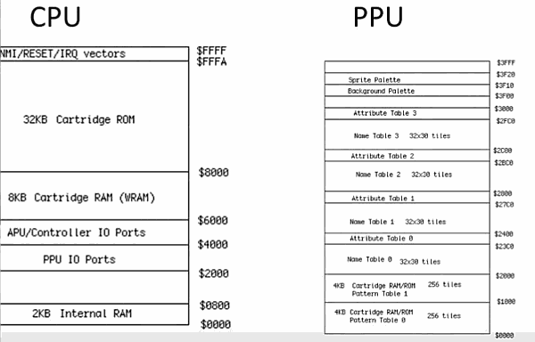
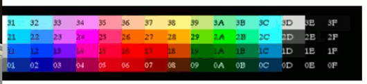

- [NES](#8d93d9819942f8e443fdde4fc2d67bc2)
- [Architecture](#2d242bb36ec91b32005f9296ff03a912)
- [CPU / PPU address space](#2be3d76538a593e1735d07715f79b68d)
- [6502 Assembly](#b240c56be56568f36b4c5fdc76556e61)
- [6502 Opcodes](#4d0e908847f66f494010fd565b1f6c4c)
- [Assembly Starter](#0b0a01d40c7bdf214e285f59726626bf)
- [Sprite](#51f2b7b14433aa22c67d1f4fc18943cd)
- [Palettes](#5b9ee9aa42c46ecdbaae966ca84cc8fa)
- [Background](#a9ded1e5ce5d75814730bb4caaf49419)
- [Controller Input](#47b8dd4685c135e432339d9c07f3502b)
- [Playing Sounds](#ed9cf94969b1915b1fb44110a9fba599)
- [NES ROM Image](#1ccd04b836dc65aa6c64598136974e04)

<h2 id="8d93d9819942f8e443fdde4fc2d67bc2"></h2>

# NES

<h2 id="2d242bb36ec91b32005f9296ff03a912"></h2>

# Architecture

NES Console

- 6502 CPU 
     - 16 bit address bus
     - 64 kB address space
         - 0x0000 - 0xFFFF
     - Four register
         - Accumulator
             - perform maathematical operations 
             - compare the value stored in it
         - X , Y increment register
             - basically those are used for storing values such as counters 
         - Status
             - can not write
             - but can read from it to get certain value like if the accumulator overflows and it will put a status there saying that your value has overflowed
- APU ( Audio Processing Unit )
- PPU ( Picture Processing Unit  )
     - 16 KB address space
- Lockout chip

Game Cartridge

- CHR ( Charater Memory ) ROM or RAM
     - where all your sprite data is stored 
- PRG ( Program Memory ) ROM
     - where your game code is stored
- WRAM ( optional ) and battery
- Lockout chip

When NES is on ,

- PRG ROM copied to CPU
- CHR copied to PPU
- CPU write to the PPU 
     - to modify the background and the sprites

<h2 id="2be3d76538a593e1735d07715f79b68d"></h2>

# CPU / PPU address space

from CPU

- buttom 2KB internal RAM 
     - which can be used for things like variables 
- next 2KB ?
     - PPU ports , use for writing to the PPU
- on the top of it,    APU  and control ports
- WRAM
- Cartridge ROM 
- at the very end of it  , NMI / RESET / IRQ vectors
     - NMI , for every frame that gets displayed to the screen , that's going to called and then from there it's going to run all of the code that modified your sprites and backgrounds and upateds the game engine.
     - RESET , gets called whenever the nes starts up , beasts up, and reset button is pressed 
     - IRQ , i haven't used that , it uesd for special circumstances

from PPU 

- 1st 2KB , 
     - the pattern tables , and that's basically all the sprite data
- name tabels 
     - basically the arrangement of all the sprites on the screen that creats the background
- attribute tabels
     - determines the colors that are used to paint the background 
     - you have multiple name tables and attribute tables  , so you can switch between these to give you different backgourds in your game 
- sprite palette , backgroud palette
     - you have limited number of colors you can choose from , and that is stored in these palette variables

<h2 id="b240c56be56568f36b4c5fdc76556e61"></h2>

# 6502 Assembly

- Directives 
     - Assembler commands
     - Start with a period
- Labels
     - Used to organize code
     - Like a BASIC line number (for GOTO)
     - Not intented and followed by a colon
- Opcodes
       - Program instructions
       - Indented 

<h2 id="4d0e908847f66f494010fd565b1f6c4c"></h2>

# 6502 Opcodes

you should take special considerations if your values are going to add to more than 256

- Load / Store
     - Load: LDA , LDX, LDY
     - Store:  STA , STX, STY
- Math
     - Add: ADD , CLC
     - Subtract : SBC, SEC
     - Increment:  INC, DEC , INX , INY , DEX , DEY 
     - Shift :  ASL  , LSR 
- Comparision
     - CMP , CPX , CPY
- Control
     - JMP
     - BEQ , BNE 

<h2 id="0b0a01d40c7bdf214e285f59726626bf"></h2>

# Assembly Starter

 \ | C   |  6502  | Desc
--- |:--- |:---  | --- 
declare  |  int num;   |   .rsset  $0000  |  where your variable in the memory address
vars     |               |   num .rs 1      |  reserved 1 byte space 
ASSIGN     |  num = 42   |   LDA #$2A
         |               |   STA num
IF       |  if (num==5) |  LDA num 
         | |                 CMP #$05
         | |                BNE Done
         | |                 ; do something
         | |                 Done: 
PROCEDURE |  void MyMethod() {  | MyMethod:
         |     // do somthing      |   : do something
         |    }                    |  RTS
         |    ...                    | ...
         |  MyMethod();            | JSR MyMethod
INCREMENT | x = 10;         | LDA #$0A
          | x ++ ;            | STX
          | y = 32 ;        | INX 
          | y-- ;            | LDA #$20
          |                    | STY
          |                    | DEY
WHILE LOOP  | x = 0 ;            | LDA #$0
            | while (x<255) {    | STX
            |    // do something | Loop:
            |    x ++             |    ; do something
            |    }                 | INX 
            |                    | CPX #$FF
            |                    | BNE Loop
INTERRUPT     |    void Draw() {        | NMI:
METHODS        |        // draw code     | ; modify sprites
            |    }                     | ; modify background
            |    void Update() {     | ; update code
            |        // update code  | RTI
            |   }                     | 

<h2 id="51f2b7b14433aa22c67d1f4fc18943cd"></h2>

# Sprite

- Can be created with programs like YY-CHR
- Each sprite tile is 8x8 pixels
- Each sprite tile can only have 4 unique colors
     - actually 3  colors and 1 transparency layer
- Objects , such as mario , are usually composed of multiple sprite tiles
- All sprites must fit on a single spritesheet

<h2 id="5b9ee9aa42c46ecdbaae966ca84cc8fa"></h2>

# Palettes

- Less than 60 total colors
     - 
- PPU IO ports : $2006 , $2007
     - you write to the palette table by using PPU $2006, $2007 ports
- Sprite palette: $3F10
- Background palette :  $3F00

<h2 id="a9ded1e5ce5d75814730bb4caaf49419"></h2>

# Background

- 32x30 tiles (256 * 240)
- Tiles are 8x8 pixels
- Four unique colors for every 2x2 tiles
- Background is static , but can be scrolled
- Text is usually background tiles

<h2 id="47b8dd4685c135e432339d9c07f3502b"></h2>

# Controller Input

- Call load on Controller port
     - LDA $4016 (player #1)
     - LDA $4017 (player #2)
- Each call returns the status of the next button
     - A,B,Select, Start , Up, Down, Left, Right

<h2 id="ed9cf94969b1915b1fb44110a9fba599"></h2>

# Playing Sounds

- APU 5 channels
     - Square 1, 2  -- Hollow sound
     - Triangle -- Smooth sound
     - Noise  - Explosions
     - DMC     - prerecorded, like voices
- Write to $4015 to enable sounds
- $4000 to $4003 modify sound properties

<h2 id="1ccd04b836dc65aa6c64598136974e04"></h2>

# NES ROM Image

- Generate with NES assemble
     - NESASM3
- Play with NES emulator
     - FCEUXD
- Tools exist for playing on actual NES hardware

