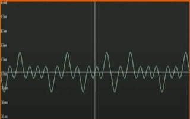
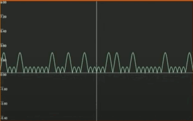
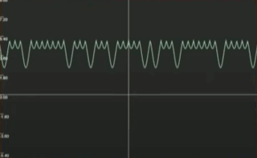
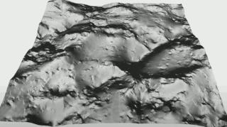
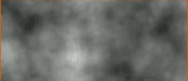
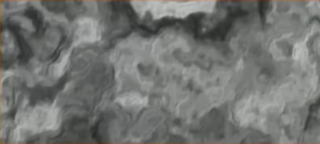
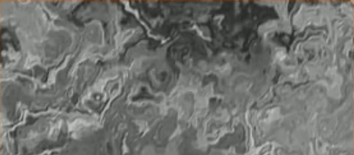

[](...menustart)

- [Current Noise Methods](#eb9eedb507134d1e48e6f3f15f139b5e)
    - [Perlin](#2859057909e216c33bd7903d2e5f7976)
    - [Billow](#7aa10035e694a2af0783c9cf74b47979)
    - [Ridged](#a1a7d607254ad89013d93115af4017f0)
    - [Analytical Derivative](#06dfe3fefa645be8dc2c59182ae3f9e2)
    - [Domain Warping](#96c764ee834cfb4c051951fbcfbb9427)
- [References](#d95867deadfe690e40f42068d6b59df8)

[](...menuend)


- Attempt 1 - Copy Minecraft !
    - Trilinear filtered low density layered perlin noise field
- Attempt 2 - Noise Fields
    - Layers of 3D noise with lots of image processing
- Attempt 3 - DEM Data Trainer
    - Alter noise fields using real world DEM data as a trainer
- Attempt 4 - Uber Noise
    - A unifying method of noise generation


<h2 id="eb9eedb507134d1e48e6f3f15f139b5e"></h2>

## Current Noise Methods

<h2 id="2859057909e216c33bd7903d2e5f7976"></h2>

### Perlin

- Fractional Brownian Motion
- Simplest of the composite Perlin noise algorithms
- Weighted sum a sumber of scaled Perlin noise 'octaves'
- Each octave is responsible for a different size of features

```cshape
float sum  = 0;
float freq = 1.0, amp=1.0;
for (int i=0; i<octaves; i++) {
    float n = noise( p*freq, seed );
    sum += n*amp;
    freq *= lacunarity; 
    amp *= gain;
}
return sum;
```




<h2 id="7aa10035e694a2af0783c9cf74b47979"></h2>

### Billow

- 'billowy' and eroded terrain with sharp creases can be created.
- Creates rolling hills
    ```cshapr
    abs( noise(p, seed) )
    ```




<h2 id="a1a7d607254ad89013d93115af4017f0"></h2>

### Ridged

- Using the complement of the billow creates sharp ridges instead of creases
- Make sharp alpine like ridges
    ```csharp
    1.0f - abs( noise(p, seed) )
    ```



<h2 id="06dfe3fefa645be8dc2c59182ae3f9e2"></h2>

### Analytical Derivative

- Modify the amplitude of finer detail ocatves based on (intermediate) output from coarser ocatves while summing over them as before
- Creates realisitic erosion ( originally described by I.Quillez)


```cshape
float sum  = 0.5;
float freq = 1.0, amp=1.0;
vec dsum = vec2(0,0); 

for (int i=0; i<octaves; i++) {
    vec3 n = noiseDeriv( p*freq, seed );
    dsum += n.yz;
    sum += amp*n.x / (1+dot(dsum,dsum)) ;

    freq *= lacunarity; 
    amp *= gain;
}
return sum;
```

- normal perlin noise map
    - 
- feed in derivatives
    - 


<h2 id="96c764ee834cfb4c051951fbcfbb9427"></h2>

### Domain Warping

- Distort the domain with another function
- orginally looking, perlin noise looks like
    ```csharp
    float pattern( in vec2 p ) {
        return fbm(p);
    }
    ```
    - 
- add a first domain warping
    ```csharp
    float pattern(in vec2 p) {
        vec2 q = vec2( 
            fbm (p + vec2(0.0,0.0)),
            fbm (p + vec2(5.2,1.3))
        );

        return fbm ( p + 4.0 * q ) ;
    }
    ```
    - 
- second warping
    ```csharp
    float pattern(in vec2 p) {
        vec2 q = vec2( 
            fbm (p + vec2(0.0,0.0)),
            fbm (p + vec2(5.2,1.3))
        );
        vec2 r = vec2( 
            fbm (p + 4.0*q + vec2(1.7,9.2)),
            fbm (p + 4.0*q + vec2(8.3,2.8))
        );

        return fbm ( p + 4.0 * r ) ;
    }
    ```
    - 
    - shapes likes rivers, something flow into one another

<h2 id="d95867deadfe690e40f42068d6b59df8"></h2>

## References 

- Inigo Quilez
    - https://iquilezles.org/
    - https://iquilezles.org/www/index.htm
- Giliam de Carpentier
    - https://www.decarpentier.nl/


