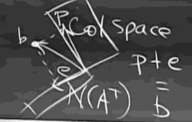

...menustart

 - [1. The Geometry of Linear Equations](#8c1303f71444d7754a705424f793b9ae)
     - [m linear equations, n unknowns](#91e33357c93456f5d4fcdd5d83e73499)
     - [Row picture](#105886be937f14bad5b4f729649f33b2)
     - [`*` Column picture](#1cd37a33867b1e386181f495f9fc46bd)
     - [Maxtrix form](#0cf5af3caf7569284abcadfc4d362a04)
 - [2. Elimination](#007512dbf0eecf82a8ebf4c1e7b71357)
     - [Elimination](#37ce2a99728857da54756961009fe633)
     - [Back-Substitution](#3377dc23ba4243098066d43864323ef8)
     - [Elimination  Matrices](#2ca71dcfb9d41862ad1272b22958b92e)
 - [3. Matrix multiplication](#36c22d87c505ccb870696f9dddce56c3)
     - [Matrix multiplcation (4 ways) :  A * B = C](#99f80b726498ad866ed76cec68ca859e)
     - [Inverse of A , AB, Aᵀ](#785ba5483d4595815b81a1ab57fa7d38)
     - [Gauss-Jordan / find A⁻¹](#4e2c98c06f8cb4b5e5fda933f2d08ba2)
 - [4 (10)](#515dfcd954f57355545174f22e938c1f)
     - [Product of elimination matrices](#214181c5442239e64cc8d942b8b189e3)
     - [A=LU (no row exchange)](#f1248609fe6c8d2d55ee97b5d1a231d7)
     - [Permutations](#687883d0478f7377a01db0003294c174)
 - [5](#e4da3b7fbbce2345d7772b0674a318d5)
     - [Section 2.7 PA=LU](#0fa27231d37120418da2892cbb00e7cf)
     - [Section 3.1 Vector Spaces and Subspaces](#9d1fa1d7cb8b7fb75f4ac91338858795)
 - [6](#1679091c5a880faf6fb5e6087eb1b2dc)
     - [Column Space of A](#6b209870f2238fe90b6a06eacf3352f4)
     - [Null Space of A](#aae362f830f86beea7700082eba79028)
 - [7](#8f14e45fceea167a5a36dedd4bea2543)
     - [Computing the nullspace (Ax=0)](#b5352408af1619a3d4c23bc24b7a9be1)
     - [Pivot variables -- free variables](#fe178efd74327aee4c4fb7261a34154b)
     - [Special Solutions -- rref(A) = R](#2913817abf898dbe3ad9d3e5e39e3026)
 - [8](#c9f0f895fb98ab9159f51fd0297e236d)
     - [Complete solution of Ax=b](#9de0ef58d914b04f049388c958ac1a74)
 - [9](#45c48cce2e2d7fbdea1afc51c7c6ad26)
     - [Linear independence](#ab6b0812ad1ce14864584b2657a527a1)
     - [Spanning a space](#8244f5d68b8b82ffeadf91818ea34850)
     - [BASIS and dimension](#e85643186cee77ad9ac05f9f5f251c51)
 - [10](#d3d9446802a44259755d38e6d163e820)
     - [Four Fundamental Subspace](#2d18c3506588b8d120fd1814df9c542f)
     - [New vector space !](#097b0bf7ca0b3f1b1998a2e0a692c81a)
 - [11](#6512bd43d9caa6e02c990b0a82652dca)
     - [Rank one matrices](#49ffec6957c7988a3bb3cec6322ce09b)
     - [Small graph](#d42a81a20d066bbb2afc576729176c38)
 - [12](#c20ad4d76fe97759aa27a0c99bff6710)
     - [Graphs of Networks](#f4f0e61f230052f73a45b10df498ee07)
 - [14](#aab3238922bcc25a6f606eb525ffdc56)
     - [Orthogonal vectors and subspaces](#6f2c485c71fb691471a44db33644095c)
     - [null space ⟂  row space](#6d51fae8845c5c8fd88e68e74a9e2b51)
     - [N(AᵀA) = N(A)](#1381809db6ebf7c77b7a83e941330b8d)
 - [15  crucial chapter](#5ac01a8dcddca1156c071b45acd1bb50)
     - [Projections !!](#7bf91f47e22dc40630e1fda5272cbb05)
 - [16](#c74d97b01eae257e44aa9d5bade97baf)
     - [Projection Matrix](#3f74ad10af3eacd7e34e00ff5d659663)
     - [Least square](#508a75177e1b86cd02457f1b8d091909)
 - [17](#70efdf2ec9b086079795c442636b55fb)
     - [Orthogonal basis q₁, q<sub>n</sub>](#77c10fd5007190b1606ec52dee42d392)
     - [Orthogonal matrix Q](#ddab1e3788581e4947eff92141a6891c)
     - [Gram-Schmidt  A -> Q](#074ad2dd56bc627b14e5a90ad7e9b2e8)

...menuend


http://web.mit.edu/18.06

<h2 id="8c1303f71444d7754a705424f793b9ae"></h2>

-----
-----

## 1. The Geometry of Linear Equations

<h2 id="91e33357c93456f5d4fcdd5d83e73499"></h2>

-----

###  m linear equations, n unknowns


<h2 id="105886be937f14bad5b4f729649f33b2"></h2>

-----

### Row picture  

<details>
<summary>
Intersection of planes
</summary>

In n dimensions space, each equation produces an (n-1) dimemsional "plane" in n dimemsions. Assuming all goes well , every new "plane" (every new equation) reduce the dimension by 1.

At the end, when all n planes are accounted for, the intersection has dimension zero. It's a point , it lies on all planes, and its coordinates satisfy all n equations. It's the solution!
</details>

<h2 id="1cd37a33867b1e386181f495f9fc46bd"></h2>

-----

###  `*` Column picture


<details>
<summary>
Combination of columns
</summary>

The equations ask for a linear combination of the n columns that equals b.
</details>

<h2 id="0cf5af3caf7569284abcadfc4d362a04"></h2>

-----

### Maxtrix form


<details>
<summary>
Ax = b
</summary>

 - Q: how to compute Ax 
    1. each row dot product x 
    2. combination of columns

 - Q: can I solve Ax=b for every b?
    - That is , do the linear combination of columns fill the whole space (i.e. 3D).
    - It depends on columns of A.

 - solve Ax=b
    - ax=b, x=b/a=a⁻¹b
    - same idea: Ax=b => x=A⁻¹b

</details>


<h2 id="007512dbf0eecf82a8ebf4c1e7b71357"></h2>

-----
-----

## 2. Elimination

<h2 id="37ce2a99728857da54756961009fe633"></h2>

-----

### Elimination   

**GAUSSIAN ELIMINATION** starts by subtracting multiples of the first equation from the other equations. 

Breakdown of Elimination: 0 in pivot position , then do row exchange , by definition, **pivots cannot be zero**.
 
<h2 id="3377dc23ba4243098066d43864323ef8"></h2>

-----

### Back-Substitution 


One good way to write down the forward elimination steps is to include the right-hand side as an extra column, this matrix [A |b] is an augmented matrix.

[A |b] ==elim==> [U |c] ==> Ux=c

U is a triangular matrix, and then we can use **back-substitution** to get the solve.
    
<h2 id="2ca71dcfb9d41862ad1272b22958b92e"></h2>

-----

### Elimination  Matrices

- EA = U
- 向量在 矩阵右侧，列组合；向量在矩阵左侧，行组合
    - Matrix \* column => column
    - row \* Marix => row 
- subtract 3 x column1 from column2
    - elementary matrix: E₂₁
    - 
    ```
    ⎡  1 0 0⎤
    ⎢ -3 1 0⎥
    ⎣  0 0 1⎦
    ```
- permutation matrix
    - suppose to exchange row1 and row2
    - 
    ```
    ⎡ 0 1⎤
    ⎣ 1 0⎦
    ```
    
<h2 id="36c22d87c505ccb870696f9dddce56c3"></h2>

-----
-----

## 3. Matrix multiplication


<h2 id="99f80b726498ad866ed76cec68ca859e"></h2>

-----

### Matrix multiplcation (4 ways) :  A * B = C

1. regular way
    - row·column, dot product
2. column way 
    - columns in C , are combinations of columns of A 
    - that is , A * column of B ,  generates  a column in C 
3. row way
    - rows of C , are combinations of rows of B
    - that is , row of A * B , generates a row in C
4. 4th way
    - sum of (columns of A) * (rows of B) 
    - column * row , generates a big matrix 
    - `sum( Cn*Rn )` 
    
<h2 id="785ba5483d4595815b81a1ab57fa7d38"></h2>

-----

### Inverse of A , AB, Aᵀ
    
 - A is not invertible if you can find a non-zero vector that Ax = 0
    - Ax = 0 means some combination of columns gives 0, they contribute nothing. 
 - (AB)⁻¹ = B⁻¹A⁻¹
 - AA⁻¹ = I 
    - => (A⁻¹)ᵀAᵀ = I 
    - = (Aᵀ)⁻¹ = (A⁻¹)ᵀ

<h2 id="4e2c98c06f8cb4b5e5fda933f2d08ba2"></h2>

-----

###  Gauss-Jordan / find A⁻¹

- how to find A⁻¹?
    - A * column j of A⁻¹ = column j of I 
    - 每次通过解一组方程组 就能得到 A⁻¹的一列
- Gauss-Jordan
    - slove n equations at once.
    - eliminate on long matrix [AI] , and get [IA⁻¹]
    - 为什么 经过消元法后(矩阵E)，就能得到A⁻¹嗯 ?
        - E*[AI] = [I?]
        - E*A = I => E = A⁻¹ => E*[AI] = [IA⁻¹]

 - note
    - 矩阵乘法规则， 适用于 单个数字元素， 也同样适用于 block 元素

<h2 id="515dfcd954f57355545174f22e938c1f"></h2>

-----
-----

## 4 (10)


<h2 id="214181c5442239e64cc8d942b8b189e3"></h2>

-----

### Product of elimination matrices 

 - E₃E₂E₁A = U 
 - U 的最后一个 pivot 可以不为0

<h2 id="f1248609fe6c8d2d55ee97b5d1a231d7"></h2>

-----

### A=LU (no row exchange)

 - EA=U , A=LU , E⁻¹=L

<h2 id="687883d0478f7377a01db0003294c174"></h2>

-----

### Permutations 

 - elimination may introduce row exchanges. 
 - permutation matrix performs row exchange. 
 - The inverse of permuation matrix P is P's transpose.
    - P⁻¹ = Pᵀ  =>  PᵀP = I

<h2 id="e4da3b7fbbce2345d7772b0674a318d5"></h2>

-----
-----

## 5

<h2 id="0fa27231d37120418da2892cbb00e7cf"></h2>

-----

### Section 2.7 PA=LU

 - Transpose 
    - RᵀR is always symmetric
    - (RᵀR)ᵀ = RᵀRᵀᵀ = RᵀR

<h2 id="9d1fa1d7cb8b7fb75f4ac91338858795"></h2>

-----

### Section 3.1 Vector Spaces and Subspaces

 - The begining of Linear Algebra
 - All vector subspace have to go through the origin.
 - if S and T are both subspace, S∩T is a subspace.
    - why? 
    - Suppose I take a couple of vectors that are in the intersections, why is the sum also in the intersection? 
        - if V and W are 2 vectors in both S and T , then 
        - V+W is in S , and V+W is in T.   that is  , V+W is in both S and T as well. 
        - so that , V+W must in S∩T. 
    - 乘法的封闭性证明？ 等价若干加法所以不需要？
 - C(A)  column space


<h2 id="1679091c5a880faf6fb5e6087eb1b2dc"></h2>

-----
-----

## 6 

<h2 id="6b209870f2238fe90b6a06eacf3352f4"></h2>

-----

### Column Space of A
 
 - column的长度j  决定了 A的column space 是 Rʲ 下的一个 subspace.
 - Does Ax=b has a solution for every b ? 
    - yes only if b is a combination of the colunmn, that is, b is a vector in the column space.

<h2 id="aae362f830f86beea7700082eba79028"></h2>

-----

### Null Space of A 

 - Totally different space. it contains all solutions **x** to Ax = 0.
 - The dimension of N(A) is determined by number of columns. 
 - Why solutions to Ax=0 always give a subspace ?
    - That is , if Av=0 and Aw=0,  A(v+w) must be 0.
    - A(v+w) = Av + Aw = 0 
 - Q: Ax = b ,  is the solutions of x give a subspace ?
    - A: No. it doesn't go through the origin.


<h2 id="8f14e45fceea167a5a36dedd4bea2543"></h2>

-----
-----

## 7

<h2 id="b5352408af1619a3d4c23bc24b7a9be1"></h2>

-----

### Computing the nullspace (Ax=0)

The algorithm is elimination, but extended to the rectangular case (and won't carray b), where we have to continue even if there's zeros in the pivot position, we go on.

The result, let's call it U,  is a echelon matrix.

**Rank** of A = number of pivots

To solve Ax=0, really I'm solving Ux=0.

PS: The only operation not required by our example, but needed in general, is row exchange.

<h2 id="fe178efd74327aee4c4fb7261a34154b"></h2>

-----

### Pivot variables -- free variables

when you get the echelon matrix, for free variables, you can assign any value, and then you just to compute the value of pivot variables,  so that you get a vector, a special solution for Ux=0.

if it have n free variables, you can find n vectors, n special solutions, those vectors span the null space.

That is , the null space contains exactly all the combinations of the special solutions. And how many special solutiosn there ? There's one for every free variable.  How many free variables ?  n-Rank !  (here, n means number of xᵢ in solution).


<h2 id="2913817abf898dbe3ad9d3e5e39e3026"></h2>

-----

### Special Solutions -- rref(A) = R

Take a more step from U ,  making 0 above and below pivots, and making pivots = 1. (PS. zero above the pivot column , not needed for free column)

Then you get reduced row echelon form R.  Matlab will do it immediately with `rref(A)`. 

R got all the information as clear as can be.  

The solution to Rx=0  is as same as the solution to Ax=0 , or Ux=0.

PS. if A is invertible, then rref(A) = I.

```
octave:2> A
A =

    1    2    2    2
    2    4    6    8
    3    6    8   10

octave:3> rref(A)
ans =

   1.00000   2.00000   0.00000  -2.00000
   0.00000   0.00000   1.00000   2.00000
   0.00000   0.00000   0.00000   0.00000
```

But how can we get solution directly from the R form ?

From the pivot column, we get a identity matrix, form the free columns we get the free matrix.

```
octave:4> I = [1 0 ; 0 1]
I =

   1   0
   0   1

octave:5> F = [2 -2 ; 0 2 ]
F =

   2  -2
   0   2
```


The typical R form is

```
⎡ I F⎤
⎣ 0 0⎦
```

Now we gonna to create a 'nullspace matrix' N , which columns are the special solution, so that RN=0.

So what N will do the job ?

```
⎡ -F⎤
⎣  I⎦
```

That is ,

```
Rx = 0  

=>

[I F]·⎡ x_pivot⎤ = 0
      ⎣ x_free ⎦

=>

x_pivot = -F * free_variables

    P P     -2  2    -2  2
N = F F =>   F  F =>  1  0
    P P      0 -2     0 -2
    F F      F  F     0  1
```


---

```
R =

   1   0   1
   0   1   1
   0   0   0
   0   0   0
```

What's the x?  The x has a identify, it's only a single number 1, bt its the identify matix in free part. And what does it have in the pivot variables ?  [-1;-1]
 
x = c·[ -1;-1;1 ]
 

<h2 id="c9f0f895fb98ab9159f51fd0297e236d"></h2>

-----
-----

## 8

<h2 id="9de0ef58d914b04f049388c958ac1a74"></h2>

-----

### Complete solution of Ax=b

To solve Ax=b,  we create an augmented matrix [A |b].

Solvability condition on b: b had to be in the column space C(A).

To find complete solution to Ax=b.

1. one particular solution 
    - set all free variables to 0, and then solve Ax=b for the pivot variables.
2. add on any x in the nullspace.

x = x<sub>p</sub> + x<sub>n</sub> , this pattern through all of mathematics, because it shows up everywhere.

x<sub>n</sub> is a subspace, but x<sub>complete</sub> is not.  x<sub>complete</sub> is like a subspace, but it's been shifted, away from the origin, it doesn't contain 0, since it must go through x<sub>p</sub> .

<h2 id="45c48cce2e2d7fbdea1afc51c7c6ad26"></h2>

-----
-----

## 9

<h2 id="ab6b0812ad1ce14864584b2657a527a1"></h2>

-----

### Linear independence

indenpendent if N(A) = 0

<h2 id="8244f5d68b8b82ffeadf91818ea34850"></h2>

-----

### Spanning a space

The space consists of all combinations of those vectors.

<h2 id="e85643186cee77ad9ac05f9f5f251c51"></h2>

-----

### BASIS and dimension

BASIS for a space is a sequence of vectors with 2 properties.

1. they are independent
2. they span the space.

Dimension of a space is the  number of space basis.

Subspace also have basis.

rank(A) = #pivot columns = dimension of C(A) (PS. NOT the dimension of matrix) .

dim(C(A)) = r
dim(N(A)) = #free variables = n-r

A 和 Aᵀ 的 r 相等。


<h2 id="d3d9446802a44259755d38e6d163e820"></h2>

-----
-----

## 10

<h2 id="2d18c3506588b8d120fd1814df9c542f"></h2>

-----

### Four Fundamental Subspace 

A is mxn

 - C(A) , ( in Rᵐ )                       ,dim=r
 - N(A) , dim=n-r
 - `---------`
 - Row Space C(Aᵀ) ,              ,dim=r
 - Left Null Space N(Cᵀ)  , ( in Rᵐ ),  dim=m-r

why we call N(Cᵀ) left null space ?

 - Aᵀy = 0  ==>  yᵀA = 0ᵀ 

About elimination:

Elimination preserve the row space. so R and A have different colum space, but same row space.

-----

```
A =

   1   2   3
   1   2   3
   2   5   8
```

it looks like the collmns are independent , does it ?

Actually, the rows are not inpendent ,so A is not invertible, so that the columns must be dependent. 

`A*[-1;2;-1 ] = 0` 

---

<h2 id="097b0bf7ca0b3f1b1998a2e0a692c81a"></h2>

-----

### New vector space !

All 3x3 matrices !!  we called M. 

Every 3x3 matrix is one of my "vectors". They are vectors in my vectors space because they obey the rules. 

dim(M) = 9 !

Subspaces of M :

 - upper triangulars
    - dim(U) = 6
 - symmetric matrices
    - dim(S) = 6
 - diagonal matrices  D 
    - dim(D) = 3

now D is a subspace. The dimension of D is 3. for example, you can shoose such 3 basis:

```
   1   0   0
   0   0   0
   0   0   0

   0   0   0
   0   3   0
   0   0   0

   0   0   0
   0   0   0
   0   0   7
```
  
<h2 id="6512bd43d9caa6e02c990b0a82652dca"></h2>

-----
-----

## 11 

<h2 id="49ffec6957c7988a3bb3cec6322ce09b"></h2>

-----

### Rank one matrices

A = uvᵀ

We'll be interested in rank 1 matrices. Later we'll find, ok, their determinant, their eigen values, that'll be interesting. 

Rank 1 matrices are like the building blocks for all matrices. And actually maybe you can guess, if I took a 5x17 matrix of rank 4, then it seems pretty likely , and it's true , that I could break that 5x17 matrix down as a combination of rank 1 matrices , -- I need 4 rank 1 matrices. The rank 1 matrices are the building blocks.

Q: S = all v in R⁴ with v₁+v₂+v₃+v₄=0

A: S = null space of A=[1 1 1 1]

rank(A) = 1 = r,  dim(N(A)) = n-r .

<h2 id="d42a81a20d066bbb2afc576729176c38"></h2>

-----

### Small graph


Graph = { nodes , edges }

Every peaple is a node, there is an egde between 2 peaples if they are frinds. The question for that graph is how many steps does it take to get from anybody to anybody ? What 2 peaple are furthest apart in this friendship graph.


<h2 id="c20ad4d76fe97759aa27a0c99bff6710"></h2>

-----
-----

## 12

<h2 id="f4f0e61f230052f73a45b10df498ee07"></h2>

-----

### Graphs of Networks

Graph = { nodes , edges }


Loops in directed graph correspond linear dependence. 

Usually graph is a very sparse matrix.

Directed graph matrix is always column dependent ? Ax=0

电路图: x=x1,x2,x3,x4...  potential at node.  normally we need fix one node , say, connect it to ground, so that the column represent that node disappear.  

Aᵀy = 0.  currency y1,y2,y3,y4,y5 on edges.


 - #loops = #edges - ( #nodes - 1 )

this is, #nodes - #edges + #loops = 1 , it's Euler's formula.


<h2 id="aab3238922bcc25a6f606eb525ffdc56"></h2>

-----
-----

## 14

<h2 id="6f2c485c71fb691471a44db33644095c"></h2>

-----

### Orthogonal vectors and subspaces

Subspace S is orthogonal to subspace T , means every vetor S is orthogonal to every vector in T.  If S is orthogonal to T, then they intersect only at 0 vector. 


<h2 id="6d51fae8845c5c8fd88e68e74a9e2b51"></h2>

-----

### null space ⟂  row space 

why ?

beause Ax=0,  *each row*·x = 0.  

nullspace and row space are orthogonal **complements** in Rⁿ.  That is, nullspace contains **all** vectors ⟂ row space.

<h2 id="1381809db6ebf7c77b7a83e941330b8d"></h2>

-----

### N(AᵀA) = N(A)

Solve Ax=b when there is no solution.

AᵀA:  nxn, symmetric, (AᵀA)ᵀ = AᵀA, 

AᵀAx = Aᵀb

AᵀA is often invertible, but not always.  Since N(AᵀA) = N(A) , so AᵀA is invertible exactly if the column of A are independent, that is N(A)=0. 

<h2 id="5ac01a8dcddca1156c071b45acd1bb50"></h2>

-----
-----

## 15  crucial chapter

<h2 id="7bf91f47e22dc40630e1fda5272cbb05"></h2>

-----

### Projections !!

2D

how to calculate the vector p , which is vector b projects on vector a ?

p must be some multiple of a ,  p = xa.

the error vector e = b - p  = b - xa.   since e ⟂ a , 

so  aᵀe = aᵀ(b-xa) = aᵀb - xaᵀa = 0 

=>  xaᵀa = aᵀb.   => x = aᵀb/(aᵀa) 

p = a·aᵀb/aᵀa   => P = aaᵀ/(aᵀa) 

rank(P) = 1 ,    key property: Pᵀ=P , P²=P 

----

 - Why project ?
    - Because Ax=b may have no solution. 
    - Ax has to be in the column space , but b may not in column space.
    - So I change b to the closest vector in the column space. 
    - So I solve Ax = p instead, where p is the projection of b onto the **column space**. 

----

3D

project onto a place , span with independent vector a1 and a2.  that is , the place is the column space of A=[a1 a2]

The crucial fact is that , e=(b-p) ⟂ the plane, and the p has to be the combination of columns Ax.

p = Ax̂ . 

Now the problem is to find the right combination of the columns so that the error vector is is perpendicular to the plane. 

Find x̂, so that, a₁ᵀ(b - Ax̂) = 0 , and a₂ᵀ(b - Ax̂).  that is 

Aᵀ(b - Ax̂) = 0.

now we know e is in N(Aᵀ), that is saying **e is ⟂ C(A)**.

rewrite the equation :

AᵀAx̂ = Aᵀb.    So the sulution is x̂ = (AᵀA)⁻¹·Aᵀb. 

P = A(AᵀA)⁻¹Aᵀ . 

why I can not expand the euqation to AA⁻¹(Aᵀ)⁻¹Aᵀ = I  ?  becuase A is not a square matrix, it does not have an inverse. 

still 

 - Pᵀ=P ,  inverse of symmetric  is still symmetric.
 - P²=P 


<h2 id="c74d97b01eae257e44aa9d5bade97baf"></h2>

-----
-----

## 16 


<h2 id="3f74ad10af3eacd7e34e00ff5d659663"></h2>

-----

### Projection Matrix

P = A(AᵀA)⁻¹Aᵀ 

- if b in column space , Pb = b .
    - so Pb = A(AᵀA)⁻¹Aᵀ·Ax = AIx = b 
- if b ⟂ column space ,  Pb = 0 .  
    - ( Mathematical vector is through zero vector )  
    -  what are bs ⟂ column space  ?
        - Those are the vectors in the null space of Aᵀ.
        - so Pb = A(AᵀA)⁻¹Aᵀ·b = A(AᵀA)⁻¹·0 = 0 

Ok now you see what happens if we use our formular. So geometrically what we're seeing is we're taking a vector , we've got the column space, and perpendicular to that is the null space of Aᵀ.

And our typical vector b is out here, and what we're doing is we're projecting it to p in column space, and to e in N(Aᵀ). 




 - p + e = b . 
    - so p is the project b on C(A)  ,  p = Pb 
    - how do e come out ?  what's the projection matrix ?
        - It's (I-P), it's another projection matrix !  It project to a perpendicular space.  
        - e = (I-P)b.


<h2 id="508a75177e1b86cd02457f1b8d091909"></h2>

-----

### Least square

fitting line , curve ,  

 - points in 2D plane , 
    - (1,1), (2,2) , (3, 2 )
    - find a line C + Dt , minimize sum of the error.
    - |Ax̂ - b|² = |e|²
 - The |e|² is :
    - (C+D-1)² + (C+2D-2)² + (C+3D-2)² 
 - no you can use calculus to find the minimn. But here we will use the linear algebra way.

```octave
A =
   1   1
   1   2
   1   3

x =
   C
   D

b =
   1
   2
   2
```

 - here Ax = b have no solution, but  AᵀAx̂ = Aᵀb  have.

```octave
AᵀA =
    3    6
    6   14

Aᵀ*b = 
    5
   11
```

 - so 
    - 3C + 6D = 5
    - 6C + 14D = 11
 - solve it:
    - C = 2/3
    - D = 1/2 

```octave
octave:14> x = inv(A'*A) * (A'*b)
x =
   0.66667
   0.50000
```

---

Repeat: If A has independent columns , then AᵀA is invertible. 

Proof: suppose AᵀAx = 0.  

Trick:  xᵀAᵀAx=0 =>  (Ax)ᵀ(Ax)=0  => Ax=0. 

(Ax)ᵀ(Ax) is the length of the vector Ax squared,  if it is 0, then Ax must be 0.
Since A has independent columns => x=0. 

Q: (1,1), (2,5), (-1,-2) ,  拟合一条2次曲线

A:  ax² + bx + c 

build matrix: 

```
A =

   1   1   1
   4   2   1
   1  -1   1
```


<h2 id="70efdf2ec9b086079795c442636b55fb"></h2>

-----
-----

## 17 

<h2 id="77c10fd5007190b1606ec52dee42d392"></h2>

-----

### Orthogonal basis q₁, q<sub>n</sub>

Orthonormal vectors :

q<sub>i</sub>ᵀq<sub>i</sub> = 0,if i≠j ;  1,if i==j

 - How does having an orthonormal basis make things nice ?
    - It makes all the calcuations better,  a lot of numerical linear algebra is buillt around working with orthonormal vectors.

<h2 id="ddab1e3788581e4947eff92141a6891c"></h2>

-----

### Orthogonal matrix Q 

```
    | |     | |
Q = |q₁ ... qn|
    | |     | | 
```

QᵀQ = I  , Q doesn't have to be square here.

Now we're seeing this new class of matrices with orthonormal columns. This is a long name, I'm sorry that I can't just call them orthogonal matrices. 

Maybe orthonormal matrices are good name.

But the convention is  that we only use that word "orthogonal matrix" when it is square.  So in the case when this is a square matrix, that's the case we call it an orthogonal matrix. 

What's special about the case when it's square?  When it's a square matrix, we've got its inverse. If Q is square, then QᵀQ=I tells us Qᵀ=Q⁻¹. 

---

What's the good of having a Q ? What formula becomes easy.

Suppose Q has orthonormal columns, project onto its column space, what's the projection matrix. 

P = Q(QᵀQ)⁻¹Qᵀ = QQᵀ

```
Q =

   0   1
  -1   0
   0   0

Q*Q'=

   1   0   0
   0   1   0
   0   0   0
```

---

Ax = b, when A is Q,  x̂=Qᵀb.


<h2 id="074ad2dd56bc627b14e5a90ad7e9b2e8"></h2>

-----

### Gram-Schmidt  A -> Q

We start with independent vectors ans we want to make them orthonormal.

Here comes Gram-Schmidt.

step :
 0. vector a,b
 1. orthogonal A,B  ( Gram )
    - a -> A is ok.
    - b is not ok. I'm looking for a vector , starts with b, but makes it orthogonal to A. B should be the error vector when b projection onto a. 
    - B = b - p.  B won't be zero since a,b is independent.
 2. q₁= A/|A| , q₂= B/|B|.   (Schmidt)

32:00


