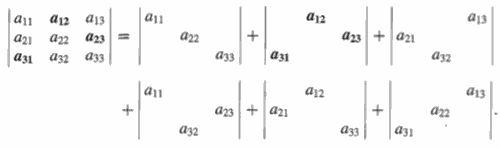
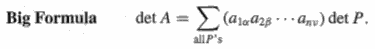
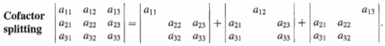
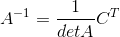
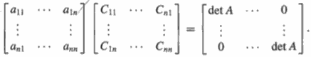

...menustart

 - [18.Determinants](#ae8178b3d3c78ee97adfcc298fe0b11e)
     - [Determinants , det A = |A|](#fc7bcc02eaa53ccf05c2b3f48461de47)
     - [Signed](#71fed0c3428bf1a2e19af257c4bac379)
     - [Properties](#9fc2d28c05ed9eb1d75ba4465abf15a9)
 - [19. Formular for Determinant](#077014dde3a16154d48a5807d1c351bb)
     - [Formula for detA ( n! terms )](#a4ea43d88bcd4db4f7d7fe3abe7052b4)
     - [Cofactor formula](#d02910574d79a0726db429910342d33e)
 - [20. APPLICATIONS OF DETERMINANTS](#d32bea3e6901eaca807e7ff0a03afc52)
     - [Formula for A⁻¹](#23d31b234b8839bc2675b16fff1de2da)
     - [Cramers Rule for x=A⁻¹b](#8d1f376d9179ba4326b17606a2f64136)
     - [| detA | = volume of box](#b99ff4a9543c3ccbfac05190cc07dd68)
 - [21. EigenValues - EigenVectors](#2a051e916e56ff2ad1a6b47745f85a6b)
     - [det\[A-λI\] = 0](#9e08a229f7feafd17be0f57fed7d544d)
     - [Trace = λ₁+λ₂+ ... + λ<sub>n</sub>](#95946abeb88b298e53a6c970166fb7aa)
 - [22. Diagonalizing](#7082803699d165541950b7de2ae708e3)
     - [Diagonalizing a matrix](#7b86df847bba7602c3c3d17d03b2841f)
     - [Powers of A / equation u<sub>k+1</sub> = Au<sub>k</sub>](#d975eb14bcadcace9392fa08591c6162)
     - [Recap](#8912c5512db9003e5c8ce07b7ff36a88)
 - [23.](#d4fbca7834560377a100c91364ec53ec)
     - [Differential Equations  du/dt=Au](#9c0f59a904be7c01984a683e511ca015)
     - [Exponential e<sup>At</sup> of a matrix](#627bb884755ff95a306e6587c9bed913)

...menuend


<h2 id="ae8178b3d3c78ee97adfcc298fe0b11e"></h2>

-----
-----

# 18.Determinants 

Up to now we paid a lot of attention to rectangular matrices. 

Now, concentrating on square matrices. Determinants and Eigen values are big, big chunk of 18.06.

<h2 id="fc7bcc02eaa53ccf05c2b3f48461de47"></h2>

-----

## Determinants , det A = |A| 

Every square matrix has a number associated with , called its determinant. 

- det A = 0 , means A is singular.  
- det A !=0 , means A is invertible.

<h2 id="71fed0c3428bf1a2e19af257c4bac379"></h2>

-----

## Signed

Determinant is signed.

<h2 id="9fc2d28c05ed9eb1d75ba4465abf15a9"></h2>

-----

## Properties 

3 base properties:

1. det I = 1.
2. Exchanging rows reverse sign of det.  
3. The determinant depends linearly on **one** row. (single row linearity)
    - 3a: Add vectors in a row
        - 
        ```
        |a+a' b+b'| =|a b| + |a' b'|
        |c    d   |  |c d|   |c  d |
        ```
    
    - 3b: Multiply by t in row
        - 
        ```
        |ka kb| = k |a b|
        | c  d|     |c d|
        ```
        - det2A = 2ⁿ detA
        - det(A+B) ≠ detA + detB

---

<details>
<summary>
p4 ~ p10
</summary>

 - p4: property 2 also said , dup rows => det=0 
 - p5: elimination ( - k rowi from rowj ) doesn't change det.
    - 数学上，减去的这部分 使用p3 可以分离出去，这部分的det 为0.
    - 集合上，平行四边形,底不变发生切变，面积不变
 - p6: zero row => det=0.
    - p3b, in case a=0,b=0 , K·det=det => det=0.
 - p7: triangular matrix, det = product of pivots
 - p8: If A is singular, then det A = 0. If A is invertible, then det A ≠ 0.
 - p9: det AB = detA * detB  (very valuable property)
    - detA⁻¹
 - p10: detAᵀ = detA 
    - 行列式，所有行的性质，对列同样有效

</details>


<h2 id="077014dde3a16154d48a5807d1c351bb"></h2>

-----
-----

# 19. Formular for Determinant

<h2 id="a4ea43d88bcd4db4f7d7fe3abe7052b4"></h2>

-----

## Formula for detA ( n! terms )

 - use property 3 to break down each row 
    - [a b c] = [a 0 0] + [0 b 0] + [0 0 c]
 - the determinant of A can be expanded into nⁿ terms 
 - a lot terms has 0 det,  they can be removed.
 - The nonzero terms have to come in different columns and rows. 
    - 
 - 
 
<h2 id="d02910574d79a0726db429910342d33e"></h2>

-----

## Cofactor formula

Cofactor is a way of breaking up above big formula that connects the nxn determinant to a determinant one smaller. 



- **The determinant of A is a combination of any row i times its cofactors**.
    - **det A by cofactors:** det A = aᵢ₁Cᵢ₁ + aᵢ₂Cᵢ₂ + ... + aᵢ<sub>𝑛</sub>Cᵢ<sub>𝑛</sub>. (10)
    - The cofactor is the determinant of Mᵢⱼ , with the correct sign:
        - **delete row i and column j:** Cᵢⱼ = (-1)ⁱ⁺ʲ detMᵢⱼ.   (11)


<h2 id="d32bea3e6901eaca807e7ff0a03afc52"></h2>

-----
-----

# 20. APPLICATIONS OF DETERMINANTS

<h2 id="23d31b234b8839bc2675b16fff1de2da"></h2>

-----

## Formula for A⁻¹



<details>
<summary>
ACᵀ = (detA) I
</summary>



The critical question is: Why do we get zeros off the diagonal? 

The answer is: we are actually computing the determinant of a new matrix which has equal rows. 

</details>

<h2 id="8d1f376d9179ba4326b17606a2f64136"></h2>

-----

## Cramers Rule for x=A⁻¹b


What do I get in Cᵀb ? What's the first entry of Cᵀb ?  

Somehow I multiply cofactors by the entries of b, anytime I'm multiplying cofactors by numbers, I think, I'm getting the determinant of something. Let's call the matrix B , whose determinant comes out of Cᵀb .

So x₁ = detB₁/detA  , x₂ = detB₂/detA , ... 

**4C:** Cramer's rule: The jth component of x = A⁻¹b is the ratio


Actually, Cramer's Rule is a disastrous way to go, because compute these determinants takes like approximately forever.  

But having a formula allows you to do algebra instead of algorithms. They're nice formulas, but I just don't want you to use them. 


<h2 id="b99ff4a9543c3ccbfac05190cc07dd68"></h2>

-----

## | detA | = volume of box


```
    已知三角形的三个顶点：
    (x1,y1),(x2,y2),(x3,y3),求面积:
    解：
                |x1 y1 1|
    S= 1/2 det  |x2 y2 1|
                |x3 y3 1|
    
    
    如果有个顶点是原点,比如(x1,y1)=(0,0)
    
    S =  1/2 det|x2,y2|
                |x3,y3|
```

---

<h2 id="2a051e916e56ff2ad1a6b47745f85a6b"></h2>

-----
-----

# 21. EigenValues - EigenVectors 

There are certain vectors where Ax comes out parallel to x. And those are the eigenvectors.  **Ax=λx**.

If A is singular, λ=0 is an eigenvalue.

Now the question is how do we find these x-s and λ.

<details>
<summary>
Projection Matrix
</summary>

Any x in projection plane  Ax=x , λ=1

Any x ⟂ plane,  Ax=0 , λ=0.

</details>

<details>
<summary>
Permutation Matrix
</summary>

```
A =

   0   1
   1   0
```

x = [1;1] , λ=1

x = [-1;1] , λ=-1. In fact, the trace tells you right away what the other eigenvalue is.

</details>

How to solve Ax=λx ?

(A-Iλ)x = 0.    A-Iλ has to be singular.


<h2 id="9e08a229f7feafd17be0f57fed7d544d"></h2>

-----

## det[A-λI] = 0 

The idea will be to find λ first. I'll find n λ's.  A λ could be repeated, A repeated λ is source of all trouble in 18.06.

<h2 id="95946abeb88b298e53a6c970166fb7aa"></h2>

-----

## Trace = λ₁+λ₂+ ... + λ<sub>n</sub>

Fact: sum of λ's = a₁₁+a₂₂+ ... + a<sub>nn</sub>.


<details>
<summary>
Symmetric Matrix Example 
</summary>

```
A =
   3   1
   1   3


det(A-λI) = |3-λ 1| = (3-λ)²-1
            |1 3-λ|

          = λ²-6λ+8 
```

This example is great. 6 is the trace ,and 8 is the determinant. 

λ₁=4, λ₂=2 . 

```
A-4I = 
  -1   1
   1  -1
```

x₁= [1;1]

```
A-2I = 
   1   1
   1   1
```

x₂= [-1;1]

</details>

What's the relateion between the Permutation example and Symmetric example ?

Simple but useful observation: if I add *n*·I to a matrix, its eigenvectors don't change, and its eigen values are *n* bigger.


<details>
<summary>
Why does it happen ? 
</summary>

Suppose I have a matrix A, and Ax=λx. I add 3I to that matrix. 

(A+3I)x = λx + 3x = (λ+3)x

</details>


<details>
<summary>
Rotation matrix Q
</summary>

```
Q = 
   0  -1
   1   0
```

90° rotation.

trace = 0 = λ₁+λ₂ , det = 1 = λ₁λ₂.  λ²=-1.

What I'm leading up to with this example is that something is gonna go wrong, because what vector can come out parallel to itself after a 90° rotation? 

λ₁=i, λ₂=-i. 

</details>

If a matrix was symmetric, it wouldn't happen ( complex number λ ). So if we stick to matrices that are symmetric , or close to symmetri, then the eigenvalues will stay real. But if we move far away from symmetric , for this example it's anti-symmetric , the bad thing will happen. 


<details>
<summary>
Here's one more bad thing that could happen.
</summary>

```
A =
   3   1
   0   3
```

This is a triangular matrix.  It's really useful to know you can read the eigenvalues off, they're  right on the diagonal. 

λ₁ = λ₂ = 3. 

```
(A-λI)x = |0 1|x = 0
          |0 0|
```

x₁=[1;0]  , x₂= NO 2nd independent x 

This is a degenerate matrix. It's only got one line of eigenvectors instead of two.  It's this possibility of a repeated eigenvalue opens this further possiblity of a shortage of eigenvectors. 

</details>


<h2 id="7082803699d165541950b7de2ae708e3"></h2>

-----
-----

# 22. Diagonalizing 

<h2 id="7b86df847bba7602c3c3d17d03b2841f"></h2>

-----

## Diagonalizing a matrix 


<details>
<summary>
S⁻¹AS = Λ
</summary>

Suppose we have n independent eigenvectors of A , put them in columns of S.  
S is the eigenvector matrix. 

```
     ⎡ |  |      |  ⎤   ⎡ |    |        |   ⎤
AS = ⎢ x₁ x₂ ... xn ⎥ = ⎢λ₁x₁ λ₂x₂ ... λnxn ⎥.
     ⎢ |  |      |  ⎥   ⎢ |    |        |   ⎥
     ⎣ |  |      |  ⎦   ⎣ |    |        |   ⎦
```

Each time A multiply eigenvectors , the eigen value comes out.

```
     ⎡  |   |        |  ⎤   ⎡  | |      |  ⎤ ⎡λ₁       ⎤
AS = ⎢λ₁x₁ λ₂x₂ ... λnxn⎥ = ⎢ x₁ x₂ ... xn ⎥ ⎢  λ₂     ⎥.
     ⎢  |   |        |  ⎥   ⎢  | |      |  ⎥ ⎢    ...  ⎥
     ⎣  |   |        |  ⎦   ⎣  | |      |  ⎦ ⎣       λn⎦
```

If I want a number to multiply x,  then I can do it by puting xᵢ in column i (I get S back again), and multiply by a diagonal matrix. 

**AS = SΛ**. 

Provided my assumption of n independent eigenvectors,  I multiply S⁻¹ on the left , I got 

**S⁻¹AS=Λ**.

if I multiply  S⁻¹ on the right , I got 

**A=SΛS⁻¹**.

</details>


<h2 id="d975eb14bcadcace9392fa08591c6162"></h2>

-----

## Powers of A / equation u<sub>k+1</sub> = Au<sub>k</sub>

<details>
<summary>
Can I just begin to use that ? For example how about A² ? What's eigenvectors and eigenvalues of A² ? 
</summary>

If Ax = λx 

A²x = λAx = λ²x. 

So the eigenvalues of A² are λ², and the eigenvector is the same x as A.

This is one way to do it . 

Now let me see that also from formula A=SΛS⁻¹.

A²x = SΛS⁻¹·SΛS⁻¹x = SΛ²S⁻¹. It's telling me the same thing that I just learned here, but in a matrix form. It's telling me that the S is the same, the eigenvectors are the same; but the eigenvalues are squared.

</details>

Aᵏ = SΛᵏS⁻¹ . 

Eigenvalues and eigenvectors give a great way to understand the powers of a matrix. 

Theorem: Aᵏ→0 as k→∞  if all |λᵢ|<1 .  

So far I'm operationg on one assumption: I had a full set of n independent eigenvectors. If we don't have n independent eigenvectors can not diagonalize the matrix,  S⁻¹ can not make sense.

**A is sure to have n independent eigenvectors (and be diagonalizable) if all the λ's are different (no repeated λ)**. 

If I have repeated λ's , I may or may not have n independent eigenvectors (think about the Identity matrix). 


<details>
<summary>
Start with given vector u₀ , u<sub>k+1</sub> = Au<sub>k</sub>, calculate u₁₀₀
</summary>

u₁=Au₀, u<sub>k</sub>=Aᵏu₀

The next section is gonna to solve systems of differential equations. I'm going to have derivatives. 

write u₀ as the combination of eigenvectors: 

u₀ = c₁x₁ +c₂x₂ + ... +c<sub>n</sub>x<sub>n</sub>

Now multiply by A :

Au₀ = c₁λ₁x₁ +c₂λ₂x₂ + ... +c<sub>n</sub>λ<sub>n</sub>x<sub>n</sub>

u₁₀₀ = A¹⁰⁰u₀ = c₁λ₁¹⁰⁰x₁ +c₂λ₂¹⁰⁰x₂ + ... +c<sub>n</sub>λ<sub>n</sub>¹⁰⁰x<sub>n</sub> = Λ¹⁰⁰Sc


</details>


<details>
<summary>
Fibonacci Example:  F<sub>k+2</sub> = F<sub>k+1</sub> + F<sub>k</sub>
</summary>

0,1,1,2,3,5,8,13, ... 

F<sub>k+2</sub> = F<sub>k+1</sub> + F<sub>k</sub>

Right now what I've got is a single equation, not a system, and it's second-order, with second derivatives. I want to get first derivatives. The way to do it is to introduce u<sub>k</sub> will be a vector:


This is my unknown. 

So I'm going to get a 2x2 system, first order, instead of a scalar system, second order:


This is my system. 

And what's my one step equation? 


What's the eigenvalues and eigenvectors of this matrix ?  

λ₁ = -0.61803, λ₂ = 1.61803 . 

How fast are those Fibonacci numbers increasing ? What's controlling the growth of these Fibonacci numbers? It's the eigenvalues. 

And which eigenvalue is controlling that growth? The big one. 

Since u₀ = [1;0] , c₁x₁+c₂x₂ = [1;0].

F₁₀₀ ≈ c₁·(1.61803)¹⁰⁰.   ( the other terms involves c₂ is ignored since it is very slow. )


</details>

<h2 id="8912c5512db9003e5c8ce07b7ff36a88"></h2>

-----

## Recap 

 - eigenvalue λ
    1. nxn matrix has n eigenvalues
    2. eigenvalue is allowed to be 0 ( i.e. projection matrix )
    3. sum of λ's  equals the trace of matrix,  
    4. product of λ's equals determinant of matrix. 
    5. singular matrix must have 0 λ.  
        - number of 0 λ's = dimension of null space.
    6. repeated λ **MAY or may NOT** result in missing eigenvectors
    7. eigenvalue could be complex number.
        - Symmetric matrix's eigenvalues are all real. 
 - eigenvector 
    1. Eigenvectors of sysmmetric matrix are orthogonal.  (doesn't all eigenvectors orthogonal )
    2. A matrix may have no eigenvectors.  ( ? any example ? )


<h2 id="d4fbca7834560377a100c91364ec53ec"></h2>

-----
-----

# 23. 

This section is about how to solve a system of first order, first derivative, constant coefficient linear equations. And if we do it right, it turns directly into linear algebra. The key idea is the sulutions to contant coefficient linear equations are **exponentials**.  

And the result, one thing we will find it's completely parallel to powers of a matrix. 


<h2 id="9c0f59a904be7c01984a683e511ca015"></h2>

-----

## Differential Equations  du/dt=Au

<details>
<summary>
Example 
</summary>

u(0) = [1;0]

du₁/dt = -u₁+2u₂

du₂/dt =  u₁-2u₂

-> A = ⎡ -1  2 ⎤
       ⎣  1 -2 ⎦

So it starts u at time 0, everything starts at u₁. And as time goes on, du₂/dt weill be positive because of that u₁ term, so flow will move into the u₂ component and it will go out of the u₁ component. 

So we'll just follow that movement as time goes forward by looking at the eigenvalues and eigenvectors of that matrix.

λ₁ = 0, λ₂ = -3.

The eigen values are telling me something. λ₂ = -3 , this eigen value is going to disappear, e⁻³ᵗ.  λ₁ = 0, e⁰ᵗ=1. 

So I'm expecting that this solution'll have 2 parts, e⁰ᵗ and e⁻³ᵗ parts. and as time goes on, the second part'll disappear and the first part will be a steady status. ( 因为这是微分方程，所以0是steady status??? )

x₁=[2;1] , x₂=[1;-1]

Solution: u(t) = c₁e<sup>λ₁</sup>x₁ + c₂e<sup>λ₂</sup>x₂

TODO 看书。


</details>


<h2 id="627bb884755ff95a306e6587c9bed913"></h2>

-----

## Exponential e<sup>At</sup> of a matrix

TODO

---

# 24. 

## Markov matrices


```bash
A =

   0.10000   0.01000   0.30000
   0.20000   0.99000   0.30000
   0.70000   0.00000   0.40000
```

<details>
<summary>
property: 
</summary>

1. all entreis >= 0
2. all columns add to 1.

The powers of Markov matrix are all Markov matrices.

**Steady State**:  λ = 1. 

Key points:

1.  λ = 1 is an eigenvalue
2. all other |λᵢ| < 1

Remember: uk = Aᵏu₀ = c₁λ₁ᵏx₁ +c₂λ₂ᵏx₂ + ... +cnλnᵏxn 

Those terms which has |λᵢ| < 1 goes to 0.

since all columns of A markov matrix add to 1, then A-I must be singular ( all columns of A-I add to 0 ) . That is , one of the eigenvalues must be 1. 

**Eigenvalus of Aᵀ are the same as eigenvalues of A.**  because det(A-λI) = det(Aᵀ-λI).  (Determinant's property 10.)

</details>

<details>
<summary>
application :
</summary>

u<sub>k+1</sub> = Au<sub>k</sub> , A is Markov Matrix

The populations in California and Massachusetts.

Every year, 90% people of California stays, and 10% moves to Massachusetts, while 80% people of Massachusetts stays , and 20% moves to California.

```
u = |u_cal |
    |u_mass|

A =

   0.90000   0.20000
   0.10000   0.80000
```

after many many  yeas later, where are those peoples ? 

We can easily get the 2 eigenvalues : λ₁=1, λ₂=0.7.

and the eigenvector for the steady status is x₁=[2;1].  Now we can jump to infinity right now, finally , the California will have 2/3 total peoples, while Mass has 1/3 of all. 

To verify: 

let u₀ = [0;1000],

since u₀ = c₁x₁ +c₂x₂  =  c₁[2;1] +c₂[-1;1] , we get c₁ = 1000/3.

A<sup>k+1</sup>u₀ = c₁·1<sup>k+1</sup>[2;1] = [666.67 ; 333.33] 


</details>


## Fourier Series and projections 


<details>
<summary>
Projections with orthonormal basis  
</summary>

for any v ,  

v = x₁q₁+ x₂q₂+ ... + x<sub>n</sub>q<sub>n</sub>

how to calculate x₁ quickly ?  multiplied by q₁ᵀ on both side 

q₁ᵀv = x₁.

This result can be achieved from the maxtix view .

Qx = v.  x=Q⁻¹v = Qᵀv  => x₁=q₁ᵀv


</details>

<details>
<summary>
Fourier Series 
</summary>

f(x) =a₀ + a₁cosx + b₁sinx + a2cos2x + b₂cos2x + ... 

This one's infinite, but the key property of things being orthogonal is still true for sin and cos. So it is the propery that makes Fourier series work. 

Joseph Fourier realized that, hey, I could could work in function space.

Instead of a vector v, I could have a function f(x) . Instead of orthornal vectors q₁,q₂,..., I could have orthogonal functions, but infinitely many of them. 

So the basis are functions , 1, cosx, sinx, cos2x, sin2x, ... , and they are orthogonal. 

What does it means "funtions are orthogonal" ?

fᵀg = ∫₀<sup>2π</sup> f(x)g(x)dx = 0.

How do I get a₁?  I take the inner product of everything with cos(x).


</details>


---

# 25.

## Symmetric Matrices

A = Aᵀ
 
<details>
<summary>
Eignvalues / Eigenvectors 
</summary>

What's special about the eigenvectors ?

1. The eigenvalues are REAL.
2. The eigenvectors are (can be chosen) PERPENDICULAR

Usual case :  A = SΛS⁻¹
Symmetric case: A = QΛQ⁻¹ = QΛQᵀ , one of the most famous theorem.

Why real eigenvalues ?

TODO

If A is a real matrix , A has real eigenvalues and perpendicular eigenvectors means  A = Aᵀ.

If A is a complex matrix ,  it meas A = A̅ᵀ.

A = QΛQᵀ 


</details>


<details>
<summary>
Start: Positive Definite Matrices
</summary>

</details>


