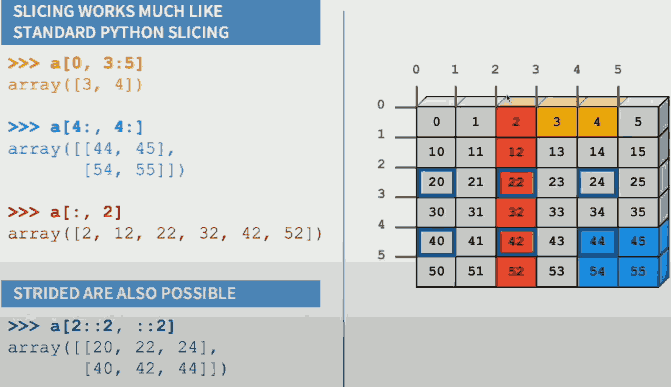
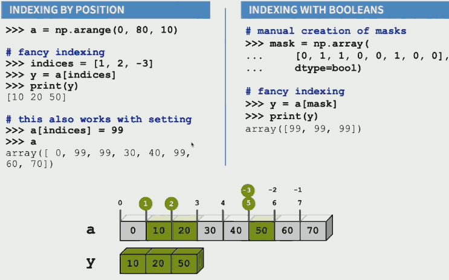
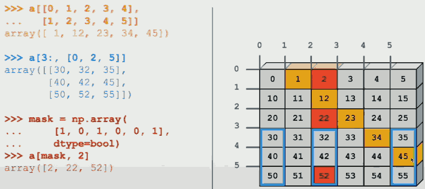
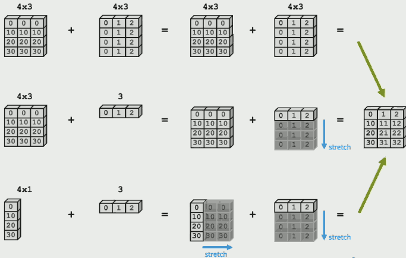
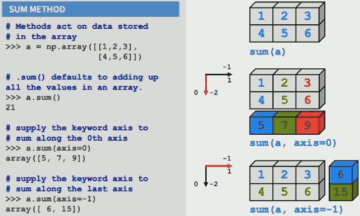

...menustart

- [numpy tips](#c2bfb8f194cb52abbd9cc9397dafc5d4)
    - [Combining Arrays](#84df0f6a0e96bb96e66fdba51a103ad5)
    - [Math Functions](#1f1ef887de84fa2b7f644b5878b4e6ce)
    - [Indexing / Slicing](#6b17874075ca37cc84a6c0d09e623e1c)
    - [Iterating Over Arrays](#f32b904edd83a21e8b374913f5631504)
    - [数据 slice](#1ae1043e3a38472916094e5c042464ed)
    - [数据过滤](#86260398567c0091b1c262ef98512bd6)
    - [数据 拼接](#6ab51568114b14d4784a1fa07f6717b5)
    - [数据转换](#3c30b3189b43008ec08418c0d6afc49f)
- [SciPy 2019](#e7bb3b7194c96eb93fb9a2777411aca8)
    - [Array Slicing](#458a3cb8ba7cd1c7a812c577db825242)

...menuend


<h2 id="c2bfb8f194cb52abbd9cc9397dafc5d4"></h2>


# numpy tips

- Use the shape method to find the dimensions of the array. (rows, columns)
    - `m.shape   # (2, 3) `
- `arange` returns evenly spaced values within a given interval.
    - `np.arange(0, 30, 2) # start at 0 count up by 2, stop before 30`
    - `array([ 0,  2,  4,  6,  8, 10, 12, 14, 16, 18, 20, 22, 24, 26, 28])`
- `reshape` returns an array with the same data with a new shape.
    - `n.reshape(3, 5) # reshape array to be 3x5`
    - `array([[ 0,  2,  4,  6,  8], [10, 12, 14, 16, 18], [20, 22, 24, 26, 28]])`
- `linspace` returns evenly spaced numbers over a specified interval.
    - `o = np.linspace(0, 4, 9)`
    - `array([ 0. ,  0.5,  1. ,  1.5,  2. ,  2.5,  3. ,  3.5,  4. ])`
- `resize` changes the shape and size of array **in-place**.
    - `o.resize(3, 3)`
    - `array([[ 0. ,  0.5,  1. ], [ 1.5,  2. ,  2.5], [ 3. ,  3.5,  4. ]])`


<h2 id="84df0f6a0e96bb96e66fdba51a103ad5"></h2>


## Combining Arrays

```python
>>> p = np.ones([2, 3], int)
>>> p
>>> array([[1, 1, 1],
           [1, 1, 1]])
```

- Use `vstack` to stack arrays in sequence vertically (row wise).

```python
>>> np.vstack([p, 2*p])
>>> array([[1, 1, 1],
           [1, 1, 1],
           [2, 2, 2],
           [2, 2, 2]])
```

- Use hstack to stack arrays in sequence horizontally (column wise).

```python
>>> np.hstack([p, 2*p])
>>> array([[1, 1, 1, 2, 2, 2],
           [1, 1, 1, 2, 2, 2]])
```

- Dot Product:
    - `x.dot(y)`
- Use .T to get the transpose.
    - `z.T`
- Use .dtype to see the data type of the elements in the array.
    - `z.dtype`
- Use .astype to cast to a specific type.
    - `z = z.astype('f')`

<h2 id="1f1ef887de84fa2b7f644b5878b4e6ce"></h2>


<h2 id="f32b904edd83a21e8b374913f5631504"></h2>


## Iterating Over Arrays

- Let's create a new 4 by 3 array of random numbers 0-9.

```python
test = np.random.randint(0, 10, (4,3))
test
array([[5, 2, 9],
       [6, 0, 1],
       [0, 4, 5],
       [3, 8, 0]])
```

- Use zip to iterate over multiple iterables.

```python
test2 = test**2
test2
array([[25,  4, 81],
       [36,  0,  1],
       [ 0, 16, 25],
       [ 9, 64,  0]])

for i, j in zip(test, test2):
    print(i,'+',j,'=',i+j)
[5 2 9] + [25  4 81] = [30  6 90]
[6 0 1] + [36  0  1] = [42  0  2]
[0 4 5] + [ 0 16 25] = [ 0 20 30]
[3 8 0] + [ 9 64  0] = [12 72  0]
```


--------

<h2 id="e7bb3b7194c96eb93fb9a2777411aca8"></h2>


# SciPy 2019

<h2 id="458a3cb8ba7cd1c7a812c577db825242"></h2>


## Array Slicing

numpy 可以把多个维度的slicing 放在一个方括号内...

- 

- single colon : everything
- **slicing is just a view into original array, it won't create a copy.**
    - use `r.copy` to create a copy that will not affect the original array
        - `r_copy = r.copy()`

## Fancy Indexing 

Also called masking or boolean indexing , or logical indexing.

- 
- this 1st orange case is 2 fancy index, while the other 2 are mixing of regular slicing and fancy indexing.

Fancy Indexing in 2-D

- 


**Unlike sliciing, fancy indexing creates copies instead of a view into original array.**


## Creating Array

1. arange
2. linspace
3. array
4. zeros
5. ones
6. eye
    - 
    ```python
    >>> np.eye(3)
    array([[ 1.,  0.,  0.],
           [ 0.,  1.,  0.],
           [ 0.,  0.,  1.]])
    ```


## Computations with Arrays

1. Rule 1: Operations between multiple array objects are first checked for proper shape match
    - Broadcasting rule
    - shape must be same , or compatible
2. Rule 2: Mathematical operators ( `+ - * / exp log` ) apply element by element, on the values
3. Rule 3: Reduction operations ( mean, std, skew, kurt, sum, prod, ... ) apply to the whole array, unless an axis is specified.
4. Rule 4: Missing values propagate unless explicitly ignored( nanmean, nansum, ... )


- Broadcasting rule
    - 
    - what numpy does here is 
        1. prepend 1 to smaller array's shape
        2. dimensions of size 1 are repeated without copying
- Reduction operations
    - 
    - Mathematical functions
        - sum, prod
        - min, max, argmin, argmax
        - ptp (max-min), peak to peak
    - Statistics
        - mean, std, var
    - Truth value testing
        - any, all
    - UNRAVELING
        - reduction operations take our multi-dimensional array and flatten it into just 1D, which is kind of annoying because usually we care about the fact that our data is multi-dimensional.
        - there's a super helpful function called `unravel_index`.
        - 
        ```python
        >>> a = np.arange(12).reshape(3,4)
        >>> np.unravel_index( a.argmax(), a.shape )
        (2, 3)
        ```
        - it does have 1 downside which is if you're there are multiple maxima or multiple minima,  it'll only give you the coordinates of the first one that it encouters, that is why `where` kicks in.
    - 


