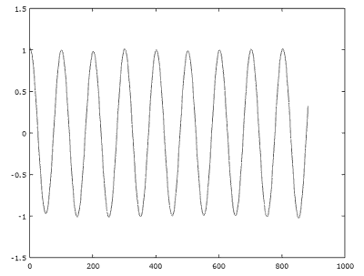
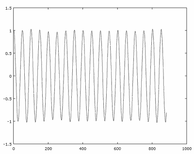
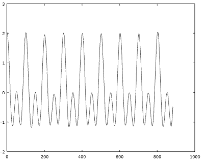
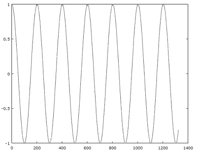
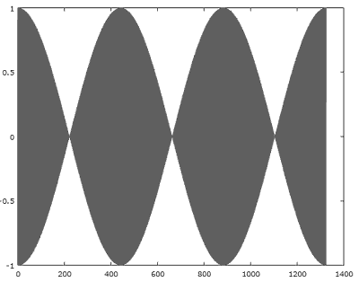
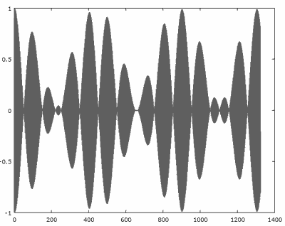

...menustart

- [基本操作](#b7b05952d509c439f94113324ff52318)
    - [install](#19ad89bc3e3c9d7ef68b89523eff1987)
    - [音频信息](#3413dd4049308da2951e7a4e76d5f36f)
    - [读取音频文件](#4e57f1fdd6e72178dedecf98c08602b2)
    - [音频文件的写操作](#1994a8ca2987014975c8f885e42f0efd)
    - [播放音频文件](#168ed667ff59ad9971f9bc226839bc65)
- [信号叠加](#907979cef2ac1030b1862469aab35c41)
    - [1. 产生两个不同频率的信号](#7859357f85cdd30bf0efeae9e4d5f6ff)
    - [1.1 绘制出两个信号的图像](#529d85ceb420010bbae4ff8ddfc8ac23)
    - [1.2 把两个信号叠加](#777d069853661fb6fb9cd8e67b116e81)
    - [3. 两个信号的乘积](#49bd8db4f8d3299524f11771f93554ce)
    - [3.1 生成两个频率为 220 赫兹的声音信号](#3a964a6ddc88e66ce54d2b99a7614a25)
    - [3.2 生成一个 22000 赫兹的高频调制信号](#de12d6d99cdc4745c70e4ee1a8a92ab1)
    - [3.3 把两个信号相乘并绘出图像](#ae927bd937602b7362bcec1dfd6c75df)
- [信号调制](#583240736100dab274fa2e9518318d79)

...menuend


<h2 id="b7b05952d509c439f94113324ff52318"></h2>


# 基本操作

<h2 id="19ad89bc3e3c9d7ef68b89523eff1987"></h2>


## install

```
brew reinstall octave --with-sndfile --with-libsndfile --with-docs
```

--with-portaudio --with-openblas


<h2 id="3413dd4049308da2951e7a4e76d5f36f"></h2>


## 音频信息

- Various formats are supported including wav, flac and ogg vorbis


```
info = audioinfo ('testing.ogg')
```

<h2 id="4e57f1fdd6e72178dedecf98c08602b2"></h2>


## 读取音频文件

```
file='yourfile.ogg'
[M, fs] = audioread(file)
```

M 是一个一列或两列的矩阵，取决于信道的数量，fs 是采样率

下面的操作都可以读取音频文件：

```
[y, fs] = audioread (filename, samples)
[y, fs] = audioread (filename, datatype)
[y, fs] = audioread (filename, samples, datatype)
```

- samples 指定开始帧和结束帧

```
samples = [1, fs)
[y, fs] = audioread (filename, samples)
```

- 指定 datatype

```
[y,Fs] = audioread(filename,'native')
```

<h2 id="1994a8ca2987014975c8f885e42f0efd"></h2>


## 音频文件的写操作

新建一个 ogg 文件：

我们会从一个余弦值创建一个 ogg 文件。采样率是每秒 44100 次，这个文件最少进行 10 秒的采样。余弦信号的频率是 440 Hz。

```
filename='cosine.wav';
fs=44100;
t=0:1/fs:10;
w=2*pi*440*t;
signal=cos(w);
audiowrite(filename, signal, fs);
```

播放这个 'cosine.ogg' 文件就会产生一个 440Hz 的 音调，这个音调正好是乐理中的 'A' 调。

<h2 id="168ed667ff59ad9971f9bc226839bc65"></h2>


## 播放音频文件

```
[y,fs]=audioread('cosine.flac');
player=audioplayer(y, fs, 8)

  scalar structure containing the fields:

    BitsPerSample =  8
    CurrentSample = 0
    DeviceID = -1
    NumberOfChannels =  1
    Running = off
    SampleRate =  44100
    TotalSamples =  441001
    Tag = 
    Type = audioplayer
    UserData = [](0x0)
play(player);
```

-----

<h2 id="907979cef2ac1030b1862469aab35c41"></h2>


# 信号叠加

<h2 id="7859357f85cdd30bf0efeae9e4d5f6ff"></h2>


## 1. 产生两个不同频率的信号

```
sig1='cos440.ogg';                  %creating the audio file @440 Hz
sig2='cos880.ogg';                  %creating the audio file @880 Hz
fs=44100;                           %generating the parameters values (Period, sampling frequency and angular frequency)
t=0:1/fs:0.02;
w1=2*pi*440*t;
w2=2*pi*880*t;
audiowrite(sig1,cos(w1),fs);        %writing the function cos(w) on the files created
audiowrite(sig2,cos(w2),fs);
```

<h2 id="529d85ceb420010bbae4ff8ddfc8ac23"></h2>


## 1.1 绘制出两个信号的图像

信号 1 的图像（440 赫兹）

```
[y1, fs] = audioread(sig1);
plot(y1)
```



信号 2 的图像（880 赫兹）

```
[y2, fs] = audioread(sig2);
plot(y2)
```




<h2 id="777d069853661fb6fb9cd8e67b116e81"></h2>


## 1.2 把两个信号叠加

```
sumres=y1+y2;
plot(sumres)
```



<h2 id="49bd8db4f8d3299524f11771f93554ce"></h2>


## 3. 两个信号的乘积

```
sig1='cos440.wav';                  %creating the audio file @440 Hz
sig2='cos880.wav';                  %creating the audio file @880 Hz
product='prod.wav';                 %creating the audio file for product
fs=44100;                           %generating the parameters values (Period, sampling frequency and angular frequency)
t=0:1/fs:0.02;
w1=2*pi*440*t;
w2=2*pi*880*t;
audiowrite(sig1, cos(w1), fs);      %writing the function cos(w) on the files created
audiowrite(sig2, cos(w2), fs);[y1,fs]=audioread(sig1);[y2,fs]=audioread(sig2);
audiowrite(product, y1.*y2, fs);    %performing the product
[yprod,fs]=audioread(product);
plot(yprod);                           %plotting the product
```


两个基本频率相差很大的信号相乘后的图表效果（调制原理）

<h2 id="3a964a6ddc88e66ce54d2b99a7614a25"></h2>


## 3.1 生成两个频率为 220 赫兹的声音信号

```
fs=44100;
t=0:1/fs:0.03;
w=2*pi*220*t;
y1=cos(w);
plot(y1);
```




<h2 id="de12d6d99cdc4745c70e4ee1a8a92ab1"></h2>


## 3.2 生成一个 22000 赫兹的高频调制信号

```
y2=cos(100*w);
plot(y2);
```




<h2 id="ae927bd937602b7362bcec1dfd6c75df"></h2>


## 3.3 把两个信号相乘并绘出图像

```
plot(y1.*y2);
```

调制后的信号:



---

<h2 id="583240736100dab274fa2e9518318d79"></h2>


# 信号调制


