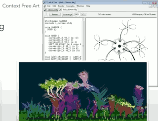
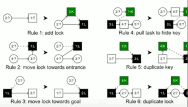
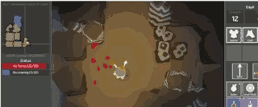
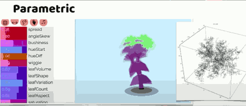
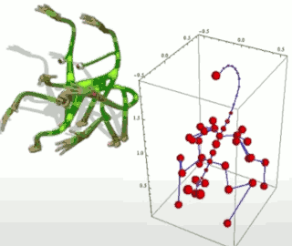
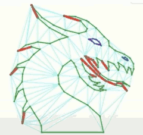
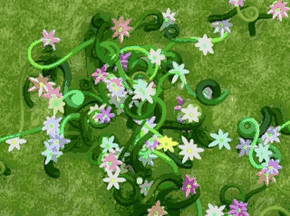

- [Practical Procedural Generation for Everyone](#eacc3a9a45637984cc50fd76d47aefd1)
    - [Additive methods](#6c23aa7f2a6ef1bc6de8c021be1f269b)
    - [Subtractive methods](#6809d0cbfba4b408a9f32fac2a549d2e)

<h2 id="eacc3a9a45637984cc50fd76d47aefd1"></h2>

# Practical Procedural Generation for Everyone

[youtube](https://www.youtube.com/watch?v=WumyfLEa6bU&t=1207s)

<h2 id="6c23aa7f2a6ef1bc6de8c021be1f269b"></h2>

## Additive methods

- Tiles
- Grammars
    - Recursively make things from other things
    - Tracery and other templating systems (for text)
        - Tracery is a super-simple tool and language to generate text, by GalaxyKate.
    - L-Systems(for geometry)
        - things like content-free art
        - draw a line, pick out an angle separate draw new lines, for each of those pick out an angle, and kind of recursive that way.
        - gammars are all about through this top-down structure.
        - 
    - Replacement grammars
        - if you have a dungeon, that's a straight line, and you would like it to not be a straight line, this is your Dorman's work where he made Zelda dungeons by taking a straight line and then perturbing it in different ways, put a door and the key, now if you've got a section that has a key, you can hide that key behind another door, you can recursively apply these.
        - 
        - He recently just published his indie game **Unexplored** which use this technique.
        - 
- Distribution
    - Put down some objects
    - x = random(100), y=random(100)
    - "actual" random looks bad, clumps strangely.
    - "real" distributions are hierarchical and clustered, but also maintain spacing.
    - Options:
        - start with a grid, and offset a bit 
            - (less obvious with a hex grid)
        - Use a voronoi diagram with easing
        - do it preperly with a Halton Sequence
        - **barnacling, greebling, footing**.
- Parametric
    - 
    - So I have 32 different parameters and put those through an algorithm and out pops a little flow
        - you can actually modle this as an N dimensional cube. 
        - no man's sky use this to generate creatures.
    - An array of floats representing settings, "morph handles"
        - modellable as points in an N-dimensional cube.
        - any position is a valid artifact!
        - You can do genetic algorithms 
            - or user directed walks through the space
            - or "regionize" the space.
- Interpretive
    - Start with some input
        - Run an algorithm to process data into some other data
        - 
        - You have a simple structure: some distribution of points, a skeleton, a connectivity map, a curve or path and want to make it more **complex**.
    - Examples:
        - Noise(Perlin/simplex)
        - Voronoi/Delaunay
            - triangulate stuff
            - 
        - Constructive Solid Geometry Extrusion, revolution
        - Metaballs
        - Fractals, mathematical models of impossible shapes
        - (Hypernom, Miegakure)
            - Low control, high weirdness, not suitable for most games.
- Simulations
    - Particle trails
        - simulate particle path responding to forces
            - you can use particles to generate those curves, and then decorate them in interesting ways.
            - 
        - draw directly
        - OR record path and use for extrusions or distributions (photoshop brushes)
    - Cellular automata
    - Agent-based simulations
    - Physics simulation

For more info about grammars, GDC Tech Toolbox 2016 on youtube tracery.io

For more info about user-controlled parametric design, "Petalz: Search-based Procedural Content Generation for the Casual Gamer"

For more info about the Spore pipeline: 

- Real-time Motion Retargeting to Highly Varied User-Created Morphologies -- Chris Hecker
- How to Animate a Character You've Never Seen Before

<h2 id="6809d0cbfba4b408a9f32fac2a549d2e"></h2>

## Subtractive methods

- Saving seeds
    - Seeded random numbers
    - Same seed, Same random
    - Whitelist a catalog of **known good** content
        - It's faster to verify questionable content than to build a testing function.
- Generate and test
    - If you can write an algorithm to judge "quality"...
        - throwaway vs ranking/prioritization
        - Test for brokenness/connectivity
    - Beware of false function
        - beware the "fun equation"

- Computationally exploring the possibility space
    - Also called "search"
        - Brute force search
        - Hill-climbing
            - Genetic algorithms
            - Works best with parametric
- Constraint-solving
    - You can describe a possibility space and constraints, just find the valid parameters.
    - IK-solving
    - Answer set solving
        - Potassco Clingo
    - Brute force!
        - brute force is ok, just pay attention to exponential growth!

