...menustart

- [Perlin Noise](#af3462ddc2e2da770f2e68b7f1c0dc98)
    - [1. Introduction](#71418df45ef46a0f40bd390be0bd5434)
    - [2. noise() vs random()](#66747406635278dfddbc2246d6051ab3)
    - [4. 2D noise](#67885b41eb7504f4224d7a16fd616cee)
    - [6. Coding Challenge #24: Perlin Noise Flow Field](#81ca8128b860dca3c40b5ed6187db988)

...menuend


<h2 id="af3462ddc2e2da770f2e68b7f1c0dc98"></h2>


# Perlin Noise

[src: p5 noise()](https://github.com/processing/p5.js/blob/v1.4.0/src/math/noise.js)

[src: pull p5](https://github.com/processing/p5.js/releases/download/v1.4.0/p5.js)


<h2 id="71418df45ef46a0f40bd390be0bd5434"></h2>


## 1. Introduction

- 1D perlin noise
    - smooth coherent random number
- how to generate ?
    - let's say I'm going to pick random values over time to start with.
        - let's say I'm going to pick them very 10 units of time
        - And I'm to pick those random values with some amplitude, between something like  0~100
        - 
    - Now, the next thing I want to do is to an interpolation function.
        - so here is the start of my Perlin noise function.
        - 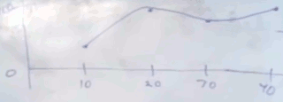
    - Now, the next thing I want to do is to an interpolation function.
    - ANd let's just pretend I also had to pick a value a 0, which let's say I picked this 1
        - 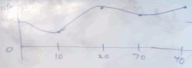
        - 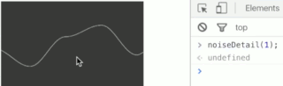
    - Now I'm going to do that again. This time, however, I'm going to pick those random values every 5 units of time. 
        - and instead of picking between 0 and 100, I'm just going to pick between 0 and 50. 
        - **double freq, halve amplitude**.
        - 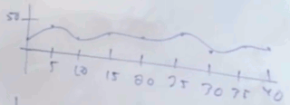
    - repeat the process,  every 2.5 units of time, and values between 0 and 25
        - 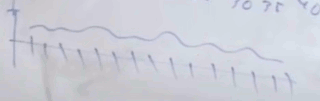
    - ...
    - Now, what if I were to do this prossibly 8 times, 16 times, 25 times, however many times I want, and each time I'm halving essentially the sampling time interval, and also halving the amplitude ? What then if I take all of these and add them together ?
        - THis is essentially how Perlin noise is calculated. And these, what the above pictures show, by the way, are known as octaves.
    - So Perlin noise is calculated over a number of octaves. And essentially it's a bunch of random waveforms. 
        - **the more ocatves that you have, the more fine detail you're getting.**
        - **the smaller the shrinking factor is (currently 0.5), the smoother the graph has.**.


<h2 id="66747406635278dfddbc2246d6051ab3"></h2>


## 2. noise() vs random()

- perlin noise function needs a parameter: the offset in x-axis, in float.
- calling `noise(100)` always return same value until reinitialize


<h2 id="67885b41eb7504f4224d7a16fd616cee"></h2>


## 4. 2D noise

```javascript
// 2D Noise
// The Coding Train / Daniel Shiffman
// https://thecodingtrain.com/learning/noise/0.5-2d-noise.html
// https://youtu.be/ikwNrFvnL3g
// https://editor.p5js.org/codingtrain/sketches/2_hBcOBrF

// This example has been updated to use es6 syntax. To learn more about es6 visit: https://thecodingtrain.com/Tutorials/16-javascript-es6

let inc = 0.01;

function setup() {
  createCanvas(200, 200);
  pixelDensity(1);
}

function draw() {
  let yoff = 0;
  loadPixels();
  for (let y = 0; y < height; y++) {
    let xoff = 0;
    for (let x = 0; x < width; x++) {
      let index = (x + y * width) * 4;
      // let r = random(255);
      let r = noise(xoff, yoff) * 255;
      pixels[index + 0] = r;
      pixels[index + 1] = r;
      pixels[index + 2] = r;
      pixels[index + 3] = 255;

      xoff += inc;
    }
    yoff += inc;
  }
  updatePixels();
  //noLoop();
}
```


<h2 id="81ca8128b860dca3c40b5ed6187db988"></h2>


## 6. Coding Challenge #24: Perlin Noise Flow Field

- instead of having a grayscale value for each pixel,  what I want to have is a vector, an arrow pointing in some direction according to Perlin noise.


<details>


```javascript
let inc = 0.1;
var scl = 10;
var cols, rows;

var fr;

function setup() {
  createCanvas(200, 200);
  pixelDensity(1);
  cols = floor(width/scl);
  rows = floor(height/scl);
  fr = createP("")
}

function draw() {
  background(255);
  let yoff = 0;
  // loadPixels(); // no pixel for this demo
  for (let y = 0; y < rows; y++) {
    let xoff = 0;
    for (let x = 0; x < cols; x++) {
      let index = (x + y * width) * 4;
      // let r = random(255);
      let angle = noise(xoff, yoff) * TWO_PI ;
      var v = p5.Vector.fromAngle(angle); // horizontal right 
      xoff += inc;

      // fill(r);
      // rect(x*scl, y*scl, scl, scl);
      stroke(0);
      push();
      translate( x*scl, y*scl ) ; // move to grid left-bottom corner
      rotate( v.heading() ); // rotate 
      // draw vector line
      line(0,0, scl, 0); // draw   horizontal line
      pop();

    }
    yoff += inc;
  }
  // updatePixels();
  //noLoop();
  fr.html( floor(frameRate()));
}
```

</details>


- flow field animation
    - 3D perlin noise. one dimension is the x axis, another dimension is the y axis. 
    - imagine a z dimension as slices. we though the z axis is the time, every frame of the animation.

<details>

```javascript
let inc = 0.1;
var scl = 10;
var cols, rows;

var zoff = 0;

var fr;

function setup() {
  createCanvas(200, 200);
  pixelDensity(1);
  cols = floor(width/scl);
  rows = floor(height/scl);
  fr = createP("")
}

function draw() {
  background(255);
  let yoff = 0;
  // loadPixels(); // no pixel for this demo
  for (let y = 0; y < rows; y++) {
    let xoff = 0;
    for (let x = 0; x < cols; x++) {
      let index = (x + y * width) * 4;
      // let r = random(255);
      let angle = noise(xoff, yoff, zoff ) * TWO_PI ;
      var v = p5.Vector.fromAngle(angle); // horizontal right 
      xoff += inc;

      // fill(r);
      // rect(x*scl, y*scl, scl, scl);
      stroke(0);
      push();
      translate( x*scl, y*scl ) ; // move to grid left-bottom corner
      rotate( v.heading() ); // rotate 
      // draw vector line
      line(0,0, scl, 0); // draw   horizontal line
      pop();

    }
    yoff += inc;

  }
  zoff += 0.05;
  // updatePixels();
  //noLoop();
  fr.html( floor(frameRate()));
}
```

</details>


- particles
    - for every particles location look up the vector that's nearest to it and then apply that as a force.


## 11. Coding Challenge #136: Polar Perlin Noise Loops

- If you draw a circle with noised vertex , normaly the last vertex won't match the first vertex.
    - 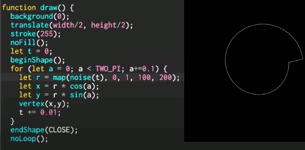
- To solve this problem, we use 2d perlin noise instead.
    - we pick the noise along the circle in 2D perlin plane
        - 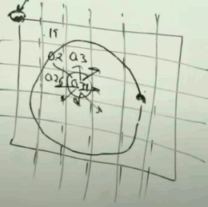
    - but now it is weirdly symmetrical, why ?
        - 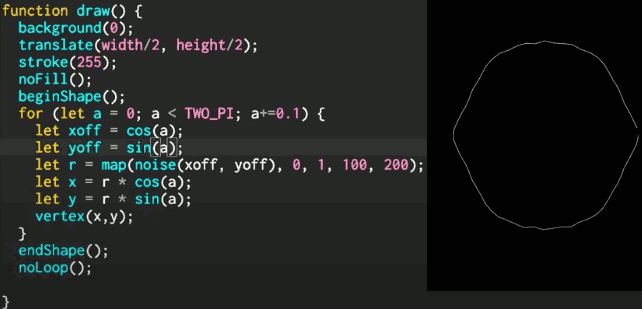
        - because `cos(a), sin(a)` are [-1,1], but perlin noise space are all positive, it doesn't exists in negative space.
    - let's simply fix it
        - 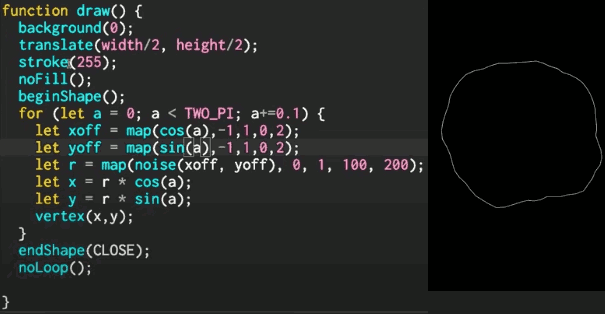
        - we can parameterize the maximum noise value 
            ```javascript
            let xoff = map(cos(a),-1,1,0,noiseMax);
            ```
    - add a phase to make it rotating
        - 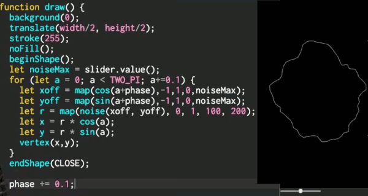
- again, you can use z-axis of perlin noise to make animation
    - 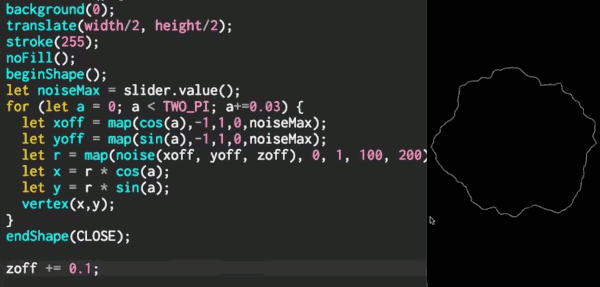
- IDEA:
    - I have perlin noise values in 1D space, but they don't loop.
    - Why not take those looping values along the path of circle which is in 2D perlin plane, and then unfold them back into the sort of 1D line, and use those to apply to any value in any visualization to make perfect GIF loop.
    - That's the IDEA!


