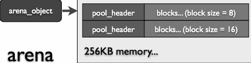

...menustart

- [python 实现笔记](#f5a8090cfbf3141fa074bf597c5a1d15)
- [1 基本环境](#957ca81de7391c55455d5889ff744bc3)
    - [1.2 类型和对象](#a42ee72fe365212ee9342285a0f26ee2)
    - [1.3 名字空间](#9f1d912adac327c6a0f76de998ea956c)
        - [Names have no type, but objects do.](#115664aa6997c25b797d3e9545c9b0b4)
    - [1.4 内存管理](#4a98d7faf3b0d89767d6214bb8368c14)
        - [内存池](#b8294ac34a7b17ac2803dd1bf67aa16b)
        - [引用传递](#8d1c66d29f78e3ca80303b73cc5d57e6)
        - [引用计数](#0a8cbff6e3a3532ede2e30b88dbed5c1)
        - [GC](#7359c3eb5c57547295a76ac1bf775b29)
    - [1.5 编译](#404010db360ecac14364cfeb798bb6be)
    - [1.6 执行](#032a3feced1954f3d6d6dee838163c3c)

...menuend


<h2 id="f5a8090cfbf3141fa074bf597c5a1d15"></h2>


# python 实现笔记

<h2 id="957ca81de7391c55455d5889ff744bc3"></h2>


# 1 基本环境

<h2 id="a42ee72fe365212ee9342285a0f26ee2"></h2>


## 1.2 类型和对象

- 万物皆对象
- Type 也是对象
- 每个对象都有一个标准头， 通过头部信息就能 知道Type
    - 头部信息由 引用计数, 和 类型指针 组成
- 以 int 为例

```cpp
#define PyObject_HEAD                   \
    Py_ssize_t ob_refcnt;               \
    struct _typeobject *ob_type;

typedef struct _object {
    PyObject_HEAD
} PyObject;

typedef struct {
    PyObject_HEAD    // 在 64 位版本中，头 度为 16 字节。 
    long ob_ival;    // long 是 8 字节。
} PyIntObject;
```

- 所以，一个 python int 64位系统上，占 24字节

```python
>>> import sys
>>> x = 0x1234   # don't use small integer here
>>> sys.getsizeof(x)
24
>>> sys.getrefcount(x) # 注意形参也会增加1次引用
2 
```

- 类型指针则指向具体的类型对象
    - 是的，Type 也是对象
    - 其中包含了继承关系、静态成员等信息
    - 所有 内置类型对象 都能从 types 模块中找到， int ,long, str 这些 都是简短别名

```python
>>> import types
>>> x = 20
>>> type(x) is types.IntTyp
True

>>> x.__class__  # __class__ 通过类型指针来获取类型对象
<type 'int'>

>>> x.__class__ is type(x) is int is types.IntType
True
```

- 除了 int 这样的固定长度类型外，还有 long、str 这类变长对象。
    - 其头部多出 1个记录元素项数量的字段。
    -  如 str 的字节数量，list 列表的长度等等

```cpp
define PyObject_VAR_HEAD \
    PyObject_HEAD \
    Py_ssize_t ob_size;   /* Number of items in variable part */

typedef struct {
    PyObject_VAR_HEAD
} PyVarObject;
```

<h2 id="9f1d912adac327c6a0f76de998ea956c"></h2>


## 1.3 名字空间

```python
>>> x 
NameError: name 'x' is not defined
```

- 和 C 变量名是内存地址别名不同 , Python 的名字实际上是1个字符串对象
    - 它和所指向的目标对象  一起 在名字空间中构成一项 {name: object} 关联
- Python 有多种名字空间
    - 模块名字空间 : globals
    - locals
        - 在函数外部，locals() 和 globals() 作用完全相同
        - 在函数内部, locals() 则是获取当前 函数堆栈帧的名字空间, 函数参数、局部变量等信息 
    - class
    - instance 等

```python
>>> x = 123 
>>> globals() 
{'x': 123, ......}
```

- 可以看出，名字空间就是一个 dict 
    - 我们完全可以直接在名字空间添加项来创建名字 

```python
>>> globals()["y"] = "Hello, World!"
>>> y 
'Hello, World!'
```

<h2 id="115664aa6997c25b797d3e9545c9b0b4"></h2>


### Names have no type, but objects do.

- 正是因为 名字的弱类型特征， 我们可以在运行期随时将其关联到任何类型对象
- 使用名字空间管理上下文对象，带来无与伦比的灵活性, 但也牺牲了执行性能。 

<h2 id="4a98d7faf3b0d89767d6214bb8368c14"></h2>


## 1.4 内存管理

<h2 id="b8294ac34a7b17ac2803dd1bf67aa16b"></h2>


### 内存池

- 减少操作系统内存分配和回收操作
- 那些 ≤ 256 字节对象，将直接从内存池中获取存储空间
- **arena**: arena 是内存申请单位  
    - 根据需要，虚拟机每次从操作系统申请1块 256KB，取名为 arena 的大块内存。 
- **pool** : 
    - arena 按系统页大小  ，划分成多个 pool , 所以每个 pool长度是 系统页大小(通常是 4KB))。
    - pool 在其起始位置存储了 pool_header 状态信息。当需要存储小对象时，就是通过检索该区来查看是否符合存储要求。
- **block** 
    - 每个 pool 剩余的内存会按照需要，再次分割成多个更小的区域 block 
        - 每个 pool 只包含⼀种大小规格 的 block。
        - block 是内存池 最小存储单位
     - b基于性能原因， block 大小总是按 8 字节对齐，也就是说总是 8 的倍数。
        - 存储 13 字节的对象，需要找 block  大小为 16 的 pool 获取空闲block
-  > 256 字节的对象，直接用 malloc 在堆上分配内存
    - 程序运行中的绝大多数对象都 < 这个阈值，因此内存池策略可有效提升性能。
- 当所有 arena 的总容量超出限制 (64MB) 时，就不再请求新的 arena 内存
    - 而是如同 "大对象" 一样，直接在堆上为对象分配内存。
- 完全空闲的 arena 会被释放，其内存交还给操作系统。



- 多个 arena 通过 arena_object 内的链表连接起来，共同构成 Python 内存池。 

<h2 id="8d1c66d29f78e3ca80303b73cc5d57e6"></h2>


### 引用传递

- 对象总是按引用传递
    - 就是通过 **复制指针** 来实现 **多个名字** 指向 **同一对象**
- 因为 arena 也是 在堆上分配的，所以无论何种类型 何种大小的对象，都存储在堆上。
- Python 没有值类型和引用类型一说，就算是最简单的整数也是拥有标准头的完整对象。
 
```python
>>> a = object()
>>> b = a
>>> a is b
True
>>> hex(id(a)), hex(id(b))    
('0x10b1f5640', '0x10b1f5640')
>>> def test(x):        
...     print hex(id(x))
>>> test(a)
0x10b1f5640  # same object
```

- 如果不希望对象被修改，就需使 不可变类型，或对象复制品
    - 不可变类型:int, long, str, tuple, frozenset
    - 除了某些类型自带的 copy方法外，还可以:
        - 使用标准库的 copy 模块进行深度复制。
        - 序列化对象，如 pickle、cPickle、marshal

<h2 id="0a8cbff6e3a3532ede2e30b88dbed5c1"></h2>


### 引用计数

- python采用"引用计数"和"垃圾回收"两种机制来管理内存。
- 当一个对象引用计数为 0 时，python 立即回收该对象内存，
    - 要么将对应的 block 块标记为空闲，要么返还给操作系统。
- 某些内置类型， 如小整数，因为缓存的缘故，计数永远不会为 0，直到进程结束才由虚拟机清理函数释放。
- 除了直接引用外，Python 还支持弱引用 -- 允许在不增加引用计数，不妨碍对象回收的情况下间接 引用对象。
    - 不是所有类型都 支持弱引用 ， 如 list、dict ，弱引用会引发异常

```python
>>> import sys, weakref
>>> a = User()
# callback是回调函数（当被引用对象被删除时的，会调用改函数）
>>> r= weakref.ref(a, callback) # create weakref
>>> sys.getrefcount(a) # 弱引用没有导致引用计数增加
2 
>>> r() is a   
True
```

- 引用计数是一种简单直接，并且十分有效的内存回收方式。
- 但是 循环引用会造成计数故障 
    - 简单明显的循环引用 ，可以用弱引用打破循环关系
- 但在实际开发中，循环引用的形成往往很复杂 , 这是只有靠 GC 去回收了。

<h2 id="7359c3eb5c57547295a76ac1bf775b29"></h2>


### GC 

- Reference Cycle Garbage Collection
- 能引发循环引用问题的，都是那种容器类对象
    - 如 list、set、object 等 
- 对于这类对象，虚拟机在为其分配内存时，会额外添加用于追踪的 PyGC_Head
    - 这些对象被添加到特殊链表 ，以便 GC 进行管理。

```cpp
typedef union _gc_head {
    struct {
        union _gc_head *gc_next;
        union _gc_head *gc_prev;
        Py_ssize_t gc_refs;
    } gc;
    long double dummy;
} PyGC_Head;
```

- 这并不表示此类对象非得 GC 才能回收
    - 如果不存在循环引用， 引用计数机制 抢先会处理掉。
    - 也就是说，只要不存在循环引用，理论上可以禁用 GC
    - 当执行某些密集运算时，临时关掉 GC 有助于提升性能。

```python
>>> import gc
>>> gc.collect()  # 手工回收
>>> gc.disable()
```

- 同 .NET、JAVA  样，Python GC 同样将要回收的对象分成 3 级代龄
    - GEN0 管理新近加入的年轻对象
    - GEN1 则是在上次回收后依然存活的对象
    - 剩下 GEN2 存储的都是生命周期极长的家伙。
- 每级代龄都有一个最大容量阈值
- 每次 GEN0 对象数量超出阈值时，都将引发垃圾回收操作。

```cpp
#define NUM_GENERATIONS 3

/* linked lists of container objects */
static struct gc_generation generations[NUM_GENERATIONS] = {
    /* PyGC_Head,                      threshold,      count */
    {{{GEN_HEAD(0), GEN_HEAD(0), 0}},      700,            0},
    {{{GEN_HEAD(1), GEN_HEAD(1), 0}},      10,             0},
    {{{GEN_HEAD(2), GEN_HEAD(2), 0}},      10,             0},
};
```

- GC首先检查 GEN2，如阈值被突破，那么合并 GEN2、GEN1、GEN0  几个追踪链表。
- 如果没有超出，则检查 GEN1。
- GC 将存活的对象提升代龄， 而那些可回收对象则被打破循环引 ，放到专门的列表等待回收。
- 包含 __del__  法的**循环**引用对象，永远不会被 GC 回收，直至进程终了 。
- 关于用不用  __del__ 的争论很多

<h2 id="404010db360ecac14364cfeb798bb6be"></h2>


## 1.5 编译

- Python 实现了栈式虚拟机 (Stack-Based VM) 架构
- 这种字节码指令集没有寄存器，完全以栈 (抽象层 ) 进行指令运算
- 无论是模块还是其内部的函数，都被编译成 PyCodeObject 对象
    - 内部成员都嵌套到 co_consts 列表中。
- 除了内置的 compile 函数，标准库 还有 py_compile、compileall 可供选择
- 对 pyc 文件格式有兴趣,  不想看 C 代码, 可以到 /usr/lib/python2.7/compiler 目录里寻宝
- 对反汇编、代码混淆、代码注入等话题更有兴趣，不妨看看标准库 的 dis。


<h2 id="032a3feced1954f3d6d6dee838163c3c"></h2>


## 1.6 执行

- 最简单的就是  eval() 执行表达式。

```python
>>> eval("(1 + 2) * 3") 
9
>>> eval("{'a': 1, 'b': 2}")
{'a': 1, 'b': 2}
```

- eval 默认会使用当前环境的名字空间，当然我们也可以带入 自定义字典。

```python
>>> x = 100
>>> eval("x + 200")     
300

>>> ns = dict(x = 10, y = 20)
>>> eval("x + y", ns)    
30

>>> ns.keys() 
['y', 'x', '__builtins__'] 
```

- 要执行代码片段，或者 PyCodeObject 对象，那么就需要动用  exec 
    - 同样可以带入 自定义名字空间

```python
py = """
... class User(object):
... def __init__(self, name):
...     self.name = name
... def __repr__(self):
...     return "<User: {0:x}; name={1}>".format(id(self), self.name)
... """

>>> ns = dict()
>>> exec py in ns
>>> ns.keys()      
['__builtins__', 'User']
>>> ns["User"]("Tom")  # 貌似用来开发 ORM 会很简单
<User: 10547f290; name=Tom> 
```

- 动态执行一个 py 文件，可以考虑用 execfile()，或者 runpy 模块。


