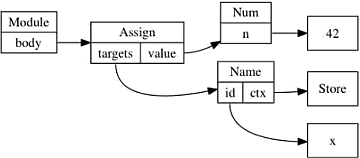
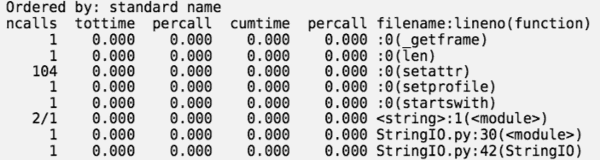

...menustart

 - [2 Modules and libraries](#9fed92638cc7fdfc20c463f5a324b2d3)
     - [2.1 THE IMPORT SYSTEM](#2b1064e477bfd9f4d5b58f7d2f5aa3aa)
     - [2.5](#8221435bcce913b5c2dc22eaf6cb6590)
 - [3 Documentation](#f9ee102aebd5221f15b2b5e34d2b2866)
     - [3.1 Getting started with Sphinx and reST](#0315cce60722138404fe5f4dfe367f90)
 - [7 Methods and decorators](#810127df69a19f8fcc336218c6f2c3e0)
     - [7.1 decorator](#01410921554cbd019a05a64598407bae)
     - [7.3 Static Method](#caf1fbda831136a01cec78b788e99252)
     - [7.4 Class method](#20bf7616e373803aca38068a96f75620)
     - [7.5 Abstract methods](#fd29db4d51ec7f45079d68ebc9ce97ef)
     - [7.6 Mixing static, class, and abstract methods](#2b9c18b0eaab22d1e2348379296852cf)
     - [7.7 The truth about super](#fc3b61a6c99940dd0b3b47dadaeb05fb)
 - [9 The AST](#61e3638e3fcb8f0e306423cd455d1f23)
     - [9.1 Hy](#f36a69842636b49443e209a54f4126a3)
 - [10 Performances and optimizations](#79f281b0c9a80584dba28eda35893e98)
     - [10.2 Profiling](#1181dcb1d371dd2b727902cd6ec7551c)
     - [10.3 Ordered list and bisect](#c930f8e82525c9ad18cb842512f6ce08)

...menuend


<h2 id="9fed92638cc7fdfc20c463f5a324b2d3"></h2>


# 2 Modules and libraries


<h2 id="2b1064e477bfd9f4d5b58f7d2f5aa3aa"></h2>


## 2.1 THE IMPORT SYSTEM

 - When importing modules, Python relies on a list of paths.
 - This list is stored in the `sys.path` variable and tells Python where to look for modules to load
 - There is 2 approaches to append the search path

```python
>>> import sys
>>> sys.path.append('/foo/bar')

$ PYTHONPATH=/foo/bar python
>>> import sys
>>> '/foo/bar' in sys.path
True
```

 - You can also add a custom module finder by appending a factory class to `sys.path_hooks`.

<h2 id="8221435bcce913b5c2dc22eaf6cb6590"></h2>


## 2.5


 - 在编写任何代码之前编写库的文档给我一种思考使用它的特性和工作流程的方法，而不必执行细节。


<h2 id="f9ee102aebd5221f15b2b5e34d2b2866"></h2>


# 3 Documentation

 - The de facto standard documentation format for Python is *reStructuredText*
    - It’s a lightweight markup language (like the famous Markdown) that’s as easy to read and write for humans as it is for computers.
 - [sphinx](http://www.sphinx-doc.org/en/stable/) is the most com- monly used tool for working with this format:
    - it can read reST-formatted content and output documentation in a variety of other formats.
 - Your **project documentation** should include:
    - *The problem your project is intended to solve*, in one or two sentences.
    - *The license your project is distributed under.* 
    - *A small example of how it works.*
    - *Installation instructions.*
    - Links to community support, mailing list, IRC, forums, etc.
    - A link to your bug tracker system.
    - A link to your source code so that developers can download and start delving into it right away.
 - You should also include a README.rst file that explains what your project does.
    - This README will be displayed on your GitHub or PyPI project page; both sites know how to handle reST formatting.

<h2 id="0315cce60722138404fe5f4dfe367f90"></h2>


## 3.1 Getting started with Sphinx and reST

<h2 id="810127df69a19f8fcc336218c6f2c3e0"></h2>


# 7 Methods and decorators

 - 装饰器本质上是一个函数，它将另一个函数作为参数，并用一个新的，修改过的函数替换它。
 - 最简单的装饰器是 identity function ，它除了返回原始函数外什么都不做:

```python
def identity(f):
    return f

@identity
def foo():
    return 'bar'
```

 - 和原来的 foo 函数完全等效
 - identity function 没什么用，但它依然起作用了，只是什么都没做

```python
foo = identity(foo)
```

<h2 id="01410921554cbd019a05a64598407bae"></h2>


## 7.1 decorator

 - Again , 装饰器本质上是一个函数，它将另一个函数作为参数，并用一个新的，修改的函数替换它。

---

Example 7.1   A registering decorator

```python
_functions = {}
def register(f):
    global _functions
    _functions[f.__name__] = f
    return f

@register 
def foo(): return 'bar'
```

 - 在这个例子中，我们注册函数, 把它们的名字存储在字典中，以便将来 通过名字访问它们.

---

 - 装饰器的 主要用例， 是 把需要在 多个函数 之前/之后/或周围 调用的 **通用代码** 分离出去。
 - 考虑一组类方法， 它们都需要 检验 传入的 username 参数

```python
class Store(object):
    def get_food(self, username, food):
        if username != 'admin':
            raise Exception("This user is not allowed to get food")
        return self.storage.get(food)

    def put_food(self, username, food):
        if username != 'admin':
            raise Exception("This user is not allowed to get food")
        self.storage.put(food)
```  

 - 首先，很容易考虑到的是，提出 公共的 checking code

```python
def check_is_admin(username):
    if username != 'admin':
        raise Exception("This user is not allowed to get food")

class Store(object):
    def get_food(self, username, food):
        check_is_admin(username)
        return self.storage.get(food)
    def put_food(self, username, food):
        check_is_admin(username)
        self.storage.put(food)
```

 - 代码干净了很多，使用装饰器我们可以做得更好
    - 显然，我们不能像  @register 那样直接返回 f , 那样无法处理 函数参数，我们需要一个wrapper

```python
def check_is_admin(f):
    def wrapper(*args, **kwargs):
        # to make the check work
        # you need call like: 
        #   a.get_food( username="admin" , food="food")
        if kwargs.get('username') != 'admin':
            raise Exception("This user is not allowed to get food")
        return f(*args, **kwargs)
    return wrapper   # f is wrapped

class Store(object):
    @check_is_admin
    def get_food(self, username, food):
        return self.storage.get(food)
    @check_is_admin
    def put_food(self, username, food):
        self.storage.put(food)
```

 - 但是，上面这个实现有严重的缺陷， 装饰器返回了一个新的函数，这个函数丢失了 原来函数的信息
    - 比如 ，docstring 和 func.__name__

```python
>>> foobar.__doc__
>>> foobar.__name__
'wrapper'
```

 - 幸运的是， **functools** 模块 提供了一个 `update_wrapper` 方法 用来解决这个问题
 - `update_wrapper` 把这些属性 拷贝给了 wrapper 

```python
foobar = functools.update_wrapper(is_admin, foobar)
```

 - 很丑陋。 还好  **functools**  同时还提供了一个装饰器 `functools.wraps`

```python
def check_is_admin(f):
    @functools.wraps(f)
    def wrapper(*args, **kwargs):
         if kwargs.get('username') != 'admin':
            raise Exception("This user is not allowed to get food")
         return f(*args, **kwargs)
    return wrapper
```

 - 在这个例子中 ，我们总是假设 这个装饰器装饰的方法，以这种形式被调用
    - `func( ... , username = username  )`
 - 然后你无法保证这点。所以我们一个更加 聪明的做法

**Retrieving function arguments using inspect**

```python
import functools
import inspect
def check_is_admin(f):
    @functools.wraps(f)
    def wrapper(*args, **kwargs):
         func_args = inspect.getcallargs(f, *args, **kwargs)
         print func_args
         if func_args.get('username') != 'admin':
            raise Exception("This user is not allowed to get food")
         return f(*args, **kwargs)
    return wrapper
    
@check_is_admin
def get_food(username, type='chocolate'):
    return type + " nom nom nom!"
```

 - inspect.getcallargs，它返回一个包含参数名称和值作为键值对的字典。

```python
>>> get_food( "admin"  )
{'username': 'admin', 'type': 'chocolate'}
'chocolate nom nom nom!'
```


<h2 id="caf1fbda831136a01cec78b788e99252"></h2>


## 7.3 Static Method

 - Static methods are methods which belong to a class, 
    - but don’t actually operate on class instances.
 - 好处
    - P4thon doesn’t have to instantiate a bound method for each Pizza object we create
    - Bound methods are objects, too, and creating them has a cost.

```python
class Pizza(object):
    @staticmethod
    def mix_ingredients(x, y):
        return x + y


>>> Pizza().cook is Pizza().cook
False
```

<h2 id="20bf7616e373803aca38068a96f75620"></h2>


## 7.4 Class method

 - Class methods are methods that are bound directly to a class rather than its instances:


```python
class Pizza(object):
    radius = 42
    @classmethod
    def get_radius(cls):
        return cls.radius

>>> Pizza.get_radius is Pizza().get_radius
True
```

 - However you choose to access this method, it will be always bound to the class it is attached to, and its first argument will be the class itself
 - Class methods are mostly useful for creating factory methods
    - 用 classmethod实现工厂方法 比 用staticmethod 好的地方是，不用硬编码 类名

```python
class Pizza(object):
    def __init__(self, ingredients):
        self.ingredients = ingredients

    @classmethod
    def from_fridge(cls, fridge):
        # use cls, not hard-code class name
        return cls(fridge.get_cheese() + fridge.get_vegetables())
```

<h2 id="fd29db4d51ec7f45079d68ebc9ce97ef"></h2>


## 7.5 Abstract methods

 - 实现 Abstract methods 最简单的办法是

```python
class Pizza(object):
    @staticmethod
    def get_radius():
        raise NotImplementedError
```

 - 这个方法的缺点是， 你不知道你漏了 某个 抽象函数的实现，直到你在运行时碰到了这个 exception
 - 使用 **abc**模块 可以在你实例化一个 有抽象方法的对象时，给出警告


```python
import abc
class BasePizza(object):
    __metaclass__  = abc.ABCMeta

    @abc.abstractmethod
    def get_radius(self):
         """Method that should do something."""

>>> BasePizza()
TypeError: Can't instantiate abstract class BasePizza with abstract methods get_radius
```

<h2 id="2b9c18b0eaab22d1e2348379296852cf"></h2>


## 7.6 Mixing static, class, and abstract methods

 - 抽象方法的原型并不是一成不变的。 
    - 当你真正实现这个方法的时候，没有什么能阻止你扩展参数列表，只要你认为合适：

```python
import abc
class BasePizza(object):
    __metaclass__  = abc.ABCMeta
    @abc.abstractmethod
    def get_ingredients(self):
        """Returns the ingredient list."""
         
class Calzone(BasePizza):
    def get_ingredients(self, with_egg=False):
        egg = Egg() if with_egg else None
        return self.ingredients + [egg]
```


 - 我们可以用任何我们喜欢的方式来定义Calzone的方法，只要仍然支持我们在BasePizza类中定义的接口。 
    - 这包括将它们实现为 class or static  方法：

```python
class DietPizza(BasePizza):
    @staticmethod
    def get_ingredients():
        return None
```

 - python3 开始，你可以直接在 `@abstractmethod` 上加上 `@staticmethod` or `@classmethod`.
 - 但是，没有什么办法 可以强制规定 子类 把某个抽象方法 必须实现为 某个种类

---

 - 不像java ，你可以在python的抽象方法 加入代码。
    - 抽象方法中还有实现, 怎么办？
    - call 抽象方法 by using super()
 
```python
import abc
class BasePizza(object):
    __metaclass__  = abc.ABCMeta
    default_ingredients = ['cheese']

    @classmethod
    @abc.abstractmethod
    def get_ingredients(cls):
        """Returns the default ingredient list."""
        return cls.default_ingredients
        
        
class DietPizza(BasePizza):
    def get_ingredients(self):
        return [Egg()] + super(DietPizza, self).get_ingredients()
```

<h2 id="fc3b61a6c99940dd0b3b47dadaeb05fb"></h2>


## 7.7 The truth about super

 - From the earliest days of Python, developers have been able to use both single and multiple inheritance to extend their classes
 - classes are objects in Python
    - The construct used to create a class is a special statement that you should be well familiar with:
    - `class classname(expression of inheritance)`
 - The part in parentheses is a Python expression that returns the list of class objects to be used as the class’s parents. 
    - Normally you’d specify them directly, but you could also write something like:

```python
>>> def parent():
...     return object
...
>>> class A(parent()):
...     pass
...
>>> A.mro()
[<class '__main__.A'>, <type 'object'>]
```

 - The class method mro() returns the method resolution order used to resolve attributes.
 - You already know that the canonical way to call a method in a parent class is by using the `super()` function
    - but what you probably don’t know is that super() is actually a constructor, 
    - and you instantiate a super object each time you call it

```python
>>> print super.__doc__
super(type, obj) -> bound super object; requires isinstance(obj, type)
super(type) -> unbound super object
super(type, type2) -> bound super object; requires issubclass(type2, type)
Typical use to call a cooperative superclass method:
class C(B):
    def meth(self, arg):
        super(C, self).meth(arg)
```


 - It takes either one or two arguments: 
    - the first argument is a class, 
    - and the second argument is either a subclass or an instance of the first argument.
 - The object returned by the constructor functions as *a proxy for the parent classes of the first argument*
    - It has its own __getattribute__ method that iterates over the classes in the MRO list and returns the first matching attribute it finds:

```
>>> class A(object):
...     bar = 42
...     def foo(self):
...         pass
...
>>> class B(object):
...     bar = 0 
...

>>> class C(A, B):
...     xyz = 'abc'
...

>>> C.mro()
[<class '__main__.C'>, <class '__main__.A'>, <class '__main__.B'>, <type 'object'>]
>>> super(C, C()).bar
42
>>> super(C, C()).foo
<bound method C.foo of <__main__.C object at 0x7f0299255a90>>
>>> super(B).__self__
>>> super(B, B()).__self__
<__main__.B object at
```

 - When requesting an attribute of the super object of an instance of C, it walks through the MRO list and return the attribute from the first class having it.
    - If we call super() with only one argument, it returns an unbound super object instead:

```python
>>> super(C)
<super: <class 'C'>, NULL>
```

 - Since this object is unbound, you can’t use it to access class attributes:

```python
>>> super(C).foo
AttributeError: 'super' object has no attribute 'foo'
>>> super(C).bar
AttributeError: 'super' object has no attribute 'bar'
```

 - At first glance, it might seem like this kind of super object ( take 1 argument ) is useless 
    - but the super class implements the descriptor protocol (i.e. __get__) in a way that makes unbound super objects useful as class attributes:

```python
>>> class D(C):
...     sup = super(C)
...
>>> D().sup
<super: <class 'C'>, <D object>>
>>> D().sup.foo
<bound method D.foo of <__main__.D object at 0x7f0299255bd0>>
>>> D().sup.bar
42
>>> D().sup.xyz
AttributeError: 'super' object has no attribute 'xyz'
```

 - The unbound super object’s __get__ method is called 
    - using the instance and the attributenameasarguments :
    - `super(C).__get__(D(), 'foo')` 
    - allowing it to find and resolve foo.


 - In Python  , super() picked up a little bit of magic: 
    - it can now be called from within a method without any arguments.
    - When no arguments are passed to super(), it automatically searches the stack frame for them:

```python
class B(A):
    def foo(self):
        super().foo()
```

 - super is the standard way of accessing parent attributes in subclasses, and you should always use it. 
    - It allows cooperative calls of parent methods without any surprises, such as 
        - parent methods not being called or being called twice when using multiple inheritance.


<h2 id="61e3638e3fcb8f0e306423cd455d1f23"></h2>


# 9 The AST

 - Parsing Python code to AST

```python
>>> import ast
>>> ast.parse
<function parse at 0x104c9bed8>
>>> ast.parse("x=42")
<_ast.Module object at 0x104c99f10>
>>> ast.dump( ast.parse("x=42") )
"Module(body=[Assign(targets=[Name(id='x', ctx=Store())], value=Num(n=42))])"
>>> 
```



- An AST construction always starts with a root element
    - which is usually an ast. Module object.
    - This object contains a list of statements or expressions to evaluate in its body attribute.
    - It usually represents the content of a file.   
- the ast.Assign object represents an assignment
    - that is mapped to the = sign in the Python syntax
    - Assign has a list of targets, and a value it assignates to it
        - The list of target in this case consists of one object, ast.Name
        - The value is a number with value being 42.

- This AST can be passed to Python to be compiled and then evaluated.

```python
>>> compile(ast.parse("x = 42"), '<input>', 'exec')
<code object <module> at 0x104c91eb0, file "<input>", line 1>
>>> eval( compile(ast.parse("x = 42"), '<input>', 'exec') )
>>> x
42
```
         
- An abstract syntax tree can be built manually using the classes provided in the ast module. 
    - Obviously, this is a very long way to write Python code
    - NOT recommend
    - But it’s still interesting to use.
- Hello world using Python AST

```python
>>> hello_world = ast.Str(s='hello world!', lineno=1, col_offset=1)
>>> print_call = ast.Print(values=[hello_world], lineno=1, col_offset=1, nl=True)
>>> module = ast.Module(body=[print_call])
>>> code = compile(module, '', 'exec')
>>> eval(code)
hello world!
```

- lineno and col_offset represents the line number and column offset of the source code that has been used to generate the AST.
    - it’s useful to find back the position of the code that generated this AST.
- It’s for example used by Python when generating backtraces.
- Anyway, Python refused to compile any AST object that doesn’t provide this information, this is why we pass it fake values of 1 here.
    - The ast.fix_missing_loc ations() function can fix it for you by setting the missing values to the ones set on the parent node.

- You can easily imagine that it is then possible to leverage this AST to construct a compiler that would parse strings and generate code by building a Python AST. 
    - This is exactly what led to the Hy project discussed later.

- In case you need to walk through your tree
    - the ast.walk function will help you with that. 
- But the ast module also provides NodeTransformer,
    - a class that can be subclassed to walk an AST to modify some nodes. 
    - It’s therefore easy to use it to change code dynamically.

```python
>>> import ast
>>> class ReplaceBinOp(ast.NodeTransformer):
...     """Replace operation by addition in binary operation"""
...     def visit_BinOp(self, node):
...         return ast.BinOp(left=node.left,
...                          op=ast.Add(),
...                          right=node.right)
...
>>> tree = ast.parse("x = 1/3")
>>> ast.fix_missing_locations(tree)
<_ast.Module object at 0x104cc27d0>
>>> eval(compile(tree, '', 'exec'))
>>> print(ast.dump(tree))
Module(body=[Assign(targets=[Name(id='x', ctx=Store())], value=BinOp(left=Num(n=1), op=Div(), right=Num(n=3)))])
>>> print(x)
0
>>> tree = ReplaceBinOp().visit(tree)
>>> ast.fix_missing_locations(tree)
<_ast.Module object at 0x104cc27d0>
>>> print(ast.dump(tree))
Module(body=[Assign(targets=[Name(id='x', ctx=Store())], value=BinOp(left=Num(n=1), op=Add(), right=Num(n=3)))])
>>> eval(compile(tree, '', 'exec'))
>>> print(x)
4
```

- Tip
    - If you need to evaluate a string of Python that should return a simple data type, you can use ast.literal_eval. 
    - Contrary to eval, it disallows the input string to execute any code. It’s a safer alternative to eval.

<h2 id="f36a69842636b49443e209a54f4126a3"></h2>


## 9.1 Hy

- Now that you know about the AST, 
    - you can easily dream of creating a new syntax for Python that you would parse and compile down to a standard Python AST.
- The Hy programming language is doing exactly that.
    - It is a Lisp dialect that parses a Lisp like language and converts it to regular Python AST. 
    - You could compare it to what Clojure is to Java.
    - Hy could deserve a book for itself, so we will only fly over it in this section.

---

- Most constructs are mapped from Python directly, such as function definition. Setting a variable relies on the setv function.

```
=> (defn hello [name]
...  (print "Hello world!")
...  (print (% "Nice to meet you %s" name)))
=> (hello "jd")
Hello world!
Nice to meet you jd
```

- Internally, Hy parses the code that is provided and compiles it down to Python AST.
- Class definition is supported through the defclass construct, that is inspired from CLOS -- common lisp object system:

```
(defclass A [object]
[[x 42]
 [y (fn [self value]
      (+ self.x value))]])
```

- This defines a class named A, inheriting from object, with a class attribute x whose value is    and a method y that returns the x attribute plus the value passed as argument.

- What’s really wonderful, is that you can import any Python library directly into Hy and use it with no penalty.

```
=> (import uuid)
=> (uuid.uuid4)
UUID('f823a749-a65a-4a62-b853-2687c69d0e1e') => (str (uuid.uuid4))
'4efa60f2-23a4-4fc1-8134-00f5c271f809'
```

- Hy also has more advanced construct and macros. 
    - If you ever wanted to have a case or switch statement in Python, admire what cond can do for you:

```
(cond
((> somevar 50)
 (print "That variable is too big!"))
((< somevar 10)
(print "That variable is too small!"))
(true
(print "That variable is jusssst right!")))
```

- Hy is a very nice project that allows you to jump into Lisp world without leaving your comfort 5one too far behind you, as you are still writing Python. 
- The hy2py tool can even show you what your Hy code would look like once translated into Python , though it has some restrictions.


<h2 id="79f281b0c9a80584dba28eda35893e98"></h2>


# 10 Performances and optimizations

<h2 id="1181dcb1d371dd2b727902cd6ec7551c"></h2>


## 10.2 Profiling

- Python provides a few tools to profile your program
- The standard one is cProfile and is easy enough to use.

```bash
$ python -m cProfile myscript.py
    343 function calls (342 primitive calls) in 0.000 seconds
    ...
```



- You can use the -s option to sort by other fields;
    - e.g. `-s time` will sort by internal time.

- If you’ve coded in C , you probably already know the fantastic **Valgrind** tool, that is able to provide profiling data for C programs
- The data that it provides can then be visuali5ed by another great tool named **KCacheGrind**.
- You’ll be happy to know that the profiling information generated by cProfile can easily be converted to a call tree that can be read by KCacheGrind.
    - The cProfile module has a -o option that allows you to save the profiling data,
    - and pyprof calltree can convert from one format to the other.

- Using KCacheGrind to visuali5e Python profiling data

```
python -m cProfile -o myscript.cprof myscript.py
pyprof2calltree -k -i myscript.cprof
```

- While this clearly works well for a macroscopic view of your program, it sometimes helps to have a microscopic view of some part of the code. 
    - In such a context, I find it better to rely on the dis module to find out what’s going on behind the scenes.
    - The dis module is a disassembler of Python byte code. It’s simple enough to use:

```python
>>> def x():
...     return 42
...
>>> import dis
>>> dis.dis(x)
  2           0 LOAD_CONST               1 (42)
              3 RETURN_VALUE
```

<h2 id="c930f8e82525c9ad18cb842512f6ce08"></h2>


## 10.3 Ordered list and bisect


