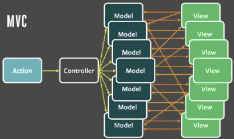
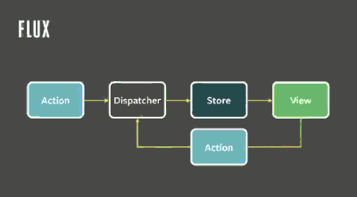
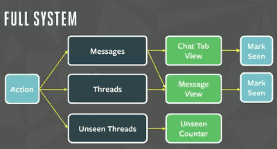
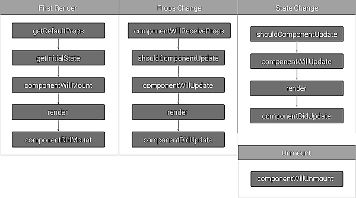
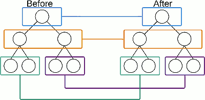
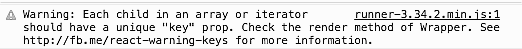
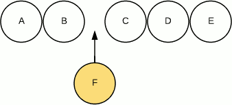
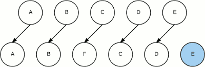
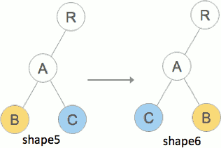

...menustart

 - [REACT philosophy](#67db2bb23bbcd103e2b1448bce31f0b8)
     - [React 设计哲学](#d26b45234dc50602ea7c69c46eb97488)
     - [简化的组件模型](#789c3baacb123e2aa9c07d961993f58d)
     - [每一次界面变化都是整体刷新](#c77d656b27ac9ad2c3d66e00ff104119)
     - [单向数据流动：Flux](#64a579910d2416b9cc1b2be9ece8b548)
     - [让数据模型也变简单：Immutability](#30bd7e6c2f9c04a028e11e2b41c36e77)
 - [JSX 和 组件](#69ca82177490266af8a006d12ee76d11)
     - [什么是 JSX](#e0733778840614eeeaafcef6abb8c2fa)
     - [为什么使用JSX](#375313758b588253eea15aafd307df29)
     - [JSX的语法](#ceaec762ddaa0f4c4786479ed1db6333)
     - [在JSX中使用事件](#d704b2ef48686bfeaf4c6431e7c31e22)
     - [在JSX中使用样式](#f2fc376b3fed4715ad9cfcdf05e7e792)
     - [使用自定义组件](#25f500e0d374330577b51164814a7535)
     - [Functional Components](#04cd8282a4db14156a55d4a62e1c787a)
     - [组件的概念和生命周期](#59f930043e5ce55808006dcd1262e219)
     - [使用Babel进行JSX编译](#1e6746fd5d3442b62adf875b5f109174)
 - [虚拟DOM Diff算法解析](#3b6ecd38b8f111baf6c8136bb4b7c3f3)
     - [什么是DOM Diff算法](#a1ce577d4d576b68f5635c12f31b0d76)
     - [不同节点类型的比较](#6db9696eda33d6675740fa5c55434a93)
     - [逐层进行节点比较](#756e4863062ce3a5013d4e3e7d0a3843)
     - [由DOM Diff算法理解组件的生命周期](#d7ac21bd6748a44799e6f5e9c3768f25)
     - [相同类型节点的比较](#77c133e682cae447b4af3f747ba01229)
     - [列表节点的比较](#0a7e79842e74b83e5fecc07e9d093643)

...menuend


<h2 id="67db2bb23bbcd103e2b1448bce31f0b8"></h2>


# REACT philosophy

<h2 id="d26b45234dc50602ea7c69c46eb97488"></h2>


## React 设计哲学

<h2 id="789c3baacb123e2aa9c07d961993f58d"></h2>


## 简化的组件模型

 - 所谓组件，就是状态机器
    - React将用户界面看做简单的状态机器。当组件处于某个状态时，那么就输出这个状态对应的界面。通过这种方式，就很容易去保证界面的一致性。
    - 在React中，你简单的去更新某个组件的状态，然后输出基于新状态的整个界面。React负责以最高效的方式去比较两个界面并更新DOM树。
 - 这种组件模型简化了我们思考的方式：对组件的管理就是对状态的管理。
    - 不同于其它框架模型，React组件很少需要暴露组件方法和外部交互
        - 例如，某个组件有只读和编辑两个状态。一般的思路可能是提供beginEditing()和endEditing()这样的方法来实现切换；
        - 而在React中，需要做的是setState({editing: true/false})。在组件的输出逻辑中负责正确展现当前状态。
 - 组件是React中构建用户界面的基本单位。它们和外界的交互除了状态（state）之外，还有就是属性（props）
    - 状态更多的是一个组件内部去自己维护，而属性则由外部在初始化这个组件时传递进来（一般是组件需要管理的数据）
    - React认为属性应该是只读的，一旦赋值过去后就不应该变化。

<h2 id="c77d656b27ac9ad2c3d66e00ff104119"></h2>


## 每一次界面变化都是整体刷新

 - 数据模型驱动UI界面的两层编程模型从概念角度看上去是直观的，而在实际开发中却困难重重。
 - 一个数据模型的变化可能导致分散在界面多个角落的UI同时发生变化。界面越复杂，这种数据和界面的一致性越难维护。
    - 在Facebook内部他们称之为“Cascading Updates”，即层叠式更新，意味着UI界面之间会有一种互相依赖的关系。
    - 开发者为了维护这种依赖更新，有时不得不触发大范围的界面刷新，而其中很多并不真的需要。
 - React的初衷之一就是，既然整体刷新一定能解决层叠更新的问题，那我们为什么不索性就每次都这么做呢？
    - React 做到了让框架自身去解决哪些局部UI需要更新的问题。实现途径就是通过虚拟DOM（Virtual DOM）。
 - Virtual DOM
    - 简而言之就是，UI界面是一棵DOM树，对应的我们创建一个全局唯一的数据模型
    - 每次数据模型有任何变化，都将整个数据模型应用到UI DOM树上
    - 由React来负责去更新需要更新的界面部分。
    - 这种方式不但简化了开发逻辑并且极大的提高了性能
 - 虚拟DOM（Virtual DOM）机制
    - 在浏览器端用Javascript实现了一套DOM API
    - 基于React进行开发时所有的DOM构造都是通过虚拟DOM进行，
        - 每当数据变化时，React都会重新构建整个DOM树，
        - 然后React将当前整个DOM树和上一次的DOM树进行对比，得到DOM结构的区别，
        - 然后仅仅将需要变化的部分进行实际的浏览器DOM更新。
    - React能够批处理虚拟DOM的刷新，在一个事件循环（Event Loop）内的两次数据变化会被合并
        - 例如你连续的先将节点内容从A变成B，然后又从B变成A，React会认为UI不发生任何变化
        - 而如果通过手动控制，这种逻辑通常是极其复杂的
    - 尽管每一次都需要构造完整的虚拟DOM树，但是因为虚拟DOM是内存数据，性能是极高的，
        - 而对实际DOM进行操作的仅仅是Diff部分，因而能达到提高性能的目的

<h2 id="64a579910d2416b9cc1b2be9ece8b548"></h2>


## 单向数据流动：Flux

 - 既然已经有了组件机制去定义界面，那么还需要一定的机制来定义组件之间，以及组件和数据模型之间如何通信。
 - Facebook提出了Flux框架用于管理数据流。
 - Flux是一个相当宽松的概念框架，同样符合React简单直观的原则。
    - 不同于其它大多数MVC框架的双向数据绑定，Flux提倡的是单向数据流动，即永远只有从模型到视图的数据流动。 
 - Flux 与 MVC
    - 
    - 
    - 一个 chat message的例子
        - 
 - in FLUX,  what we have are 
    - an action coming into the system
    - a dispatch for that sort of acts as the traffic controller for the whole thing 
        - every action is sent to all stores, via the callbacks the stores register with the dispatcher
    - the store which is the data layer that basically updates whenever you get a new action 
        - after stores update themselves in response to an action, they emit a change event
    - and the views we render whenever the stores say something has changed. 
        - and the from the view side , they can throw another action back into the system.
        - views listen for change events , retrieve the new data from the stores and provide the new data to the entire tree of their child view. 
 - the dispatcher here is the main piece that enforces that there is no cascading effects. 
    - once an action goes into the store you can't push another one in until the stores are compleltely finished processing it
 - Dispatcher和Action
    - dispatcher是一个全局的分发器负责接收Action，而Store可以在Dispatcher上监听到Action并做出相应的操作。
    - 简单的理解可以认为类似于全局的消息发布订阅模型。
    - Action可以来自于用户的某个界面操作，比如点击提交按钮；也可以来自服务器端的某个数据更新。当数据模型发生变化时，就触发刷新整个界面。
 - Flux的定义非常宽松，除了Facebook自己的实现之外, 比较流行的包括Flexible, Reflux, Flummox等等

<h2 id="30bd7e6c2f9c04a028e11e2b41c36e77"></h2>


## 让数据模型也变简单：Immutability

 - React提倡使用只读数据来建立数据模型
 - 假设有如下数据：

```
var employee = {
  name: ‘John’,
  age: 28
};
```

 - 如果要修改年龄，那么你需要产生一份新的数据：

```
var updated = {
  name: employee.name,
  age: 29
};
```
         
 - 这样，原来的employee对象并没有发生任何变化，相反，产生了一个新的updated对象，体现了年龄发生了变化。这时候需要把新的updated对象应用到界面组件上来进行界面的更新。


<h2 id="69ca82177490266af8a006d12ee76d11"></h2>


# JSX 和 组件

<h2 id="e0733778840614eeeaafcef6abb8c2fa"></h2>


## 什么是 JSX

 - React的核心机制之一就是虚拟DOM：可以在内存中创建的虚拟DOM元素。
    - React利用虚拟DOM来减少对实际DOM的操作从而提升性能。
 - 类似于真实的原生DOM，虚拟DOM也可以通过JavaScript来创建，例如：

```javascript
var child1 = React.createElement('li', null, 'First Text Content');
var child2 = React.createElement('li', null, 'Second Text Content');
var root = React.createElement('ul', { className: 'my-list' }, child1, child2);
```

 - 使用这样的机制，我们完全可以用JavaScript构建完整的界面DOM树，正如我们可以用JavaScript创建真实DOM。
    - 但这样的代码可读性并不好，于是React发明了JSX，利用我们熟悉的HTML语法来创建虚拟DOM：

```javascript
var root =(
  <ul className="my-list">
    <li>First Text Content</li>
    <li>Second Text Content</li>
  </ul>
);
``` 

 - 这两段代码是完全等价的，后者将XML语法直接加入到JavaScript代码中，让你能够高效的通过代码而不是模板来定义界面。
    - 之后JSX通过翻译器转换到纯JavaScript再由浏览器执行。
    - 在实际开发中，JSX在产品打包阶段都已经编译成纯JavaScript，JSX的语法不会带来任何性能影响。
    - 另外，由于JSX只是一种语法，因此JavaScript的关键字class, for等也不能出现在XML中，
        - 而要如例子中所示，使用className, htmlFor代替，这和原生DOM在JavaScript中的创建也是一致的。 
 - JSX本身并不是什么高深的技术，可以说只是一个比较高级但很直观的语法糖。
 - PS: 上面的代码中，我们把 `<ul>` 标签 分成了多行来书写，我们使用 `()` 来防止 JavaScript 自动插入分号 破坏原来的代码.

<h2 id="375313758b588253eea15aafd307df29"></h2>


## 为什么使用JSX

 - React直接放弃了模板而发明了JSX。
 - 看上去很像模板语言，但其本质是通过代码来构建界面，这使得我们不再需要掌握一门新的语言就可以直观的去定义用户界面：
    - 掌握了JavaScript就已经掌握了JSX。

<h2 id="ceaec762ddaa0f4c4786479ed1db6333"></h2>


## JSX的语法

 - JSX本身就和XML语法类似，可以定义属性以及子元素。
 - 唯一特殊的是可以用大括号来加入JavaScript表达式

```javascript
var person = <Person name={window.isLoggedIn ? window.name : ''} />;
```

 - 一般每个组件都定义了一组属性（props，properties的简写）接收输入参数
    - 这些属性通过XML标记的属性来指定。
 - 大括号中的语法就是纯JavaScript表达式，返回值会赋予组件的对应属性，因此可以使用任何JavaScript变量或者函数调用。
 - 上述代码经过JSX编译后会得到：

```javascript
var person = React.createElement(
  Person,
  {name: window.isLoggedIn ? window.name : ''}
);
```

<h2 id="d704b2ef48686bfeaf4c6431e7c31e22"></h2>


## 在JSX中使用事件

 - 90年代 HTML 写法

```
<button onclick="checkAndSubmit(this.form)">Submit</button>
```

 - 使用JavaScript来绑定事件，例如在jQuery中：

```
$('#my-button').on('click', this.checkAndSubmit.bind(this));
```

 - 在看到这段事件绑定和验证逻辑之前，你无法直观的看到有事件绑定在某个元素上
 - 幸运的是，现在JSX可以让事件绑定返璞归真：

```
<button onClick={this.checkAndSubmit.bind(this)}>Submit</button>
```

 - 和原生HTML定义事件的唯一区别就是JSX采用驼峰写法来描述事件名称，大括号中仍然是标准的JavaScript表达式，返回一个事件处理函数。
 - 在JSX中你不需要关心什么时机去移除事件绑定，因为React会在对应的真实DOM节点移除时就自动解除了事件绑定
 - React并不会真正的绑定事件到每一个具体的元素上，而是采用事件代理的模式：
    - 在根节点document上为每种事件添加唯一的Listener，然后通过事件的target找到真实的触发元素。
    - 这样从触发元素到顶层节点之间的所有节点如果有绑定这个事件，React都会触发对应的事件处理函数。这就是所谓的React模拟事件系统

<h2 id="f2fc376b3fed4715ad9cfcdf05e7e792"></h2>


## 在JSX中使用样式

 - 尽管在大部分场景下我们应该将样式写在独立的CSS文件中
    - 但是有时对于某个特定组件而言，其样式相当简单而且独立，那么也可以将其直接定义在JSX中。
 - 在JSX中使用样式和真实的样式也很类似，通过style属性来定义，
    - 但和真实DOM不同的是，属性值不能是字符串而必须为对象，例如：

```
<div style={{color: '#ff0000', fontSize: '14px'}}>Hello World.</div>
```

 - 上面的双括号
    - 外面的大括号是JSX的语法
    - 里面的大括号 是标准的JavaScript对象表达式
 - 所以，样式你也可以先赋值给一个变量，然后传进去，代码会更易读：

```
var style = {
  color: '#ff0000',
  fontSize: '14px'
};

var node = <div style={style}>HelloWorld.</div>;
```

 - 在JSX中可以使用所有的的样式，基本上属性名的转换规范就是将其写成驼峰写法
    - 例如“background-color”变为“backgroundColor”, “font-size”变为“fontSize”
    - 这和标准的JavaScript操作DOM样式的API是一致的。

 
<h2 id="25f500e0d374330577b51164814a7535"></h2>


## 使用自定义组件

 - 在JSX中，我们不仅可以使用React自带div, input...这些虚拟DOM元素，还可以自定义组件。
 - 组件定义之后，也都可以利用XML语法去声明
 - 能够使用的XML Tag就是在当前JavaScript上下文的变量名，这一点非常好用，你不必再去考虑某个Tag是如何对应到相应的组件实现
 - 例如React官方教程中的例子：

```javascript
class HelloWorld extends React.Component{
  render() {
    return (
      <p>
        Hello, <input type="text" placeholder="Your name here" />!
        It is {this.props.date.toTimeString()}
      </p>
    );
  }
};

setInterval(function() {
  React.render(
    <HelloWorld date={new Date()} />,
    document.getElementById('example')
  );
}, 500);
```

 - 其中声明了一个名为HelloWorld的组件，那么就可以在XML中使用
    - 这个Tag就是JavaScript变量名，我们可以用任意变量名：

```javascript
var MyHelloWorld = HelloWorld;
React.render(<MyHelloWorld />, …);
```

 - 甚至，我们还可以引入命名空间：

```javascript
var sampleNameSpace = {
  MyHelloWorld: HelloWorld
};
React.render(<sampleNameSpace.MyHelloWorld />, …);
```

 - 这些语法看上去有点怪，但是如果我们记住JSX语法只是JavaScript语法的一个语法映射，那么这些就非常容易理解了。


<h2 id="04cd8282a4db14156a55d4a62e1c787a"></h2>


## Functional Components

 - React supports a simpler syntax called functional components for component that only consist of a render method. 
 - rather than define a class extending React.Component, simply write a function that takes props and returns what should be rendered.


```
class Square extends React.Component {
  render() {
    return (
      <button className="square" onClick={() => this.props.onClick()}>
        {this.props.value}
      </button>
    );
  }
}
```

to

```
function Square(props) {
  return (
    <button className="square" onClick={props.onClick}>
      {props.value}
    </button>
  );
}
```

 - this.props -> props
 - onClick={() => props.onClick()} ->  onClick={props.onClick}


<h2 id="59f930043e5ce55808006dcd1262e219"></h2>


## 组件的概念和生命周期

 - 组件自身定义了一组props作为对外接口，展示一个组件时只需要指定props作为XML节点的属性。
 - 组件很少需要对外公开方法，唯一的交互途径就是props。
    - 这使得使用组件就像使用函数一样简单，给定一个输入，组件给定一个界面输出。
    - 当给予的参数一定时，那么输出也是一定的。
 - 如果整个项目完全采用React，那么界面上就只有一个组件根节点；
    - 如果局部使用React，那么每个局部使用的部分都有一个根节点。
 - 在Render时，根节点由React.render函数去触发： 

```
React.render(
  <App />,
  document.getElementById('react-root')
);
```

 - 而所有的子节点则都是通过父节点的render方法去构造的。
    - 每个组件都会有一个render方法，这个方法返回组件的实例，最终整个界面得到一个虚拟DOM树，再由React以最高效的方式展现在界面上。
 - 除了props之外，组件还有一个很重要的概念：state。
    - 组件规范中定义了setState方法，每次调用时都会更新组件的状态，触发render方法。
    - 需要注意，render方法是被异步调用的，这可以保证同步的多个setState方法只会触发一次render，有利于提高性能。
 - 和props不同，state是组件的内部状态，除了初始化时可能由props来决定，之后就完全由组件自身去维护。

 - initState

```
ES5

var TodoApp = React.createClass({
  propTypes: {
    title: PropTypes.string.isRequired
  },
  getInitialState () {
    return {
      items: []
    };
  }
});
ES6

class TodoApp extends React.Component {
  constructor () {
    super()
    this.state = {
      items: []
    }
  }
});
```

 - 在组件的整个生命周期中，React强烈不推荐去修改自身的props，因为这会破坏UI和Model的一致性，props只能够由使用者来决定。
 - 对于自定义组件，唯一必须实现的方法就是render()，除此之外，还有一些方法会在组件生命周期中被调用，如下图所示：



 method | desc
--- | ---
componentDidMount | 在组件第一次render之后调用，这时组件对应的DOM节点已被加入到浏览器。在这个方法里可以去实现一些初始化逻辑。
componentWillUnmount | 在DOM节点移除之后被调用，这里可以做一些相关的清理工作
shouldComponentUpdate | 这是一个和性能非常相关的方法，在每一次render方法之前被调用。它提供了一个机会让你决定是否要对组件进行实际的render,如下面的例子


```
// shouldComponentUpdate example
// 当此函数返回false时，组件就不会调用render方法
// 从而避免了虚拟DOM的创建和内存中的Diff比较
shouldComponentUpdate(nextProps, nextState) {
  return nextProps.id !== this.props.id;
}
```

<h2 id="1e6746fd5d3442b62adf875b5f109174"></h2>


## 使用Babel进行JSX编译

 - React官方博客发布了一篇文章，声明其自身用于JSX语法解析的编译器JSTransform已经过期，不再维护，
 - React JS和React Native已经全部采用第三方Babel的JSX编译器实现


<h2 id="3b6ecd38b8f111baf6c8136bb4b7c3f3"></h2>


# 虚拟DOM Diff算法解析

<h2 id="a1ce577d4d576b68f5635c12f31b0d76"></h2>


## 什么是DOM Diff算法

 - Web界面由DOM树来构成，当其中某一部分发生变化时，其实就是对应的某个DOM节点发生了变化。
 - 在React中，构建UI界面的思路是由当前状态决定界面。
    - 前后两个状态就对应两套界面，然后由React来比较两个界面的区别，这就需要对DOM树进行Diff算法分析。
 - 即给定任意两棵树，找到最少的转换步骤。
    - 但是标准的的Diff算法复杂度需要O(n³)
    - Facebook工程师 结合Web界面的特点做出了两个简单的假设，使得Diff算法复杂度直接降低到O(n)
        1. 两个相同组件产生类似的DOM结构，不同的组件产生不同的DOM结构；
        2. 对于同一层次的一组子节点，它们可以通过唯一的id进行区分。


<h2 id="6db9696eda33d6675740fa5c55434a93"></h2>


## 不同节点类型的比较

 - 为了在树之间进行比较，我们首先要能够比较两个节点
    - 在React中即比较两个虚拟DOM节点，分为两种情况：
        - 1) 节点类型不同 
        - 2) 节点类型相同，但是属性不同。

 - 先看第一种

 - 当在树中的同一位置前后输出了不同类型的节点，React直接删除前面的节点，然后创建并插入新的节点。
    - 假设我们在树的同一位置前后两次输出不同类型的节点。

```
// 根据假设1，直接删除旧节点，插入新节点
renderA: <div />
renderB: <span />
=> [removeNode <div />], [insertNode <span />]
```

<h2 id="756e4863062ce3a5013d4e3e7d0a3843"></h2>


## 逐层进行节点比较

 - 在React中，树的算法其实非常简单
    - 那就是两棵树只会对同一层次的节点进行比较。如下图所示：



 - React只会对相同颜色方框内的DOM节点进行比较，即同一个父节点下的所有子节点.
    - 当发现节点已经不存在，则该节点及其子节点会被完全删除掉，不会用于进一步的比较。
    - 这样只需要对树进行一次遍历，便能完成整个DOM树的比较。
 - 但因为React只会简单的考虑同层节点的位置变换，对于不同层的节点，只有简单的创建和删除。
    - 简单粗暴，没有其它复杂的操作
 
<h2 id="d7ac21bd6748a44799e6f5e9c3768f25"></h2>


## 由DOM Diff算法理解组件的生命周期

 - React组件的生命周期，其中的每个阶段其实都是和DOM Diff算法息息相关的。
 - 例如以下几个方法：

 method | desc
--- | ---
constructor | 构造函数，组件被创建时执行；
componentDidMount | 当组件添加到DOM树之后执行；
componentWillUnmount | 当组件从DOM树中移除之后执行，在React中可以认为组件被销毁；
componentDidUpdate | 当组件更新时执行。

 - 当DOM树进行如下转变时，即从“shape1”转变到“shape2”时。我们来观察这几个方法的执行情况：


```
C will unmount.
C is created.
B is updated.
A is updated.
C did mount.
D is updated.
R is updated.
```

<h2 id="77c133e682cae447b4af3f747ba01229"></h2>


## 相同类型节点的比较

 - 第二种节点的比较是相同类型的节点
 - React会对属性进行重设从而实现节点的转换。例如：

```
renderA: <div id="before" />
renderB: <div id="after" />
=> [replaceAttribute id "after"]
```

 - 虚拟DOM的style属性稍有不同，其值并不是一个简单字符串而必须为一个对象，因此转换过程如下

```
renderA: <div style={{color: 'red'}} />
renderB: <div style={{fontWeight: 'bold'}} />
=> [removeStyle color], [addStyle font-weight 'bold']
```

<h2 id="0a7e79842e74b83e5fecc07e9d093643"></h2>


## 列表节点的比较

 - 前面介绍过
    - 对于不在同一层的节点， 即使它们完全一样，也会销毁并重新创建
    - 那么当它们在同一层时，又是如何处理的呢？
    - 这就涉及到列表节点的Diff算法。
 - 相信很多使用React的同学大多遇到过这样的警告：
    - 
    - 这是React在遇到列表时却又找不到key时提示的警告。
    - 虽然无视这条警告大部分界面也会正确工作，但这通常意味着潜在的性能问题。因为React觉得自己可能无法高效的去更新这个列表。
 - 列表节点的操作通常包括添加、删除和排序。
 - 例如下图，我们需要往B和C直接插入节点F
    - 
    - 在jQuery中我们可能会直接使用$(B).after(F)来实现
    - 而在React中，我们只会告诉React新的界面应该是A-B-F-C-D-E，由Diff算法完成更新界面。
 - 这时如果每个节点都没有唯一的标识，React无法识别每一个节点，那么更新过程会很低效，即
    - 将C更新成F，D更新成C，E更新成D，最后再插入一个E节点。效果如下图所示：
    - 
    - 可以看到，React会逐个对节点进行更新，转换到目标节点。
 - 而如果给每个节点唯一的标识（key），那么React能够找到正确的位置去插入新的节点，入下图所示：
    - 
 - 对于列表节点顺序的调整其实也类似于插入或删除, 如我们把树的形态从shape5转换到shape6：
    - 
 - 即将同一层的节点位置进行调整。如果未提供key，那么React认为B和C之后的对应位置组件类型不同，因此完全删除后重建:

```
B will unmount.
C will unmount.
C is created.
B is created.
C did mount.
B did mount.
A is updated.
R is updated.
```

 - 而如果提供了key，如下面的代码：

```
shape5: function() {
  return (
    <Root>
      <A>
        <B key="B" />
        <C key="C" />
      </A>
    </Root>
  );
},

shape6: function() {
  return (
    <Root>
      <A>
        <C key="C" />
        <B key="B" />
      </A>
    </Root>
  );
},
```

```
C is updated.
B is updated.
A is updated.
R is updated.
```

 - 可以看到，对于列表节点提供唯一的key属性可以帮助React定位到正确的节点进行比较，从而大幅减少DOM操作次数，提高了性能。


