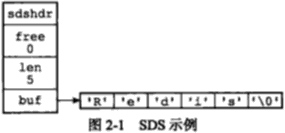
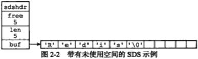
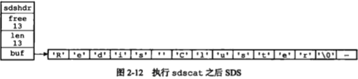
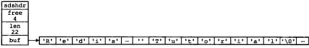
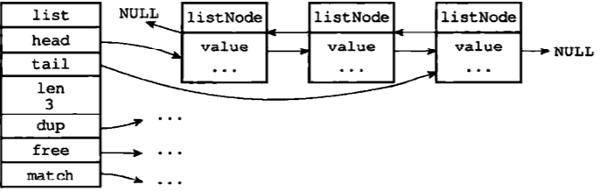
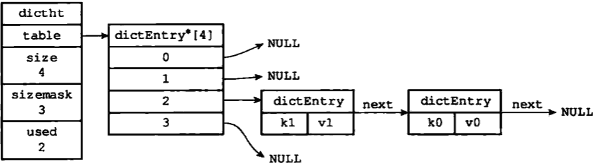

...menustart

- [Redis 设计与实现](#387f728bb737b1de0668033d5bc04a2c)
- [第一章](#ce87533fbd746b8a6487078028fd3162)
- [第二章 简单动态字符串](#c3e17e255aaa5c90ba15bf6b7b8dd4b6)
    - [SDS的定义](#0f2451d5f33972e84f60e9ce6d71de9b)
    - [2.2 SDS 与字符串的区别](#b9a03087283735023631acf642a4b59f)
        - [2.2.1 常数复杂度 获取字符串长度](#b24ce3884a7989b428894b5b9e6215ce)
        - [2.2.2 杜绝缓冲区溢出](#5aea993c723bbb93af487fc4a44f27b5)
        - [2.2.3 减少修改字符串时带来的内存重分配次数](#50a3e42afacfa5113a5ef835f81a59d7)
        - [2.2.4 二进制安全](#fe16b5423e86dd95dfb418659da3fa7b)
        - [2.2.5 兼容部分C字符串函数](#4f424f0cb00766fc9e0258ff7fb3e829)
- [第三章 链表](#439d12ff1033af4e6bf3e78f2128f30a)
    - [3.1 链表和链表节点的实现](#05ac251d0b38c1e50cbef0087d9fd554)
- [第四章   字典](#8f0b77251766e156d10a62eda7aee595)
    - [4.1 字典的实现](#44643e64f92d05a72f45815ae337e5b6)
        - [4.1.1 哈希表](#e7dc36fc51c2f9660dfc05e74e4ec583)
        - [4.1.2 哈希表节点](#fce41380aa44ee19ac351ee9d7a59085)
        - [4.1.3 字典](#841ac5fd6bd63c08630b8cc0a75dcbbe)
- [第五章 跳跃表](#2612dc58f20212db2dcff012cd5b8617)
- [第六章 整数集合](#c10c5d64f50d3fb431cbc1db2aae8cff)
    - [6.1 intset 的实现](#0a80aebc42b85969960d3c5d956bceff)
    - [6.2 升级](#08af8997852f2553061109773c143818)
- [第七章 压缩列表](#f5e6a4cb0a45c892103057b5310288b2)
    - [7.1 压缩列表的构成](#a904d0ab3439a7e3d3fd7ecd05ccbbb5)
    - [第八章 对象](#b0e63c6b769b17f06bfb543a76e01cc2)
    - [8.1 对象的类型与编码](#947cb22bf41ee653483c5d1d3f423fd3)
        - [8.1.1 类型](#d7cd82e64506ca8b3ab1f7f11af1a0b3)
        - [8.1.2 编码和底层实现](#21d79216e0e441f46a071bcd88345608)
    - [8.2 字符串对象](#ae2f50c1db56f741c9bfd0999dedc44d)
    - [8.3 列表对象](#5a404c7286437e234b57849758d1a9b4)
    - [8.4 哈希对象](#cee4aea24f032c607571fbc591125301)
    - [8.5 集合对象](#501265bd3c5a14475cb267973a51f749)
    - [8.6 有序集合对象](#592e43fbe94cfbf03322f3b26ef010cf)
    - [8.7 类型检查与命令多态](#9c04bfc98d085dc31480a7eee7b85a40)
        - [8.7.1 类型检查的实现](#e270c5e4384bbeeaf503b811edd3c14f)
    - [8.8 内存回收](#e378b5f1615057b62aac972540bbf4ea)
    - [8.9 对象共享](#cd5ef8edf476a73f609610fb36443aa7)
    - [8.10 对象的空转时长](#96dfd1728db8ce4dc55fad8c37ed1523)

...menuend


<h2 id="387f728bb737b1de0668033d5bc04a2c"></h2>


# Redis 设计与实现

[docker redis image](https://docs.docker.com/samples/library/redis)

```
# redis cli
docker run -it --link redis:redis --rm redis redis-cli -h redis -p 6379
```


- 需求: 实现类似微博的共同关注
    - 从集合的角度看，就是一个交集的概念。应该很容易实现？
    - 关系数据库并不直接支持 交集计算操作，要计算两个集合的交集，除了需要对两个数据表执行 JOIN操作意外，还需要对合并的结果去重DISTINCT操作，最终导致交集操作的实现变得异常复杂。
    - Redis 内置了集合数据类型，其中的交集计算操作可以直接用于实现这个共同关注功能。

<h2 id="ce87533fbd746b8a6487078028fd3162"></h2>


# 第一章

- Redis数据库里面的每个键值对 都是由 对象组成的，其中
    - 数据库键 总是一个字符串对象
    - 值可以是 字符串对象, list object, hash object, set object, sorted set object


<h2 id="c3e17e255aaa5c90ba15bf6b7b8dd4b6"></h2>


# 第二章 简单动态字符串

- Redis没有直接使用 C字符串( `\0` 结尾 )，而是自己构建了一种名为简单动态字符串(simple dynamic string ,SDS) 的抽象类型, 并将 SDS用作Redis默认字符串表示。
- 在Redis里面，C字符串只会作为 字符串常量string literal 用在一些无序对字符串值进行修改的地方，比如打印日志:
    - `redisLog(REDIS_WARNING, "Redis is now ready to exit, bye bye...");`
- 当 Redis需要一个可以被修改的字符串值时， Redis就会使用SDS来表示字符串。
    - 比如，Redis里的key-value pair 的键和值都是SDS
- 除了用来保存数据库中的字符串值之外， SDS还被用作缓冲区buffer: 
    - AOF模块中的AOF缓冲区, 以及客户端状态中的输入缓冲区，都是有SDS实现的。


<h2 id="0f2451d5f33972e84f60e9ce6d71de9b"></h2>


## SDS的定义

- 每个 `sds.h/sdshdr` 结构表示一个SDS值

```c
struct sdshdr {
    // 所保存字符串长度
    int len;
    // 纪录 buf数组中未使用字节的数量
    int free;
    // 字符串数组，用于保存字符串
    char buf[];    
}
``` 



- 上图， free 为0， 表示这个SDS没有分配任何未使用空间
    - len 为5，表示这个SDS保存了一个5字节长的字符串
    - buf 属性是一个 char[], 
- SDS 遵循了C字符串以 `\0`结尾的惯例，保存`\0`的1字节不计算在SDS的len属性里面
    - 为`\0`分配额外的1个字节，以及添加 `\0` 到字符串末尾的操作都是有SDS函数自动完成的。
    - 所以这个 `\0`  对于SDS的使用者是完全透明的。
    - 遵循 `\0` 结尾这一惯例的好处是，SDS可以直接重用一部分C字符串函数库里面的函数。
        - `printf( "%s" , s->buf );`




<h2 id="b9a03087283735023631acf642a4b59f"></h2>


## 2.2 SDS 与字符串的区别

<h2 id="b24ce3884a7989b428894b5b9e6215ce"></h2>


### 2.2.1 常数复杂度 获取字符串长度

- 因为C字符串 并不记录自身的长度信息，所以 获取长度必须遍历整个字符串O(n)
- 而SDS 获取长度复杂度为 O(1), 这确保了获取字符串长度的工作不会成为Redis的性能瓶颈.
    - 即使我们对一个非常长的 key做 STRLEN命令，也不会对系统系统造成任何影响。


<h2 id="5aea993c723bbb93af487fc4a44f27b5"></h2>


### 2.2.2 杜绝缓冲区溢出

- C 字符串不记录自身长度带来的另一个问题是容易造成缓冲区溢出
    - 如 `<string.h>/strcat` 拼接的时候不会做溢出检测
- 当 SDS API 需要对SDS进行修改是，API 会先检查SDS的空间是否满足修改所需的要求，如果不满足的话，API会自动将SDS的空间扩展至合适的大小，然后才执行实际的修改操作。

<h2 id="50a3e42afacfa5113a5ef835f81a59d7"></h2>


### 2.2.3 减少修改字符串时带来的内存重分配次数

- 每次增长/缩短一个C字符串， 程序总是要对保存这个C字符串的数据进行一次内存重分配操作。
    - 如 缩短一个字符串，需要通过重新分配内存来释放那部分不再使用的空间，如果忘记这一步，就会导致内存泄漏( 因为不记录长度信息？ )
- Redis作为数据库，数据会发生频繁修改，如果每次修改字符串的长度都需要执行一次内存重分配的话，会对性能造成严重影响。
- 为了避免C字符串的这种缺陷，SDS 通过 未使用空间 解除了 字符串长度和底层数组长度之间的关联。
    - 通过 未使用空间， SDS实现了空间预分配和惰性空间释放两种优化策略。
        - 1. 空间预分配 
            - 对SDS进行空间扩展时，不仅会为SDS分配修改所必须的空间，还会分配和修改后长度相同的未使用空间，但是最大不会超过1MB.
            - 
            - 如果这时，我们执行 `sdscat( s " Tutorial" )` , 那么这次sdscat 将不需要执行内存重分配，因为未使用空间的13字节足以保存 9字节的" Tutorial"
            - 
            - 注: 's' 后的省略号表示若干字符省略
        - 2. 惰性空间释放
            - 缩短SDS保存的字符串时， 程序并不立即使用内存重分配来回收缩短后 多出来的字节，而是使用 free属性将这些字节的数量纪录起来，并等待将来使用。 
            - SDS 也提供了相应的API，让我们可以在有需要时，真正的释放SDS的未使用空间，所以不必担心内存浪费。


<h2 id="fe16b5423e86dd95dfb418659da3fa7b"></h2>


### 2.2.4 二进制安全

- 二进制数据经常会包含 `\0` , 这给字符串处理带来了很大麻烦。
- SDS API 都是 binary-safe的。

<h2 id="4f424f0cb00766fc9e0258ff7fb3e829"></h2>


### 2.2.5 兼容部分C字符串函数

- 虽然SDS 是二进制安全的，但它们一样遵循C字符串以 `\0`结尾的惯例
    - API 总会将SDS保存的数据的末尾设置为 `\0`
    - 这是为了让那些保存文本数据的SDS可以重用一部分 <sting.h> 库定义的函数.


<h2 id="439d12ff1033af4e6bf3e78f2128f30a"></h2>


# 第三章 链表

- 发布/订阅， 慢查询， 监视器 等功能都用到了 链表

<h2 id="05ac251d0b38c1e50cbef0087d9fd554"></h2>


## 3.1 链表和链表节点的实现

```c
// adlist.h/listNode
typedef struct listNode {
    struct listNode *prev ;
    struct listNode *next ;
    void *value ;
} listNode ;
```

```c
// addlist.h/list
typedef struct list {
    listNode *head;
    listNode *tail;
    // 链表所包含的节点数量
    unsigned long len ;
    void *(*dup)(void *ptr) ;
    void *(*free)(void *ptr) ;
    int (*match)(void *ptr, void *key) ;
} list ;
```



- Redis 链表实现的特点：
    - 双端， 获取某个节点的 prev / next  的复杂度都是 O(1)
    - 无环， 表头的 prev 和 表尾的next 都指向 NULL, 对表的访问以 NULL结束
    - 带 head, tail 指针:  获取链表 头/尾节点的 复杂度 O(1)
    - 带长度计数器 : 获取 链表长度的时间复杂度 O(1)
    - 多态: 链表节点使用 `void *` 指针来保存节点值


<h2 id="8f0b77251766e156d10a62eda7aee595"></h2>


# 第四章   字典

- Redis 的 key-value pair 本身就是 使用字典作为底层实现的
- 字典也是 哈希键的底层实现之一 ， 当一个哈希键 包含的键值对 比较对，又或者键值对中的元素都是 比较长的字符串时， Redis就会使用字典作为哈希键的底层实现

<h2 id="44643e64f92d05a72f45815ae337e5b6"></h2>


## 4.1 字典的实现

- Redis的字典 使用 哈希表作为底层实现， 一个哈希表里面可以有 多个哈希表节点， 而每个哈希表节点就保存了 字典中的一个 键值对。

<h2 id="e7dc36fc51c2f9660dfc05e74e4ec583"></h2>


### 4.1.1 哈希表

```c
// dict.h/dictht
typedef struct dictht {
    // 哈希表数据
    dictEntry **table ;
    // 哈希表大小
    unsigned long size ;
    // 哈希表大小掩码，用于计算索引值
    unsigned long sizemask ;
    // 该哈希表 已有的节点数量    
    unsigned long used ;
} dictht; 
```

- 每个 dictEntry 保存一个 键值对
- size 记录 数组 table 的大小
- used 记录了 哈希表当前 已有的节点(键值对)的数量


<h2 id="fce41380aa44ee19ac351ee9d7a59085"></h2>


### 4.1.2 哈希表节点

```c
typedef struct dictEntry {
   void *key;
   union {
        void *val;
        uint64_tu64;    
        int64_ts64;    
   } v ; 
   // 形成单向链表
   struct dictEntry *next;
} dictEntry ;
```

- next 用于解决 键冲突的问题




<h2 id="841ac5fd6bd63c08630b8cc0a75dcbbe"></h2>


### 4.1.3 字典

```c
// dict.h/dict
typedef struct dict {
    dictType *type;
    void *privdata;
    dictht ht[2];
    // rehash 索引
    // 当 rehash 不在进行时，值为-1
    int rehashidx ;  
} dict ;
```

- type 和 privdata 属性时针对不同类型的键值对， 为创建多台字典而设置的
    - type 指向 dictType结构， 每个 dictType 保存了一簇用于操作特定类型键值对的函数，Redis会为用途同步的字典设置不同的类型特定函数
    - privdata 则保存了 需要传给那些类型特定函数的可选参数
- ht 包含两个 dictht ， 一般只用 ht[0], ht[1] 只会在对 ht[0] 进行 rehash时使用
- rehashidx 用于记录 rehash 目前的进度, 如果没在 rehash，值为-1


<h2 id="2612dc58f20212db2dcff012cd5b8617"></h2>


# 第五章 跳跃表

- skiplist 是一种有序的数据结构，它通过在每个节点中 维持多个指向其他节点的指针，从而达到快速访问节点的目的。
- skiplist 支持平均 O(logN), 最坏 O(N) 的节点查找， 还可以通过顺序性操作来 批量处理节点
- 大部分情况下，skiplist 效率可以和平衡树 相媲美 ， 而且因为跳跃表的实现比平衡树要来得更为简单，所以有不少程序都使用跳跃表来代替平衡树。
- Redis 使用 skiplist 作为有序集合键的底层实现之一
- Redis 只在两个地方用到了 skiplist 
    - 一个是实现有序集合键
    - 另一个是 在集群节点中用作内部数据结构


<h2 id="c10c5d64f50d3fb431cbc1db2aae8cff"></h2>


# 第六章 整数集合

- intset 是集合键的底层实现之一， 当一个集合只包含 整数值元素，并且这个集合的元素数量不多时， Redis就会使用整数集合作为集合键的底层实现

```
redis:6379> SADD numbers 1 3 5 7 9
(integer) 5
redis:6379> OBJECT ENCODING numbers
"intset"
```

<h2 id="0a80aebc42b85969960d3c5d956bceff"></h2>


## 6.1 intset 的实现

- intset 可以保存类型为 int16_t, int32_t 或 int64_t 的整数值， 并且保证集合中 不会出现重复的元素

```c
typedef struct intset {
    uint32_t encoding;
    // 集合包含的元素数量
    unit32_t length ;
    // 保存元素的数组
    int8_t contents[]
} intset ;
```

- contents 中的元素 按值的大小， 从小打大 有序排列
- 虽然 intset 将 contents 声明为 int8_t 类型的数组，但实际上 contents 数组并不保存任何 int8_t 类型的值， contents 数组的真正类型 取决于 encoding 属性的值
    - 如果 encoding 为 INTSET_ENC_INT16, 那么 contents 就是一个 int16_t 类型的数组，数组中的每个项 都是一个 int16_t 整数.
- contents 的长度 ， 等于 length * sizeof( 元素类型占用的字节数 )

<h2 id="08af8997852f2553061109773c143818"></h2>


## 6.2 升级

- 当添加一个新的元素进来，但是 新元素的类型 当前的encoding 类型 要长时， intset 需要先进行升级 upgrade.
    - 扩展 contents 空间大小
    - 将底层数组现有的所有元素都转换成 与新元素相同的类型， 放置到新的位置上
    - 将新元素添加到底层数组里面
- intset 不支持 降级操作
 

<h2 id="f5e6a4cb0a45c892103057b5310288b2"></h2>


# 第七章 压缩列表

- ziplist 是 列表键和哈希键的底层实现之一。
- 当一个 列表键只包含少量 列表项， 并且每个列表项 要么就是 小整数值，要么就是 短字符串， 那么Redis就会使用 ziplist 来做列表键的底层实现
- 另外，当一个哈希键 只包含少量键值对， 并且 键/值 都是 小整数值或 短字符串， Redis也会使用 ziplist.

<h2 id="a904d0ab3439a7e3d3fd7ecd05ccbbb5"></h2>


## 7.1 压缩列表的构成

- 压缩列表 是 Redis 为了节约内存而开发的， 是由一些列 特殊编码的连续内存块 组成的顺序型(sequential) 数据结构.
- 一个 ziplist 可以包含任意多个节点，  每个节点可以保存一个 字节数组 或者 一个 整数值。


<h2 id="b0e63c6b769b17f06bfb543a76e01cc2"></h2>


## 第八章 对象

- Redis 并没有直接使用上面介绍的各种数据结构来实现 键值对数据库， 而是基于这些数据结构 创建了一个 对象系统
    - 这个系统包含了 字符串对象， 列表对象， 哈希对象， 集合对象， 和有序集合对象 这五种类型的对象。
- 我们可以针对 不同的使用场景， 为对象设置多种不同的数据结构实现， 从而优化对象在不同场景下的使用效率。
- Redis的对象系统还实现了基于 引用计数的内存回收机制
- 最后，Redis 对象带有访问时间记录信息， 该信息可以用于计算数据库键的空转时常， 在服务器启动了 maxmemory 功能的情况下， 空转时常较大的那些键可以会优先被服务器删除。
 

<h2 id="947cb22bf41ee653483c5d1d3f423fd3"></h2>


## 8.1 对象的类型与编码

- redis 数据库中的键和值都是对象。
- redis 中的每个对象都由一个 redisObject 结构表示

```c
typedef struct redisObject {
    unsigned type:4;
    unsigned encoding:4;
    // 指向底层实现数据结构的指针
    void *ptr ; 
    // ...    
} robj ;
```

<h2 id="d7cd82e64506ca8b3ab1f7f11af1a0b3"></h2>


### 8.1.1 类型

- type 属性纪录对象的类型


 类型常量 | 对象的名称 | TYPE 命令输出
--- | --- | ---
REDIS_STRING | 字符串对象 | string
REDIS_LIST | 列表对象 | list
REDIS_HASH | 哈希对象 | hash
REDIS_SET | 集合对象   | set 
REDIS_ZSET | 有序集合对象 | zset


``` 
redis> TYPE msg
string
```

<h2 id="21d79216e0e441f46a071bcd88345608"></h2>


### 8.1.2 编码和底层实现

- 对象的 ptr 指针指向 对象的底层实现数据结构，而这些数据结构 由encoding 属性决定


 encoding常量 |  对应的底层数据结构 | OBJECT ENCODING 输出
---  | --- | ---
REDIS_ENCODING_INT |  long int | int
REDIS_ENCODING_EMBSTR |  embstr编码的 SDS | embstr
REDIS_ENCODING_RAW | SDS | raw
REDIS_ENCODING_HT |  字典 | hashtable
REDIS_ENCODING_LINKEDLIST |  双端链表 | linkedlist
REDIS_ENCODING_ZIPLIST |  压缩列表  | ziplist
REDIS_ENCODING_INTSET |  整数集合  | intest
REDIS_ENCODING_SKIPLIST | 跳跃表和字典 | skiplist


- 每种类型的对象都至少使用了两种不同的编码


 类型 |  encoding | 对象
--- | --- | ---
REDIS_STRING | REDIS_ENCODING_INT | 使用整数值 实现的字符串对象
REDIS_STRING | REDIS_ENCODING_EMBSTR | 使用 embstr编码实现
REDIS_STRING | REDIS_ENCODING_RAW | 使用SDS实现
REDIS_LIST | REDIS_ENCODING_ZIPLIST | 使用压缩表实现
REDIS_LIST | REDIS_ENCODING_LINKEDLIST | 使用双端链表实现
REDIS_HASH | REDIS_ENCODING_ZIPLIST | 使用压缩列表实现
REDIS_HASH | REDIS_ENCODING_HT | 使用字典实现
REDIS_SET | REDIS_ENCODING_INTSET | 使用整数集合实现
REDIS_SET | REDIS_ENCODING_HT | 使用字典实现
REDIS_ZSET | REDIS_ENCODING_ZIPLIST | 使用压缩列表实现
REDIS_ZSET | REDIS_ENCODING_SKIPLIST | 使用跳跃表和字典实现


- `OBJECT ENCODING`命令查看对象编码

```
redis:6379> set msg "hello world"
OK
redis:6379> OBJECT ENCODING msg
"embstr"
```

- 根据性能需要，redis会自动调整对象使用的 encoding 和 底层实现


<h2 id="ae2f50c1db56f741c9bfd0999dedc44d"></h2>


## 8.2 字符串对象

- 编码可以是 int, raw, embstr
- 如果 一个字符串对象保存的是整数值， 并且这个整数可以用long表示， 那么就使用int 编码 ( 将 `void *` 转换成 long  )

```
redis:6379> SET number 10086
OK
redis:6379> OBJECT ENCODING number
"int"
redis:6379> SET number "10086"
OK
redis:6379> OBJECT ENCODING number
"int"
```

- 如果字符串对象保存的是一个字符串值， 并且这个字符串值的长度 > 44 字节，那么就使用 raw编码, 否则使用 embstr 

```
redis:6379> SET story "long, long ago there .aaaaaaaaaaaaaaaaaa.   " 
OK
redis:6379> STRLEN story
(integer) 44
redis:6379> OBJECT ENCODING story
"embstr"
redis:6379> SET story "long, long ago there .aaaaaaaaaaaaaaaaaa.    " 
OK
redis:6379> STRLEN story
(integer) 45
redis:6379> OBJECT ENCODING story
"raw"
```

- embstr 编码是专门用于保存短字符串的一种优化编码方式。
- 下表是 字符串对象保存 各类型值的编码方式


 值 | 编码
--- | ---
可以用long类型保存的整数 | int
可以用 long double 类型保存的**浮点数** | embstr 或 raw
字符串值，或者无法用 long/long doulbe保存的数值 |  embstr 或 raw


<h2 id="5a404c7286437e234b57849758d1a9b4"></h2>


## 8.3 列表对象

- 编码可以是 ziplist 或 linked list
- 当列表对象 可以同时 满足以下两个条件是， 使用 ziplist 编码, 否则使用 linked list
    - 1. 列表对象 所保存的所有字符串元素的长度 都小于64字节
    - 2. 列表对象保存的元素数量小于 512个，


<h2 id="cee4aea24f032c607571fbc591125301"></h2>


## 8.4 哈希对象

- 哈希对象可以是 ziplist 或 tashtable
- 当同时满足以下两个条件时，哈希对象使用 ziplist 编码
    - 1. 哈希对象 保存的所有键值对的 键和值的字符串长度都小于64字节
    - 2. 哈希对象 保存的键值队数量 小于512个


<h2 id="501265bd3c5a14475cb267973a51f749"></h2>


## 8.5 集合对象

- 编码可以是 intset 或 hashtable
- 当同时满足以下两个条件时，使用intset
    - 1. 所有元素都是整数值
    - 2. 元素数量不超过 512

<h2 id="592e43fbe94cfbf03322f3b26ef010cf"></h2>


## 8.6 有序集合对象

- 编码可以是 ziplist 或 skiplist
- 当同时满足以下两个条件时，使用 ziplist
    - 1. 元素数量小于 128个
    - 2. 元素成员的长度都小于 64字节


<h2 id="9c04bfc98d085dc31480a7eee7b85a40"></h2>


## 8.7 类型检查与命令多态

- Redis 用于 操作 key 的命令基本上 分为两种类型
- 其中一种命令 可以对任何类型的键执行， 比如
    - DEL, EXPIRE, RENAME, TYPE, OBJECT 等
- 而另一种命令只能对特定类型的key执行，比如
    - SET, GET, APPEND, STRLEN 只能用于 字符串key
    - HDEL, HSET, HGET, HLEN  只能用于 哈希key
    - RPUSH, LPOP, LINSERT, LLEN 只能用于 列表key
    - SADD, SPOP, SINTER, SCART 只能用于 集合key
    - ZADD, ZCARD, ZRANK, ZSCORE 只能用于 有序集合key


<h2 id="e270c5e4384bbeeaf503b811edd3c14f"></h2>


### 8.7.1 类型检查的实现

- 在执行一个类型特定的命令之前， Redis会先检查输入键的类型是否正确，然后再决定是否执行给定的命令
- 类型检查使用 redisObject结构的 type属性来实现


<h2 id="e378b5f1615057b62aac972540bbf4ea"></h2>


## 8.8 内存回收

- redis 使用引用计数的内存回收机制
- 每个对象的引用计数信息 由 redisObject 结构的 refcount 属性纪录：

```c
typedef struct redisObject {
    // ...
    int refcount;
    // ...
} robj ;
```

- 当 refcount 为0时，对象所占用的内存会被释放

<h2 id="cd5ef8edf476a73f609610fb36443aa7"></h2>


## 8.9 对象共享

- 对象的 refcount 属性还有对象共享的作用。
- 假设 key A 创建了一个 整数值100的字符串对象，这时如果 key B也要创建一个 整数值100的字符串对象， 那么redis可以有两种做法:
    - 1. 为 key B 新建一个 字符串对象
    - 2. 让 key A 和 key B 共享同一个对象， 显然这样做更节约内存
- redis中， 让多个key 共享 一个value 需要执行以下两个步骤
    - 1. 将 key 的 值指针 指向一个现有的对象
    - 2. 将被共享的值对象的引用计数 +1
- 目前来说， Redis 会在初始化服务器时， 创建一万个字符串对象， 这些对象包含了从 0到9999 的所有整数值，
    - 当服务器需要用到值为 0到9999的字符串对象时， 服务器就会使用这些共享对象，而不是新创建对象。

```
redis:6379> SET A 100
OK
redis:6379> OBJECT REFCOUNT A
(integer) 2147483647
```


<h2 id="96dfd1728db8ce4dc55fad8c37ed1523"></h2>


## 8.10 对象的空转时长

- redisObject 结构还包含一个 名为 lru 的属性，该属性记录了对象最后一次被命令程序访问的时间

```c
typedef struct redisObject {
        // ...
        unsigned lru:22;
        // ...
} robj;
```

- `OBJECT IDLETIME` 可以打印给定 key的空转时长 = 当前时间-lru时间 , 单位秒
    - `OBJECT IDLETIME` 命令是特殊的，它不会修改 lru的值

```
redis:6379> OBJECT IDLETIME B
(integer) 20
```

- 如果服务器打开了 maxmemory 选项， 并且服务器用于 回收内存的算法为 volatile-lru 或者 allkeys-lru, 那么当服务器占用的内存数 超过了 maxmemory 选项所设置的上限值时， 空转时长较高的那部分键会 优先被 服务器释放，从而回收内存。
- 配置： maxmemory, maxmemory-policy

----

