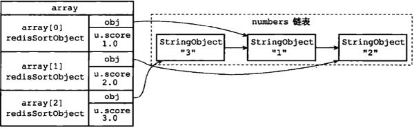
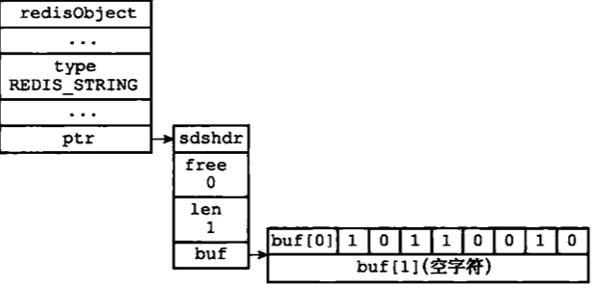
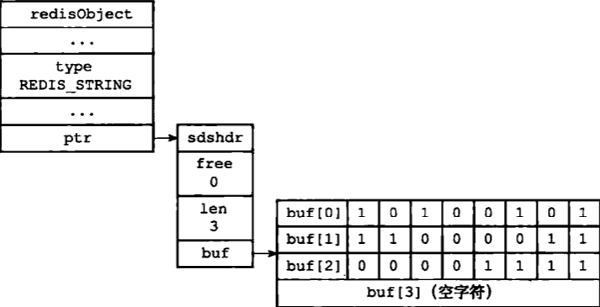

...menustart

- [第4部分 独立功能的实现](#df38bbe2a4af790c40b09b4166f7cd18)
- [第18章  发布与订阅](#964eeccfeea4a36c1736f2e5a57d1936)
    - [18.1 频道的订阅与退订](#06ae8f1a3c62b1b2f86eaf94eaf16a95)
    - [18.2 模式的订阅和退订](#57376f3b970f2fa57e1395386936e16a)
    - [18.3  发送消息](#d29e119278212c7ebc10e295e8537d37)
    - [18.4 查看订阅信息](#109b71be8b317986473c5dfea90cf2dc)
        - [18.4.1 PUBSUB CHANNELS](#f4ed095f5f37088707ed460c010630af)
        - [18.4.2  PUBSUB NUMSUB](#5768c710779e10adb7b6ac9772a0ab4b)
        - [18.4.3 PUBSUB NUMPAT](#c54263018f8148338bf46a8d46bf6c31)
- [第19章  事务](#87cde6ca54c7579c03f69be070dd141b)
    - [19.1 事务的实现](#efd312b27b5968e83fc3763546a4083a)
        - [19.1.1  事务开始](#832549cf829596df424ce8fe8fcc7ae1)
        - [19.1.2 命令入队](#163e958e079058bd91fc09d892070cb8)
        - [19.1.3 事务队列](#98fc14fcc3aa0ea174ff99dc98acd2ce)
        - [19.1.4 执行事务](#a2769c0c7bfc442d2ed32b1821b406c1)
    - [19.2 WATCH 命令的实现](#40d7a197f4d7802573ddb3741cec9901)
        - [19.2.1 使用 WATCH 命令监视 数据库key](#f69269c4b0fefb086441b343bb3bd69c)
        - [19.2.2 监视机制的触发](#71eec7edb0e465feb174dbb7a805762e)
        - [19.2.3 判断事务是否安全](#f37824e7144573b13696356a88310c66)
    - [19.3 事务的ACID性质](#5910e65d9e1898114ba68ef5aa5124a9)
- [第20章  Lua 脚本](#bdd07bac10a5c190d07d7da0b6e5262b)
    - [20.1 创建并修改 Lua环境](#8e13c8c836d81c99a7b8989bf49ff176)
        - [20.1.1 创建Lua环境](#08c32bfcc6dd8ba085bd89dc3b60e47a)
        - [20.1.3 创建 global table -- redis](#f3716d66535360016ee1c2f8f143d090)
        - [20.1.4  Redis Lua的随机函数](#320e921a509acf5f53e5865162e2cbef)
        - [20.1.5 创建排序辅助函数](#09b113a02594419ad610060d36c7757d)
        - [20.1.6 redis.pcall 函数的错误报告辅助函数](#9d3823c412cc867c5f9b84f7c2ab3814)
        - [20.1.7 保护 Lua的全局环境](#9e88edb771987464623d7b8ceea6c5d9)
        - [20.1.8 将 Lua环境保存到服务器状态的 lua属性里面](#54370b6dbbd2e6cb81f19079c5ac064a)
    - [20.2 Lua 环境协作组件](#7f48d61252f581eae9861e6f213b4119)
        - [20.2.1 伪客户端](#5a2bddf043ce45f378296dd0dbe723a5)
        - [20.2.2 lua_scripts 字典](#b24debb9c12c4bd3b56f9a4804d91af1)
    - [20.3  EVAL命令的实现](#f71560aef16e627ab080511bffca4666)
        - [20.3.1 定义脚本函数](#e5ac86dc960af6b95902862f4de6c281)
        - [20.3.2  脚本保存到 lua_scripts 字典](#3dd6b835b4010ffc4bca7a0051314bd6)
        - [20.3.3 执行脚本函数](#f00951bee4bbca174fd91b03528ec826)
            - [EVAL 语法](#43e063e6dbb818871b624b2fb3271309)
            - [执行过程](#61ee803db76c4a4ad421b3b984edb1a4)
            - [脚本的原子性](#986c35df0da4b7fc1f5f024406bc842d)
    - [20.4 lua 和 redis 通信](#fceebe04bb59a00b53434168656d5408)
        - [Redis to Lua conversion table.](#6beb0a3b94586776779ad6180080dbce)
        - [Lua to Redis conversion table.](#8c7f7ce5672b4f0fc08bf31d3fa3fedf)
        - [important rules to note:](#88883a183878359a8fa1d7629847d304)
    - [20.5 脚本管理命令的实现](#1df406401550a6a7d98cc7f798be128c)
    - [20.5.1 include third party library](#80f52ee50ddaafdd1e3ad14ec385358c)
    - [20.6 脚本复制](#0728c02dd7b51dcf7102925e1b013d78)
        - [20.6.2 复制 EVALSHA 命令](#a6ceeaf4494914d850150dc707837495)
        - [20.7 redis 集群和 lua 脚本](#20f2c099ee2880c7a3f268657b394f9a)
- [第21章 排序](#8b7e6e4e7ba14f17536a734562b5f28f)
    - [21.1 SORT key 命令的实现](#c62b77fb4e06a3ca43f809411a8a6a00)
    - [21.2 ALPHA 选项的实现](#b079e3077212764095facc17223159fc)
    - [21.3 ASC选项 和 DESC 选项的实现](#c870e6c991230e2406edcb5b8b5fb13c)
    - [21.4 BY 选项的实现](#6e485766032658c95966060f67c8ba0a)
    - [21.5 带有ALPHA选项的BY选项的实现](#e667b92bc65c794901ce2a5c6ed6aa05)
    - [21.6 LIMIT 选项的实现](#25f5d57661e7396017dabac798e1532a)
    - [21.7  GET选项实现](#9b66c377235226caeed9907a45c3eeab)
    - [STORE 选项的实现](#e827f3cf644b0fa8c422b250b175ece2)
    - [21.9 多个选项的执行顺序](#9842cb1c660f7bf9b088ef1c7457b73b)
        - [21.9.1 选项的执行顺序](#4272f1ffef6354d1545f6a04f04887ca)
        - [29.9.2 选项的摆放顺序](#46c9c370774b781b2cbc3ed9cc644051)
- [第22章 二进制位数组](#be26e27ba9a2192ff9ba71abe4189252)
    - [22.1 位数组的表示](#c1526473ffa8c6b4c03daceb2a9b56b8)
- [第23章 慢查询日志](#f787db5001caad44b970aa8c22b64219)
- [第24章 监视器](#5f558a433b25327fc447a899fac6fa9d)

...menuend


<h2 id="df38bbe2a4af790c40b09b4166f7cd18"></h2>


# 第4部分 独立功能的实现

<h2 id="964eeccfeea4a36c1736f2e5a57d1936"></h2>


# 第18章  发布与订阅

 - PUBLISH, SUBSCRIBE, PSUBSCRIBE 等命令组成
 - 通过 SBUSCRIBE 命令， 客户端可以 订阅一个 或多个频道 ， 每当有 其他客户端向 被订阅的频道发送消息 (message) 时，频道的所有订阅者 都会收到这条消息
    - `SUBSCRIBE "news.it"`
    - `PUBLISH "news.it" "hello"`
 - 客户端还可以通过 PSUBSCRIBE 命令订阅 一个或多个 **模式**
    - `"new.[ie]t"` 


<h2 id="06ae8f1a3c62b1b2f86eaf94eaf16a95"></h2>


## 18.1 频道的订阅与退订

```
SUBSCRIBE "news.sport" "news.movie"
UNSUBSCRIBE "news.sport" "news.movie"
```

<h2 id="57376f3b970f2fa57e1395386936e16a"></h2>


## 18.2 模式的订阅和退订

```
PSUBSCRIBE "news.*"
PUNSUBSCRIBE "news.*"
```


<h2 id="d29e119278212c7ebc10e295e8537d37"></h2>


## 18.3  发送消息

```
PUBLISH <channel> <message>
```

<h2 id="109b71be8b317986473c5dfea90cf2dc"></h2>


## 18.4 查看订阅信息
 
 - PUBSUB 可以查看 频道或模式的相关信息， 比如 某个频道目前有多少个 订阅者， 又或者 某个模式目前有多少个订阅者， 等等


<h2 id="f4ed095f5f37088707ed460c010630af"></h2>


### 18.4.1 PUBSUB CHANNELS

```
PUBSUB CHANNELS [pattern]
```

 - 用于返回服务器当前被订阅的频道 
    - 如果不给定 pattern 参数， 返回当前被订阅的所有频道
    - 如果给定 pattern 参数， 返回 与 pattern 匹配的 被订阅频道


<h2 id="5768c710779e10adb7b6ac9772a0ab4b"></h2>


### 18.4.2  PUBSUB NUMSUB

```
PUBSUB NUMSUB [channel-1 channel-2 ... channel-n] 
```

 - 返回 指定频道的 订阅者数量


<h2 id="c54263018f8148338bf46a8d46bf6c31"></h2>


### 18.4.3 PUBSUB NUMPAT

 - 返回 被订阅模式的数量


<h2 id="87cde6ca54c7579c03f69be070dd141b"></h2>


# 第19章  事务

 - Redis 通过 MULTI, EXEC, WATCH 等命令 来实现事务 transaction 功能。
 - 事务提供了一种  将多个命令请求打包， 然后一次性， 按顺序的执行多个命令的机制
    - 并且在事务 执行期间， 服务器不会中断事务， 它会将事务中的所有命令都执行完毕， 然后才去处理其他客户端的命令请求。
        - 注意，仅仅是执行阶段才会特殊处理
        - 在 事务入队列阶段，仍然会执行其他客户端的请求。
        - 所以 需要 WATCH指令来配合 确保 入队期间，没有重要的数据被 修改。
 - 以下是一个事务执行的过程, 首先以一个 MULTI 命令开始， 接着将多个命令放入事务当中，最后由 EXEC 命令将这个事务提交 给服务器执行。

```
redis:6379> MULTI
OK
redis:6379> set name "Practical Common Lisp"
QUEUED
redis:6379> GET name
QUEUED
redis:6379> SET author "Peter Seibel"
QUEUED
redis:6379> GET author
QUEUED
redis:6379> EXEC
1) OK
2) "Practical Common Lisp"
3) OK
4) "Peter Seibel"
```

<h2 id="efd312b27b5968e83fc3763546a4083a"></h2>


## 19.1 事务的实现

 - 一个事务从开始到结束通常会  经历以下三个阶段
    - 1. 事务开始
    - 2. 命令入队
    - 3. 事务执行

<h2 id="832549cf829596df424ce8fe8fcc7ae1"></h2>


### 19.1.1  事务开始

```
redis:6379> MULTI
OK
```

 - MULTI 可以将 执行该命令的客户端从 非事务状态 切换至 事务状态
    - 通过在 客户端状态的 flags 属性中 打开 REDIS_MULTI 标志来完成
 - 伪代码:


```
def MULTI():
    client.flags |= REDIS_MULTI
    replyOK()
```


<h2 id="163e958e079058bd91fc09d892070cb8"></h2>


### 19.1.2 命令入队

 - 当一个客户端处于非事务状态时， 这个客户端发送的命令会立即 被服务器执行:
 - 当一个客户端切换到 事务状态后， 服务器会根据这个客户端发来的不同命令，执行不能的操作
    - 如果是 EXEC, DISCARD, WATCH, MULTI 中的一个， 那么服务器会 立即执行这个命令
    - 如果是其他命令， 那么服务器并不会立即执行这个命令，而是放入一个事务队列里面， 然后向客户端 返回QUEUED 回复。


<h2 id="98fc14fcc3aa0ea174ff99dc98acd2ce"></h2>


### 19.1.3 事务队列

 - 每个redis客户端都有自己的事务状态 mstate 属性：

```c
typedef struct redisClient {
    // ...
    multiState mstate ;     
    // ... 
}
```

 - 事务状态包含一个事务队列， 以及一个 已入队命令的计数器，也即 事务队列的长度

```c
typedef struct multiState {
    multiCmd *commands;
    int count ;    
} multiState;
```

<h2 id="a2769c0c7bfc442d2ed32b1821b406c1"></h2>


### 19.1.4 执行事务

 - EXEC 命令会立即被服务器执行。 服务器会遍历 这个客户端的事务队列， 执行队列中保存的所有命令， 最后将 结果全部 返回给客户端。


<h2 id="40d7a197f4d7802573ddb3741cec9901"></h2>


## 19.2 WATCH 命令的实现

 - WATCH 是一个 乐观锁 optimistic locking, 它 可以在 EXEC 命令执行之前， 监视任意数量的数据库key，并在 EXEC命令执行时， 检查被监视的key 是否至少有一个 已经被修改过了。
    - 如果是的话， 服务器将 拒绝执行事务， 并向客户端返回代表 事务执行失败的 nil 回复


```
redis:6379> EXEC
(nil)
```


时间  |   客户端A | 客户端B
--- | --- | ---
T1 |  WATCH name  | 
T2 | MULTI  | 
T3 | SET name "peter" | 
T4 |   |  SET name "john"
T5 |  EXEC -> nil | 


 - 或者使用单个客户端模拟


```
redis:6379> WATCH name
OK
redis:6379> SET name "A"
OK
redis:6379> MULTI
OK
redis:6379> EXEC
(nil)
```

<h2 id="f69269c4b0fefb086441b343bb3bd69c"></h2>


### 19.2.1 使用 WATCH 命令监视 数据库key

 - 每个redis数据库都保存着一个 watched_keys 字典， 这个字典的key是某个被 WATCH命令监视的数据库键，而value 是一个链表， 记录了所有监视 相应key的客户端

```c
typedef struct redisDb {
    // ...
    dict *watched_keys ;
    // ...
} redisDB ;;
```

<h2 id="71eec7edb0e465feb174dbb7a805762e"></h2>


### 19.2.2 监视机制的触发

 - 所有对数据库进行修改的命令，如 SET, LPUSH, SADD, ZREM, DEL, FLUSHDB 等等，在执行之后都会调用 `multi.c/touchWatchKey` 函数对 watched_keys字典进行检查， 查看是否有客户端正在监视 刚刚被修改过的 key
    - 如果有的话，那么 touchWatchKey 函数 会将相关客户端的 REDIS_DIRTY_CAS 表示打开， 表示该客户端的 事务安全性 已经被破坏。


<h2 id="f37824e7144573b13696356a88310c66"></h2>


### 19.2.3 判断事务是否安全

 - 当服务器接收到一个客户端发来的 EXEC 命令时， 服务器会根据这个客户端是否打开了 REDIS_DIRTY_CAS 标识来决定是否执行


<h2 id="5910e65d9e1898114ba68ef5aa5124a9"></h2>


## 19.3 事务的ACID性质

 - 在 Redis中， 事务总是具有原子性 Atomicity, 一致性 Consistency 和 隔离型 Isolation, 并且当 Redis运行在 某种特定的持久化模式下， 事务也具有耐久性 Durability.
 - 原子性
    - 事务要么全部执行，要么就一个都不执行
    - 不像传统的关系型数据库， Redis不支持 事务回滚机制。 即时事务队列中的某个命令执行出错了， 整个事务也会继续执行下去
 - 一致性
    - Redis 通过谨慎的检测和简单的设计 来保证事务的一致性. 对于 Redis事务可能出错的地方，Redis 做了妥善处理
        - 1. 入队错误
            - 如果一个事务 在入队命令的过程中，出现了 命令不存在，或 格式不正确 等情况，那么Redis将拒绝执行这个事务
        - 2. 执行错误
            - 出错的命令会被服务器识别出来，并进行相应错误处理，所以这些出错的命令不会对数据进行任何修改， 也不会对事务的一致性产生任何影响
        - 3. 服务器停机
            - 略
 - 隔离性
    - 隔离性是指， 即时数据库中 有多个事务并发的执行，各个事务之间也不会相互影响， 并且在并发状态下执行的事务和串行执行的事务产生的结果完全相同
    - 因为 Redis 是单线程方式 执行事务，以及事务队列中的命令， 并且服务器保证， 在执行事务期间不会对事务进行中断，因此，Redis的事务总是以串行的方式运行的，并且事务也总是具有隔离性的。

 - 耐久性
    - 耐久性是指， 当一个事务执行完毕， 所得结果已经被保存到永久性存储介质里面了。 即使事务执行完毕后停机， 所得结果也不会消失
    - Redis 事务的耐久性， 由Redis所使用的 持久化模式决定:
        - 内存模式下， 事务不具有耐久性
        - RDB 模式下， 也不具有耐久性。
        - AOF 模式下， 只有 appendfsync 设置为 always 时， 事务才具有 耐久性
    - 不论 Redis 在什么模式下运作， 在一个事务的最后加上 SAVE 命令， 总可以保证事务的耐久性
        - 不过这种方法 不具有实用性，效率太低

```
redis:6379> MULTI
OK
redis:6379> SET msg "hello"
QUEUED
redis:6379> SAVE
QUEUED
redis:6379> EXEC
1) OK
2) OK
```


<h2 id="bdd07bac10a5c190d07d7da0b6e5262b"></h2>


# 第20章  Lua 脚本

 - 2.6 版本开始引入对Lua脚本支持
 - 使用 EVAL 命令可以直接对 输入的脚本求值:

```
redis:6379> EVAL "return 'hello world'" 0
"hello
```

 - 使用 EVALSHA 命令可以根据脚本的 SHA1 来对脚本进行求职， 但这个命令要求 SHA1 对应的脚本 必须至少被 EVAL 命令执行过一次, 或者 曾经被 SCRIPT LOAD 命令载入过

```
redis:6379> SCRIPT LOAD "return 2*2"
"4475bfb5919b5ad16424cb50f74d4724ae833e72"
redis:6379> EVALSHA 4475bfb5919b5ad16424cb50f74d4724ae833e72 0
(integer) 4
```


<h2 id="8e13c8c836d81c99a7b8989bf49ff176"></h2>


## 20.1 创建并修改 Lua环境

 - Redis 服务器创建并修改 Lua 环境的整个过程由以下几个步骤组成
    - 1. 创建一个基础Lua环境，之后的所有修改都是针对这个环境进行的
    - 2. 载入多个函数库到Lua环境里面，让Lua脚本可以使用这些函数库来进行数据操作
    - 3. 创建全局table redis,  包含了对Redis进行操作的函数， 比如用于在 Lua脚本中执行 Redis命令的redis.call 函数
    - 4. 使用 Redis自制的随机函数来替换 Lua原有的带有副作用的随机函数.
    - 5. 创建排序辅助函数， Lua环境使用这个 辅助函数来对一部分 Redis命令的结构进行排序， 从而消除这些命令的不确定性
    - 6. 创建 redis.pcall 函数的错误报告辅助函数， 这个函数可以提供更详细的出错信息
    - 7. 对Lua环境中的全局环境进行保护， 防止用户在执行 Lua脚本的过程中， 将额外的全局变量添加到Lua环境中
    - 8. 将修改完的Lua环境保存到 服务器状态的 lua属性中， 等待执行服务器传来的Lua脚本


<h2 id="08c32bfcc6dd8ba085bd89dc3b60e47a"></h2>


### 20.1.1 创建Lua环境

 - `lua_open`
 - 载入函数库
    - base library:  
    - table
    - string
    - math
    - Lua cjson
    - Lua Struct 
        - 用于在 Lua值和C结构之间进行转换 
        - 函数 struct.pack 将多个 Lua值打包成一个类结构 (struct-like)  字符串
        - struct.unpack 则从一个类结构字符串中 解包出多个Lua值。
    - Lua cmsgpack 
        - 用于处理 MessagePack格式的数据
        - cmsgpack.pack  将 lua值转换为 MessagePack 数据
        - cmsgpack.unpack 反之
    - bitop


<h2 id="f3716d66535360016ee1c2f8f143d090"></h2>


### 20.1.3 创建 global table -- redis

 - redis 表 包含以下函数:
    - redis.call , redis.pcall
    - redis.log :   redis.LOG_DEBUG , redis.LOG_VERBOSE, redis.LOG_NOTICE, redis.LOG_WARNING
    - 用于计算 SHA1 的 redis.sha1hex 函数
    - 用于返回错误信息的 redis.error_reply , redis.status_reply 
 - 这些命令中，最重要也是最常用的就是 redis.call 和 redis.pcall , 使用这两个函数，用户可以直接在 Lua脚本中 执行Redis命令:


```
redis:6379> EVAL "return redis.call('PING')" 0
PONG
```

 - redis.call() 和 redis.pcall() 的唯一区别在于它们对错误处理的不同。
 - 当 redis.call() 在执行命令的过程中发生错误时，脚本会停止执行，并返回一个脚本错误，错误的输出信息会说明错误造成的原因：

```
redis> lpush foo a
(integer) 1

redis> eval "return redis.call('get', 'foo')" 0
(error) ERR Error running script (call to f_282297a0228f48cd3fc6a55de6316f31422f5d17): ERR Operation against a key holding the wrong kind of value
```

 - redis.pcall() 出错时并不引发(raise)错误，而是返回一个带 err 域的 Lua 表(table)，用于表示错误：

```
redis 127.0.0.1:6379> EVAL "return redis.pcall('get', 'foo')" 0
(error) ERR Operation against a key holding the wrong kind of value
```


<h2 id="320e921a509acf5f53e5865162e2cbef"></h2>


### 20.1.4  Redis Lua的随机函数

 - 为了保证相同的脚本 可以在 不同的机器上产生相同的作用， Redis 要求所有传入服务器的Lua脚本，以及Lua环境中的所有函数，都必须是无side effect 的 pure function.
 - 但是 math.random 和 math.randomseed 函数都是由 side effect 的， 它们不符合 Redis 对Lua环境的无 side effect 要求
    - 所以redis 用自己的函数 替代了 math.random 和 math.randomseed 
    - 对于相同的seed 来说， math.random 总产生相同的随机数序列， 这个函数是一个  pure function
    - 除非在脚本中使用 math.randomseed 显示的修改 seed, 否则每次运行脚本时， Lua环境都使用固定的 math.randomseed(0) 语句来初始化 seed


<h2 id="09b113a02594419ad610060d36c7757d"></h2>


### 20.1.5 创建排序辅助函数

 - 对于lua脚本来说，另一个可能产生不一致数据的地方是那些 带有不确定性质的命令。
 - 比如对于一个set key 来说， set 元素的排列是无序的
 - Redis 将 SMEMBERS 这种在相同的数据集上 可能会产生不同输出的命令 称为"带有不确定性的命令", 包括 ：
    - SINTER
    - SUNION
    - SDIFF
    - SMEMBERS
    - HKEYS
    - HVALS
    - KEYS
 - 为了消除这些不确定性， 服务器会为 Lua环境创建一个排序辅助函数 `__redis__compare__helper` 
    - 当 Lua脚本执行完一个带有不确定性的命令之后， 程序会使用这个函数作为 compare 函数， 自动调用 table.sort 函数将命令的返回值做一次排序，以此来保证相同的数据集总是产生相同的输出。


<h2 id="9d3823c412cc867c5f9b84f7c2ab3814"></h2>


### 20.1.6 redis.pcall 函数的错误报告辅助函数

 - `__redis__err_handler` 
 - `redis.pcall` 执行的命令 出现错误时，  `__redis__err_handler`  就会打印出错代码的来源和发生错误的行数，为程序的调试提供方便


<h2 id="9e88edb771987464623d7b8ceea6c5d9"></h2>


### 20.1.7 保护 Lua的全局环境

 - 对Lua环境中的全局环境进行保护，确保 脚本不会因为 忘记使用local关键字 而将额外的全局变量 添加到Lua环境里面。
 - 因为 全局变量保护的原因， 当一个脚本试图创建一个 全局变量时， 服务器将报告一个错误

```
redis:6379> EVAL "x = 10" 0
(error) ... : Script attempted to create global variable 'x'
```

 - 除此之外， 试图 获取一个不存在的全局变量， 也会引发一个错误


```
redis:6379> EVAL "return x" 0
(error) ... : Script attempted to access nonexistent global variable 'x'
```

 - 不过 Redis 并不禁止 用户修改已存在的全局变量， 所以在执行 Lua脚本的时候， 必须非常小心， 以免 错误地修改了已存在的全局变量 , 比如 redis ...


<h2 id="54370b6dbbd2e6cb81f19079c5ac064a"></h2>


### 20.1.8 将 Lua环境保存到服务器状态的 lua属性里面

 - 因为 Redis 使用 串行化方式来执行 Redis命令， 所以在特定的时间里， 最多都只会有一个脚本能够放进Lua环境里面运行， 因为 整个Redis服务器只需要创建一个Lua环境即可。


<h2 id="7f48d61252f581eae9861e6f213b4119"></h2>


## 20.2 Lua 环境协作组件

 - Redis 服务器还创建了两个用于 与 Lua环境进行协作的组件
    - 负责执行Lua脚本中的Redis命令的 伪客户端
    - 以及 用于保存Lua脚本的 lua_scripts 字典

<h2 id="5a2bddf043ce45f378296dd0dbe723a5"></h2>


### 20.2.1 伪客户端

 - 因为执行 Redis 命令必须有响应的客户端状态， 所以为了执行Lua脚本中的Redis命令， Redis 专门为Lua环境创建了一个伪客户端。
 - Lua脚本使用 redis.call / redis.pcall 执行一个redis 命令，需要完成以下步骤:
    - 1. Lua  环境将 要执行的命令 传给 伪客户端
    - 2. 伪客户端 将命令传给 命令执行器
    - 3. 命令执行器 执行命令， 将结果返回 伪客户端
    - 4. 伪客户端接收命令执行器返回的命令结果， 并将这个命令结果返回给Lua环境
    - 5. Lua环境 将结果返回给 redis.call / redis.pcall 函数
    - 6. redis.call / redis.pcall 将命令经过作为 函数返回值，返回给脚本中的调用者

<h2 id="b24debb9c12c4bd3b56f9a4804d91af1"></h2>


### 20.2.2 lua_scripts 字典

 - key 位 lua脚本的SHA1  checksum，而 value 则是 SHA1 对应的 Lua脚本
 - Redis 服务器会将所有被 EVAL 命令执行过的 Lua脚本， 以及所有被 SCRIPT LOAD 命令载入过的 Lua 脚本 都保存到 lua_scripts 字典里面
 - lua_scripts 有两个作用
    - 实现 SCRIPT EXISTS 命令
    - 实现 脚本复制功能


<h2 id="f71560aef16e627ab080511bffca4666"></h2>


## 20.3  EVAL命令的实现

 - EVAL 命令执行过程 分为3个步骤：
    - 1 根据 lua脚本， 在 Lua环境中定义一个Lua函数
    - 2 将lua脚本 保存到 lua_scripts 
    - 3 执行刚刚定义的 lua函数


<h2 id="e5ac86dc960af6b95902862f4de6c281"></h2>


### 20.3.1 定义脚本函数

 - 函数名字 由 `f_` + SHA1  组成， 函数体 则是脚本本身
 - 对于命令
    - `EVAL "return 'hello world'"` 0
 - 服务器将在  Lua环境定义一下函数


```lua
function f_5332031c6b470dc5a0dd9b4bf2030dea6d65de91 ()
    return 'hello world'
end
```


```
// 验证一下 sha1
redis:6379> EVAL "return redis.sha1hex( \"return 'hello world'\" )" 0
"5332031c6b470dc5a0dd9b4bf2030dea6d65de91"
```

 - 使用函数来保存 传入的脚本有以下好处：
    - 执行脚本的步骤非常简单， 只要调用与脚本相对应的函数即可
    - 通过函数的局部性 来让lua环境保持清洁， 减少垃圾回收的工作量，并避免了 使用全局变量
    - 如果某个脚本 对应的函数在 Lua环境中 被定义过至少一次， 那么只要记得这个脚本的 sha1 ， 服务器就可以在 不知道脚本本身的情况下， 直接通过调用 函数来执行脚本，这是 EVALSHA 命令的实现原理。


<h2 id="3dd6b835b4010ffc4bca7a0051314bd6"></h2>


### 20.3.2  脚本保存到 lua_scripts 字典

 - 对于命令
    - `EVAL "return 'hello world'"` 0
 - EVAL 命令要做的第一件事 是将客户端传入的脚本保存到 服务器的 lua_scripts 字典里
    - key 是 sha1 
    - value 就是 脚本本身 `return 'hello world'`


<h2 id="f00951bee4bbca174fd91b03528ec826"></h2>


### 20.3.3 执行脚本函数

<h2 id="43e063e6dbb818871b624b2fb3271309"></h2>


#### EVAL 语法

```
EVAL script numkeys key [key ...] arg [arg ...]

   <1> script：     你的lua脚本
   <2> numkeys:  key的个数
   <3> key:         redis中各种数据结构的替代符号
   <4> arg:         你的自定义参数

example: 

eval "return {KEYS[1],KEYS[2],ARGV[1],ARGV[2]}" 2 username age jack 20
```

 - `username` , `age` 被 保存到 lua环境的 KEYS 数组
 - 剩下的参数被保存到lua环境的 ARGV 数组
 - 最后，从 KEYS/ARGV 数组中 取的数据 返回

<h2 id="61ee803db76c4a4ad421b3b984edb1a4"></h2>


#### 执行过程

 - 定义函数，保存脚本 完成后， 服务器还需要进行一些 设置钩子，传入参数之类的准备动作， 才能正是开始执行脚本
 - 整个准备和执行脚本的过程如下：
    - 1 将 EVAL 命令中 传入的 key name 参数 和 arg 参数 分别保存到 KEYS / ARGV 数组， 然后将 这两个数组作为全局变量 传入到 Lua环境里面
    - 2 为 Lua环境装载超时 处理钩子 hook , 这个钩子可以在 脚本出现超时运行情况时， 让客户端通过 SCRIPT KILL 命令停止脚本， 或者通过 SHUTDOWN 命令直接关闭服务器。
    - 3 执行脚本函数
    - 4 移除之前装载的钩子
    - 5 将 结果保存到 客户端状态的输出缓冲区里面，等待服务器 将结果返回给客户端
    - 6 对 Lua环境执行垃圾回收工作


<h2 id="986c35df0da4b7fc1f5f024406bc842d"></h2>


#### 脚本的原子性

 - Redis 使用单个 Lua 解释器去运行所有脚本，并且， Redis 也保证脚本会以原子性(atomic)的方式执行
    - 当某个脚本正在运行的时候，不会有其他脚本或 Redis 命令被执行。
    - 这和使用 MULTI / EXEC 包围的事务很类似。

<h2 id="fceebe04bb59a00b53434168656d5408"></h2>


## 20.4 lua 和 redis 通信

Conversion between Lua and Redis data types

<h2 id="6beb0a3b94586776779ad6180080dbce"></h2>


### Redis to Lua conversion table.

 - Redis integer reply -> Lua number
 - Redis bulk reply -> Lua string
 - Redis multi bulk reply -> Lua table (may have other Redis data types nested)
 - **Redis status reply** -> Lua table with a single ok field containing the status
 - **Redis error reply** -> Lua table with a single err field containing the error
 - Redis Nil bulk reply and Nil multi bulk reply -> Lua false boolean type
 
<h2 id="8c7f7ce5672b4f0fc08bf31d3fa3fedf"></h2>


### Lua to Redis conversion table.

 - Lua number -> Redis integer reply (the number is converted into an integer)
 - Lua string -> Redis bulk reply
 - Lua table (array) -> Redis multi bulk reply (truncated to the first nil inside the Lua array if any)
 - Lua table with a single ok field -> Redis status reply
 - Lua table with a single err field -> Redis error reply
 - Lua boolean false -> Redis Nil bulk reply.

There is an additional Lua-to-Redis conversion rule that has no corresponding Redis to Lua conversion rule:

 - Lua boolean true -> Redis integer reply with value of 1.

<h2 id="88883a183878359a8fa1d7629847d304"></h2>


### important rules to note:

 - **If you want to return a float from Lua you should return it as a string**
    - Lua has a single numerical type, Lua numbers.
    - There is no distinction between integers and floats. 
    - So we always convert Lua numbers into integer replies, removing the decimal part of the number if any.


<h2 id="1df406401550a6a7d98cc7f798be128c"></h2>


## 20.5 脚本管理命令的实现

 - 除了 EVAL 和  EVALSHA 命令之外， Redis中 与Lua脚本相关的命令还有4个:
    - SCRIPT FLUSH , SCRIPT EXISTS , SCRIPT LOAD , SCRIPT KILL

 - SCRIPT FLUSH 命令用于清除 服务器中所有和Lua 脚本有关的信息，
    - 释放并重建 lua_scripts
    - 关闭现有的lua环境，并重建一个新的Lua环境
 - SCRIPT EXISTS 
    - 根据输入的 sha1 ， 测试 对应的脚本是否存在与服务器中


```
redis:6379> SCRIPT EXISTS 5332031c6b470dc5a0dd9b4bf2030dea6d65de91
1) (integer) 1
```

 - SCRIPT LOAD
    - 和 EVAL 命令执行脚本所做的前两部 完全一样
    - Lua环境中 定义函数
    - 脚本保存到 lua_scripts


```
redis:6379> SCRIPT LOAD "return 'hi'"
"2f31ba2bb6d6a0f42cc159d2e2dad55440778de3"
redis:6379> EVALSHA 2f31ba2bb6d6a0f42cc159d2e2dad55440778de3 0
"hi"
```

 - SCRIPT KILL
    - 如果服务器配置了 lua-time-limit 配置选项， 那么在每次执行Lua脚本之前， 服务器都会在 Lua环境里面 设置一个超时处理钩子 hook.
    - 一旦钩子发现脚本的运行时间 超过了 lua-time-limit 选项设置的时长， 钩子将定期在 脚本运行的间隙， 查看是否有 SCRIPT KILL 或 SHUTDOWN 命令到达服务器
    - 如果超时脚本 未执行过任何写入操作， 那么客户端可以通过 SCRIPT KILL 命令来只是服务器停止执行这个脚本， 并返回一个错误回复。
    - 处理完 SCRIPT KILL 命令后，服务器可以继续运行
    - 另一方面，如果脚本已经 执行过写入操作，那么客户端只能用 SHUTDOWN nosave 命令来停止服务器，从而防止不合法的数据被写入数据库中。


<h2 id="80f52ee50ddaafdd1e3ad14ec385358c"></h2>


## 20.5.1 include third party library

 - 你不能这么做
 - The only way around this is to refactor the library and turn it into a Redis script that you can run。
    - The refactored script can then be a part of your script, or you can SCRIPT LOAD it and call it from your script using an undocumented feature 
    - in you script call the function f_sha1

```lua
return _G['f_' .. lua_sha_matchFinishCheck ](  )
```

 - redis lua 脚本都是通过 KEYS, ARGV 接收参数。
    - 所以像上面那样主动调用 脚本， 传入参数并没有用， 而是需要 在函数调用设置好 KEYS, ARGV 


<h2 id="0728c02dd7b51dcf7102925e1b013d78"></h2>


## 20.6 脚本复制

 - 与其他命令一样， 当服务器运行在  复制模式模式下时， 具有写性质的脚本命令 也会被复制到从服务器
    - 这些命令包括 EVAL命令，EVALSHA命令， SCRIPT FLUSH命令，以及 SCRIPT LOAD 命令
 - EVAL , SCRIPT FLUSH , SCRIPT LOAD 命令相对都简单
 - EVALSHA 的复制操作是最复杂的一个, 因为 主服务器 与 从服务器载入 Lua脚本的情况 可能有所不同
    - 主服务器 不能像复制 其他3个命令那样， 直接将 EVALSHA 命令传播给从服务器

<h2 id="a6ceeaf4494914d850150dc707837495"></h2>


### 20.6.2 复制 EVALSHA 命令

 - 对于一个 在主服务器被成功执行的 EVALSHA命令来说，相同的EVALSHA 命令在从服务器执行时却可能会出现 脚本not found 的错误
 - Redis要求 主服务器在 传播 EVALSHA 命令的时候，必须确保 EVALSHA 命令要执行的脚本 已经被所有的 从服务器载入过，如果不能确保这一点的话，主服务器会将 EVALSHA 命令转换为一个等价的 EVAL 命令
 - 传播 EVALSHA 命令，或 转换为 EVAL 命令， 都需要用到服务器状态的 lua_scripts 和 repl_scriptcache_dict 字典

 - 1 判断传播 EVALSHA 命令是否安全的方法
    - 主服务器使用服务器状态的 repl_scriptcache_dict 字典 记录自己已经将哪些脚本传播给了所有从服务器。
    - 如果一个脚本的 sha1  存在与 lua_scripts ， 却 不存在与 repl_scriptcache_dict , 说明脚本并没有传播给所有从服务器
 - 2 清空 repl_scriptcache_dict 字典
    - 每当 主服务器添加一个新的 从服务器时， 主服务器都会清空 自己的 repl_scriptcache_dict 字典， 强制自己重新向 所有从服务器 传播脚本
 - 3 EVALSHA 转换成 EVAL 命令
 - 4 传播 EVALSHA 或 EVAL 命令


<h2 id="20f2c099ee2880c7a3f268657b394f9a"></h2>


### 20.7 redis 集群和 lua 脚本

 - Redis操作（无论是 commands 还是Lua脚本）只能在所有key位于同一服务器上时才能工作。 
    - lua 脚本的 key传递规则的目的 就是允许群集服务器找出 该把脚本发送到哪个节点，并在所有key不来自同一服务器时fast fail. 
    - 所以 你要确保 脚本要操作的所有key位于同一服务器上。 
        - The way to do that is to use hash tags to force keys to hash to the same slot
        - See [documents](http://redis.io/topics/cluster-spec#keys-hash-tags)  for more details on that.
 - Redis cluster
    - Redis Cluster实现了Redis的非分布式版本中可用的所有单key命令。 
    - 执行复杂的多key操作（Set type unions or intersections）的命令也可以实现，只要这些键都属于同一个节点。
    - Redis Cluster实现了一个称为**hash tag**的概念，可用于强制某些key存储在同一节点中。
        - 但是，在手动重新分片期间( manual resharding )，多key操作可能会在一段时间内不可用，而单key操作始终可用。
    - Redis Cluster does not support multiple databases
        - There is just database 0 and the **SELECT** command is not allowed.
    - 在Redis群集中，节点负责保存数据并获取群集的状态，包括将key映射到正确的节点。 
        - 群集节点还能够自动发现其他节点，检测非工作节点，并在需要时 promote slave nodes to master ，以便在发生故障时继续运行。
    - The base algorithm used to map keys to hash slots is
        - `HASH_SLOT = CRC16(key) mod 16384`
    - Keys hash tags
        - 计算key hash 有一个例外：hash tag
        - hash tag 是一种确保在同一个 hash slot 中分配多个key的方法。 这用于在Redis群集中实现多键操作。
        - 如果key包含 `{...}`模式，则仅对 { 和  }之间的子字符串进行hash以获取 hash slot。
        - 但是，由于可能存在多次{或}，因此以下规则可以很好地指定算法：
            - IF the key contains a { character.
            - AND IF there is a } character to the right of {
            - AND IF there are one or more characters between the first occurrence of { and the first occurrence of }.
            - Then instead of hashing the key, only what is between the first occurrence of { and the following first occurrence of } is hashed.
        - Examples:
            - The two keys `{user1000}.following` and `{user1000}.followers` will hash to the same hash slot 
            - For the key `foo{}{bar}` the whole key will be hashed as usually since the first occurrence of { is followed by } on the right without characters in the middle.
            - For the key `foo{{bar}}zap` the substring `{bar` will be hashed
            - For the key `foo{bar}{zap}` the substring bar will be hashed
            - 如果key以{}开头，则和一般情况一样,保证整个散列。 当使用二进制数据作为键名时，这很有用。


<h2 id="8b7e6e4e7ba14f17536a734562b5f28f"></h2>


# 第21章 排序

 - Redis 的 SORT 命令可以对列表键， 集合键， 或者有序集合键 的值进行排序

```
redis:6379> RPUSH numbers 5 3 1 4 2
(integer) 5
redis:6379> LRANGE numbers 0 -1
1) "5"
2) "3"
3) "1"
4) "4"
5) "2"
redis:6379> SORT numbers
1) "1"
2) "2"
3) "3"
4) "4"
5) "5"
```

```
redis:6379> SADD alphabet a b c d e f g
(integer) 7
redis:6379> SMEMBERS alphabet
1) "b"
2) "a"
3) "d"
4) "e"
5) "g"
6) "c"
7) "f"
redis:6379> SORT alphabet ALPHA
1) "a"
2) "b"
3) "c"
4) "d"
5) "e"
6) "f"
7) "g"
```

 - 下面的例子 使用了 SORT 命令和 BY 选项， 以 jack_number , peter_number, tom_number 3个键的值为权重， 对有序集合 test-result 中的 jack, peter, tom 三个成员进行排序

```
redis:6379> ZADD test-result 3.0 jack 3.5 peter 4.0 tom
(integer) 3
redis:6379> ZRANGE test-result 0 -1
1) "jack"
2) "peter"
3) "tom"

redis:6379> MSET peter_number 1 tom_number 2 jack_number 3
OK
redis:6379> SORT test-result  BY *_number
1) "peter"
2) "tom"
3) "jack"
```


<h2 id="c62b77fb4e06a3ca43f809411a8a6a00"></h2>


## 21.1 SORT key 命令的实现

 - `SORT <key>` 可以对一个包含数字value 的 key 进行排序

```
redis:6379> RPUSH numbers 3 1 2
(integer) 3
redis:6379> SORT numbers
1) "1"
2) "2"
3) "3"
```

 - 服务器执行 SORT numbers 命令的详细步骤如下 ：
    - 1 创建一个 和 numbers 列表长度相同的数组， 该数组的每一项都是一个 `redis.h/redisSortObject` 结构
    - 2 遍历数组， 将 redisSortObject 的 obj 指针分别 指向 numbers 列表的各个项
    - 3 遍历数组， 将哥哥 obj 指针指向的 列表项 转换成一个 double，并将这个 double 保存在 redisSortObject 的 u.score 属性里面
    - 4 根据 u.score 属性的值， 对数组进行排序
    - 5 遍历数组， 将 redisSortObject 的 obj 指针指向的列表项作为排序结果 依次返回给客户端。




```c
typedef struct _redisSortObject {
    // value to sort
    robj *obj ;
    // weight
    union {
        // used for sort number
        double score ;
        // used sort string via `BY`
        robj *cmpobj ;    
    } u;

} redisSortObject ;
```

<h2 id="b079e3077212764095facc17223159fc"></h2>


## 21.2 ALPHA 选项的实现

 - `SORT <key> ALPHA`  可以对包含 字符串值的 key 进行排序

```
redis:6379> SADD fruits apple banana cherry
(integer) 3
redis:6379> SORT fruits ALPHA
1) "apple"
2) "banana"
3) "cherry"
```

<h2 id="c870e6c991230e2406edcb5b8b5fb13c"></h2>


## 21.3 ASC选项 和 DESC 选项的实现

 - 在默认情况下， SORT 执行 升序排序 
    - `SORT <key>` 和 `SORT <key> ASC` 是等价的
 - `SORT <key> DESC` 可以降序排序


<h2 id="6e485766032658c95966060f67c8ba0a"></h2>


## 21.4 BY 选项的实现

 - 默认情况下， SORT 命令使用 元素本身作为排序的权重
 - 通过BY选项， SORT 命令可以指定某些 string key ，或者某个 hash key 所包含的fields 来作为元素的权重， 进行排序
    - 如下面的例子， 对于 apple， 排序使用 权重key: apple-price

```
redis:6379> MSET apple-price 8 banana-price 5.5  cherry-price 7
OK
redis:6379> SORT fruits BY *-price
1) "banana"
2) "cherry"
3) "apple"
```

<h2 id="e667b92bc65c794901ce2a5c6ed6aa05"></h2>


## 21.5 带有ALPHA选项的BY选项的实现

 - BY 选项默认假设权重key保存的值是数字， 如果 权重key保存的是字符串值的话，那么就需要在使用BY选项的同时，配合使用ALPHA选项


```
redis:6379> MSET apple-id FRUIT-25 banana-id FRUIT-79 cherry-id FRUIT-13
OK
redis:6379> SORT fruits BY *-id
(error) ERR One or more scores can't be converted into double
redis:6379> SORT fruits BY *-id ALPHA
1) "cherry"
2) "apple"
3) "banana"
```


<h2 id="25f5d57661e7396017dabac798e1532a"></h2>


## 21.6 LIMIT 选项的实现

 - SORT 默认 将排序后的所有元素都返回给客户端
 - 通过LIMIT选项， 可以只返回一部分 已排序的元素
 - `LIMIT <offset> <count>`

```
redis:6379> SORT alphabet ALPHA LIMIT 0 4
1) "a"
2) "b"
3) "c"
4) "d"
redis:6379> SORT alphabet ALPHA LIMIT 4 -1
1) "e"
2) "f"
3) "g"
```

<h2 id="9b66c377235226caeed9907a45c3eeab"></h2>


## 21.7  GET选项实现

 - 默认情况下， SORT 排序会， 总是返回被排序key 包含的元素
 - 通过GET选项， 可以让 SORT 命令在对key进行排序之后， 根据被排序的元素， 以及GET选项所指定的模式， 查找并返回某些key的值。
 - 下面的例子， SORT首先对 students集合排序， 然后根据排序结果(对学生简称排序),  查找并返回 学生的全名:

```
redis:6379> SADD students peter jack tom
(integer) 3

// 设置全名
redis:6379> SET peter-name "Peter White"
OK
redis:6379> SET jack-name "Jack Snow"
OK
redis:6379> SET tom-name "Tom Smith"
OK

redis:6379> SORT students ALPHA GET *-name
1) "Jack Snow"
2) "Peter White"
3) "Tom Smith"
```


<h2 id="e827f3cf644b0fa8c422b250b175ece2"></h2>


## STORE 选项的实现

 - 默认情况下， SORT 命令只返回排序结果，并不 保存这个排序结果
 - 使用 STORE 选项， 可以把 排序结果保存在 指定的 key里

```
redis:6379> SORT students ALPHA STORE sorted_students
(integer) 3
redis:6379> LRANGE sorted_students 0 -1
1) "jack"
2) "peter"
3) "tom"
```

 - STORE 会先查找 key sorted_students ， 如果存在则删除 
    - 然后设置 sorted_students 为 空的 list key
    - 将排序结果 依次 推入 sorted_students ， 相当于 RPUSH


<h2 id="9842cb1c660f7bf9b088ef1c7457b73b"></h2>


## 21.9 多个选项的执行顺序

 - SORT 命令 请求通常会用到多个选项， 而这些选项的执行顺序是有 先后之分的

<h2 id="4272f1ffef6354d1545f6a04f04887ca"></h2>


### 21.9.1 选项的执行顺序

 - 如果按照选项来划分的话， 一个SORT命令的执行过程可以分为以下4步:
    - 1 排序:
        - 使用 ALPHA, ASC, DESC, BY 这几个选项， 进行排序
    - 2 限制结果长度
        - LIMIT 
    - 3 获取外部键
        - GET ， 产生新的排序结果集
    - 4 保存排序结果
        - STORE
    - 5 返回排序结果


<h2 id="46c9c370774b781b2cbc3ed9cc644051"></h2>


### 29.9.2 选项的摆放顺序

 - 另外要提醒的一点是， 调用 SORT 命令时 ， 除了GET选项外， 改变选项的摆放顺序 并不会影响 SORT 命令执行这些选项的顺序
 - 不过 如果 命令包含多个 GET 选项，那么在调整选项的位置时， 我们必须保证多个 GET 选项的摆放顺序不变，这才可以让排序结果保持不变


<h2 id="be26e27ba9a2192ff9ba71abe4189252"></h2>


# 第22章 二进制位数组

 - Redis 提供了 SETBIT, GETBIT, BITCOUNT, BITOP 用于处理 bit array

```
redis:6379> SETBIT bit 0 1  # 0000 0001
(integer) 0
redis:6379> SETBIT bit 3 1  # 0000 1001
(integer) 0  
redis:6379> SETBIT bit 0 0  # 0000 1000
(integer) 1
redis:6379> GET bit  # 是的你没看错
"\x10"               # 实际保存的数据
                     # bit 是逆序

redis:6379> GETBIT bit 0
(integer) 0
redis:6379> GETBIT bit 3
(integer) 1

redis:6379> BITCOUNT bit
(integer) 1
redis:6379> SETBIT bit 0 1 # 0000 1001
(integer) 0
redis:6379> BITCOUNT bit
(integer) 2

redis:6379> SETBIT x 3 1  # 0000 1011
(integer) 0
redis:6379> SETBIT x 1 1
(integer) 0
redis:6379> SETBIT x 0 1
(integer) 0
redis:6379> SETBIT y 2 1  # 0000 0110
(integer) 0
redis:6379> SETBIT y 1 1
(integer) 0
redis:6379> SETBIT z 2 1  # 0000 0101
(integer) 0
redis:6379> SETBIT z 0 1
(integer) 0
redis:6379> BITOP AND and-result x y z  # 0000 0000
(integer) 1
redis:6379> GET and-result
"\x00"
redis:6379> BITOP OR or-result x y z    # 0000 1111
(integer) 1
redis:6379> GET or-result
"\xf0"
redis:6379> BITOP XOR xor-result x y z  # 0000 1000
(integer) 1
redis:6379> GET xor-result
"\x10"

redis:6379> SETBIT value 0 1   # 0000 1001
(integer) 0
redis:6379> SETBIT value 3 1
(integer) 0
redis:6379> BITOP NOT not-value value  # 1111 0110
(integer) 1

```


<h2 id="c1526473ffa8c6b4c03daceb2a9b56b8"></h2>


## 22.1 位数组的表示

 - Redis 使用字符串对象 来表示 bit array， 因为 字符串对象使用的 SDS 数据结构是二进制安全的，可以直接使用SDS 结果来保存 位数组, 并使用SDS结构的操作函数来处理 bit array
 - 例： SDS 表示 一个字节长的bit array
    - redisObject.type 为 REDIS_STRING
    - sdshdr.len 为 1 
    - buf[0] 保存了一个字节的 bit array, buf[1] 为 `\0`



 - 需要注意的是， buf 数组保存位数组的顺序， 和我们平时书写 位数组的顺序是 完全相反的
    - 如上图的 buf[0] , 各个位的值 从高位到地位 分别是 1,0,1,1, 0,0,1,0 ,  buf[0]中保存的其实是 0b01001101.
 - 使用逆序来保存 bit array 可以简化 SETBIT命令的实现。
    - 是的SETBIT 命令可以不在移动现有二进制位的情况下， 对bit array 进行空间扩展




 - 上图展现了另一个 bit array
    - sdshdr.len = 3, 表示这个 SDS 保存了一个3字节长的 bit array
    - bit array:  1111 0000 1100 0011 1010 0101 ,
    - buf 数组为  buf [0] 1010 0101 , buf [1]  1100 0011 , buf [2] 0000 1111


<h2 id="f787db5001caad44b970aa8c22b64219"></h2>


# 第23章 慢查询日志

 - Redis的 慢查询日志 用于记录 执行时间超过给定时长的命令请求， 用户可以通过 这个功能产生的日志来监视和优化查询速度。
 - 服务器配置有 两个和慢查询日志相关的选项：
    - slowlog-log-slower-than , 微秒， 1ms = 1000 微秒
    - slowlog-max-len     最多保存多少条 慢查询日志
        - FIFO list , 超过最大长度后， 最旧的日志删除
 - `SLOWLOG GET` 查看慢日志
 - `SLOWLOG LEN` 


<h2 id="5f558a433b25327fc447a899fac6fa9d"></h2>


# 第24章 监视器 

 - 通过执行 MONITOR 命令， 客户端可以将自己变成一个监视器 ， 实时地接收并打印服务器当前处理的命令的相关信息


