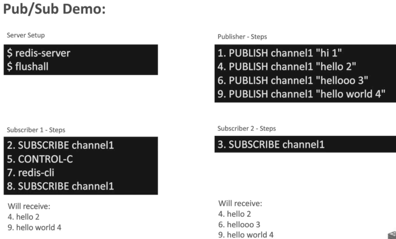
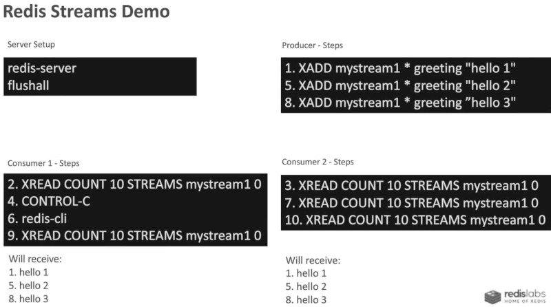

...menustart

- [Redis Put/Sub vs. Stream](#61853e17a2210cfac484926c230cbe9f)
    - [Pub/Sub](#8f4a41dee47b8a76d21a4d4d23500450)
    - [Stream](#eae835e83c0494a376229f254f7d3392)

...menuend

<h2 id="61853e17a2210cfac484926c230cbe9f"></h2>

# Redis Put/Sub vs. Stream

<h2 id="8f4a41dee47b8a76d21a4d4d23500450"></h2>

## Pub/Sub

messages **miss** if no subscriber.

<h2 id="eae835e83c0494a376229f254f7d3392"></h2>

## Stream 

message **won't miss** even if there's no subscriber.

