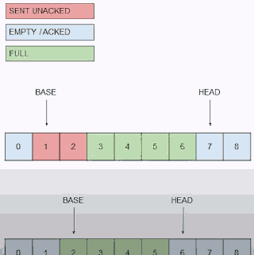

...menustart

 - [Build Reliable UDP](#33eef9972b3dab1ca3b2f203a5156f0f)
     - [Solution 1](#7e0129abb3834b04718bd19014931b29)

...menuend

<h2 id="33eef9972b3dab1ca3b2f203a5156f0f"></h2>

# Build Reliable UDP

<h2 id="7e0129abb3834b04718bd19014931b29"></h2>

## Solution 1

- Packet headers (at minimum)
    - Sequence number
    - Type 
    - Payload
- Read/Write windows
    - Base pointer, head pointer (sequence number)
    - Write data to head, send from base 
        - Read data from base, add data to head 
        - TCP also has these concepts
    - 
    - topside here is the write window , green is written but unsent 
- ACK
    - Let the sender know we got the data
    - Receive sends read packet sn, head pointer
    - Sender can calculate RTT
- Keepalive
    - Need to send something if both sender and receiver are sleeping
    - Receiver can send their head pointer
- Retransmit
    - Fast retransmit based on out of order acks
    - Most packets , if out of order are only flipped
    - Slow retransmit for failasfe ( sent after certain mulitple of the RTT )
- Simplifying the interface: you're going to need threads

