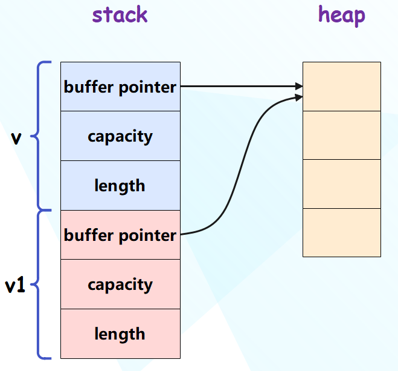
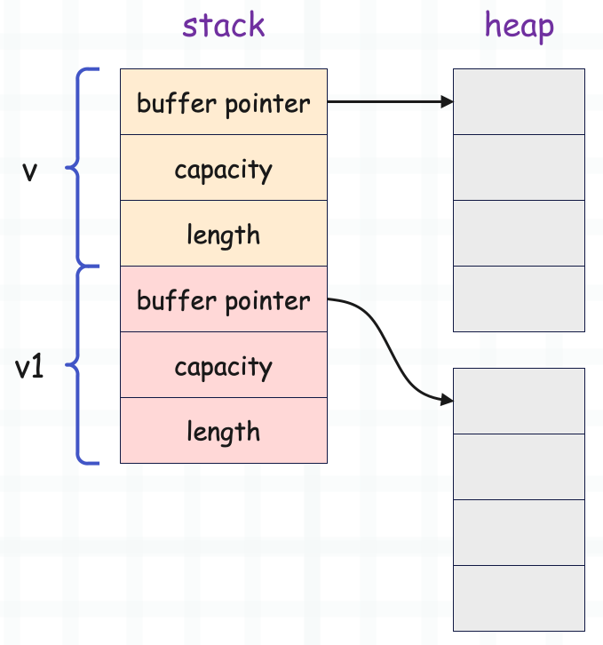

[](...menustart)

- [Rust 的內存安全以及 move、copy、clone 语义](#bb7e9c32ac8a5d6d4dfa489602327566)
    - [所有权](#ed840a18e255779553359d5e0ec6f8a8)
    - [引用](#3b61c966c812fd61ee56d86871376f0b)
    - [可变引用](#35eeb132ac415a66616b8fd44a47a20e)
    - [move 和 copy](#af7375d7546f52e11d90480399b3e8c5)
    - [clone](#d329fd777726c300d7a044e482b967e7)

[](...menuend)


<h2 id="bb7e9c32ac8a5d6d4dfa489602327566"></h2>

# Rust 的內存安全以及 move、copy、clone 语义

任何一個**可變**的對象，都由兩部分組成。

棧上存儲不會發生變化的結構本身，然後棧上的指針指向一塊 堆內存，這塊堆內存負責存放實際的數據。

棧上申請的內存，操作系統會維護它。堆內存的釋放，則需要由編譯器、解釋器或者開發者調用某個函數去釋放。


要釋放堆內存，那麼就必須確保沒有任何指向它的引用。

像python这样的有GC的语言，使用引用计数来判断一个对象是否可以被释放。

Rust 通过所有权机制 保证 一块**堆内存** 在同一时刻只能**被一个变量**引用。


<h2 id="ed840a18e255779553359d5e0ec6f8a8"></h2>

## 所有权

当你在Rust中创建一个对象时， 被赋值的变量 将成为该对象的 所有者。 转句话说，变量 拥有 对象的所有权。

```rust
let v: Vec<i32> = Vec::new();
```

同一时刻，一个对象只能有 一个所有者。 当所有者 离开作用域了，就可以安全地释放 堆内存了。

如果将 变量v 赋值给其它变量呢？

```rust
fn main() {
    let v: Vec<i32> = Vec::new();
    let v1 = v;
}
```

栈上数据在传递的时候，一律拷贝一份。 但堆数据不会，于是就变成了 这个样子：



此时，对象(在堆上的内存)有了两个所有者，但 Rust 不允许有两个栈指针指向同一块 堆内存，Rust在面对这种情况时，会转移所有权，让v1 成为对象的新所有者，而v 就不允许再访问了， 因为它已经失去了 操作堆内存的权利(所有权)。


然而，从开发者角度，每次传递都要转移所有权的话，无疑会很麻烦。 比如要将v 传到一个函数内，但当函数调用完后，v还能继续用。

这样情况，我们可以考虑 引用。

<h2 id="3b61c966c812fd61ee56d86871376f0b"></h2>

## 引用

`&v` 表示對 v 的引用。 将 **引用** 赋值给别的变量的行为叫**借用**。 相当于 给别的变量访问权, 但又不会转移所有权。

```rust
fn main() {
    let v = vec![1,2,3];
    let v1 = &v;
    println!("{}", v.len());  // 3
}
```

引用可以 赋值给多个变量， 也就是说，可以有 多个借用者。

但是，如果 借用者 在 所有者离开作用域后（内存被释放），继续访问会怎么样 ?

很幸运, Rust编译器 会确保借用者的使用范围 不会超过 所有者的存活时间。


<h2 id="35eeb132ac415a66616b8fd44a47a20e"></h2>

## 可变引用

`&mut v` 表示 v的可变引用， 将 可变引用 赋值给 别的变量，叫 **可变借用**。 获得变量的 可变引用 的前提是，变量本身 必须是可变的。

```rust
fn main() {
    let mut v = vec![1, 2, 3];
    let v1 = &mut v;
    v1.push(4);
    println!("{:?}", v1);
    // [1, 2, 3, 4]
}
```

一个变量的 不可变引用 可以有任意多个， 但一个变量的 可变引用 在同一作用域中 只能有一个。 并且，在 获得可变引用后， 就不能再 获取 不可变引用了。

**不可变引用 和 可变引用 的存在关系，就类似于 读锁 和 写锁**， 读锁可以有很多个，但 写锁 具有排他性。


<h2 id="af7375d7546f52e11d90480399b3e8c5"></h2>

## move 和 copy

```rust
fn main() {
    /*
        let v = vec![1, 2, 3];
        let v1 = v;
        // 此處 v 不再有效
        println!("{:?}", v);
    */
    let v = 123;
    let v1 = v;
    println!("{} {}", v, v1)  // 123 123
}
```

为什么 换成 i32后， v就能在 赋值后 依然有效呢？ 很简单，因为 整数默认完全分配在栈上，没堆什么事情。 而 栈上的数据 在传递的时候，一律拷贝一份。 `let v1 = v;` 后， 两个变量拥有的数据是 完全独立的。

像这种不涉及堆，传递之后 彼此独立的类型，称为 **可Copy类型**, 或者说其 实现了 Copy 这个 trait.

所有的基础类型：像 整数，浮点数，字符等 都是可 Copy的， 

而 turple 和 Array( **NOT** vector) 则取决于内部的元素，如果内部的元素都是 可 Copy的， 那么 turple 和 Array 也是可Copy。

```rust
fn main() {
    // v 裏的元素都是可 Copy 的
    // 那麼 v 也是可 Copy 的
    let v = [1, 2, 3];
    let v1 = v;
    println!("{:?}", v); // [1, 2, 3]
}
```

struct 和 enum， 默认不是可 Copy 的，但可以给他们派生相应的 trait.

```rust
#[derive(Clone, Copy)]
struct Point {
    x: i32,
    y: i32
}
```

不是实现Copy吗？ 为什么要带上 Clone？ 这个后面再解释，只需要知道Clone 是必须的即可。

如果实现了 Copy trait, 那么 struct 或 enum 的每个成员 也需要是 可Copy的。

<h2 id="d329fd777726c300d7a044e482b967e7"></h2>

## clone

如果只拷贝 栈数据，不拷贝堆数据，称为 浅拷贝； 既拷贝栈数据，又拷贝堆数据，称为 深拷贝。

Rust 默认是浅拷贝，这对 可Copy类型 来说没有问题，因为他们的数据都在 栈上。 但像 字符串，vector 就不行了，它们内部的数据是存在堆上的，此时就需要转移所有权。

那么，可不可以将 数据也拷贝一份呢？ 也就是进行 深拷贝。 答案是使用 `clone()`。

```rust
fn main() {
    let v = vec![1, 2, 3];
    let v1 = v.clone();
    println!("{:?}", v);  // [1, 2, 3]
    println!("{:?}", v1); // [1, 2, 3]
}
```




像这种 数据存放在堆上的类型，都有 clone 方法，或者说 他们都实现了 Clone 这个 trait.


