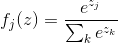
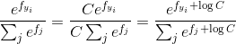
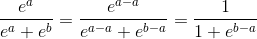

# Softmax

  is called the **softmax function**.


## Practical issues: Numeric stability

When you’re writing code for computing the Softmax function in practice, the intermediate terms efyi and e<sup>f</sup>  may be very large due to the exponentials.

```python
def softmax( f ):
    # Bad: Numeric problem, potential blowup
    return np.exp(f) / np.sum(np.exp(f))
    
>>>
>>> softmax( np.array([123, 456, 789])  )
__main__:3: RuntimeWarning: overflow encountered in exp
__main__:3: RuntimeWarning: invalid value encountered in divide
```

Notice that if we multiply the top and bottom of the fraction by a constant C and push it into the sum, we get the following (mathematically equivalent) expression:

 

We are free to choose the value of C. This will not change any of the results.  

```python
>>> softmax( np.array([12,25,44]) )
array([  1.26641655e-14,   5.60279641e-09,   9.99999994e-01])
>>> # add 100 to all entries , it keeps the same result
>>> softmax(  np.array([12+100,25+100,44+100]) )
array([  1.26641655e-14,   5.60279641e-09,   9.99999994e-01])
```

A common choice for C is to set logC=−max(f). This simply states that we should shift the values inside the vector f so that the highest value is zero.


```python
>>> def softmax( f ):
...     # instead: first shift the values of f so that the highest number is 0:
...     f -= np.max(f) # f becomes [-666, -333, 0]
...     return np.exp(f) / np.sum(np.exp(f))  # safe to do, gives the correct answer
... 
>>> softmax( np.array([12,25,44]) )
array([  1.26641655e-14,   5.60279641e-09,   9.99999994e-01])
```


[cs231n softmax notes](http://cs231n.github.io/linear-classify/#softmax)


## VS Sigmoid 

Sigmoid function:


```python
def sigmoid(X):
   return 1/(1+np.exp(-X))
```

In the case of two actions, if the preference value of the actions is a and b,  a≥b.  Then ,



Yes, the soft-max distribution is the same as that given by the sigmoid

```python
>>> softmax( np.array([14,12]) )
array([ 0.88079708,  0.11920292])
>>> sigmoid( 12-14 )
0.11920292202211755
```


