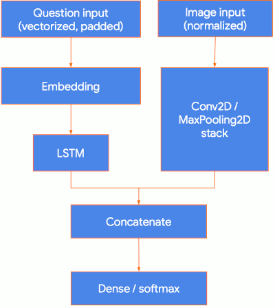
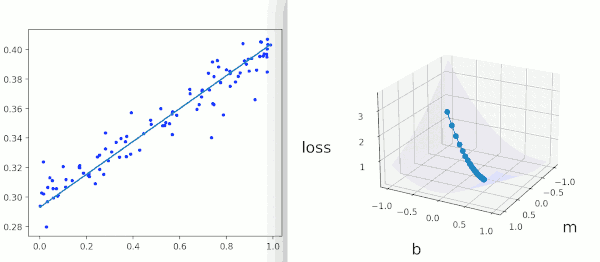

...menustart

- [Introduction to TensorFlow 2.0: Easier for beginners, and more powerful for experts](#eb38201f17f85fa8cd88b72593cd9cf2)
    - [Training](#cf270e40d273f9e7fd7c3061729060c3)
        - [Model design: Keras](#379998c229b09fb16b3859eee59409b1)
        - [Helpful references](#aaa24f6c70e138d437c490f97c52c8a3)
        - [Training Models](#d221a3c13a964a30bc621ee76eeff9cd)
        - [DEMO](#bd6dbd063f5ab7394879e3c08781cd72)
        - [DataSets](#deb6d7f18b91dc52f2998b02414e2208)
        - [Distribution](#f0bac093bb884df2891d32385d053788)
    - [Deployment](#ea355214fd4bc7c57f471bd92918879b)
    - [Keras, tf.keras, NumPy](#b0370f35e9505d9b8de1d25ab4abfdf6)
    - [Terms](#6f1bf85c9ebb3c7fa26251e1e335e032)

...menuend


<h2 id="eb38201f17f85fa8cd88b72593cd9cf2"></h2>


# Introduction to TensorFlow 2.0: Easier for beginners, and more powerful for experts

[youtube](https://www.youtube.com/watch?v=5ECD8J3dvDQ)

[pdf slides](../codes/tf2/tf2_slides.pdf)


<h2 id="cf270e40d273f9e7fd7c3061729060c3"></h2>


## Training


<h2 id="379998c229b09fb16b3859eee59409b1"></h2>


### Model design: Keras

- Sequential API
    - if you're a total novice to deep learning, you can start with something called Sequential API,
        - which is by far the easiest and clearest way to develop a deep learning model today.
    - for building a stack of layers
    - you can call things like `compile` (compile time check, to make sure all your layers are compatible) and `fit`
    ```python
    model = keras.Sequential()
    model.add(layers.Dense(32, activation='relu', input_shape=(784,)))
    model.add(layers.Dense(32, activation='relu'))
    model.add(layers.Dense(32, activation='softmax'))
    ```
- Functional API
    - such like Conv2D, MaxPooling2D, ...
    - for building DAGs --- Directed Graphs
    - A multi-input model
        1. Use a CNN to embed the image
        2. Use a LSTM to embed the question
        3. Concatenate
        4. Classify with Dense layers, per usual
    - 
    - to plot such a graph
    ```python
    from tensorflow.keras.utils import plot_model
    plot_model(vqa_model, to_file='model.png')
    ```
- Subclassing:  write everything from scratch
    ```python
    class MyModel(tf.keras.Model):
        def __init__(self, num_classes=10):
            super(MyModel, self).__init__(name='my_model')
            # in the constuctor you define your layers
            self.dense_1 = layers.Dense(32, activation='relu')
            self.dense_2 = layers.Dense(num_classes,activation='softmax')
        def call(self, inputs):
            # the `call` method describe how these layers are chained togerther
            # Define your forward pass here
            x = self.dense_1(inputs)
            return self.dense_2(x)
    ```


<h2 id="aaa24f6c70e138d437c490f97c52c8a3"></h2>


### Helpful references

- Guides
    - tensorflow.org/guide/keras/overview
    - tensorflow.org/guide/keras/functional
    - tensorflow.org/guide/keras/train_and_evaluate
    - tensorflow.org/guide/keras/custom_layers_and_models
- Examples
    - tensorflow.org/tutorials/images/segmentation
    - tensorflow.org/tutorials/generative/pix2pix
    - tensorflow.org/tutorials/generative/adversarial_fgsm


<h2 id="d221a3c13a964a30bc621ee76eeff9cd"></h2>


### Training Models

- `model.fit()`
    - Quich experiment
- `model.fit()` + callback
    - Customize your training loop 
    - Add checkpointing, 
    - early stopping, 
    - TensorBoard monitoring, 
    - send Slack notifications..
    ```python
    model.fit(data,
          epochs=10,
          validation_data=val_data,
          callbacks=[EarlyStopping(),
                     TensorBoard(),
                     ModelCheckpoint()])
    ```
- `model.train_on_batch()`, + callbacks
    - Custom training loop using built-in optimizers and losses 
    - e.g. GANs
- Custom training loop with `GradientTape`
    - Complete control
    - e.g. new optimization algorithm; easily modify gradients as you go.
    - A linear regression example: 
        - we have some function that's taking features and labels as input
        - whenever we'redong training in deep learning, we're doing gradident descent, the first step in doing gradident descent is getting the gradients.
        - the way all frameworks do this is by backpropagation. And the implementation in TensorFlow is we start recording operations on a tape.
    ```python
    @tf.function
    def train_step(features, labels):  # here we create a tape, and we're recording what's happening beneath that tape
        with tf.GradientTape() as tape:
            logits = model(features, training=True) # forward the features through the model
            loss = loss_fn(labels, logits) # compute loss use function `loss_fn`

        # getting the gradients of the loss with respect to all the variables in the model
        # if you print that out, you will see exactly what the gradients are.
        grads = tape.gradient(loss, model.trainable_variables)
        # here we're doing gradient descent manually. We're applying them on an optimizer.
        optimizer.apply_gradients(zip(grads, model.trainable_variables))
        return loss
    ```
    - This is a custom training loop from scratch. What this means is, in `model.fit()` you can use optimizers like `RMSprop` and `Adam` and all this stuff.
        - But if you'd like to write like xxx optimizer, you can go ahead and write it in Python. And it will fit right in with your model.
        - So this is great for research.
    - `ft.function`
        - you never need to write it. your code will work the same.
        - but if you do want a graph in TensorFlow 2.0, of if you want to compile your code and have it run faster, you can write that `tf.function` annotation.
        - TensorFlow2 will trace your computation, compile it, and run it faster later. jit !!!


<h2 id="bd6dbd063f5ab7394879e3c08781cd72"></h2>


### DEMO

<details>
<summary>
Linear Regression Demo:



</summary>

```python
import matplotlib.pyplot as plt
import tensorflow as tf

from tensorflow.keras import Model

# Create a noisy dataset that's roughly linear, according to the equation y = m * x + b + noise.
def make_noisy_data(m=0.1, b=0.3, n=100):
  x = tf.random.uniform(shape=(n,))
  noise = tf.random.normal(shape=(len(x),), stddev=0.01)
  y = m * x + b + noise
  return x, y


x_train, y_train = make_noisy_data()

# plt.plot(x_train, y_train, 'b.')

# Define variables for our model.
# You almost never need to write code this low level.  
#   This is pretending that we don’t have Keras.  We don’t have any 
#   built-in fit methods. We just want to do this from scratch.
m = tf.Variable(0.)
b = tf.Variable(0.)

# Predict y given x.

def predict(x):
  y = m * x + b
  return y

# Our loss will be the squared difference between the predicted values and the true values.
def squared_error(y_pred, y_true):
  return tf.reduce_mean(tf.square(y_pred - y_true)) 

# Calculate loss before training.
loss = squared_error(predict(x_train), y_train)
print("Starting loss", loss.numpy())

# Use gradient descent to gradually improve our guess for m and b. 
#   At each step, we'll nudge them a little bit in the right direction to reduce the loss.
learning_rate = 0.05
steps = 200

for i in range(steps):

  with tf.GradientTape() as tape:
    predictions = predict(x_train)
    loss = squared_error(predictions, y_train)

  gradients = tape.gradient(loss, [m, b])

  m.assign_sub(gradients[0] * learning_rate)
  b.assign_sub(gradients[1] * learning_rate)

  if i % 20 == 0:
    print("Step %d, Loss %f" % (i, loss.numpy()))

# The learned values for m and b.
print ("m: %f, b: %f" % (m.numpy(), b.numpy()))

# Plot the best fit line.
plt.plot(x_train, y_train, 'b.')
plt.plot(x_train, predict(x_train))


# A couple things you can explore:
#   To understand gradient descent, try printing out the gradients calculated below. See how they're used to adjust the variables (m and b).
#   You can use TF 2.0 a lot like NumPy. Try printing out the training data we created (x_train, y_train) and understand the format. 
#   Next, do the same for the variables (m and b). Notice both of these can be converted to NumPy format (with .numpy()).

# Bonus
# Let's visualize the error surface. This section is included purely for fun, you can skip it without missing anything.


# Warning: hacky code ahead

import numpy as np
from mpl_toolkits.mplot3d import Axes3D

# To plot the error surface, we'll need to get the loss
# for a bunch of different values for m and b.

ms = np.linspace(-1, 1)
bs = np.linspace(-1, 1)
m_mesh, b_mesh = np.meshgrid(ms, bs)

def loss_for_values(m, b):
  y = m * x_train + b
  loss = squared_error(y, y_train)
  return loss

zs = np.array([loss_for_values(m, b) for (m,b) in zip(np.ravel(m_mesh), 
                                                      np.ravel(b_mesh))])
z_mesh = zs.reshape(m_mesh.shape)

fig = plt.figure(figsize=(12, 12))
ax = fig.add_subplot(111, projection='3d')
ax.plot_surface(m_mesh, b_mesh, z_mesh, color='b', alpha=0.06)

# At this point we have an error surface. 
# Now we'll need a history of the gradient descent steps.
# So as not to complicate the above code,
# let's retrain the model here, keeping
# track of m, b, and loss at each step.

# Intentionally start with this guess to 
# make the plot nicer
m = tf.Variable(-.5)
b = tf.Variable(-.75)

history = []

for i in range(steps):
  with tf.GradientTape() as tape:
    predictions = predict(x_train)
    loss = squared_error(predictions, y_train)
  gradients = tape.gradient(loss, [m, b])
  history.append((m.numpy(), b.numpy(), loss.numpy()))
  m.assign_sub(gradients[0] * learning_rate)
  b.assign_sub(gradients[1] * learning_rate)

# Plot the trajectory
ax.plot([h[0] for h in history], 
        [h[1] for h in history], 
        [h[2] for h in history],
        marker='o')

ax.set_xlabel('m', fontsize=18, labelpad=20)
ax.set_ylabel('b', fontsize=18, labelpad=20)
ax.set_zlabel('loss', fontsize=18, labelpad=20)

ax.view_init(elev=22, azim=28)

plt.show()
```

</details>

--- 


<h2 id="deb6d7f18b91dc52f2998b02414e2208"></h2>


### DataSets

So in terms of datasets, basically you have 2 options in TensorFlow 2, Keras datasets(you can find in Keras.io) and TensorFlow Datasets.

Keras datasets are good to start with. They're in Numpy format. And they're usually really tiny. They fit into memory no problem.

TensorFlow datasets are  enormous collection of research data. 

If you're downloading a data set in TensorFlow data format, the datasets not going to be NumPy. It's going to be in tf.data, a high-performance format for data.

If you are using TensorFlow data sets, you have to be very, very careful to benchmark your input pipeline. If you just import a dataset and try to call `model.fit` on the dataset, it might be slow.  It's important to take your time and make sure that your data pipeline can read images off disk and things like that efficiently. **Either load your dataset into memory( `in_memory=True` ), or write a performant input pipeline to load it off disk.**

TensorFlow alo has a `cache()` function, it use either an in-memory cache, or a cache file, to avoid repeated work.

Here is some code for ft.data. And maybe we have an image dataset, and we have some code to preprocess the images. And let's pretent that preprocessing code is expensive and we don't want to run it every time, on every epoch.  What you can do is you can add this `cache` line at the end.

```python
# Caching is important to avoid repeated work
# Use either an in-memory cache, or a cache file
def preprocess(img):
  img = tf.cast(image, tf.float32)
  img = (img / 127.5) - 1
  img = tf.image.resize(img, [286, 286])
  # ...
  return img

# `cache` without any papameters will cache it into RAM.
#   provided file path, it will cache to files.
image_ds = image_ds.map(
    preprocess, num_parallel_calls=AUTOTUNE).cache()
```


<h2 id="f0bac093bb884df2891d32385d053788"></h2>


### Distribution

One thing that's awesome in TensorFlow 2.0 , if you're an expert, you'll care about is **distributed training**.

If you're doing multimachine, multi-GPU synchronous data training, you don't need to change the code of your model.

Your model:

```python
model = tf.keras.applications.ResNet50()
optimizer = tf.keras.optimizers.SGD(learning_rate=0.1)
model.compile(..., optimizer=optimizer)
model.fit(train_dataset, epochs=10)
```

Distribute-aware:

```python
strategy = tf.distribute.MirroredStrategy()
with strategy.scope(): Distribute-aware
    # your model, without any changes
    model = tf.keras.applications.ResNet50()
    optimizer = tf.keras.optimizers.SGD(learning_rate=0.1)
    model.compile(..., optimizer=optimizer)
    # model.fit is distribute aware and will work
    model.fit(train_dataset, epochs=10)
```

- Strategy
    - MirroredStrategy
    - MirroredMultiWorker
        - if you have a network with multiple machines on it.


<h2 id="ea355214fd4bc7c57f471bd92918879b"></h2>


## Deployment

TensorFlow 2 is going beyond Python. It's really awesome especially if you're leaning or you have students, 

- Deploying models in the browse with TensorFlow.js
- Deploying them on Android and iOS using TensorFlow Lite, or TensorFlow Lite Micro on recently Arduino.

For example, when you have trained a regular Python model, if you want to deploy it to Anduino,  you don't need to know anything special about TensorFlow Lite to do it.

```python
# Convert the model to the TFLite format without quantization
converter = tf.lite.TFLiteConverter.from_keras_model(model)
tflite_model = converter.convert()
# Save the model to disk
open("gesture_model.tflite", "wb").write(tflite_model)
# Check the size
import os
basic_model_size = os.path.getsize("gesture_model.tflite")
print("Model is %d bytes" % basic_model_size)
```

<h2 id="b0370f35e9505d9b8de1d25ab4abfdf6"></h2>


##  Keras, tf.keras, NumPy

- In TF2, instead of writing “import keras” you write “from tensorflow import keras”.
- You can also use TensorFlow 2.0 a lot like you would use Numpy.
    - Basically wheneven you see something like tensor, just replace that in your head with NumPy ndarray.
    ```python
    >>> x = tf.constant([[5, 2], [1, 3]])
    >>> print(x)
    tf.Tensor(
    [[5 2]
     [1 3]], shape=(2, 2), dtype=int32)
    >>> x.numpy()
    array([[5, 2],
       [1, 3]], dtype=int32)
    >>> a = tf.random.normal(shape=(2, 2)) 
    >>> b = tf.random.normal(shape=(2, 2)) 
    >>> c = a+ b
    >>> d = tf.square(c)
    ```


<h2 id="6f1bf85c9ebb3c7fa26251e1e335e032"></h2>


## Terms

- Dense Layer
    - Dense implements the operation: output = activation(dot(input, kernel) + bias)
    - kernel is a weights matrix created
    - bias is a bias vector
- Optimizers 
    - Optimizers are the extended class, which include added information to train a specific model. The optimizer class is initialized with given parameters but it is important to remember that no Tensor is needed. The optimizers are used for improving speed and performance for training a specific model.


# TensorFlow2 ecosystem

- TF Probability , for Bayes modeling
- TF Agents , for Reinforcement Learning
- TF Text  , for text proprocessing
- TF Federated or TF Privacy , for privacy or insecure


# Examples

[image caption](https://www.tensorflow.org/tutorials/text/image_captioning)


