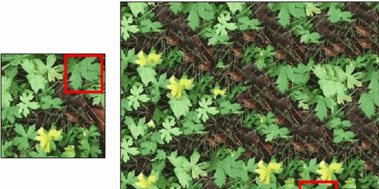
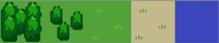
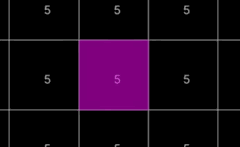
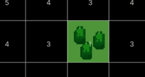
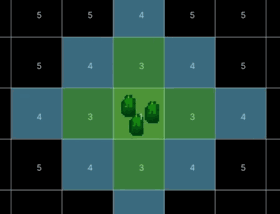
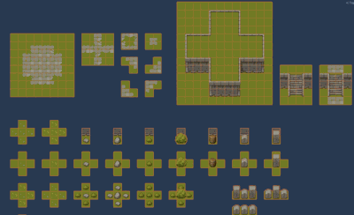

# Tile Generation

- 一个关键认知（很多人不知道）
    - WFC 其实不是新算法，它是：
    - 随机化的 CSP + Arc Consistency
- 也可以理解为：
    - 游戏版 CSP 求解器

https://www.youtube.com/watch?v=zIRTOgfsjl0

[cainos tile set](https://cainos.itch.io/pixel-art-top-down-basic)

[mxgmn/WaveFunctionCollapse](https://github.com/mxgmn/WaveFunctionCollapse)

[Oskar Stålberg's Wave Function Collapse demo:](https://oskarstalberg.com/game/wave/wave.html)

[wave function collapse c++](https://gist.github.com/jdah/ad997b858513a278426f8d91317115b9)

[another repo, include tileset and rules](https://github.com/CodingQuest2023/Algorithms)

Wave Function Collapse and Model Synthesis all fall under CSP. Unlike many puzzel games where the goal is to find one correct solution, with WFCMS the goal is to create any solution that satisfies the constraints. This makes them more about exploration and creativity rather than problem-solving.

WFCMS also draw inspiration from the texture synthesis family of algorithms. 

It was based on deliberately crafted algorithms. The following image shows one technique called image quilting.

WFCMS build upon both CSP and the earlier texture synthesis methods.

Paul C.Merrell's `Model Synthesis` paper from 2007 was the first two algorithms.

Paul recognized that many natural and artificial objects consist of similar self-repeating components, and perhaps by breaking down objects into these components. Instead of just thinking about pixels, we can use these components to generate new objects in 2D or 3D.

Here is the basic workflow of Model Synthesis:

1. unique components, and knowledge of how they fit together
    - in other words, modules and constraints
    - 
        - the grass tile(2nd) connects to the little tree and sand, and vice versa
        - the big tree connects to the little tree
        - and finally water connect to sand.
2. select a cell to collapse
    - 
3. assign a random module from its current domain.
    - the modules can be given weights to make some more likely to be selected.
    - 
4. use the constraints of the newly assigned module to reduce the domains of adjacent cells, and propagate these constraints as far as they will reach.
    - 

Now, just repeat steps 2-4 until all cells have been assigned.

The wave function collapse also used the same algorithm. That is not a mistake, at this level they're the same algorithm.

[mxgmn/WaveFunctionCollapse](https://github.com/mxgmn/WaveFunctionCollapse) is heavily influenced by model synthesis.

You might notice model synthesis focuses more on 3D, while wave function collapse focuses more on 2D. Both methods can be applied to either 2D or 3D.

How Model Synthesis and Wave Function Collapse differ isn't how they implement the steps mentioned above. Instead, they differ in how they generate the modules and constraints used in step 1.

The original method described by Paul is called discrete model synthesis(注:不是数学上的离散/连续概念).

Another method called continuous model synthesis. This is some fancy code magic and not a path I'm prepared to go down. The basic idea is to place vertices, edges, and faces in continous space.

· | Model Synthesis | Wave Function Collapse 
-- | -- | --
Graph Type | 2D Square Grid   3D Cube Grid | 2D Square Grid   3D Cube Grid
Get Modules | Discrete   Continuous | Simple Tiled   Overlapping
Cell Selection | Linear Iteration | Lowest Entropy
Collapse Cells | Random Weighted | Random Weighted
Propagation | Arc Consistency | Arc Consistency
Error Handling | Modifying in Blocks(avoid regenerate whole map) | None

Wave Function Collapse uses a method very similar to discrete model synthesis, called simple tiled method. However it's better known for the overlapping method which is one of the novel additions.

With discrete model synthesis and simple tiled wave function collapse, it's possible to create matches for each module manually which is currently my preferred method.

However the overlapping method requires a sample to analyze.

Wave function collapse provides a nice alternative. Wave function collapse picks the cell with the lower entropy. Entropy can be interpreted as a measure of uncertainty. High entropy means high uncertainty, while low entropy means low uncertainty.

Both mehods can fail. Failure becomes more likely when using large complex module sets.

