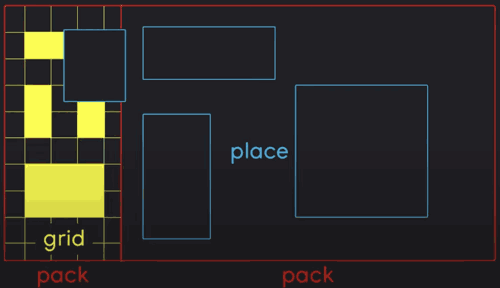

[](...menustart)

- [An overview of tkinter layouts](#dfa2fd249a9b3329a85e377b9c6c12a1)
    - [3 major methods](#f795e59b2f2582c88f1ff7ece88c917e)
    - [A couple of important things](#d4641d8da5cf5d77de42dbe9b2ee6fac)
    - [example](#1a79a4d60de6718e8e5b326e338ae533)

[](...menuend)


<h2 id="dfa2fd249a9b3329a85e377b9c6c12a1"></h2>

# An overview of tkinter layouts

<h2 id="f795e59b2f2582c88f1ff7ece88c917e"></h2>

## 3 major methods


1. pack
    - takes a window and lets you stack widgets in a certain direction.
    - by default, you are going place widgets from the top to the bottom
        - while you're doing that, you can also customize things quite a bit.
        - for example, you can tell widgets to take up the entire horizontal space, or the entire vertical space, or both as well.
    - besides that, you can also stack widgets in different directions.
        - e.g. from left to right, from right to left, from bottom to top.
2. grid
    - works by creating a grid over the window, and this grid you are then using to place widgets in a certain position with a certain size.
    - this system gives you a ton of flexibility.
        - you can change the height of each row, or the width of each column.
    - grid is generally the system you want to use if you want to create really complex layouts.
3. place
    - take a window and you place widgets with a certain position.
    - you can also change the size.
    - fairly straightforward you always have an X and a Y postion.


**You can combine these layout methods very easily.**


<h2 id="d4641d8da5cf5d77de42dbe9b2ee6fac"></h2>

## A couple of important things

- You will rely heavily on parenting and frames
- That way you can combine diferent layouts easily and keep them organized.
    - Basically what you are going to do is you are placing one layout inside of a frame, and then you are placing that frame.
    - 


<h2 id="1a79a4d60de6718e8e5b326e338ae533"></h2>

## example

pack example

```python
# widgets
lable1 = tk.Label(window, text="Label 1", background="red")
lable2 = tk.Label(window, text="Label 2", background="blue")

# pack
lable1.pack(side="left", expand=True, fill="y")  # expand to entire window
lable2.pack(side="bottom")
```

grid example

```python
# grid
window.columnconfigure(0, weight=1)  # 3 columns with different weights (1, 1, 2)
window.columnconfigure(1, weight=1)
window.columnconfigure(2, weight=2)
window.rowconfigure(0, weight=1)  # 1 row with weight 1
window.rowconfigure(1, weight=1)  # 1 row with weight 1

label1.grid(row=0, column=1, sticky="nsew")  # sticky: n, s, e, w, ne, se, sw, nw
label2.grid(row=1, column=1, columnspan=2, sticky="nsew")
```

place example

```python
# place
label1.place(x=200, y=150, width=150, anchor="nw")
label2.place(
    relx=0.5, rely=0.5, anchor="center", relwidth=0.5, relheight=0.5
)  # large botton which has area of 1/4 of window
```

