...menustart

- [Unity Shaders and Effects Cookbook](#b55d434f0710caccb257decbf8ab4917)
- [1 Diffuse Shading](#b1b582666323bda4533afa9bd399bcce)
    - [Creating a basic Surface Shader](#fc1539829f71334a0e6b8a61218d9391)
    - [Adding properties to a Surface Shader](#f8934a71d01b63f169c2de79cae2c7b5)
    - [Using properties in a Surface Shader](#a686199d052903549496a4f65129b7ba)
    - [Creating a custom diffuse lighting model](#f923eb7b3266c1a853d5ef6d6bf6bd50)
    - [Creating a Half Lambert lighting model](#17d9822b08d510c47c7a909f396c4f47)
    - [Creating a ramp texture to control diffuse shading](#c0ef1ef00afe0d980dc81f7540362639)
    - [Creating a faked BRDF using a 2D ramp texture](#394d219380b43a7353afcc1371d66f0d)
- [2 Using Textures for Effects](#e9494390acdea9a1c7a4dd9a202b9130)
    - [Scrolling textures by modifying UV values](#4555fd02bf1cc2d23dc15f9b5e929dcf)
    - [Animating sprite sheets](#13a48b8e3741e7e838ddbd4143b7aedc)
    - [Packing and blending textures](#5888245d28da31c835315d348472c20a)
    - [Normal mapping , or "Dot3 bump mapping"](#b6214df9600b8e03354cb0d5b3101ffa)
        - [About Normal Map](#e145bae90f5b6f3764bd5b501805f142)
            - [Surface Shader中的法线](#9ac76d93d8538ec48f607a32fe167c84)
    - [Creating procedural textures in the Unity editor](#f96595b64016abe1a9a81f3f6a7ed451)
    - [Photoshop levels effect](#32c3e97abe8c8a779a48e475d1a2caa3)
- [3. Making Your Gam3e Shine with Specular](#98a5397d6526f46c0eb17b0eb4252841)
    - [Introduction](#0b79795d3efc95b9976c7c5b933afce2)
    - [Utilizing Unity3D's built-in Specular type](#f0e044f1515ebbe5f9e5fea7174072ed)
    - [Creating a Phong Specular type](#70b5768f9cefe658f3575eaf349c5657)
    - [Creating a BlinnPhong Specular type](#4ce86fe867f75f0ff36fb09959e3e187)
    - [Masking Specular with textures](#c4507c2f3a79c6abbb9ac97916b5ec8f)
    - [Metallic versus soft Specular 金属与软镜面](#33961681be0e2193fa2b0e7e7973042f)
    - [Creating an Anisotropic Specular type](#6b0ce9cf1556ed6d397c6df778513b5d)

...menuend


<h2 id="b55d434f0710caccb257decbf8ab4917"></h2>


# Unity Shaders and Effects Cookbook

<h2 id="b1b582666323bda4533afa9bd399bcce"></h2>


# 1 Diffuse Shading

<h2 id="fc1539829f71334a0e6b8a61218d9391"></h2>


## Creating a basic Surface Shader

 - Getting Ready ...
     - create a `Materials` folder
     - create a shader, create a material
     - edit material, choose the shader you created
     - apply material to an object

 - The Surface Shader language is a more component-based way of writing Shaders. 
    - Tasks such as processing your own texture coordinates and transformation matrices have already been done for you
 - See also 
    - For more information on where to  nd a large portion of the built-in Cg functions for Unity
    - go to your Unity install directory and navigate to 
        - `CGIncludes\UnityCG.cginc`
        - `CGIncludes\Lighting.cginc`
        - `CGIncludes\UnityShaderVariables.cginc`

<h2 id="f8934a71d01b63f169c2de79cae2c7b5"></h2>


## Adding properties to a Surface Shader

```
Properties {
    _Color ("Color", Color) = (1,1,1,1)
}
```

 - from left to right, they are 
    - variable name
    - inspector GUI name
    - type 
    - Default value

---

Surface Shader property types | ·
 --- | ---
Range (min, max) | float property as a slider
Color | a color picker = (float,float,float,float)
2D  |   a texture
Rect |  a non-power-of-2 texture , functions the same as the 2D GUI element
Cube  |  a cube map 
Float |  a float value
Vector |  four-float property

 - See also
    - https://docs.unity3d.com/Manual/SL-Properties.html

---

Property attributes

attributes | /
 --- | ---
[HideInInspector] | does not show the property value in the material inspector.
[NoScaleOffset] | material inspector will not show texture tiling/offset fields for texture properties with this attribute.
[Normal] | indicates that a texture property expects a normal-map.
[HDR] | indicates that a texture property expects a high-dynamic range (HDR) texture.
[Gamma] | indicates that a float/vector property is specified as sRGB value in the UI (just like colors are), and possibly needs conversion according to color space used. See Properties in Shader Programs.
[PerRendererData] | indicates that a texture property will be coming from per-renderer data in the form of a MaterialPropertyBlock. Material inspector changes the texture slot UI for these properties.


<h2 id="a686199d052903549496a4f65129b7ba"></h2>


## Using properties in a Surface Shader

 1. add a property
    - `_AmbientColor ("Ambient Color", Range(0,10)) = 2`
 2. declare the properties variable type inside of the CGPROGRAM, so we can access its value from the properties block
    - in SubShader{} block , define subshader variables
    - `float4 _AmbientColor;`
 3. using it the `surf()` function
    - `float4 c =  pow((_EmissiveColor + _AmbientColor), _MySliderValue);`

<h2 id="f923eb7b3266c1a853d5ef6d6bf6bd50"></h2>


## Creating a custom diffuse lighting model

 1. modify the #pragma statement to
    - `#pragma surface surf BasicDiffuse`  光照模型改成自定义的 `BasicDiffuse`
 2. Add the following code to the subshader:
 3. Save the Shader and return to Unity.
    - you will see that no real visible change has happened to our Material
    - What we have done is removed the connection to the built-in Unity diffuse lighting and created our own lighting model that we can customize.

```
inline float4 LightingBasicDiffuse (SurfaceOutput s, fixed3
        lightDir, fixed atten)
{
    float difLight = max(0, dot (s.Normal, lightDir));  // saturate()
    float4 col;
    col.rgb = s.Albedo * _LightColor0.rgb * (difLight * atten * 2);
    col.a = s.Alpha;
    return col;
}
```

How it works ?

 - The #pragma surface directive tells the Shader which lighting model to use for its calculation
    - when we first create the Shader, the light modle which use is defined in `Lighting.cginc` file
    - We have now told the Shader to look for a lighting model by the name **BasicDiffuse**
 - Creating a new lighting model is done by declaring a new lighting model function. There are 3 types of lighting model functions that you can use:   
    - `half4 Lighting<Your Chosen Name> (SurfaceOutput s, half3 lightDir, half atten){}`
        - This function is used for forward rendering when the view direction is not needed.
    - `half4 Lighting<Your Chosen Name> (SurfaceOutput s, half3 lightDir, half3 viewDir, half atten){}`
        - This function is used in forward rendering when a view direction is needed
    - `half4 Lighting<Your Chosen Name>_PrePass (SurfaceOutput s, half4 light){}`
        - This function is used when you are using deferred rendering for your project
 - To complete the diffuse calculation, we need to multiply `difLight` with 
    - the s.Albedo value (which comes from our surf function) 
    - with the incoming `_LightColor0.rgb` value (which Unity provides)
    - and then multiply the result of that with (difLight * atten) 
 - finally, return that value as the color. See the following code:


[rending path 介绍](renderingPath.md)


<h2 id="17d9822b08d510c47c7a909f396c4f47"></h2>


## Creating a Half Lambert lighting model

 - Half Lambert was a technique created by Valve as a way of getting the lighting to show the surface of an object in low-light areas
 - It basically brightens up the diffuse lighting of the Material and wraps the diffuse light around an object's surface
 - It is designed to prevent the rear of an object losing its shape and looking too flat. 


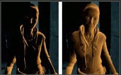

> Alyx model showing Lambertian lighting (left) and Half Lambert lighting (right)

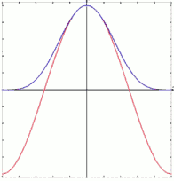

> The Lambertian dot product lobe (red) vs. the Half Lambertian dot product lobe (blue)

 - Using the basic Shader that we created in the last recipe, let's update the diffuse calculation:

```
    float difLight = dot (s.Normal, lightDir);
    float HLAMBERT = difLight*0.5 + 0.5 ;

    float4 col;
    col.rgb = s.Albedo * _LightColor0.rgb * ( HLAMBERT * atten * 2);
    col.a = s.Alpha;
    return col;
```

 - NO more `max` calcuation for difLight 
 - 原来的 0-1 的值，现在变成了 0.5-1, 整体增强了。


<h2 id="c0ef1ef00afe0d980dc81f7540362639"></h2>


## Creating a ramp texture to control diffuse shading

 - Another great tool in your Shader writing toolbox is the use of a ramp texture to drive the color of the diffuse lighting.
 - This allows you to accentuate the surface's colors to fake the effects of more bounce light or a more advanced lighting setup. 
 - You see this technique used a lot more for cartoony games
    - where you need a more artist-driven look to your Shaders and not so much of a physically-accurate lighting model.
 
 

 - To get this started you will need to create a ramp texture
    - any image editing application should be able to make a gradient
    - 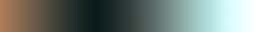
 - Simply modify the lighting function so that it includes this new code `ramp` 

```
_RampTex("Ramp texture", 2D) = "white" {}
...
sampler2D _RampTex;
...

    float difLight = dot (s.Normal, lightDir); 
    float hLambert = difLight*0.5 + 0.5 ;
    float3 RAMP = tex2D( _RampTex ,float2(hLambert,hLambert) ).rgb ;

    float4 col;
    col.rgb = s.Albedo * _LightColor0.rgb * ( RAMP );
    col.a = s.Alpha;
    return col;
```

 - tex2D function takes two arguments
    - texture property
    - UV
 - 在一般的Blinn/Phong模型中，我们对漫反射的系数是基于入射光和击中的点的法线的角度
    - 使用Ramp texture，可以用一张1D的材质图来做为索引表。用来控制漫反射的系数
 - Now it is possible for the artist to have some custom control over how the light looks on the surface of an object.
    - This is why this technique is more commonly seen on a project where you need more of an illustrative look.
 - 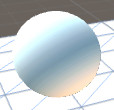

<h2 id="394d219380b43a7353afcc1371d66f0d"></h2>


## Creating a faked BRDF using a 2D ramp texture

 - We can take the ramp diffuse recipe one step further by using the `view direction` , provided by the lighting functions, to create a more advanced visual look to our lighting.
 - By utilizing the view direction, we will be able to generate some faked `rim lighting` (边缘光照) .
 - If we look at the ramp diffuse technique, we are only using one value to place into the UV lookup of the ramp texture. 
    - This means that we will get a very linear type of lighting effect. 
    - The view vector will provide us with the means to create a more advance texture lookup.
 - In the Cg industry this technique is often referred to as a **BRDF effect**. 
    - BRDF（Bidirectional Reflectance Distribution Function，即双向反射分布函数）
 - BRDF simply means the way in which light is refected off an opaque surface from both the view direction and the light direction.
 - We need gradients for both dimensions of the texture , and apply it to our Ram texture 
    - 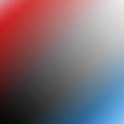
 - How to do it ...
    1. First we need to change our lighting function to include the `viewDir` variable that Unity provides us
        - to get the current view direction  , modify your lighting function to 
        - `half4 Lighting<Your Chosen Name> (SurfaceOutput s, half3 lightDir, half3 viewDir, half atten){}`
    2. We then need to calculate the dot product of the view direction and the surface normal
        - `float rimLight = dot (s.Normal , viewDir);`
        - This will produce a falloff type effect that we can use to drive our BRDF texture.
    3. To complete the operation, we need to feed our dot product result into the float2() function of the tex2D() function , modify your code to
        - `float3 ramp = tex2D( _RampTex , float2(hLambert,rimLight) ).rgb ;`

---

```
inline float4 LightingBasicDiffuse (SurfaceOutput s, half3 lightDir, half3 viewDir, half atten) { // 1
    float difLight = dot (s.Normal, lightDir); 
    float RIMLIGHT = dot (s.Normal , viewDir); // 2
    float hLambert = difLight*0.5 + 0.5 ;
    float3 ramp = tex2D( _RampTex ,float2(hLambert, RIMLIGHT ) ).rgb ; //3

    float4 col;
    col.rgb = s.Albedo * _LightColor0.rgb * ( ramp );
    col.a = s.Alpha;
    return col;
}
```

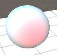

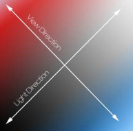

 - When using the view direction parameter, we can create a very simple falloff type effect. 
 - You can use this parameter to create a lot of different types of effects: 
    - a bubble type transparency
    - the start of a rim light effect
    - shield effects
    - the start of a toon outline effect

-------

<h2 id="e9494390acdea9a1c7a4dd9a202b9130"></h2>


# 2 Using Textures for Effects

We can also use texture to animate, to blend and really, to drive any other property we want. 

 - Scrolling textures by modifying UV values
 - Animating sprite sheets
 - Packing and blending textures
 - Normal mapping
 - Creating procedural textures in the Unity editor
 - Photoshop levels effect

<h2 id="4555fd02bf1cc2d23dc15f9b5e929dcf"></h2>


## Scrolling textures by modifying UV values

 - One of the most common texture techniques used in today's game industry is 
    - the process of allowing you to scroll their textures over the surface of an object.
    - This allows you to create effects such as **waterfalls, rivers, lava flows, and so on**.
    - It's also a technique that is the basis for creating animated sprite effects.
 - create a new shader and a new matrial
 - 1. The Shader will need two new properties that will allow us to control the speed of the texture scrolling

```
Properties {
    _MainTint ("Diffuse Tint", Color) = (1,1,1,1)
    _MainTex ("Base (RGB)", 2D) = "white" {}
    _ScrollXSpeed( "X Scroll Speed",Range(0,10) ) =2
    _ScrollYSpeed( "Y Scroll Speed",Range(0,10) ) =2
}
...
sampler2D _MainTex;
fixed4 _MainTint ;
fixed _ScrollXSpeed ;
fixed _ScrollYSpeed ;
```

 - 2. Modify the surface function to change the UVs being given to the tex2D() function.
    - hen use the built-in `_Time` variable to animate the UVs over time when **Play** is pressed in the editor:
    - `scrolledUV` has to be float2 / fixed2 because the UV values are being passed to us from the Input structure:
        - `struct Input { float2 uv_Maintex };`

```
void surf (Input IN, inout SurfaceOutputStandard o) {
    // create a separate variable to store our uvs
    // before we pass them to the tex2D() function
    fixed2 scrolledUV = IN.uv_MainTex;

    // create variables that store the 
    // individual x and y 
    // components for uvs scaled by time
    fixed xScrollValue = _ScrollXSpeed * _Time;
    fixed yScrollValue = _ScrollYSpeed * _Time;

    // apply the final uv offset
    scrolledUV += fixed2(xScrollValue,yScrollValue);

    // apply textures and tint
    half4 c = tex2D(_MainTex, scrolledUV);
    o.Albedo = c.rgb * _MainTint ;
    o.Alpha = c.a ;
}
```
 
 - for more shadow lab builtin values : [SL-BuiltinValues](https://docs.unity3d.com/455/Documentation/Manual/SL-BuiltinValues.html)

<h2 id="13a48b8e3741e7e838ddbd4143b7aedc"></h2>


## Animating sprite sheets

 - create a new shader and a new matrial
    - Then set up your Material by placing it onto a plane in the Scene view
 - 1. Create new properties 

```
Properties {
    _MainTex ("Base (RGB)", 2D) = "white" {}
    _TexWidth ("Sheet Width" , float) = 747
    _CellAmount ("Cell Amount" , float) = 9
    _Speed ( "Speed" , Range(0.01,32) ) = 12
}
...
sampler2D _MainTex;
float _TexWidth ;
float _CellAmount ;
float _Speed ;

```
 
 - get it animated !

```
void surf (Input IN, inout SurfaceOutputStandard o) {
    // let's store our UVs in a separate variable
    fixed2 spriteUV = IN.uv_MainTex;

    // uv 缩放，映射到第一帧
    float UVx = IN.uv_MainTex.x / _CellAmount ;

    float cellUVPercentage = 1.0 / _CellAmount ;

    // let's get a stair step value out of time 
    // so we can increment the uv offset
    float frameIdx = fmod( _Time.y * _Speed , _CellAmount ) ; 
    frameIdx = ceil(frameIdx) ;

    UVx +=  cellUVPercentage* frameIdx ;

    spriteUV = float2( UVx,  spriteUV.y ) ;

    // apply textures and tint
    half4 c = tex2D(_MainTex, spriteUV);
    o.Albedo = c.rgb   ;
    o.Alpha = c.a ;
}
```

 - 注意，我们这里使用 `_Time.y` , 这是正常的time值，如果直接使用 `_Time`, 其实是 `_Time.x`, 它是 t/20.
 - There's more...
    - you can move the frame offset selection code to a C# script that talks to the Shader, and have the CPU drive that portion of the code.

```
// C# 脚本直接修改 shader uniforms
void FixedUpdate() {
    timeValue = .... ;
    tranform.renderer.material.SetFloat("_TimeValue",timeValue);
}
```

<h2 id="5888245d28da31c835315d348472c20a"></h2>


## Packing and blending textures

 - Textures are also useful for storing loads of data
    - not just pixel colors as we generally tend to think of them, but for storing multiple sets of pixels in both the x and y directions and in the RGBA channels.
    - We can actually pack multiple images into one single RGBA texture and use each of the R, G, B, and A components as individual textures themselves, by extracting each of those components in the Shader code.

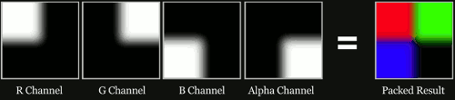

 - Why is this helpful?
    - Well, in terms of the amount of actual memory your application takes up, textures are a large portion of your application's size.
    - So, to begin reducing the size of your application, we can look at all of the images that we are using in our Shader , and see if we can merge those textures into a single texture.
 - One example of using these packed textures is when you want to blend a set of textures together onto a single surface. 
    - You see this most often in terrain type Shaders, where you need to blend nicely into another texture using some sort of control texture, or the packed texture in this case. 

---

 - create a new shader and a new material
 - gather up 4 textures for a nice terrain Shader,
    - grass, dirt, rocky dirt, and a rock texture
 - Finally, we will also need a blending texture that is packed with grayscale images. 
    - This will give us the four blending textures that we can use to direct how the color textures will be placed on the object surface.
    - 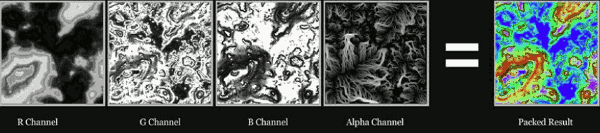
 - 1. We will need five sampler2D objects, or textures, and two color properties

```
Properties {
    _ColorA ("Terrain Color A", Color) = (1,1,1,1)
    _ColorB ("Terrain Color B", Color) = (1,1,1,1)
    _RTexture ( "Red Channel Texture" , 2D ) = "" {}
    _GTexture ( "Green Channel Texture" , 2D ) = "" {}
    _BTexture ( "Blue Channel Texture" , 2D ) = "" {}
    _ATexture ( "Alpha Channel Texture" , 2D ) = "" {}
    _BlendTex ( "Blend Texture" , 2D ) = "" {}
}
...
    float4 _ColorA ;
    float4 _ColorB ;
    sampler2D _RTexture ;
    sampler2D _GTexture ;
    sampler2D _BTexture ;
    sampler2D _ATexture ;
    sampler2D _BlendTex ;

```

 - 2. In order to allow the user to change the tiling rates on a per-texture basis, we will need to modify our Input struct. This will allow us to use the tiling and offset parameters on each texture:

```
    struct Input {
        float2 uv_RTexture;
        float2 uv_GTexture;
        float2 uv_BTexture;
        float2 uv_ATexture;
        float2 uv_BlendTex;
    };
```
 
 - 3. In the surf function, get the texture information and store them into their own variables so we can work with the data in a clean, easy-to-understand way:

```
    // get the pixel data from the blend texture
    // we need a float4 here becaues the texture
    // will return R,G,B and A or X,Y,Z, and W
    float4 blendData = tex2D( _BlendTex, IN.uv_BlendTex ) ;

    // get the data from the texture we want to blend
    float4 rTexData = tex2D( _RTexture, IN.uv_RTexture ) ;
    float4 gTexData = tex2D( _GTexture, IN.uv_GTexture ) ;
    float4 bTexData = tex2D( _BTexture, IN.uv_BTexture ) ;
    float4 aTexData = tex2D( _ATexture, IN.uv_ATexture ) ;
```

 - 4. Let's blend each of our textures together using the lerp() function.
    - It takes in three arguments, lerp(value : a, value : b, blend: c). The lerp function takes in two textures and blends them with the  oat value given in the last argument:

```
    // now we need to construct a new RGBA value and add all
    // the different blended texture back together 
    float4 finalColor ;
    finalColor = lerp( rTexData , gTexData , blendData.g ) ;
    finalColor = lerp( finalColor , bTexData , blendData.b ) ;
    finalColor = lerp( finalColor , aTexData , blendData.a ) ;
    finalColor.a = 1.0 ;
```
 
 - 5. Finally, we multiply our blended textures with the color tint values and use the red channel to determine where the two different terrain tint colors go:

```
    // add on our terrain tinting colors
    float4 terrainLayers = lerp( _ColorA, _ColorB , blendData.r ) ;
    finalColor *= terrainLayers ;
    finalColor = saturate( finalColor ) ;

    o.Albedo = finalColor.rgb;
    o.Alpha = finalColor.a;
```

 - lerp( a , b, f )
    - Involves linear interpolation:(1 – f )i\* a + b \* f
    - a and b are matching vector or scalar types. 
    - f can be either a scalar or a vector of the same type as a and b.
    - 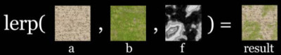

---

<h2 id="b6214df9600b8e03354cb0d5b3101ffa"></h2>


## Normal mapping , or "Dot3 bump mapping"

 - One of the most common texture techniques used in today's game development pipelines is the use of **normal maps**. 
 - These give us the ability to fake the effect of high-resolution geometry on a low-resolution model.
    - A common use of this technique is to greatly enhance the appearance and details of a low polygon model by generating a normal map from a high polygon model or height map.
 - This is because instead of performing lighting calculations on a per-vertex level, we are using each pixel in the normal map as a normal on the model, giving us much more resolution on how the lighting should be, while still maintaining the low polygon count of our object.
 - Unity makes the process of adding normals to your Shaders quite an easy process within the Surface Shader realm, using the *UnpackNormals()* function. Let's see how this is done.

---

 - Create a new Material and Shader 
 - create a normal map 
    - unity 中，将它的Texture Type改为Normal Map

---

 - 1. get our Properties block set up to have a color tint and a texture

```
Properties {
    _MainTint ("Diffuse Tint", Color) = (1,1,1,1)
    _NormalTex ( "Normal Map" , 2D ) = "bump" {} 
}
...
float4 _MainTint ;
sampler2D _NormalTex;
```

 - 2. make sure that we update the Input struct with the proper variable name, so that we can use the model's UVs for the normal map texture.

```
struct Input {
    float2 uv_NormalTex;
};
```

 - 3. Finally, we extract the normal information from the normal map texture by using the built-in UnpackNormal() function
    - Then you only have to apply those new normals to the output of the Surface Shader:

```
void surf (Input IN, inout SurfaceOutputStandard o) {
    // Get the normal Data out of the normal map texture
    // using the UnpackNormal() function
    float3 normalMap = UnpackNormal(  tex2D( _NormalTex , IN.uv_NormalTex    )  ) ;

    // apply the new normal to the light model 
    o.Normal = normalMap.rgb ;
    o.Albedo = _MainTint.rgb;
    o.Alpha = _MainTint.a;
}
```

--- 

 - 将 normal texture 的 wrap mode 改为 `repeat` , 然后修改 
    - `float3 normalMap = UnpackNormal(  tex2D( _NormalTex , IN.uv_NormalTex * 8  )  ) ;`
    - 可以产生单张 normal map 重复的效果

---

 - There's more...
    - You can also add some controls to your normal map Shader that lets a user adjust the intensity of the normal map. 
    - This is easily done by modifying the x and y components of the normal map variable, and then adding it all back together.
 - 1. Add another property
    - `_NormalIntensity ("Normal Map Intensity", Range(0,2)) = 1`
 - 2. declare
    - `float _NormalIntensity;`
 - 3. use `_NormalIntensity` in surf function

```
    float3 normalMap = UnpackNormal(tex2D(_NormalTex, IN.uv_NormalTex));
    normalMap = float3(normalMap.x * _NormalIntensity , normalMap.y * _NormalIntensity, normalMap.z);
```

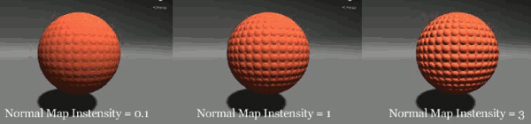

<h2 id="e145bae90f5b6f3764bd5b501805f142"></h2>


### About Normal Map

<h2 id="9ac76d93d8538ec48f607a32fe167c84"></h2>


#### Surface Shader中的法线

在Surface Shader中，无论是使用模型自带的法线或者使用法线纹理都是一件比较方便的事

 - 使用模型自带的法线
    - 法线实际上就是在光照模型中使用的，也就是Surface Shader的`Lighting<Your Chosen Name>` 函数 
    - 想要访问法线的话就是使用SurfaceOutput中的的o.Normal即可
 - 使用法线纹理
    - 如果使用法线纹理的话，就需要我们在进入光照函数之前修改SurfaceOutput中的的o.Normal
    - `float3 normal = UnpackNormal(tex2D(_NormalTex, IN.uv_NormalTex)); `
    - `o.Normal = normal; // Apply the new normals to the lighting model `

看起来 两种方法好像一样，只是更改了 o.Normal。 但其实，Unity在背后做了很多。

虽然我们使用了同样的 `Lighting<Name>` 函数，但其中normal、lightDir、viewDir所在的坐标系已经被Unity转换过了。

 - 第一种方法， 使用的 World Space
 - 第二种方法， 使用的是 **Tangent Space**.

--- 

 - Q1: 为什么法线纹理通常都是偏蓝色的？
    - 我们通常见到的这种偏蓝色的法线纹理中，存储的是在Tangent Space中的顶点法线方向。
 - Q2: 什么是Tangent Space ? （有时也叫object local coordinate system）
    - 在Tangent Space中，坐标原点就是顶点的位置
    - 其中z轴是该顶点本身的法线方向（N）
    - 这样，另外两个坐标轴就是和该点相切的两条切线
        - 这样的切线本来有无数条，但模型一般会给定该顶点的一个tangent，这个tangent方向一般是使用和纹理坐标方向相同的那条tangent（T）
        - 而另一个坐标轴的方向（B）就可以通过normal和tangent的叉乘得到。
    - 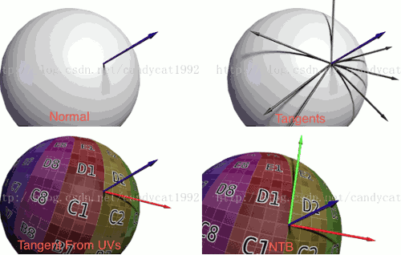
    - 也就是说，通常我们所见的法线纹理还是基于原法线信息构建的坐标系来构建出来的。
        - 那种偏蓝色的法线纹理其实就是存储了在每个顶点各自的Tangent Space中，法线的扰动方向。
        - 如果一个顶点的法线方向不变，那么在它的Tangent Space中，新的normal值就是z轴方向，也就是说值为(0, 0, 1)。
        - 但这并不是法线纹理中存储的最终值，因为一个向量每个维度的取值范围在(-1, 1)，而纹理每个通道的值范围在(0, 1)，因此我们需要做一个映射，即`pixel = (normal + 1) / 2`。
        - 这样，之前的法线值(0, 0, 1)实际上对应了法线纹理中RGB的值为(0.5, 0.5, 1)，而这个颜色也就是法线纹理中那大片的蓝色。
    - **总结一下就是，法线纹理的RGB通道存储了在每个顶点各自的Tangent Space中的法线方向的映射值**
 - Q3: 对法线纹理的采样要使用UnpackNormal函数 ?
    - 猜想一方面是为了方便Unity对不同平台做优化和调整，一方面是为了解析不同格式的法线纹理
 - Q4: 把“Texture Type”设置成“Normal Map”后，有一个复选框是“Create from grayscale”，这个是做什么用的
    - 这要从法线纹理的种类说起
    - 我们上述提到的法线纹理，也称“Tangent-Space Normal Map”
    - 还有一种法线纹理是从“Grayscale Height Map”中生成的
    - 后面这种纹理本身记录的是相对高度，是一张灰度图，白色表示相对更高，黑色表示相对更低。而法线纹理可以通过对这张图进行图像滤波来实现

--- 

<h2 id="f96595b64016abe1a9a81f3f6a7ed451"></h2>


## Creating procedural textures in the Unity editor

 - Instead of having to manually create some new texture inside an image editing application, you can create a set of pixels in a two-dimensional nature and apply that to a new texture.
 - This technique can be very useful for painting onto an already-existing texture map
    - using a dynamically created texture map, to create some interaction between the gamer and the game environment.
 - The process of creating dynamic textures does rely on creating a separate script that processes the texture for you
 - Getting Ready
    - 1. Create a new C# script in your Unity project, and name it ProceduralTexture
    - 2. Create an plane in your scene, zero-out its **Position** values, and assign the ProceduralTexture.cs script to it.
    - 3. option: create a new Shader, a new Material,  apply it to plane object  
        - or just use the default material 

 - How to do it  ...

---

 - 1. Create a variable to control the height and width of our texture, and a Texture2D variable to store our generated texture
    - We will also need some private variables to store some data while the script is working.

```c#
public int widthHeight = 512;
public Texture2D generatedTexture; 

private Material currentMaterial;
private Vector2 centerPosition;
```

 - 2. In the Start() function of the script, we need to  rst check to see if the object , to which this script is attached , does in fact have a Material assigned to it. 
    - If it does, we will call our custom function GenerateParabola() and pass its return value back to our Texture2D variable:

```c#
void Start () {
    if (!currentMaterial) {
        currentMaterial = transform.GetComponent<Renderer>().sharedMaterial;
        if(!currentMaterial)
            Debug.LogWarning( "can not find a material on: " + transform.name  ) ; 
    }
    if (currentMaterial) {
        centerPosition = new Vector2( 0.5f, 0.5f ) ;
        generatedTexture = GenerateParabola()  ; 

        // assign it to this tranform material 
        currentMaterial.SetTexture( "_MainTex" , generatedTexture  ) ;
    }
}
```

 - 3. `GenerateParabola()` 

```c#
private Texture2D GenerateParabola() {
    // Createa new Texture2D
    Texture2D proceduralTexture = new Texture2D(widthHeight, widthHeight);
    // get the center of the texture
    Vector2 centerPixelPositon = centerPosition  * widthHeight ;

    for(int x=0; x< widthHeight ; x++) {
        for (int y=0; y<widthHeight ; y++) {
            Vector2 currentPosition = new Vector2(x,y) ;
            float pixelDistance = Vector2.Distance(currentPosition , centerPixelPositon ) / ( widthHeight * 0.5f ) ;
            
            // invert the values and make sure we dont get any negative values
            // or values above 1
            pixelDistance = Mathf.Abs( 1-Mathf.Clamp( pixelDistance, 0f, 1f ) ) ;

            Color pixelColor = new Color( pixelDistance , pixelDistance , pixelDistance , 1.0f ) ;
            proceduralTexture.SetPixel( x,y, pixelColor ) ;
        }
    }
    proceduralTexture.Apply() ;
    return proceduralTexture ; 
} // end GenerateParabola
```

--- 

 - There is more ...

 - 1. Here is the math to create rings around the center of the texture:

```c#
...
pixelDistance = Mathf.Abs( 1-Mathf.Clamp( pixelDistance, 0f, 1f ) ) ;
// effect 1 , new 
pixelDistance = Mathf.Sin( pixelDistance * 30f ) * pixelDistance  ; // new 
```

 - 2. The following is the math for creating the dot product of the pixel direction as compared with the right and up world vectors:

```c#
// effect 2 
Vector2 pixelDirection = centerPixelPositon - currentPosition ; 
pixelDirection.Normalize() ;
float rightDirection = Vector2.Dot(pixelDirection , Vector3.right);
float leftDirection = Vector2.Dot(pixelDirection , Vector3.left );
float upDirection = Vector2.Dot(pixelDirection , Vector3.up);
pixelColor = new Color( rightDirection , leftDirection , upDirection ) ;
```

 - 3. The following is the math for creating the angle of the pixel direction as compared to world directions:

```c#
// effect 3 
Vector2 pixelDirection = centerPixelPositon - currentPosition ; 
pixelDirection.Normalize();
float rightDirection = Vector2.Angle(pixelDirection , Vector3.right)/360;
float leftDirection = Vector2.Angle(pixelDirection , Vector3.left )/360;
float upDirection = Vector2.Angle(pixelDirection , Vector3.up)/360;
pixelColor = new Color( rightDirection , leftDirection , upDirection ) ;
```

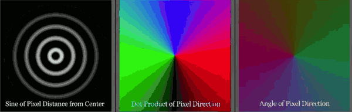

---

<h2 id="32c3e97abe8c8a779a48e475d1a2caa3"></h2>


## Photoshop levels effect

 - Getting Ready
    - create a new Shader and Material , and assign it to an plan in a new Unity scene. 
    - prepare a source texture with which to test our level's code 
 - how to do it ...
 - 1. Add the following properties

```
Properties {
    _MainTex ("Albedo (RGB)", 2D) = "white" {}

    _inBlack ( "Input Black"  , Range(0,255)) = 0
    _inGamma ( "Input Gamma"  , Range(0,2  )) = 1.61
    _inWhite ( "Input White"  , Range(0,255)) = 255

    _outWhite( "Output White" , Range(0,255) ) = 255
    _outBlack( "Output Black" , Range(0,255) ) = 0
}
...
float _inBlack ;
float _inGamma ;
float _inWhite ;
float _outWhite ;
float _outBlack ;
```

 - 2. function to create leveled pixel

```
float getPixelLevel(float pixelColor) {
    // create a variable to store a pixel channel from our MainTex texture
    float outPixel ;
    // remap 0-1 range to 0-255
    outPixel = (pixelColor * 255.0 ) ;
    // subtract the black value given to us
    // by the inBlack property
    outPixel = max( 0, outPixel - _inBlack ) ;
    // increase white value of each pixel with white
    outPixel = saturate( pow(  outPixel / ( _inWhite - _inBlack ) ,  _inGamma ) ) ;
    // change the final black point and white point and
    // remap from 0-255 to 0-1
    outPixel = ( outPixel *( _outWhite - _outBlack ) + _outBlack ) / 255.0 ;
    return outPixel ;
}
```

 - 3. calculate pixel levels

```
void surf (Input IN, inout SurfaceOutputStandard o) {
    // Albedo comes from a texture tinted by color
    fixed4 c = tex2D (_MainTex, IN.uv_MainTex)  ;

    float outRPixel = getPixelLevel(c.r);
    float outGPixel = getPixelLevel(c.g);
    float outBPixel = getPixelLevel(c.b);

    o.Albedo = float3(outRPixel,outGPixel,outBPixel);
    o.Alpha = c.a;
}
```


 - see also 
    - [nvidia GPU Gems ch22](https://developer.nvidia.com/gpugems/GPUGems/gpugems_ch22.html)


---

<h2 id="98a5397d6526f46c0eb17b0eb4252841"></h2>


# 3. Making Your Gam3e Shine with Specular

<h2 id="0b79795d3efc95b9976c7c5b933afce2"></h2>


## Introduction

 - The specularity of an object surface simply describes how shiny it is.
 - to achieve a realistic Specular effect in your Shaders, you need to include the direction the camera or user is facing the object's surface , and the light direction
 
<h2 id="f0e044f1515ebbe5f9e5fea7174072ed"></h2>


## Utilizing Unity3D's built-in Specular type

 - Unity has already provided us with a Specular function we can use for our Shaders.
 - It is called the **BlinnPhong** Specular lighting model.
 - Getting ready
    - Create a new Shader and a new material 
    - Then create a sphere object and place it roughly at world center.
 - how to do it ...
 - 1. adding Properties

```
Properties {
    _MainTex ("Albedo (RGB)", 2D) = "white" {}
    _MainTint ("Color", Color) = (1,1,1,1)
    _SpecColor ( "Specular Color" , Color )  = (1,1,1,1)
    _SpecPower ( "Specular Power" , Range(0,1) ) = 0.5 
}
```

 - 2. declear variable 
    - Notice that we don't need to declare the `_SpecColor` property as a variable
    - This is because Unity has already created this variable for us in the built-in Specular model

```
sampler2D _MainTex;
float _SpecPower ;
float4 _MainTint;
```
 
 - 3. Our Shader now needs to be told which lighting model we want to use to light our model with
    - let's add BlinnPhong to our #pragma statement like so:
    - `#pragma surface surf BlinnPhong` 
    - ps. BlinnPhong is not in `surface surf Standard `

 - 4. We then need to modify our surf() function to look like the following:

```
void surf (Input IN, inout SurfaceOutput  o)
{
    fixed4 c = tex2D (_MainTex, IN.uv_MainTex) * _MainTint;

    o.Specular = _SpecPower ;
    o.Gloss = 1.0 ;
    o.Albedo = c.rgb;
    o.Alpha = c.a;
}
```
 
 - 5. Now apply a dark color to main tint , and white color to specular color, you will see the effect.

 - How it works ... 
    - Unity has provided us with a lighting model that has already taken the task of creating your Specular lighting for you
    - If you look into the Lighting.cginc file , you will notice that you have Lambert and BlinnPhong lighting models available for you to use.  
    - The moment you compile your Shader with the `#pragma surface surf BlinnPhong`, you are telling the Shader to utilize the BlinnPhong lighting function
    - so that we don't have to write that code over and over again

---

<h2 id="70b5768f9cefe658f3575eaf349c5657"></h2>


## Creating a Phong Specular type 

 - The most basic and performance-friendly Specular type is the **Phong** Specular effect.
 - While it isn't the most realistic in terms of accurately modeling the reflected Specular, it gives a great approximation that performs well in most situations
 - Plus, if your object is further away from the camera and the need for a very accurate Specular isn't needed, this is a great way to provide a Specular effect on your Shaders.
 - In this recipe, we will be covering how to implement the per vertex version of the effect , and also see how to implement the per pixel version using some new parameters in the surface Shader's Input struct. 
 - Getting ready
    - Create a new Shader, Material, and a sphere
 - How to do it ...

---

 1. properties

```
Properties {
    _MainTint ("Diffuse Tint", Color) = (1,1,1,1)
    _MainTex ("Base (RGB)", 2D) = "white" {}
    _SpecularColor ("Specular Color", Color) = (1,1,1,1)
    _SpecPower ("Specular Power", Range(0.1,30)) = 1
}
...
sampler2D _MainTex;
float4 _MainTint;
float4 _SpecularColor;
float _SpecPower;
```


 2. tell the CGPROGRAM block that it needs to use our custom lighting function instead of one of the built-in ones
    - `#pragma surface surf   Phong`

 3. Now we have to add our custom lighting model so that we can compute our own Phong Specular

```
    inline fixed4 LightingPhong (SurfaceOutput s, fixed3 lightDir, half3 viewDir, fixed atten)
    {
        //Calculate diffuse and the reflection vector
        float diff = dot(s.Normal, lightDir);
        float3 reflectionVector = normalize((2.0 * s.Normal * diff) - lightDir);
        
        //Calculate the Phong specular
        float spec = pow(max(0,dot(reflectionVector, viewDir)), _SpecPower);
        float3 finalSpec = _SpecularColor.rgb * spec;
        
        //Create final color
        fixed4 c;
        c.rgb = (s.Albedo * _LightColor0.rgb * diff) + (_LightColor0.rgb * finalSpec);
        c.a = 1.0;
        return c;
    }
```

 4. now adjust main tint color to dark color , see the effect 

---

<h2 id="4ce86fe867f75f0ff36fb09959e3e187"></h2>


## Creating a BlinnPhong Specular type

 - **Blinn** is another more efficient way of calculating and estimating specularity.
 - It is done by getting the half vector from the view direction and the light direction. 
 - If you actually look at the built-in BlinnPhong lighting model included in the UnityCG.cginc file, you will notice that it is using the half vector as well
 - It is just a simpler version of the full Phong calculation.

 - Getting start 
    - create a new shader and material -- CustomBlinnPhong  , and a sphere

 - How to do it ...

---

 1. Properties

```
_MainTint ("Diffuse Tint", Color) = (1,1,1,1)
_MainTex ("Base (RGB)", 2D) = "white" {}
_SpecularColor ("Specular Tint", Color) = (1,1,1,1)
_SpecPower ("Specular Power", Range(0.1, 120)) = 3

#pragma surface surf CustomBlinnPhong

sampler2D _MainTex;
float4 _MainTint;
float4 _SpecularColor;u3d_shader_meta_soft_effect.png
float _SpecPower;
```

 2. create our custom lighting model that will process our Diffuse and Specular calculations.

```
inline fixed4 LightingCustomBlinnPhong (SurfaceOutput s, fixed3 lightDir, half3 viewDir, fixed atten)
{
    float3 halfVector = normalize (lightDir + viewDir);

    float diff = max (0, dot (s.Normal, lightDir));

    float NdotH = max (0, dot (s.Normal, halfVector));
    float spec = pow (NdotH, _SpecPower) ;

    float4 c;
    c.rgb = (s.Albedo * _LightColor0.rgb * diff) + (_LightColor0.rgb * _SpecularColor.rgb * spec) * (atten * 2);
    c.a = s.Alpha;
    return c;
}
```

---

<h2 id="c4507c2f3a79c6abbb9ac97916b5ec8f"></h2>


## Masking Specular with textures

In this next recipe, we will look at how we can use textures to drive our Specular and Specular power attributes.

The technique of using Specular textures is seen in most modern game development pipelines because it allows the 3D artists to control the  nal visual effect on a per-pixel basis.

This recipe will introduce you to some new concepts, such as
 
 - creating your own Input struct
 - and learning how the data is being passed around from the output struct
 - to the lighting function, to the Input struct, and to the surf() function

---

 - Getting ready
    - create a new Shader, Material, and a sphere
    - We will also need a Specular texture to use. Any texture will do as long as it has some nice variation in colors and patterns.
 - How to do it ...
 - 1. Properties

```
Properties {
    //Set properties here so we can feed our shader information
    //from the inspector in the editor
    _MainTint ("Diffuse Tint", Color) = (1,1,1,1)
    _MainTex ("Base (RGB)", 2D) = "white" {}
    _SpecularColor ("Specular Tint", Color) = (1,1,1,1)
    _SpecularMask ("Specular Texture", 2D) = "white" {}
    _SpecPower ("Specular Power", Range(0.1, 120)) = 3
}

...

    sampler2D _MainTex;
    sampler2D _SpecularMask;
    float4 _MainTint;
    float4 _SpecularColor;
    float _SpecPower;
```

 - 2. Now we have to add our own custom **Output** struct
    - This will allow us to store more data for use between our surf function and our lighting model.

```
    //Create a custom Output Struct
    struct SurfaceCustomOutput
    {
        fixed3 Albedo;
        fixed3 Normal;
        fixed3 Emission;
        fixed3 SpecularColor;
        half Specular;
        fixed Gloss;
        fixed Alpha;
    };
```

 - 3. Just after the Output struct we just entered, we need to add our custom lighting model

```
    #pragma surface surf CustomPhong
    
    ...

    inline fixed4 LightingCustomPhong (SurfaceCustomOutput s, fixed3 lightDir, half3 viewDir, fixed atten)
    {
        //Calculate diffuse and the reflection vector
        float diff = dot(s.Normal, lightDir);
        float3 reflectionVector = normalize(2.0 * s.Normal * diff - lightDir);

        //Calculate the Phong specular
        float spec = pow(max(0.0f,dot(reflectionVector, viewDir)), _SpecPower) * s.Specular;
        float3 finalSpec = s.SpecularColor * spec * _SpecularColor.rgb;

        //Create final color
        fixed4 c;
        c.rgb = (s.Albedo * _LightColor0.rgb * diff) + (_LightColor0.rgb * finalSpec);
        c.a = s.Alpha;
        return c;
    }
```

 - 4. Since we are going to be using a texture to modify the values of our base Specular calculation, we need to store another set of UVs for that texture specifically.
    - This is done inside the Input struct by placing the word uv in front of the variable's name that is holding the texture. 

```
    struct Input {
        //Get uv information from the Input Struct
        float2 uv_MainTex;
        float2 uv_SpecularMask;
    };
```

 - 5. To finish off the Shader, we just need to modify our surf() function with the following code.
    - This will let us pass the texture information to our lighting model function
    - so that we can use the pixel values of the texture to modify our Specular values in the lighting model function

```
    void surf (Input IN, inout SurfaceCustomOutput  o) {
        // Albedo comes from a texture tinted by color
        fixed4 c = tex2D (_MainTex, IN.uv_MainTex) * _MainTint;
        float4 specMask = tex2D(_SpecularMask, IN.uv_SpecularMask) * _SpecularColor;

        o.Albedo = c.rgb;

        o.Specular = specMask.r;

        // Metallic and smoothness come from slider variables
        o.SpecularColor = specMask.rgb;
        o.Alpha = c.a;
    }
```

 - How it works...
    - we are now going to modify our Specular with a per-pixel texture, giving our Specular much more visual interest and depth.
    - To do this, we need to be able to pass information from our surface function to our lighting functions. 
        - The reason is that we can't get the UVs of a surface within the lighting function.
    - You can procedurally generate UVs in the lighting function but if you want to unpack a texture and get its pixel information, you have to use the Input struct,
        - the only way to access the data from the Input struct is to use the surf() function.
    - So to set up this data relationship, we have to create our own SurfaceCustomOutput struct.
        - This struct is the container for all the  nal data in a Surface Shader and luckily for us
        - the lighting function and the surf() function can both access the data from it

```
// data flow ?
struct Input -> surf() -> struct Output 
struct Output -> Lighting<Name> 
```

---

<h2 id="33961681be0e2193fa2b0e7e7973042f"></h2>


## Metallic versus soft Specular 金属与软镜面

 - In this section, we are going to explore a way to create a Shader that gives us the versatility to have a soft Specular as well as a hard Specular. 
 - You will  nd in most productions that you will need to create a nice set of Shaders to perform many tasks.
 - it is common for Shader programmers to create a set of Shaders that can both be used for cloth and for metal in one Shader file.

---

 - Getting ready ...
    - a simple capsule , plane, and directional light in the new scene.
    - Create a new Shader and Material
    - attach the Shader to the Material and attach the Material to the capsule object
    - We are also going to need to get some textures together that will allow an artist to re ne the roughness of the Specular by de ning how blurry and how sharp the Specular should be. 
        - 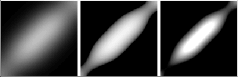
 - How to do it...
 - 1. Properties

```c#
Properties
{
    _MainTint ("Diffuse Tint", Color) = (1,1,1,1)
    _MainTex ("Base (RGB)", 2D) = "white" {}
    _RoughnessTex ("Roughness texture", 2D) = "" {}
    _Roughness ("Roughness", Range(0,1)) = 0.5
    _SpecularColor ("Specular Color", Color) = (1,1,1,1)
    _SpecPower ("Specular Power", Range(0,30)) = 2
    _Fresnel ("Fresnel Value", Range(0,1.0)) = 0.05
}

    sampler2D _MainTex;u3d_shader_meta_soft_effect.png
    sampler2D _RoughnessTex;
    float _Roughness;
    float _Fresnel;
    float _SpecPower;u3d_shader_meta_soft_effect.png
    float4 _MainTint;
    float4 _SpecularColor;
```

 - 2. We now need to declare our new lighting model and tell the #pragma statement to look for it:

```c#
#pragma surface surf MetallicSoft

inline fixed4 LightingMetallicSoft (SurfaceOutput s, fixed3 lightDir, half3 viewDir, fixed atten) {

}
```

 - 3. At this point we are ready to  fill in our custom lighting model function with our lighting calculations. 
    - We are  rst going to want to generate all of our diffuse and view dependent vectors, as this lighting model is going to make use of them all.

```c#
//Compute simple diffuse and view direction values
float3 halfVector = normalize(lightDir + viewDir);
float NdotL = saturate(dot(s.Normal, normalize(lightDir)));
float NdotH_raw = dot(s.Normal, halfVector);
float NdotH = saturate(dot(s.Normal, halfVector));
float NdotV = saturate(dot(s.Normal, normalize(viewDir)));
float VdotH = saturate(dot(halfVector, normalize(viewDir)));
```

 - 4. The next section of code in the Shader takes care of producing the roughness values for our Specular, by using a texture to de ne the Specular shape and to procedurally simulate micro bumps in the surface of the object.

```c#
//Micro facets distribution
float geoEnum = 2.0*NdotH;
float3 G1 = (geoEnum * NdotV)/NdotH;u3d_shader_meta_soft_effect.pngu3d_shader_meta_soft_effect.png
float3 G2 = (geoEnum * NdotL)/NdotH;
float3 G =  min(1.0f, min(G1, G2));

//Sample our Spceular look up BRDF
float roughness = tex2D(_RoughnessTex, float2(NdotH_raw * 0.5 + 0.5, _Roughness)).r;
```

 - 5. The last element we need for our Specular calculation is a **Fresel** term.
    - This will help us mask off the Specular when your view becomes very glancing to the object's surface.

```c#
//Create our custom fresnel value
float fresnel = pow(1.0-VdotH, 5.0);
fresnel *= (1.0 - _Fresnel);
fresnel += _Fresnel;
```

 - 6. Now that we have all the components ready for our Specular, we just need to combine them together to generate our  nal Specular value.

```c#
//Create the final spec
float3 spec = float3(fresnel * G * roughness * roughness) * _SpecPower;
```

 - 7. To complete the lighting model, we simply need to add our Diffuse terms and our Specular terms together:

```c#
float4 c;
c.rgb = (s.Albedo * _LightColor0.rgb * NdotL)+  (spec * _SpecularColor.rgb) * (atten * 2.0f);
c.a = s.Alpha;
return c;
```

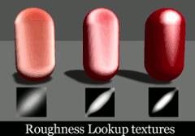

<h2 id="6b0ce9cf1556ed6d397c6df778513b5d"></h2>


## Creating an Anisotropic Specular type

**Anisotropic** is a type of Specular or re ection that simulates the directionality of grooves in a surface, and modi es/stretches the Specular in the perpendicular direction. 

It is very useful when you want to simulate brushed metals, not a metal with a clear, smooth, polished surface.

Imagine the Specular you see when you look at the data side of a CD or DVD, or the way Specular is shaped at the bottom of a pot or pan.

This recipe will introduce you to the concept of augmenting your Specular highlights to achieve different types of brushed surfaces.

In future recipes, we will look at ways in which we can use the concepts of this recipe to achieve other effects, such as stretched re ections and hair,
but here we are going to learn the fundamentals of the technique first.

The following screenshot shows examples of different types of Specular effects one can achieve by using Anisotropic Shaders in Unity:

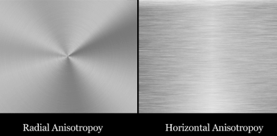

 - Getting ready 
    - Create a new scene with some capsules
    - create a new Shader and Material, and hook them up to our objects
    - Lastly, we will need some sort of normal map that will indicate the directionality of our Anisotropic Specular highlight.
        - 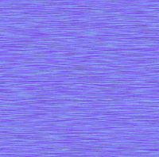
 - How to do it ...
 - 1. properties

```
Properties {
    _MainTint ("Diffuse Tint", Color) = (1,1,1,1)
    _MainTex ("Base (RGB)", 2D) = "white" {}
    _SpecularColor ("specular Color", Color) = (1,1,1,1)
    _Specular ("Specular Amount", Range(0,1)) = 0.5
    _SpecPower ("Specular Power", Range(0,1)) = 0.5
    _AnisoDir ("Anisotropic Direction", 2D) = "" {}
    _AnisoOffset ("Anisotropic Offset", Range(-1,1)) = -0.2
}

sampler2D _MainTex;
sampler2D _AnisoDir;
float4 _MainTint;
float4 _SpecularColor;
float _AnisoOffset;
float _Specular;
float _SpecPower;
``` 

 - 2. create our lighting function that will produce the correct Anisotropic effect on our surface:

```
#pragma surface surf Anisotropic

struct SurfaceAnisoOutput
{
    fixed3 Albedo;
    fixed3 Normal;
    fixed3 Emission;
    fixed3 AnisoDirection;
    half Specular;
    fixed Gloss;
    fixed Alpha;
};


inline fixed4 LightingAnisotropic (SurfaceAnisoOutput s, fixed3 lightDir, half3 viewDir, fixed atten)
{
    fixed3 halfVector = normalize(normalize(lightDir) + normalize(viewDir));
    float NdotL = saturate(dot(s.Normal, lightDir));
    
    fixed HdotA = dot(normalize(s.Normal + s.AnisoDirection), halfVector);
    float aniso = max(0, sin(radians((HdotA + _AnisoOffset) * 180.f)));
    
    float spec = saturate(pow(aniso, s.Gloss * 128) * s.Specular);
    
    fixed4 c;
    c.rgb = ((s.Albedo * _LightColor0.rgb * NdotL) + (_LightColor0.rgb * _SpecularColor.rgb * spec)) * (atten * 2);
    c.a = 1.0;
    return c;
}
```

 - 3. We have also given the Anisotropic normal map its own UVs by declaring the following code in the Input struct.
    - This isn't entirely necessary as we could just use the UVs from the main texture, but this gives us independent control over the tiling of our brushed metal effect, so that we can scale it to any size we want.

```
struct Input  {
    float2 uv_MainTex;
    float2 uv_AnisoDir;
};
```

 - 4. Finally, we need to use the surf() function to pass the correct data to our lighting function. So we get the per-pixel information from our Anisotropic normal map and set our Specular parameters.

```
void surf (Input IN, inout SurfaceAnisoOutput  o) {
    // Albedo comes from a texture tinted by color
    fixed4 c = tex2D (_MainTex, IN.uv_MainTex) * _MainTint;
    float3 anisoTex = UnpackNormal(tex2D(_AnisoDir, IN.uv_AnisoDir));

    o.AnisoDirection = anisoTex;
    o.Specular = _Specular;
    o.Gloss = _SpecPower;
    o.Albedo = c.rgb;
    o.Alpha = c.a;
}
```


