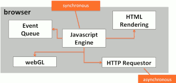
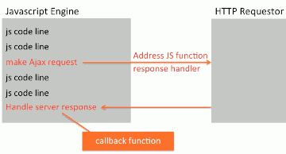

...menustart

- [Web Dev](#e038f9e554416040d7422224d511efc8)
    - [5. Using Javascript to Build Web Applications](#971c3edf4a623656caf1415857320a21)
        - [5.53 DOM Manipulation](#d6d94075fb5693e67ff2de8dc28db24c)
        - [5.54 Handling Events](#6881202a8d5a42748445262c96828cd8)
        - [5.55 The 'event' Argument](#d13624125089387d2440648bcb744b0d)
        - [-- Introduction to Ajax --](#e6a17d9f8a09a9d0ef440dc03373f839)
        - [5.57 Ajax Basics](#22a138df746af464d4bb0714165920ee)
        - [5.58 Processing JSON](#99087eec50334e0324a44b8fca0e8a9c)
        - [5.59 jQuery](#e0fc39e216d6b8be690711f8c6d5cde3)
        - [5.60 Dynamically Loading Home View Content](#e4f31e3ba5bc19547905cf6f376e1257)
        - [5.63 Changing 'active' Button Style Through Javascript](#66281d7e27c790e5a010b5790aa8e0cd)

...menuend


<h2 id="e038f9e554416040d7422224d511efc8"></h2>


# Web Dev

<h2 id="971c3edf4a623656caf1415857320a21"></h2>


## 5. Using Javascript to Build Web Applications

<h2 id="d6d94075fb5693e67ff2de8dc28db24c"></h2>


### 5.53 DOM Manipulation

```html
<!doctype html>
<html lang="en">
  <head>
    <meta charset="utf-8">
    <script src="js/script.js"></script>
  </head>
<body>
  <h1 id="title">Lecture 54</h1>

  <p>
    Say hello to
    <input id="name" type="text">
    <button onclick="sayHello();">
      Say it!
    </button>
  </p>


  <div id="content"></div>
</body>
</html>
```

- fetch HTML element
    ```javascript
    document.getElementById( "title" )
    // <h1 id="title">Lecture 53</h1>
    ```
    - PS. Be sure that "title" element exists in rendering HTML page before `document.getElementById` invoking, or it will result in `null`.
        - So javascript code is always best not to keep it in the head, but actually place it at the very end.
- Change HTML structure
    ```javascript
    function sayHello() {
        var name = document.getElementById( "name" ).value;
        var message = "Hello " + name + "!";

        document.getElementById( "content" ).textContent = message;
    }
    ```
    - How can I change "content" text to h2 headering ? 
        ```javascript
        var message = "<h2>Hello " + name + "!</h2>";
        ```
        - Adding h2 tag literally does not work, it is just text, not really something that the browser should render.
    - How to solve it ?
        ```javascript
            // document.getElementById( "content" ).textContent = message;
            document.getElementById( "content" ).innerHTML = message;
        ```
- QuerySelector
    - the way you select things using CSS
    ```javascript
    document.querySelector( "#title" ).textContent = "XXX";
    // document.querySelector( "h1" )   // will return the first matching element
    // document.queryAllSelector( "h1" )   // a list of all matching element
    ```


<h2 id="6881202a8d5a42748445262c96828cd8"></h2>


### 5.54 Handling Events

- In Lecture 53, we've already seen a simple example of how to bind an event handler to a particular element. 
    ```html
    <button onclick="sayHello();">
    ```
    - Let's explore now couple of different ways that you can actually assign event handlers to elements.
- What is event handler ?
    - Well event handlers are basically functions that you bind using specific methods to certain events that happen in the browser. 
    - Those events might be triggered by just a lifecycle. Meaning something like the page loaded.  Or it could be triggered by user interaction, like a user typed a character or user clipped something. 
- One of the most simplest ways to assign an event handler to a particular element is to just use the ***on***`<something>` attribute on that element. 
    - onblur(lose focus), onclick, ondblclick, onfocus, onkeydown, onkeypress, onkeyup, onmousedown, 
    - This method comes with some side effects.
        1. you kind of have to dirty up your HTML with these on-events, we may hope the HTML is just for content.
        2. `this` in `sayHello` function is pointing to *window* object because `sayHello` function is defined in Global scope.
- UnObtrusive Event Binding
    - The HTML does not need to know anything about your JavaScript.
    ```javascript
    function sayHello() {
        ...
    }

    document.querySelector("button").addEventListener( "click", sayHello );
    ```
    - Now `this` in `sayHello` function is pointing to the containing object, the *button* element.
- Another similar way
    ```javascript
    document.querySelector("button").onclick = sayHello ;
    ```
- **DOMContentLoaded** event
    - a life cycle event of the page
    - that will let us actually assign the events to the elements of the page once they load, but before anything else loads. Before any images load, before any CSS loads, and so forth. 
    - And since we are going to be listening for that event, we no longer need to provide this script at the bottom of the page. We can actually cut this script out of here, and place it very easily in the head. 
        ```javascript
        document.addEventListener("DOMContentLoaded", 
            ...
        );
        ```
    - What we want to do is we want to assign a function, with parameter `event`, and every event handler function gets this event object. 
        ```javascript
        document.addEventListener("DOMContentLoaded", 
            function (event) {
                ...
            }  
        );
        ```
    - and inside this function, we can now start assigning different events. 
        ```javascript
        document.addEventListener("DOMContentLoaded", 
            function (event) {
                function sayHello (event) {
                    ...
                }
                // Unobtrusive event binding
                document.querySelector("button").addEventListener("click", sayHello);
            }  
        );
        ```
        - This function will get executed when this Event files called, dom content loaded and that will happen before any images, or any CSS, or any other script is loaded. 


<h2 id="d13624125089387d2440648bcb744b0d"></h2>


### 5.55 The 'event' Argument

- When mouse-left clicking the button, the object that *event* is `MouseEvent`.
    - PS. you would not get *event* if you bind the function via `on-event` attributes in HTML.


<h2 id="e6a17d9f8a09a9d0ef440dc03373f839"></h2>


### -- Introduction to Ajax --

<h2 id="22a138df746af464d4bb0714165920ee"></h2>


### 5.57 Ajax Basics

- Asynchronous Javascript and XML
- While Ajax started with XML, very few apps use it nowadays
    - Plain text (at time as html) and JSON is used instead
- Why does Ajax exist to begin with ? 
    - Faster response.  Less bandwidth, nicer experience for user
- 
- 

<details>
<summary>
ajax-utils.js
</summary>

```javascript
(function (global) {

// Set up a namespace for our utility
var ajaxUtils = {};


// Returns an HTTP request object
function getRequestObject() {
  if (global.XMLHttpRequest) {
    return (new XMLHttpRequest());
  } 
  else if (global.ActiveXObject) {
    // For very old IE browsers (optional)
    return (new ActiveXObject("Microsoft.XMLHTTP"));
  } 
  else {
    global.alert("Ajax is not supported!");
    return(null); 
  }
}


// Makes an Ajax GET request to 'requestUrl'
ajaxUtils.sendGetRequest = 
  function(requestUrl, responseHandler) {
    var request = getRequestObject();
    request.onreadystatechange = 
      function() { 
        handleResponse(request, responseHandler); 
      };
    // true: async, false: sync
    request.open("GET", requestUrl, true);
    request.send(null); // for POST only
  };


// Only calls user provided 'responseHandler'
// function if response is ready
// and not an error
function handleResponse(request,
                        responseHandler) {
  if ((request.readyState == 4) &&
     (request.status == 200)) {
    responseHandler(request);
  }
}


// Expose utility to the global object

// just like jQuery uses `$`, we use `$` as well.
global.$ajaxUtils = ajaxUtils;


})(window);


```

</details>

- Sending Ajax request
    ```javascript
    // Call server to get the name
    $ajaxUtils
      .sendGetRequest("data/name.txt", 
        function (request) {
          var name = request.responseText;
          document.querySelector("#content")
            .innerHTML = "<h2>Hello " + name + "!</h2>";
        });    
    ```


<h2 id="99087eec50334e0324a44b8fca0e8a9c"></h2>


### 5.58 Processing JSON

- converts from json string to object
    ```javascrip
    var obj = JSON.parse( jsonString ) ;
    ```
- converts from object to json string
    ```javascript
    var str = JSON.stringify( obj ) ;
    ```


<details>
<summary>
ajax-utils.js improved by JSON support
</summary>

```javascript
(function (global) {

// Set up a namespace for our utility
var ajaxUtils = {};


// Returns an HTTP request object
function getRequestObject() {
  if (global.XMLHttpRequest) {
    return (new XMLHttpRequest());
  } 
  else if (global.ActiveXObject) {
    // For very old IE browsers (optional)
    return (new ActiveXObject("Microsoft.XMLHTTP"));
  } 
  else {
    global.alert("Ajax is not supported!");
    return(null); 
  }
}


// Makes an Ajax GET request to 'requestUrl'
ajaxUtils.sendGetRequest = 
  function(requestUrl, responseHandler, isJsonResponse) {
    var request = getRequestObject();
    request.onreadystatechange = 
      function() { 
        handleResponse(request, 
                       responseHandler,
                       isJsonResponse); 
      };
    request.open("GET", requestUrl, true);
    request.send(null); // for POST only
  };


// Only calls user provided 'responseHandler'
// function if response is ready
// and not an error
function handleResponse(request,
                        responseHandler,
                        isJsonResponse) {
  if ((request.readyState == 4) &&
     (request.status == 200)) {

    // Default to isJsonResponse = true
    if (isJsonResponse == undefined) {
      isJsonResponse = true;
    }

    if (isJsonResponse) {
      responseHandler(JSON.parse(request.responseText));
    }
    else {
      responseHandler(request.responseText);
    }
  }
}


// Expose utility to the global object
global.$ajaxUtils = ajaxUtils;


})(window);
```

</details>


<h2 id="e0fc39e216d6b8be690711f8c6d5cde3"></h2>


### 5.59 jQuery

- The name of the jQuery function is `$`.
    - example
    ```javascript
    $( // Same as document.addEventListener("DOMContentLoaded"...
      function () { 

      // Same as document.querySelector("#navbarToggle").addEventListener("blur",...
      $("#navbarToggle").blur(function (event) {
        var screenWidth = window.innerWidth; // browse window, not entire monitor screen
        if (screenWidth < 768) {
          $("#collapsable-nav").collapse('hide'); // collapse function is from bootstrap
        }
      });

      // In Firefox and Safari, the click event doesn't retain the focus
      // on the clicked button. Therefore, the blur event will not fire on
      // user clicking somewhere else in the page and the blur event handler
      // which is set up above will not be called.
      // Refer to issue #28 in the repo.
      // Solution: force focus on the element that the click event fired on
      $("#navbarToggle").click(function (event) {
        $(event.target).focus();
      });
    });
    ```
- 

<h2 id="e4f31e3ba5bc19547905cf6f376e1257"></h2>


### 5.60 Dynamically Loading Home View Content

```javascript
// Convenience function for inserting innerHTML for 'select'
var insertHtml = function (selector, html) {
  var targetElem = document.querySelector(selector);
  targetElem.innerHTML = html;
};

// Show loading icon inside element identified by 'selector'.
var showLoading = function (selector) {
  var html = "<div class='text-center'>";
  html += "</div>";
  insertHtml(selector, html);
};

```

- where to get that `ajax-loader.gif` ?
    - http://ajaxload.info/

- Issue Ajax request
    ```javascript
    // On first load, show home view
    showLoading("#main-content");
    $ajaxUtils.sendGetRequest(
      homeHtml,
      function (responseText) {
        document.querySelector("#main-content")
          .innerHTML = responseText;
      },
      false);
    });
    ```


<h2 id="66281d7e27c790e5a010b5790aa8e0cd"></h2>


### 5.63 Changing 'active' Button Style Through Javascript

```html
<li id="navHomeButton" class="visible-xs active">
  <a href="index.html">
    <span class="glyphicon glyphicon-home"></span> Home</a>
</li>
```

```javascript
// Remove the class 'active' from home and switch to Menu button
var switchMenuToActive = function () {
  // Remove 'active' from home button
  var classes = document.querySelector("#navHomeButton").className;
  classes = classes.replace(new RegExp("active", "g"), "");
  document.querySelector("#navHomeButton").className = classes;

  // Add 'active' to menu button if not already there
  classes = document.querySelector("#navMenuButton").className;
  if (classes.indexOf("active") == -1) {
    classes += " active";
    document.querySelector("#navMenuButton").className = classes;
  }
};
```


