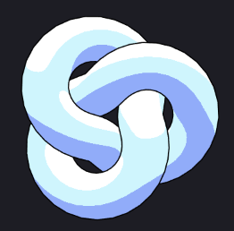
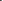
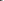
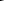

[](...menustart)

- [WebGL Tips](#20cf1d566508f29fb50f5da48374ba38)
    - [Qualifiers](#619dd4db8171a8f1bf978f44c9cf10c4)
    - [BUILT-IN VARIABLES](#435827c0432e29e22a2b69df5c4a9db4)
- [Three.js Tips](#bcf2f4a04de7d50e787ded8c2c14e655)

[](...menuend)


<h2 id="20cf1d566508f29fb50f5da48374ba38"></h2>

# WebGL Tips

[OpenGL-ES-2_0-Reference-card](https://www.khronos.org/opengles/sdk/docs/reference_cards/OpenGL-ES-2_0-Reference-card.pdf)

[the book of shaders](https://thebookofshaders.com/)   You can find the visualization of gsgl functions.

<h2 id="619dd4db8171a8f1bf978f44c9cf10c4"></h2>

## Qualifiers

1.0 name | 2.0 name | Facility | Data 
--- | --- | --- | ---
attribute | in | store current vertex data |  per vertex parameters
varying | out | interpolated data between vertex/fragment shaders(e.g. pass the vertex position to fragment shader) | per-fragment(or per-pixel)
uniform | uniform | store "constant" data during entire draw call | per primitive parameters


<h2 id="435827c0432e29e22a2b69df5c4a9db4"></h2>

## BUILT-IN VARIABLES

variable name | Description | Shading Stage | Access
--- | --- | --- | ---
gl_Position | output vertex position | Vertex |  Must be writen
gl_FragColor | output fragment color | Fragment |  Must (in WebGL 1.0)
gl_FragCoord | viewport position | Fragment | Read only
gl_FragDepth | depth value in [0,1] | Fragment | Read only


<h2 id="bcf2f4a04de7d50e787ded8c2c14e655"></h2>

# Three.js Tips

- All objects by default automatically update their matrices, or if they are the child of another object that has been added to the scene
    - However, if you know the object will be static, you can disable this and update the transform matrix manually just when needed.
    ```javascript
    object.matrixAutoUpdate = false;
    object.updateMatrix();
    ```
- built-in uniform & attributes
    - https://threejs.org/docs/#api/en/renderers/webgl/WebGLProgram 


## custom shader

```javascript
import vertexShader from './shaders/vertex.glsl'
import fragmentShader from './shaders/fragment.glsl'

//...

  // meshes
  const geometry = new THREE.PlaneGeometry(2, 2)
  const material = new THREE.ShaderMaterial({
    vertexShader: vertexShader,
    fragmentShader: fragmentShader,
    // wireframe: true,
  })
  // ...
```

- three.js ShaderMaterial class create some attributes, uniform for you
    - such like `projectionMatrix`, `modelViewMatrix`, `position`
    - if you want take control everything yourself, you should use `THREE.RawShaderMaterial`
        - when using `THREE.RawShaderMaterial`, you need to specify a precision for floats
        ```c
        precision mediump float;
        ```

## custom uniform

e.g. create a float uniform named `uTime`

```javascript
    // in javascript
    material.uniforms.uTime = {value: 0}
```

```c
// in shader
uniform float uTime;
```

## useful GSGL functions

- [pow](https://thebookofshaders.com/glossary/?search=pow)
- [lerp/mix](https://thebookofshaders.com/glossary/?search=mix)
- [clamp](https://thebookofshaders.com/glossary/?search=clamp)
- [step](https://thebookofshaders.com/glossary/?search=step), [smoothstep](https://thebookofshaders.com/glossary/?search=smoothstep)
- [length](https://thebookofshaders.com/glossary/?search=length), [distance](https://thebookofshaders.com/glossary/?search=distance)
- [fract](https://thebookofshaders.com/glossary/?search=fract)
- [mod](https://thebookofshaders.com/glossary/?search=mod)
- [dot](https://thebookofshaders.com/glossary/?search=dot), [cross](https://thebookofshaders.com/glossary/?search=cross)


## signed distance field

https://iquilezles.org/articles/distfunctions2d/


## Customize ThreeJS Materials With Shaders

```javascript
  const geometry = new THREE.IcosahedronGeometry()
  const material = new THREE.MeshStandardMaterial({
    onBeforeCompile: (shader) => {
      // shader.vertexShader
      // shader.fragmemtShader

      // save shader reference for later using
      material.userData.shader = shader

      // add a uniform
      shader.uniforms.uTime = {value: 0}
    }
  })
  const ico = new THREE.Mesh(geometry, material)
```

add `defines`

```javascript
    // in javascript
    material.defines.NO_ANIMATION = true
```

```c
    // in gsgl
    # ifdef NO_ANIMATION
        ...
    #else
        ...
    #endif
```


## toon shader implementation

https://www.youtube.com/watch?v=V5UllFImvoE&list=PLTEbuqk52pICikiHfD-a52dxEav5UqMLy&index=12



```javascript
import TOON_TONE from './images/textures/threeTone.jpg' 
...

  const solidify = (mesh, thickness = 0.02) => {
    const geometry = mesh.geometry
    const material = new THREE.ShaderMaterial({
      vertexShader: `
        void main() {
          // outline is bit larger than the original mesh
          vec3 newPosition = position + normal * ${thickness};
          gl_Position = projectionMatrix * modelViewMatrix * vec4( newPosition, 1.0 );
        }
      `,
      fragmentShader: `
        void main() {
          // outline is in black
          gl_FragColor = vec4( 0.0, 0.0, 0.0, 1.0 );
        }
        `,
      side: THREE.BackSide, // which side of faces will be rendered
    })

    const outline = new THREE.Mesh(geometry, material)

    scene.add(outline)
  }

  // original mesh
  const _addTorus = async () => {
    // a toon texture to make THREE.MeshToonMaterial look better
    const texture = await new THREE.TextureLoader().loadAsync(TOON_TONE)
    texture.minFilter = texture.magFilter = THREE.NearestFilter // really important !

    const geometry = new THREE.TorusKnotGeometry(1, 0.4, 100, 100)
    // there.js provides a MeshToonMaterial, we use it on the original mesh, but
    //  it may be bad looking... we can add a gradient map to make it look better
    const material = new THREE.MeshToonMaterial({
      color: '#4e62f9',
      gradientMap: texture,
    })
    const torus = new THREE.Mesh(geometry, material)

    // make cartoon effect
    solidify(torus, 0.02)

    scene.add(torus)
  }

  _addTorus()

```

  (threeTone 3x1)
  (fourTone 4x1)
  (fiveTone 5x1)


## Add Toon effect on prebuilt realistic model

1. open .glb model by blender
2. find the final mesh (Yellow inverted triangle icon), delete all the parerent from top to down
3. go into the `shading` tab
    - delete all other color nodes except the `BASE COLOR` node
    - unpack the texture image in `BASE COLOR` node,   the texture image will be extracted from the model
4. use tool like [krita](https://krita.org/en/download/) or photoshop  make that texture image cartoonish
    - krita : filter/Start G'MIC-Qt
    - photoshop : Filter / filter gallery / Cut Out (change color levels)
10. export the .glb model
    - export options: `Include / Selected Objects`
11. apply `solidify()` method on the model

```javascript

  const _addModel = async () => {
    const gltf = await gltfLoader.loadAsync(SWORD_MODEL)

    const model = gltf.scene.children[0]

    solidify(model, 0.01)

    scene.add(model)
  }

  _addModel()
```


