[](...menustart)

- [Node.js](#3b2819dd4c24eda2faf2052eef449551)
- [1. 简介](#25970172060d4cb30529e42f3381e390)
    - [1.4.3 单线程](#f94e4aef98455fe6c3c572995ee8173d)
    - [1.5 Node 应用场景](#a371eba560ca50469627146fd5506f8a)
        - [1.5.1 I/O 密集型](#ef7ae775712dcc6ec2888d01b7b6189c)
        - [1.5.2 是否不擅长CPU密集型业务](#7f94465afa6516fbea09da8fc65f0022)
- [2. 模块机制](#b5b4754699837a6839e68942ce084e48)
- [3. 异步 I/O](#2367caed1a6e1e77cf9db86076f7aaa7)
    - [3.4 非 I/O 异步API](#2337531cc9139c59877ef36fbe2f3962)
        - [3.4.1 定时器](#31ac8a1326f32681e79abd3278bc69ac)
        - [3.4.2 process.nextTick()](#be8b5d001a7c00b8073f8f7e053440fa)
        - [3.4.3 setImmediate()](#04fa1451735bee3cf6caedd92bf2b1e2)
- [4. 异步编程](#3d20eb4a2ae33e18c172493235772c67)
    - [4.1 高阶函数](#a4620b7af85eaa10c0a2df9696da3f31)
        - [4.1.2 偏函数用法](#39532868ebcb07b7a1891833339d5248)
    - [4.2 异步编程的优势和难点](#71ff94b3da3d6699c8e1a2a3dac5ce72)
        - [4.2.2 难点](#6562e98bb931f236fdb3e091ccea9d78)
            - [1. 难点1: 异常处理](#0e1a6cc5b16e25447f3676cf14c04aef)
            - [2. 难点2: 函数嵌套过深](#44705c9e7e56b500230516088df608d5)
            - [3. 难点3: 阻塞代码](#5eab8f1e7b69fe7c62c17d2f44bb1f6c)
            - [4. 难点4: 多线程编程](#ee5a42a7970b3edae9f7e8e6e5503d38)
    - [4.3 异步编程解决方案](#8ecb6a4c652752dfb8ee242f96ab5bf4)
        - [4.3.1 事件发布/订阅 模式](#88d41eeed95175364778a7a38b2eead0)
            - [1. 继承events模块](#d82777e48424864ec4352051f8666061)
            - [2. 利用事件队列解决雪崩问题](#319e41239eb876ed6d3d20a0354f119e)
            - [3. 多异步之间的协作方案](#e7c29eb75b8977147bad098916b1c34c)
            - [4. EventProxy 原理](#394e27f99b5a2939568813a50652e0d2)
            - [5. EventProxy的异常处理](#65d938e36eedd2876a6f17452dc959a7)
        - [4.3.2 Promise/Deferred 模式](#3773f3ef6511db68bb7a0305b7804a37)
            - [1. Promise/A](#06ec402fc85a1a0d551871ca8373f8a9)
        - [4.3.2.1 JavaScript 原生支持 Promise](#a076eefe6a0114acc06b5d1d730e6fb2)
        - [4.3.3 流程控制库](#cc7fbc3eae1133c3de0ce5ea8b5798da)
            - [2. async 模块](#f2137150612430950433017f8775c07a)
    - [4.4 异步并发控制](#b730a8c959f1d0c0b4f1e429d0a87d45)
- [5. 内存控制](#8bd7c6f2d26215b3cf56aa262149a347)
- [9. 玩转进程](#f2034d1194cb14b32dfd43ad3db3ef3a)
    - [9.2 多进程架构](#1e2a8f43da09b9e970bdfbd9995b5751)
        - [9.2.1 创建子进程](#394f2abd6f7bb2dcc7325eec4cbfe80f)
        - [9.2.2 进程间通信](#8aac8877e59cdc14e782c31f82d8f461)
        - [9.2.3 句柄传递](#88e977e004306ff315571b0b1e9efea1)
            - [1. 句柄发送和还原](#3d214d69419965e2a9cd55781db747c0)
            - [2. 端口共同监听](#617e0e8bcb553ff8fb4c13d5f1dd6a04)
    - [9.3 集群稳定之路](#580b016110dc238ba42ff6cef470f9bc)
        - [9.3.1􏰀 􏲒􏲓􏶎􏶏](#3722ffe26a10fb5330ec2d0c5809e401)
        - [9.3.2 自动重启](#26b69febcd523f91ed7df3f4b4af5c23)
            - [自杀信号](#6bcdd9159198086f18f0a641531859c8)
            - [2. 限量重启](#19e7bc0667e049833d1138b93611b7e1)
        - [9.3.3 负载均衡](#4ad0e6a3fe7b4262a75ada13106da44e)
        - [9.3.4 状态共享](#6898072c368861f2d840c640e3f9770a)
    - [9.4 Cluster 模块](#deb69daa8affa64afe0e85b120d622a2)
        - [9.4.1 Cluster 工作原理](#2a868bc8f903b6e33b76342f0bf5bd22)
        - [9.4.2 Cluster 事件](#8ebd1ca8e8de01263812a161bf26bc50)
    - [9.5 总结](#82daa52b91a58226f55dc91795b01097)
- [JS 规范](#dcc5da07746efe166316fcbed0caf575)
    - [C.2.3 比较操作](#b99d8ee1b84b04125f1a4707817090d7)
    - [C.2.6 数组和对象](#ac5f03819112eb3a57eb8acdf7793560)
    - [C.2.8 继承](#4990f90b8d16b00619e6b52e995136d9)
        - [1. 类继承](#b1de39d2ae2b4cdf8933cb354409cd7d)
        - [2. 导出](#b20f9122c53dfd232e38443679d8b7ec)
- [NPM](#00a5cdc4be82fd4ba549d52988ef9e14)
    - [正则表达式替换](#58649fadacd370d9b6ba4950e91f0833)

[](...menuend)


<h2 id="3b2819dd4c24eda2faf2052eef449551"></h2>

# Node.js

<h2 id="25970172060d4cb30529e42f3381e390"></h2>

# 1. 简介

<h2 id="f94e4aef98455fe6c3c572995ee8173d"></h2>

### 1.4.3 单线程

- 无法利用多核CPU
- 错误会引起整个应用退出，健壮性值得考验
- 大量计算占用CPU导致无法继续调用异步I/O. 

大计算量问题的解决方案：

- google 的 Gears
     - 启用一个完全独立的进程，将需要计算的程序发送到这个进程
     - 在结果得出后，通过事件将结果传递回来
     - 这个模型将计算量分发到其他进程上，以此来降低运算造成阻塞的几率
- HTML5 定制的 Web Workers 标准
     - google 放弃了 Gears, 全力支持Web Workers
     - Web Workers 创建工作线程来进行计算，以解决 JavaScript 大计算阻塞UI渲染的问题
     - 工作线程为了不阻塞主线程，通过消息传递的方式来传递运行结果, 这也使得工作线程不能访问到主线程中的UI。

Node 采用和 Web Workers 相同的思路来解决单线程中大计算量的问题: ***child_process***

子进程的出现，意味着Node 可以从容的应对单线程在健壮性和无法利用多核CPU访问的问题。

通过将计算分发到各个子进程，可以将大量计算分解到，然后再通过进程之间的事件消息来传递结果，这可以很好地保持应用模型的简单和低依赖。

通过 Master-Worker的管理方式，也可以很好的管理各个工作进程，以达到更高的健壮性。 详见第9章。


<h2 id="a371eba560ca50469627146fd5506f8a"></h2>

## 1.5 Node 应用场景

<h2 id="ef7ae775712dcc6ec2888d01b7b6189c"></h2>

### 1.5.1 I/O 密集型

I/O密集的优势主要在于Node利用事件循环的处理能力，而不是启动每一个线程为每一个请求服务，资源占用极少。

<h2 id="7f94465afa6516fbea09da8fc65f0022"></h2>

### 1.5.2 是否不擅长CPU密集型业务

- Node 可以通过编写 C/C++ 扩展的方式更高效的利用CPU, 将一些V8不能做到性能极致的地方通过C++实现。
- 如果单线程的Node 不能满足需求，甚至用了C/C++ 扩展后还觉得不够，那么通过子进程的方式，将一部分Node进程当作常驻服务用于计算。
     - 然后利用进程间的消息来传递结果，将计算与I/O 分离。
- CPU 密集不可怕，如果合理调度是诀窍。


<h2 id="b5b4754699837a6839e68942ce084e48"></h2>

# 2. 模块机制


<h2 id="2367caed1a6e1e77cf9db86076f7aaa7"></h2>

# 3. 异步 I/O

<h2 id="2337531cc9139c59877ef36fbe2f3962"></h2>

## 3.4 非 I/O 异步API

Node其实还存在一些与 I/O 无关的异步API, 这一部分也值得略微关注一下，它们分别是 setTimeout(), setInterval(), setImmediate() 和 process.nextTick();

<h2 id="31ac8a1326f32681e79abd3278bc69ac"></h2>

### 3.4.1 定时器

setTimeout() 和 setInterval() (setInterval 重复调用)与浏览器中的API是一致的，分别用于单次和多次定时执行任务。

***调用setTimeout() 或者 setInterval() 创建的定时器会被插入到 定时器观察者内部的一个红黑树中。***

每次Tick执行时，会从该红黑树中迭代取出定时器对象，检查是否超过定时时间，如果超过，就形成一个事件，它的回调函数将立即执行。


定时器的问题在于，它并非精准的（在容忍范围内）。定时器的触发，受影响与其他任务的执行。


<h2 id="be8b5d001a7c00b8073f8f7e053440fa"></h2>

### 3.4.2 process.nextTick()

在未了解 process.nextTick() 之间，很多人也许为了 立即异步执行一个任务，会这样调用：

```JavaScript
// bad
setTimeout( function() {
    // TODO
}, 0 );
```

事实上，采用定时器需要动用红黑树，创建定时器对象，和迭代操作，较为浪费性能。实际上，process.nextTick() 方法的操作相对较为轻量，具体代码如下:

```JavaScript
process.nextTick = function(callback) { 
    // on the way out, don't bother.
    // it won't get fired anyway
    if (process._exiting) return;

    if (tickDepth >= process.maxTickDepth) 
        maxTickWarn();

    var tock = { callback: callback };
    if (process.domain) tock.domain = process.domain; 
    nextTickQueue.push(tock);
    if (nextTickQueue.length) {
        process._needTickCallback(); 
    }
};
```

每次调用process.nextTick()方法，只会将回调函数放入队列中，在下一轮Tick时取出执行。红黑树的操作事件复杂度为O(lgn) ， nextTick() 的事件复杂度为 O(1)。 相较之下，process.nextTick() 更高效。


<h2 id="04fa1451735bee3cf6caedd92bf2b1e2"></h2>

### 3.4.3 setImmediate()

setImmediate()方法 与 process.nextTick() 方法十分类似，都是将回调函数延迟执行。

```JavaScript
process.nextTick(function () { 
    console.log('延迟执行');
}); 
console.log('正常执行');
```

```JavaScript
setImmediate(function () { 
    console.log('延迟执行');
}); 
console.log('正常执行');
```

- process.nextTick() 中回调函数执行的优先级要高于 setImmediate()。
     - process.nextTick()属于idle观察者, setImmediate() 属于check观察者。
     - 在每一轮循环中，优先级 idle观察者 > I/O观察者 > check观察者。
- process.nextTick() 的回调函数保存在一个数组中
     - 每轮循环中 会将数组中的回调函数全部执行完
- setImmediate() 的结构保存在链表中
     - 每轮循环 执行链表中的一个回调


我们基本勾勒出了事件驱动的实质，即 **通过主循环加事件触发的方式来运行程序**。


<h2 id="3d20eb4a2ae33e18c172493235772c67"></h2>

# 4. 异步编程

<h2 id="a4620b7af85eaa10c0a2df9696da3f31"></h2>

## 4.1 高阶函数

高阶函数在JavaScript中比比皆是，其中 ECMAScript5 中提供的一些数组方法 foreach, map, reduce , reduceRight, filter, every, some 十分典型

<h2 id="39532868ebcb07b7a1891833339d5248"></h2>

### 4.1.2 偏函数用法

偏函数用法是指创建一个函数， 这个函数调用另外一个 部分参数或变量已经预置 的函数。

在JavaScript中，我们通常会这样做类型判定：

```JavaScript
var toString = Object.prototype.toString;
var isString = function (obj) {
    return toString.call(obj) == '[object String]';
};
var isFunction = function (obj) {
    return toString.call(obj) == '[object Function]'; 
};
```

这段代码不复杂，但存在的问题是，如果有更多的 isXXX(), 就会出现更多的冗余代码。为了解决重复定义的问题，我们引入一个新函数，这个新函数可以如工厂一样 批量创建一些类似的函数。 下面的代码中，我们通过 isType() 函数预先指定type的值，然后返回一个新的函数:

```JavaScript
var isType = function (type) { 
    return function (obj) {
        return toString.call(obj) == '[object ' + type + ']'; 
    };
};
var isString = isType('String');
var isFunction = isType('Function');
```

这种通过指定部分参数来产生一个新的定制函数的形式，就是偏函数。

<h2 id="71ff94b3da3d6699c8e1a2a3dac5ce72"></h2>

## 4.2 异步编程的优势和难点

<h2 id="6562e98bb931f236fdb3e091ccea9d78"></h2>

### 4.2.2 难点

<h2 id="0e1a6cc5b16e25447f3676cf14c04aef"></h2>

#### 1. 难点1: 异常处理

过去我们处理异常时，通常使用 Java的 try/catch/final 语句块进行一场捕获，但这对于异步编程而言并不一定是用。

异步I/O的实现包含两个阶段: ***提交请求和处理结果。 这两个阶段中间有事件循环的调度，两者彼此不关联***。

异步方法则通常在第一个阶段提交请求后立即返回，因为异常不一定发生在这个极端，try/catch 在此处不会发挥任何作用。异步方法的定义如下：

```JavaScript
var async = function (callback) { 
    process.nextTick(callback);
};
```

try/catch 对 callback 执行时抛出的异常将无能为力:

```JavaScript
try {
    async(callback); 
} catch (e) { 
    // TODO
}
```

***Node在处理异常上形成了一种约定， 将异常作为回调函数的第一个实参传回，如果为空值，则表明异步调用没有异常抛出:***

```JavaScript
async(function (err, results) { 
    // TODO
});
```

我们自行编写的异步方法上，也需要去遵循这样一些原则:

- 原则1: 必须执行调用者传入的回调函数
- 原则2: 正确传递回异常， 供调用者 判断


```JavaScript
var async = function (callback) { 
    process.nextTick(function() {
        var results = something; 
        if (error) {
            return callback(error); 
        }
        callback(null, results); 
    });
};
```

在异步方法的编写中，另一个容易犯的错误是对用户传递的回调函数进行异常捕获:

```JavaScript
try {
    req.body = JSON.parse(buf, options.reviver); 
    callback();
} catch (err){ 
    err.body = buf; 
    err.status = 400; 
    callback(err);
}
```

正确的做法是：

```JavaScript
try {
    req.body = JSON.parse(buf, options.reviver);
} catch (err){ 
    err.body = buf;
    err.status = 400;
    return callback(err); 
}
callback();
```

在编写异步方法时，只要将异常正确地传递给用户的回调方法即可，无须过多处理。


<h2 id="44705c9e7e56b500230516088df608d5"></h2>

#### 2. 难点2: 函数嵌套过深

```JavaScript
fs.readFile(template_path, 'utf8', function (err, template) { 
    db.query(sql, function (err, data) {
        l10n.get(function (err, resources) { 
            // TODO
        }); 
    });
});
```

这在结果的保证上是没有问题的，问题在于这并没有利用好异步I/O带来的并行优势。这是异步编程的典型问题。

<h2 id="5eab8f1e7b69fe7c62c17d2f44bb1f6c"></h2>

#### 3. 难点3: 阻塞代码

是用 setTimeout() 方法


<h2 id="ee5a42a7970b3edae9f7e8e6e5503d38"></h2>

#### 4. 难点4: 多线程编程

child_process 是基础API, cluster 模块是更深层次的应用。


<h2 id="8ecb6a4c652752dfb8ee242f96ab5bf4"></h2>

## 4.3 异步编程解决方案

- 事件发布/订阅 模式
- Promise/Deferred 模式
- 流程控制库


<h2 id="88d41eeed95175364778a7a38b2eead0"></h2>

### 4.3.1 事件发布/订阅 模式

事件监听模式是一种广泛用于异步编程的模式, 是回调函数的事件化, 又称 发布/订阅 模式.

Node自身提供的 events 模块 是发布/订阅模式的一个简单实现，Node中部分模块都继承自它。

它具有 addListener/on() , once(), removeListener(), removeAllListeners() 和 emit() 等基本的事件监听模式的方法实现。

```JavaScript
// 订阅
emitter.on("event1", function (message) {
    console.log(message); 
});
// 发布
emitter.emit('event1', "I am message!");
```

可以看到，订阅事件就是一个 高阶函数的应用。 事件发布/订阅模式可以实现一个事件与多个回调函数的关联, 这些回调函数又称为事件监听器。

事件发布/订阅模式 常常用来解耦业务逻辑， 事件发布者无须关注订阅者如何实现业务逻辑，甚至不用关注有多少个监听器存在，数据通过消息的方式可以很灵活地传递。

在一些典型场景中，可以通过 事件发布/订阅模式进组件封装，将不变的部分封装在组件内部，将容易变化，需自定义的部分通过事件暴露给外部处理，这是一种典型的逻辑分离方式。

Node对事件发布／订阅的机制做了一些额外处理:

- 如果对一个事件添加了超过10个监听器，将会得到一条警告
- 为了处理异常， EventEmitter 对象对 error事件进行了特殊对待。如果运行期间的错误触发error事件，EventEmitter 会检查是否有对 error事件添加触发器。 如果添加了，这个错误将交由监听器处理，否则这个错误将会作为异常抛出。如果外部没有捕获这个异常，将会引起线程退出。一个健壮的EventEmitter 实例应该对error事件做处理。


<h2 id="d82777e48424864ec4352051f8666061"></h2>

#### 1. 继承events模块

实现一个继承EventEmitter 的类是十分简单的，以下代码是Node中Stream对象继承EventEmitter的例子:

```JavaScript
var events = require('events');
function Stream() { 
    events.EventEmitter.call(this);
}
util.inherits(Stream, events.EventEmitter);
```

Node在 util模块中封装了继承的方法。可以通过这样的方式轻松的继承 EventEmitter类。Node提供的核心模块中， 有近半数都继承自EventEmitter。

<h2 id="319e41239eb876ed6d3d20a0354f119e"></h2>

#### 2. 利用事件队列解决雪崩问题

在事件订阅／发布模式中，通常也有一个once()方法，通过它添加的监听器只能执行一次，在执行之后就会将它与事件的关联移除。

以下是一条数据库查询语句的调用:

```JavaScript
var select = function (callback) { 
    db.select("SQL", function (results) {
        callback(results); 
    });
};
```

如果站点刚好启动，这时缓存中是不存在数据的，如果访问量巨大，同一句SQL会被发送到数据库中反复查询，会影响服务的整体性能。

一种改进方法是添加状态锁:

```JavaScript
var status = "ready";
var select = function (callback) {
    if (status === "ready") {
        status = "pending";
        db.select("SQL", function (results) {
            status = "ready";
            callback(results); 
        });
    }
};
```

但是这种情况下，连续地多次调用select()时，只有第一次调用是生效的，后续select()是没有数据服务的，这个时候可以引入事件队列:

```JavaScript
var proxy = new events.EventEmitter(); 
var status = "ready";
var select = function (callback) {
    // 数据请求的回调 都压入事件队列
    // 利用执行一次就会将监视器移除的特点，保证每一个回调只会执行一次
    // 对于相同的SQL语句，保证在同一个查询开始到结束的过程中永远只有一次
    proxy.once("selected", callback);

    // SQL在进行查询时，新到来的相同调用只需在队列中等待数据就绪即可，
    // 一旦查询结束, 得到的结果可以被这些调用共同使用。
    if (status === "ready") { 
        status = "pending";
        db.select("SQL", function (results) {
            // 触发事件，把结果传递通知所有监听者
            proxy.emit("selected", results);
            status = "ready";
        }); 
    } 
};
```

此处可能因为存在监听器过多引发的警告，需要调用setMaxListeners(0)移除警告，或者设更大的警告阀值。


<h2 id="e7c29eb75b8977147bad098916b1c34c"></h2>

#### 3. 多异步之间的协作方案

一般而言，事件与监听者的关系是一对多，但在异步编程中，也会出现事件与监听者的关系是多对一的情况，也就是说，一个业务逻辑可能依赖两个通过回调或事件传递的结果。前面提及的回调嵌套过深的原因即是如此。

使用 *哨兵变量*:

```JavaScript
var count = 0;
var results = {};
var done = function (key, value) {
    results[key] = value; 
    count++;
    if (count === 3) {
        // 渲染 面
        render(results); 
    }
};
fs.readFile(template_path, "utf8", function (err, template) {
    done("template", template);
});
db.query(sql, function (err, data) {
    done("data", data); 
});
l10n.get(function (err, resources) { 
    done("resources", resources);
});
```

聪明的你也许已经想到利用偏函数来处理 哨兵变量和 第三方函数的关系:

```JavaScript
var after = function (times, callback) { 
    var count = 0, 
    results = {};
    return function (key, value) {
        results[key] = value; 
        count++;
        if (count === times) {
            callback(results); 
        }
    }; 
};
var done = after(times, render);
```

上述方案实现了多对一的目的， 我们依然可以继续利用发布／订阅方式完成多对多方案:

```JavaScript
var emitter = new events.Emitter(); 
var done = after(times, render);

emitter.on("done", done); 
emitter.on("done", other);

fs.readFile(template_path, "utf8", function (err, template) { 
    emitter.emit("done", "template", template);
});
db.query(sql, function (err, data) {
    emitter.emit("done", "data", data); 
});
l10n.get(function (err, resources) { 
    emitter.emit("done", "resources", resources);
});
```

上面的方法中，有一个不那么舒服的问题，那就是调用者要去准备这个done()函数，以及在回调函数中需要从结果中把数据一个一个提取出来，在进行处理。

另一个方案是第三方的 EventProxy 模块， 它是对事件订阅／发布模式的扩充

```JavaScript
var proxy = new EventProxy();
// 提供了一个 all 方法来订阅多个事件
// 当所有事件都被触发之后，监听器才会执行
proxy.all("template", "data", "resources", function (template, data, resources) { 
    // TODO
});

fs.readFile(template_path, "utf8", function (err, template) { 
    proxy.emit("template", template);
}); 
db.query(sql, function (err, data) {
    proxy.emit("data", data); 
});
l10n.get(function (err, resources) { 
    proxy.emit("resources", resources);
});
```

EventProxy 提供的另外一个方法是 tail()方法，它和all()方法的区别在于：

- all 方法的监听器在满足条件之后 只会执行一次
- tail 方法监听器 在满足条件之后，如果组合事件中的某个事件再次被触发，监听器会用最新的数据继续执行。


除此之外，在异步的场景下，我们常常需要从一个接口多次读取数据，此时触发的事件名或许是相同的。EventProxy 提供了after()方法来实现事件在执行多次后 执行监听器的单一事件组合订阅方式:

```JavaScript
var proxy = new EventProxy();
// 执行10次data事件后，执行监听器事件
// 这个监听器得到的数据，是10次按事件触发次序排列的数组
proxy.after("data", 10, function (datas) { 
    // TODO
});
```

<h2 id="394e27f99b5a2939568813a50652e0d2"></h2>

#### 4. EventProxy 原理

<h2 id="65d938e36eedd2876a6f17452dc959a7"></h2>

#### 5. EventProxy的异常处理

```JavaScript
exports.getContent = function (callback) { 
    var ep = new EventProxy();
    ep.all('tpl', 'data', function (tpl, data) { 
        // 成功回调
        callback(null, {
            template: tpl,
            data: data 
        });
    }); 
    // 绑定错误处理函数 
    ep.fail(callback);

    fs.readFile('template.tpl', 'utf-8', ep.done('tpl'));
    db.get('some sql', ep.done('data')); };
```

`ep.fail(callback);` 等价于:

```JavaScript
ep.fail(function (err) { 
    callback(err);
});
```

又等价于:

```JavaScript
ep.bind('error', function (err) { 
    // 卸载掉 所有处理函数 
    ep.unbind();
    // 异常回调
    callback(err); 
});
```

而done()方法的实现，`ep.done('tpl');` 等价于:

```JavaScript
function (err, content) { 
    if (err) {
        // 一旦发生异常, 一律交给error事件 处理函数处理
        return ep.emit('error', err); 
    }
    ep.emit('tpl', content); 
}
```

done()方法也接收一个函数作为参数。

这里的fail() 和 done() 十分类似 Promise模式中的 fail()和done()。


<h2 id="3773f3ef6511db68bb7a0305b7804a37"></h2>

### 4.3.2 Promise/Deferred 模式

使用事件的方式时，执行流程需要被预先设定。即便是分支，也需要预先设定，这是由发布／订阅模式的运行机制所决定的。 下面为普通的 Ajax 调用

```JavaScript
$.get('/api', { 
    success: onSuccess, 
    error: onError, 
    complete: onComplete
}); 
```

是否有一种先执行异步调用，延迟传递处理的方式呢？ 答案是 Promise/Deferred 模式.

```JavaScript
$.get('/api') 
    .success(onSuccess) 
    .error(onError) 
    .complete(onComplete);
```

这使得即使不调用 success(),error() 等方法，Ajax也会执行。

通过 Deferred对象，可以对事件加入任意的业务处理逻辑。

```JavaScript
$.get('/api') 
    .success(onSuccess1) 
    .success(onSuccess2);
```

异步编程一旦出现深度的嵌套，就会让编程的体验变得不愉快，而 Promise/Deferred模式在一定程度上缓解了这个问题。 这里我们着重介绍 Promise/A 来以点带面介绍 Promise/Deferred 模式。

<h2 id="06ec402fc85a1a0d551871ca8373f8a9"></h2>

#### 1. Promise/A

Promise/Deferred 模式其实包含两部分，即 Promise和Deferred。 

Promise/A 提议对单个异步操作做出这样的抽象定义，具体如下所示：

- Promise操作只会处在3种状态中的一种: 未完成态，完成态，和失败态。
- Promise的状态只会出现 从未完成态 向完成态 或 失败态转化，不能逆反。
     - 完成态 和 失败态 不能互相转化
- Promise 的状态一旦转化，将不能被更改

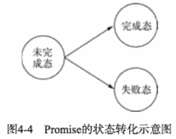

在API的定义上，Promise/A 提议是比较简单的。 一个 Promise 对象只要具备 then()方法即可。但是对于then()方法, 有以下简单的要求。

- 接收完成态，错误态的回调方法。 在操作完成或 出现错误时，将会调用对应方法。
- 可选地支持 progress 事件回调作为第三个方法
- then() 方法只接受 function 对象，其余对象将被忽略
- then() 方法继续返回 Promise 对象, 以实现链式调用。

then()方法的定义如下:

```JavaScript
then(fulfilledHandler, errorHandler, progressHandler)
```

为了掩饰 Promise/A 提议，这里我们尝试通过继承Node的events模块来完成一个简单的实现:

```JavaScript
var Promise = function () { 
    EventEmitter.call(this);
};
util.inherits(Promise, EventEmitter);

Promise.prototype.then = function (fulfilledHandler, errorHandler, progressHandler) { 
    if (typeof fulfilledHandler === 'function') {
        //  用once()方法  证成功回调 执行  
        this.once('success', fulfilledHandler); 
    }
    if (typeof errorHandler === 'function') { 
        //  用once()方法  证异常回调 执行   
        this.once('error', errorHandler);
    }
    if (typeof progressHandler === 'function') {
        this.on('progress', progressHandler); 
    }
    return this; 
};
```

这里看到, then()方法所做的事情是将回调函数存放起来。 为了完成整个流程，还需要触发 执行这些回调函数的地方，实现这些功能的对象通常被称为Deferred, 即延迟对象:

```JavaScript
var Deferred = function () { 
    this.state = 'unfulfilled'; 
    this.promise = new Promise();
};

Deferred.prototype.resolve = function (obj) { 
    this.state = 'fulfilled'; 
    this.promise.emit('success', obj);
};
Deferred.prototype.reject = function (err) { 
    this.state = 'failed'; 
    this.promise.emit('error', err);
};
Deferred.prototype.progress = function (data) { 
    this.promise.emit('progress', data);
};
```

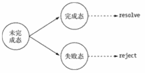

利用Promise/A 提议的模式，我们可以把一个典型的响应对象:

```JavaScript
res.setEncoding('utf8'); 
res.on('data', function (chunk) {
    console.log('BODY: ' + chunk); 
});
res.on('end', function () { 
    // Done
});
res.on('error', function (err) {
    // Error 
});
```

封装为:

```JavaScript
res.then(function () { 
    // Done
}, function (err) { 
    // Error
}, function (chunk) { 
    console.log('BODY: ' + chunk);
});
```

要实现如此简单的API，只需要简单地改造一下即可:

```JavaScript
var promisify = function (res) { 
    var deferred = new Deferred(); 
    var result = '';
    res.on('data', function (chunk) {
        result += chunk;
        deferred.progress(chunk); 
    });
    res.on('end', function () { 
        deferred.resolve(result);
    });
    res.on('error', function (err) {
        deferred.reject(err); 
    });
    return deferred.promise;
};
```

返回 deferred.promise 的目的是为了不让外部程序调用 resolve()和reject()方法，更改内部状态的行为交由定义者处理。

下面为定义好 Promise后的调用示例:

```JavaScript
promisify(res).then(function () { 
    // Done
}, function (err) { 
    // Error
}, function (chunk) {
    // progress
    console.log('BODY: ' + chunk);
});
```

这里会到 Promise和Deferred的差别上。从上面的代码可以看出， Deferred主要用于内部，用于维护异步模型的状态； Promise则作用于外部，通过 then()方法暴露给外部以添加自定义逻辑。

Promise和Deferred 整体关系如图:

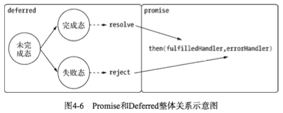

Promise/Deferred 模式 将 业务中不可变的部分封装在 Deferred中，将可变部分交给了 promise。 此时问题就来了，对于不同的场景，都需要去封装和改造其Deferred部分，然后才能得到简洁的接口。如果场景不常用，封装花费的时间与带来的简洁相比 并不一定划算。

Promise是高级接口，时间是低级接口。低级接口可以构成更多更复杂的场景，高级接口一单定义，不太容易变化，不再有低级接口的灵活性，但对于解决典型问题非常有效。

Q模块是 Promise/A 规范的一个实现。

TODO

<h2 id="a076eefe6a0114acc06b5d1d730e6fb2"></h2>

### 4.3.2.1 JavaScript 原生支持 Promise

所谓Promise，字面上可以理解为“承诺”，

- 就是说A调用B，B 先返回一个“承诺”给A，
- 然后A就可以在写计划的时候这么写：
     - 当B返回结果给我的时候，A执行方案S1，
     - 反之如果B因为什么原因没有给到A想要的结果，那么A执行应急方案S2，
- 这样一来，所有的潜在风险都在A的可控范围之内了。

上面这段话，翻译成代码类似

```JavaScript
var resB = B();
var runA = function() {
    resB.then(execS1, execS2);
};
runA();
```


用法:

```JavaScript
promise.then(function(result) {
  console.log(result); // "Stuff worked!"
}, function(err) {
  console.log(err); // Error: "It broke"
});
```

与其他库的兼容性：

JavaScript Promise 的 API 会把任何包含有 then 方法的对象当作“类 Promise”（或者用术语来说就是 thenable。叹气）的对象，这些对象经过 Promise.cast() 处理之后就和原生的 JavaScript Promise 实例没有任何区别了。所以如果你使用的库返回一个 Q Promise，那没问题，无缝融入新的 JavaScript Promise。

```JavaScript
var jsPromise = Promise.cast($.ajax('/whatever.json'));
```


<h2 id="cc7fbc3eae1133c3de0ce5ea8b5798da"></h2>

### 4.3.3 流程控制库

<h2 id="f2137150612430950433017f8775c07a"></h2>

#### 2. async 模块

长期占据 NPM 依赖榜前三名


<h2 id="b730a8c959f1d0c0b4f1e429d0a87d45"></h2>

## 4.4 异步并发控制


<h2 id="8bd7c6f2d26215b3cf56aa262149a347"></h2>

# 5. 内存控制


---


<h2 id="f2034d1194cb14b32dfd43ad3db3ef3a"></h2>

# 9. 玩转进程

从严格意义上而言，Node并非真正的单线程架构，Node自身还有一定的I/O线程存在，这些I/O线程存在。

这部分线程对于 开发者而言是透明的，只有C++扩展时才会关注到。

<h2 id="1e2a8f43da09b9e970bdfbd9995b5751"></h2>

## 9.2 多进程架构

Node提供了 child_process模块，并且也提供了 child_process.fork()函数供我们实现进程的复制。

worker.js , 监听1000-2000之间的一个随机端口

```JavaScript
var http = require('http'); http.createServer(function (req, res) {
    res.writeHead(200, {'Content-Type': 'text/plain'});
    res.end('Hello World\n');
}).listen(Math.round((1 + Math.random()) * 1000), '127.0.0.1');
```

master.js , 根据当前机器的CPU数量复制对应Node进程数

```JavaScript
var fork = require('child_process').fork; 
var cpus = require('os').cpus();
for (var i = 0; i < cpus.length; i++) {
    fork('./worker.js'); 
}
```

在 linux 系统下可以通过 ps aux | grep worker.js 查看到进程的数量

```bash
$ ps aux | grep worker.js
jacksontian 1475 0.0 0.0 2432768 600 s003 S+ 3:27AM 0:00.00 grep worker.js
jacksontian 1440 0.0 0.2 3022452 12680 s003 S 3:25AM 0:00.14 /usr/local/bin/node ./worker.js 
jacksontian 1439 0.0 0.2 3023476 12716 s003 S 3:25AM 0:00.14 /usr/local/bin/node ./worker.js 
jacksontian 1438 0.0 0.2 3022452 12704 s003 S 3:25AM 0:00.14 /usr/local/bin/node ./worker.js 
jacksontian 1437 0.0 0.2 3031668 12696 s003 S 3:25AM 0:00.15 /usr/local/bin/node ./worker.js
```


图9-1就是著名的Master-Worker模式，又称主从模式。图中的进程分为：主进程和工作进程。这是典型的分布式架构中用于并行处理业务的模式。

- 主进程不负责具体的业务处理，而是负责调度或管理工作进程，它是趋向于稳定的。
- 工作进程负责具体的业务处理

fork() 进程是昂贵的。好在Node通过事件驱动的方式在单线程上解决了大并发的问题，这里启动多个进程只是为了充分将CPU资源利用起来，而不是为了解决并发问题。


<h2 id="394f2abd6f7bb2dcc7325eec4cbfe80f"></h2>

### 9.2.1 创建子进程

child_process 模块提供了4个方法用于创建子进程

- spawn(): 启动一个子进程来执行命令
- exec(): 启动一个子进程来执行命令，与spawn不同的是接口, 它有一个回调函数获知子进程的状况
- execFile(): 启动一个子进程来执行文件
- fork(): 与 spawn 类似, 不同点在于它创建Node的子进程只需指定要执行的JavaScript文件模块即可


`node worker.js` 这个命令分别用 上述4种方法实现:

```JavaScript
var cp = require('child_process');

cp.spawn('node', ['worker.js']);
cp.exec('node worker.js', function (err, stdout, stderr) {
    // some code 
});
cp.execFile('worker.js', function (err, stdout, stderr) { 
    // some code
}); 
cp.fork('./worker.js');
```

类型 | 回调/异常 | 进程类型 | 执行类型 | 可设置超时
--- | --- | --- | --- | --- 
spawn | x | 任意 | 命令 | x
exec | ✓ |  任意 | 命令 | ✓
execFile | ✓ |  任意 | 可执行文件 | ✓
fork | x | Node | JavaScript 文件 | x 

这里的可执行文件是指可以直接执行的文件，如果是 JavaScript 文件通过 execFile()执行, 它的首行内容必须添加如下代码：

```JavaScript
 #!/usr/bin/env node
```

事实上，后面3种方法都是 spawn() 的延伸应用。

<h2 id="8aac8877e59cdc14e782c31f82d8f461"></h2>

### 9.2.2 进程间通信

在前端浏览器中，JavaScript 主线程与UI渲染公用同一个线程，两者互相阻塞。

为了解决这个问题，HTML5 提出了 WebWorker API, 允许创建工作线程并在后台运行，使得一些阻塞较为严重的计算不影响主线程的UI渲染。

它的API 如下所示

```JavaScript
var worker = new Worker('worker.js'); 
worker.onmessage = function (event) {
    document.getElementById('result').textContent = event.data; 
};
```

worker.js:

```JavaScript
var n = 1;
search: while (true) {
    n += 1;
    for (var i = 2; i <= Math.sqrt(n); i += 1)
        if (n%i == 0) 
            continue search;
     // found a prime
    postMessage(n); 
}
```

主线程和工作线程之间通过 onmessage() 和 postMessage() 进行通信。


Node 主/子进程之间的通信 API 一定程度上相似, 进程间 通过 send()方法 发送数据，message 事件接收数据。

```JavaScript
// parent.js
var cp = require('child_process');
var n = cp.fork(__dirname + '/sub.js');
n.on('message', function (m) { 
    console.log('PARENT got message:', m);
});
n.send({hello: 'world'});
```

```JavaScript
// sub.js
process.on('message', function (m) { 
    console.log('CHILD got message:', m);
});
process.send({foo: 'bar'});
```

通过fork() 或者其他 API，创建子进程之后, 为了实现父子进程之间的通信, 父子进程之间将会创建IPC通道。通过 IPC 通道，父子进程之间才能通过 message和send() 传递消息。

***进程间通信原理***

IPC的全称是 Inter-Process Communication. 实现进程间通信的技术有很多，如命名管道，匿名管道，socket，信号量，共享内存，消息队列，Domain Socket等。

Node中实现IPC通道的是管道(pipe)技术，但此管道非彼管道。在Node中管道是个抽象层面的称呼，具体细节实现由libuv提供, unix系统采用 Unix Domain Socket实现。表现在应用层上的进程间通信只有简单的message事件和send()方法。

父进程在实际创建子进程前，会创建IPC通道并监听它，然后才真正创建出子进程，并通过环境变量( NODE_CHANNEL_FD ) 告诉子进程这个IPC通道的文件描述符。子进程在启动过程中，根据文件描述符去链接这个已经存在的IPC通道，从而完成父子进程之间的连接。

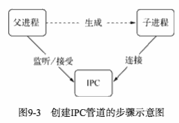

Node中，IPC通道被抽象为 Stream 对象，在调用 send() 时发送数据(类似 write())，在接收到消息会通过message事件( 类似于 data)
触发给应用层。

**注意**：只有启动的子进程是Node进程时，子进程才会根据环境变
量去链接IPC通道，对于其他类型的子进程则无法实现进程间通信，除非其他进程也按约定去连接这个已经创建好的IPC通道。


<h2 id="88e977e004306ff315571b0b1e9efea1"></h2>

### 9.2.3 句柄传递

建立好进程间的IPC后，如果仅仅只用来发送一些简单的数据，显然不够我们的实际应用使用。

问题描述: 如果启动多个服务器实例来监听，无法同时监听同一个端口。 这个问题破坏了我们将多个进程监听同一个端口的想法。

要解决问题，通常的做法是每个进程监听不同的端口，其中主进程监听主端口(80), 主进程对外接收所有的网络请求，再将这些请求分别代理道不同的端口的进程上。

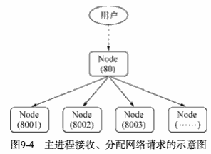

通过代理，可以避免端口不能重复监听的问题，甚至可以在代理进程上做适当的负载均衡。 由于进程每接收到一个连接，将会用掉一个文件描述描述符，因此代理方案中客户端连接到工作进程，需要用掉两个文件描述符。操作系统的文件描述符是有限的，代理方案浪费掉一倍数量的文件描述符的做法影响了系统的扩展能力。

为了解决上述问题，Node在0.5.9版本引入了进程间发送句柄的功能。send()方法除了能通过IPC发送数据外，还能发送句柄，第二个可选参数就是句柄：

```JavaScript
child.send(message, [sendHandle])
```

句柄是一种可以用来标识资源的引用，他的内部包含了指向对象的文件描述符。比如句柄可以用来标识一个服务器socket对象，一个客户端socket对象，一个UDP套接字，一个管道等。

发送句柄意味着什么？ 在前一个问题中，我们可以去掉代理这种方案，使主进程接收到socket请求后，将这个socket直接发送给工作进程，而不是重新与工作进程之间建立新的socket连接来转发数据，以解决文件描述符浪费的问题。

```JavaScript
// parent.js
var cp = require('child_process'); 
var child1 = cp.fork('child.js'); 
var child2 = cp.fork('child.js');

// Open up the server object and send the handle 
var server = require('net').createServer(); 
server.on('connection', function (socket) {
    socket.end('handled by parent\n'); 
});
server.listen(1337, function () {
    // 发送句柄给 子进程
    child1.send('server', server); 
    child2.send('server', server);
});
```

```JavaScript
// child.js
process.on('message', function (m, server) { 
    if (m === 'server') {
        server.on('connection', function (socket) {
            socket.end('handled by child, pid is ' + process.pid + '\n');
        }); 
    }
});
```

这个示例中，直接将一个TCP服务发送给了子进程。用curl测试:

```bash
$ curl "http://127.0.0.1:1337/" handled by child, pid is 24673 
$ curl "http://127.0.0.1:1337/" handled by parent
$ curl "http://127.0.0.1:1337/" handled by child, pid is 24672
```

测试的结果每次出现的结果都可能不同，结果可能被父进程处理，也可能被子进程处理。并且这是在TCP层面上完成的事情，我们尝试将其转化到HTTP层面来试试。 对于主进程来而言，我们甚至想要它更轻量一点，那么是否将服务器句柄发送给子进程之后，就可以关掉服务器的监听，让子进程来处理请求呢？

```JavaScript
// parent.js
var cp = require('child_process');

var child1 = cp.fork('child.js'); 
var child2 = cp.fork('child.js');

// Open up the server object and send the handle 
var server = require('net').createServer(); 
server.listen(1337, function () {
    // 发送句柄给 子进程
    child1.send('server', server); 
    child2.send('server', server);
    // 关 
    server.close();
});
```

```JavaScript
// child.js
var http = require('http');
var server = http.createServer(function (req, res) {
    res.writeHead(200, {'Content-Type': 'text/plain'});
    res.end('handled by child, pid is ' + process.pid + '\n'); 
});
process.on('message', function (m, tcp) { 
    if (m === 'server') {
        tcp.on('connection', function (socket) {
            server.emit('connection', socket);
        });
    }
});
```

```bash
$ curl "http://127.0.0.1:1337/" handled by child, pid is 24852 
$ curl "http://127.0.0.1:1337/" handled by child, pid is 24851
```

这样以来，所有的请求都是由子进程处理了。这个过程中，服务的过程发生了一次改变：


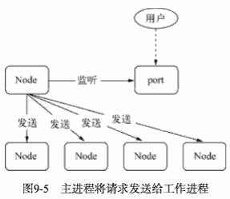  ->  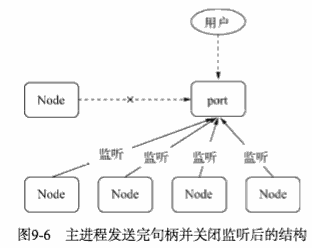

我们发现，多个子进程可以同时监听相同端口，再没有 EAADINUSE 一场发生了。

<h2 id="3d214d69419965e2a9cd55781db747c0"></h2>

#### 1. 句柄发送和还原

上文介绍的虽然是句柄发送，但是仔细看看，句柄发送 跟 我们直接将服务器对象发送给 子进程 有没有差别？  它是否真的将服务器对象发送给了 子进程？ 为什么它可以发送到多个子进程？ 发送给子进程 为什么父进程中还存在这个对象？ 

目前 send()     方法可以发送的句柄类型包括如下几种：

- net.Socket   TCP 套接字
- net.Server   TCP服务器， 任意建立在TCP服务上的应用层服务都可以享受到它带来的好处。
- net.Native   C++层面的TCP套接字 或 IPC管道
- dgram.Socket  UDP 套接字
- dgram.Native   C++ 层面的UDP套接字

send() 方法在将消息发送到 IPC 管道前，将消息组装成两个对象, 一个对象是 handle, 另一个对象是 message.  message 参数如下:

```json
{
    cmd: 'NODE_HANDLE', 
    type: 'net.Server', 
    msg: message
}
```

发送到IPC管道中的实际上是我们要发送的句柄文件描述符，文件描述符实际上是一个整数值。这个message对象在写入到ICP管道时也会通过 JSON.stringify() 进行序列化。 所以最终发送到ICP管道中的信息都是字符串， send()方法能发送消息和句柄，并不意味着它能发送任意对象。

连接了IPC通道的子进程可以读取到父进程发来的消息， 将字符串通过 JSON.parse()解析还原为对象后，才出发message事件将消息体传递给应用层使用。 在这个过程中，消息对象还要被进行过滤处理，message.cmd 的值如果以NODE_ 为前缀，它将响应一个内部事件 internalMessage。如果message.cmd的值为NODE_HANDLE, 它将取出 message.type值和得到的文件描述符 一起还原出一个对应的对象:


 以发送的TCP服务器句柄为例， 子进程收到消息后的 还原过程如下:

```JavaScript
function(message, handle, emit) {
    var self = this;
    // 子进程根据 message.type 创建对应 TCP服务器对象
    var server = new net.Server(); 
    // 然后监听到 文件描述符上
    server.listen(handle, function() {
        emit(server);  
    });
}
```

所以在子进程中， 开发者会有一种服务器就是从 父进程中直接传递过来的错觉。 **值得注意：** Node进程之间只有消息传递，不会真正传递对象。

目前 Node 只支持上述提到的几种句柄，并非任意类型的句柄都能在进程之间传递，除非它有完整的发送和还原过程。

<h2 id="617e0e8bcb553ff8fb4c13d5f1dd6a04"></h2>

#### 2. 端口共同监听 

- 独立启动的多个进程中， TCP服务器端 socket套接字的文件描述符 并不相同，导致监听到相同的端口时会抛出异常
- Node 底层对每个端口监听都设置了 SO_REUSEADDR 选项，这个选项的含义是 不同的进程 可以就相同的网卡和端口进行监听，这个套接字可以被不同的进程复用
     - 对于 send() 发送的句柄还原出服务而言, 他们的文件描述符是相同的，所以监听相同端口不会引起一场。

```Cpp
setsockopt(tcp->io_watcher.fd, SOL_SOCKET, SO_REUSEADDR, &on, sizeof(on))
```

- 多个应用监听相同端口时， 文件描述符同一时间只能被某个进程所用。 也就是说， 网络请求向服务端发送时， 只有一个幸运的进程能够抢到链接，只有它能为这个请求服务。这些进程服务是抢占式的。


<h2 id="580b016110dc238ba42ff6cef470f9bc"></h2>

## 9.3 集群稳定之路

搭建好了集群，充分利用了CPU资源，似乎就可以迎接客户端大量的请求了。但我们还有一些细节需要考虑。

- 性能问题
- 多个工作进程的存货状态管理
- 工作进程的平滑重启
- 配置活着静态数据的动态重新载入
- 其他细节

是的，虽然我们创建了很多工作进程，但每个工作进程依然是在单线程上执行的，他的稳定性还不能得到完全的保障。 我们需要建立起一个健全的机制来保障Node应用的健壮性.

<h2 id="3722ffe26a10fb5330ec2d0c5809e401"></h2>

### 9.3.1􏰀 􏲒􏲓􏶎􏶏

再次回到子进程对向上，除了引人关注的 send() 方法 和 message 事件外，子进程还有些什么? 

除message事件外, 父进程能监听到的子进程相关事件:

- error:  当子进程 无法被复制创建, 无法被杀死，无法发送消息时， 会触发改事件
- exit:  子进程退出时 触发该事件。 如果是正常退出，第一个参数是 退出码，否则为 null. 如果进程是通过 kill() 方法杀死的, 会得到第二个参数，他表示杀死进程时的信号.
- close:  在子进程的标准输入输出流 终止时， 触发该事件
- disconnect:  在父进程 或 子进程中 调用 disconnect() 方法时触发该事件
     - 在调用调用 disconnect() 方法时 将关闭监听 IPC 通道

除了 send() 外， 还能通过 kill() 方法给子进程发送消息。 kill() 方法并不能真正地将 通过IPC相连的子进程杀死，它只是给子进程发送了一个系统信号。 默认情况下，kill() 方法会发送一个 SIGTERM 信号。它与进程默认的kill() 方法类似:

```JavaScript
// 发送给子进程
child.kill([signal]);
// 发送给 目标进程
process.kill(pid, [signal]);
```

POSIX 标准中，， 有一套完备的信号系统， `kill -l` 可以看到详细的信号列表:

```bash
$ kill -l
 1) SIGHUP     2) SIGINT     3) SIGQUIT     4) SIGILL
 5) SIGTRAP     6) SIGABRT     7) SIGEMT     8) SIGFPE
 9) SIGKILL    10) SIGBUS    11) SIGSEGV    12) SIGSYS
13) SIGPIPE    14) SIGALRM    15) SIGTERM    16) SIGURG
17) SIGSTOP    18) SIGTSTP    19) SIGCONT    20) SIGCHLD
21) SIGTTIN    22) SIGTTOU    23) SIGIO    24) SIGXCPU
25) SIGXFSZ    26) SIGVTALRM    27) SIGPROF    28) SIGWINCH
29) SIGINFO    30) SIGUSR1    31) SIGUSR2
```

Node 提供了这些信号对应的信号事件， 每个进程都可以监听这些信号事件。 如 SIGTERM 是软件终止信号，进程收到该信号时应当退出。

```JavaScript
process.on('SIGTERM', function() { 
    console.log('Got a SIGTERM, exiting...'); 
    process.exit(1);
});

console.log( 'server running with PID:' , process.pid );
process.kill( process.pid , 'SIGTERM' ) ;
```


<h2 id="26b69febcd523f91ed7df3f4b4af5c23"></h2>

### 9.3.2 自动重启

有了父子进程之间的相关事件后，就可以在这些关系之间创建出需要的机制了。  至少我们能够监听子进程的 exit 事件来获知其退出的消息, 接着前文的多进程架构，我们在主进程上要加入一些子进程管理的机制，比如重新启动一个工作进程来继续服务。

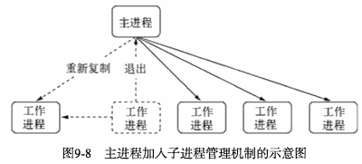

```JavaScript
// master.js
var fork = require('child_process').fork; 
var cpus = require('os').cpus();

var server = require('net').createServer(); 
server.listen(1337);

var workers = {};
var createWorker = function () {
    var worker = fork(__dirname + '/worker.js'); 
    // 􏶥退出时重􏶦启动􏶦的进程
    worker.on('exit', function () {
        console.log('Worker ' + worker.pid + ' exited.'); 
        delete workers[worker.pid];
        createWorker();
    });
    // 句柄转发
    worker.send('server', server); 
    workers[worker.pid] = worker;
    console.log('Create worker. pid: ' + worker.pid);
};

for (var i = 0; i < cpus.length; i++) { 
    createWorker();
}
// 进程自己退出时, 所有工作进程􏶥退出
process.on('exit', function () {
    for (var pid in workers) { 
        workers[pid].kill();
    } 
});    
```

在实际业务中，可能有隐藏的bug导致工作进程退出，那么我们需要仔细地处理这种异常，如下所示:

```JavaScript
// worker.js
var http = require('http');
var server = http.createServer(function (req, res) {
    res.writeHead(200, {'Content-Type': 'text/plain'});
    res.end('handled by child, pid is ' + process.pid + '\n'); 
});
var worker;
process.on('message', function (m, tcp) {
    if (m === 'server') {
        worker = tcp;
        worker.on('connection', function (socket) {
            server.emit('connection', socket); 
        });
    } 
});

process.on('uncaughtException', function () {
    // 􏶮􏶯停止接收新的链接
    worker.close(function () {
        // 所有已有链接断开后，退出进程
        process.exit(1); 
    });
});
```

上述代码的处理流程是， 一旦有未捕获的异常出现，工作进程就会立即停止接收新的链接； 当所有的连接断开后，退出进程。 主进程在 监听到工作进程的exit后，将会立即启动新的进程服务，以此保证整个集群中 总是有进程在为用户服务的。

<h2 id="6bcdd9159198086f18f0a641531859c8"></h2>

#### 自杀信号

上述代码存在的问题是 要等到所有链接断开后 进程才会退出， 在极端的情况下， 所有工作进程都停止接收新的链接，全处在等待退出的状态。 但是等到进程完全退出才重启的过程中，会丢到大部分请求。

为此需要改进这个过程， 不能等到工作进程退出后才重启新的工作进程。 当然也不能暴力退出进程，因为这样会导致以连接的用户直接断开。 于是我们在退出的流程中增加一个自杀(suicide)信号。 工作进程在得知要退出时，向主进程发送一个自杀信号，然后才停止接收新的链接，当所有连接断开后才退出。 主进程在接收到自杀信号后，立即创建新的工作进程服务。

```JavaScript
// worker.js
process.on('uncaughtException', function (err) {
    process.send({act: 'suicide'}); 
    // 􏶮􏶯停止接收新的连接 
    worker.close(function () {
        // 所有已有链接断开后，退出进程
        process.exit(1); 
    });
});    
```

主进程将重启工作进程的任务，从 exit 事件的处理函数中转移到 message 事件的处理函数中：

```JavaScript
var createWorker = function () {
    var worker = fork(__dirname + '/worker.js'); 
    // 自杀时 启动􏶦新的进程
    worker.on('message', function (message) {
        if (message.act === 'suicide') { 
            createWorker();
        } 
    });
    worker.on('exit', function () {
        console.log('Worker ' + worker.pid + ' exited.');
        delete workers[worker.pid]; 
    });
    worker.send('server', server); 
    workers[worker.pid] = worker;
    console.log('Create worker. pid: ' + worker.pid);
};    
```

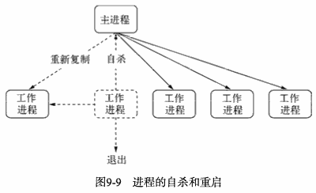


这里存在的问题是 有可能我们的链接是长连接，是不是 HTTP 服务这种短连接， 等待长连接断开可能需要较久的时间。 为此 为已有链接的断开设置一个超时时间是有必要的，在限定时间内强制退出:

```JavaScript
process.on('uncaughtException', function (err) {
    // 􏷀出现未捕获异常，说明代码的健壮性上是不合格的
    // 必须通过日志记录下问题的所在, 以帮助定位和追踪代码异常出现的位置
    logger.error(err);
    // 发送自杀信号
    process.send({act: 'suicide'}); 
    // 停止接收新的连接
    worker.close(function () {
        // 􏶩所有已有链接断开后，退出进程
        process.exit(1);
    });
    // 5秒后退出进程
    setTimeout(function () {
        process.exit(1); 
    }, 5000);
});
```

<h2 id="19e7bc0667e049833d1138b93611b7e1"></h2>

#### 2. 限量重启

工作进程不能无限制的重启，如果启动的过程中就发生了错误，或者启动后接到连接就收到错误会导致工作进程被频繁重启。

为了消除这种无意义的重启，在满足一定规则的限制下，不应当反复重启。比如在单位时间内规定只能重启多少次，超过限制就触发 giveup事件，告知放弃重启。

```JavaScript
// 重启次数 
var limit = 10;
// 时间单位
var during = 60000;
var restart = [];

var isTooFrequently = function () {
    // 记录重启时间
    var time = Date.now();
    var length = restart.push(time); 
    if (length > limit) {
        // 取出最后10个纪录
        restart = restart.slice(limit * -1); 
    }
    // 最后一次重启到前10次重启之间的时间间隔
    return restart.length >= limit && restart[restart.length - 1] - restart[0] < during; 
};


var workers = {};
var createWorker = function () {
    // 检查是否太过频繁
    if (isTooFrequently()) {
        // 触发giveup事件后, 不再重启
        process.emit('giveup', length, during); 
        return;
    }

    var worker = fork(__dirname + '/worker.js');
    ...
```

giveup 事件是比 uncaughtException 更严重的异常事件。


<h2 id="4ad0e6a3fe7b4262a75ada13106da44e"></h2>

### 9.3.3 负载均衡

Node 默认提供的机制是采用操作系统的抢占式策略。 一般而言，抢占式策略对大家是公平的，各个进程可以根据自己的繁忙度来进行抢占。但是对于Node而言，需要分清的是它的繁忙是由CPU,I/O 两个部分构成的，影响抢占的是CPU的繁忙度。 对不同的业务，可能存在 I/O繁忙，而CPU较为空闲的情况，这可能造成某个进程能够抢到较多请求，行程负载不均衡的情况。

为此 Node在 v0.11中提供了一种新的策略使得负载均衡更合理: Round-Robin, 又叫轮叫调度。 轮叫调度的工作方式是由主进程接收连接， 将其一次分发给工作进程。 分发的策略是在 N个工作进程中，每次选择第 i=(i+1) mod n . 在 cluster 模块中启用它的方式如下:

```JavaScript
// 启用 Round-Robin
cluster.schedulingPolicy = cluster.SCHED_RR 
// 不启用Round-Robin
cluster.schedulingPolicy = cluster.SCHED_NONE
```

或者在环境变量中设置: NODE_CLUSTER_SCHED_POLICY 的值

```bash
export NODE_CLUSTER_SCHED_POLICY=rr
export NODE_CLUSTER_SCHED_POLICY=none
```

Round-Robin 非常简单, 可以避免 CPU 和 I/O 繁忙差异导致的负载不均衡。Round-Robin 策略也可以通过代理服务器来实现，但是它会导致服务器上消耗的文件描述符是平常的两倍。


<h2 id="6898072c368861f2d840c640e3f9770a"></h2>

### 9.3.4 状态共享

Node 进程中不宜存放太多数据, 

- 因为它会加重垃圾回收的负担，进而影响性能。
- 同时，Node也不允许在多个进程之间共享数据。

但在实际的业务中, 往往需要共享一些数据，譬如配置数据, 这在多个进程中应当是一致的。为此，在不允许共享数据的情况下，我们需要一种方案和机制来实现数据在多个进程之间的共享。


***第三方数据存储***

解决数据共享最直接，简单的方式就是通过第三方来进行数据存储，比如将数据存放到 数据库，磁盘文件， 缓存服务(如 Redis) 中，所有工作进程启动时将其读取进内存。但这种方式存在的问题是，如果数据发生变化，还需要一种机制通知各个子进程，使得它们的内部状态也得到更新。

实现状态同步的机制有两种:

1. 各个子进程 向第三方进行定时轮询
    - 轮询带来的问题是，轮询时间不能过密，也不能过长
2. 主动通知
    - 当数据发生更新时，主动通知子进程
    - 仍需要一种机制来及时获取数据的改变，这个过程仍然不能脱离轮询，但可以减少轮询的进程数量。

我们将 这种 用来发送通知 和查询状态是否更改 的进程叫 通知进程。为了不混合业务逻辑，可以将这个进程设计为只进行轮询和通知，不处理任何业务逻辑。

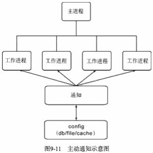

这种推送机制 如果按进程间信号传递，在跨多台服务器会无效(因为其他服务器无法获取配置文件)，是故可以考虑采用 TCP或UDP的方案。 进程在启动时从通知服务处 读取第一次数据外，还将进程信息注册到通知服务处。 一旦发现数据更新后，根据注册信息，将更新后的数据发送给工作进程。

<h2 id="deb69daa8affa64afe0e85b120d622a2"></h2>

## 9.4 Cluster 模块

前文介绍如何通过 child_process 模块构件强大的单机集群。 上述提及的问题，Node在v0.8版本时新增的 cluster 模块就能解决。 child_process 来实现单机集群，有这么的细节要处理，对普通工程师而言是一件相对较难的工作，于是v0.8直接引入了 cluster 模块，用于解决多核 CPU的利用率问题，同时也提供了较晚上的API，用以处理进程的健壮性问题。

```JavaScript
// cluster.js
// 创建进程集群
var cluster = require('cluster');
cluster.setupMaster({ 
    exec: "worker.js"
});

var cpus = require('os').cpus();
for (var i = 0; i < cpus.length; i++) {
    cluster.fork(); 
}
```

就官方的文档而言，它更喜欢如下的形式作为示例:

```JavaScript
var cluster = require('cluster');
var http = require('http');
var numCPUs = require('os').cpus().length;

if (cluster.isMaster) {
    // Fork workers
    for (var i = 0; i < numCPUs; i++) {
        cluster.fork(); 
    }
    
    cluster.on('exit', function(worker, code, signal) {
        console.log('worker ' + worker.process.pid + ' died');
    });
} else {
    // Workers can share any TCP connection
    // In this case its a HTTP server 
    http.createServer(function(req, res) {
        res.writeHead(200);
        res.end("hello world\n");
    }).listen(8000);
}
```

在进程中判断是主进程还是工作进程，主要取决于环境变量中是否有 NODE_UNIQUE_ID, 如下所示:

```JavaScript
cluster.isWorker = ('NODE_UNIQUE_ID' in process.env); 
cluster.isMaster = (cluster.isWorker === false);
```

但是官方示例中，忽而判断cluster.isMaster, 忽而判断cluster.isWorker，对于代码可读性十分差。我建议用 cluster.setupMaster()这个API, 将主进程和工作进程从代码上完全剥离。 

通过cluster.setMaster()创建子进程而不是食用 cluster.fork(), 程序结构不在凌乱，逻辑分明，代码的可读性和可维护性较好。

<h2 id="2a868bc8f903b6e33b76342f0bf5bd22"></h2>

### 9.4.1 Cluster 工作原理

事实上 cluster 模块就是 child_process 和 net 模块的组合应用。

- cluster 启动时，会在内部启动TCP服务器
- cluster.fork() 子进程时， 将这个 TCP 服务器端socket的文件描述符发送给工作进程。
     - 如果进程时通过 cluster.fork() 复制出来的，那么它的环境变量里就存在 NODE_UNIQUE_ID, 
     - 如果工作进程中存在 listern()监听端口的调用，它将拿到该文件描述符，通过SO_REUSEADDR 端口重用, 从而实现多个子进程共享端口。
     - 对于普通方式启动的进程，则不存在文件描述符传点共享等事情

在cluster 内部隐式创建TCP服务器的方式对使用者来说十分透明，但也正是这种方式使得它无法入直接使用child_process 那样灵活。在 cluster 模块应用中, 一个主进程只能管理一组工作进程； 而通过 child_process 可以更灵活地控制工作进程，甚至控制多组工作进程。其原因在于 child_process 可以隐式地创建多个TCP服务器，使得子进程可以共享多个的服务端socket.

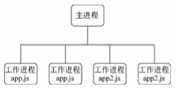


<h2 id="8ebd1ca8e8de01263812a161bf26bc50"></h2>

### 9.4.2 Cluster 事件

对于健壮性处理, cluster 模块也暴露了相当多的事情。

- fork: 复制一个工作进程后触发该事件
- online: 复制好一个工作进程后, 工作进程主动发送一条 online 消息给主进程，主进程得到消息后, 触发该事件
- listening: 工作进程中调用 listen() (共享了服务端Socket)后，发送一条listening 消息给主进程，主进程收到消息后，触发该事件。
- disconnect: 主进程和工作进程之间IPC通道断开后会触发该事件
- exit: 有工作进程退出时触发该事件
- setup: cluster.setupMaster() 执行后触发该事件

这些事件大多跟 child_process 模块的事件相关，在进程间消息传递的基础上完成的封装，这些事件对于增强应用的健壮性已经足够了。


<h2 id="82daa52b91a58226f55dc91795b01097"></h2>

## 9.5 总结

尽管通过 child_process 模块可以大幅提升Node的稳定性，但是一旦主进程出现问题，所有的子进程将会失去管理。在Node的进程管理之外，还需要用监听进程数量或监听日志的方式确保整个系统的稳定性，即使主进程出错退出，也能及时得到监控警报。


<h2 id="dcc5da07746efe166316fcbed0caf575"></h2>

# JS 规范

<h2 id="b99d8ee1b84b04125f1a4707817090d7"></h2>

### C.2.3 比较操作

如果是无容忍的场景，请尽量使用 === 代替 ==

```JavaScript
'0' == 0; // true 
'' == 0 // true
'0' === '' // false
```

0、undefined、 null、false、''  都代表逻辑非


<h2 id="ac5f03819112eb3a57eb8acdf7793560"></h2>

### C.2.6 数组和对象

2. for in 循环

```JavaScript
var foo = []; 
foo[100] = 100;
for (var i in foo) {
    console.log(i); } // 100
for (var i = 0; i < foo.length; i++) { 
    console.log(i); // 0--100
}
```

<h2 id="4990f90b8d16b00619e6b52e995136d9"></h2>

### C.2.8 继承

<h2 id="b1de39d2ae2b4cdf8933cb354409cd7d"></h2>

#### 1. 类继承

一般情况下, 我们采用 Node推荐的类继承方式：

```JavaScript
function Socket(options) { 
    // ...
    stream.Stream.call(this);
    // ... 
}
util.inherits(Socket, stream.Stream);
```

<h2 id="b20f9122c53dfd232e38443679d8b7ec"></h2>

#### 2. 导出

当需要将文件当作一个类导出时, 需要通过如下的方式挂载:

```JavaScript
module.exprots = Class;
```

而不是通过 `exports = Class;`


<h2 id="00a5cdc4be82fd4ba549d52988ef9e14"></h2>

# NPM 

```
npm config list
npm config set https-proxy "http://xxxxx" --global
npm config set proxy "http://xxxx" --global

npm install colors 
npm uninstall 
使用 -g 安装的全局 module，需要指定 NODE_PATH ?
```

- note:
     - `https-proxy` , it is dash, not underscore
    - `https-proxy` also use "http://xxx" , not https !!!


<h2 id="58649fadacd370d9b6ba4950e91f0833"></h2>

## 正则表达式替换

a=b 替换为 a="b"

```
var reg = /(\w+)=(\w+)/ ;
var res = process.argv[i].replace( reg , '$1="$2"' ) ;
```


